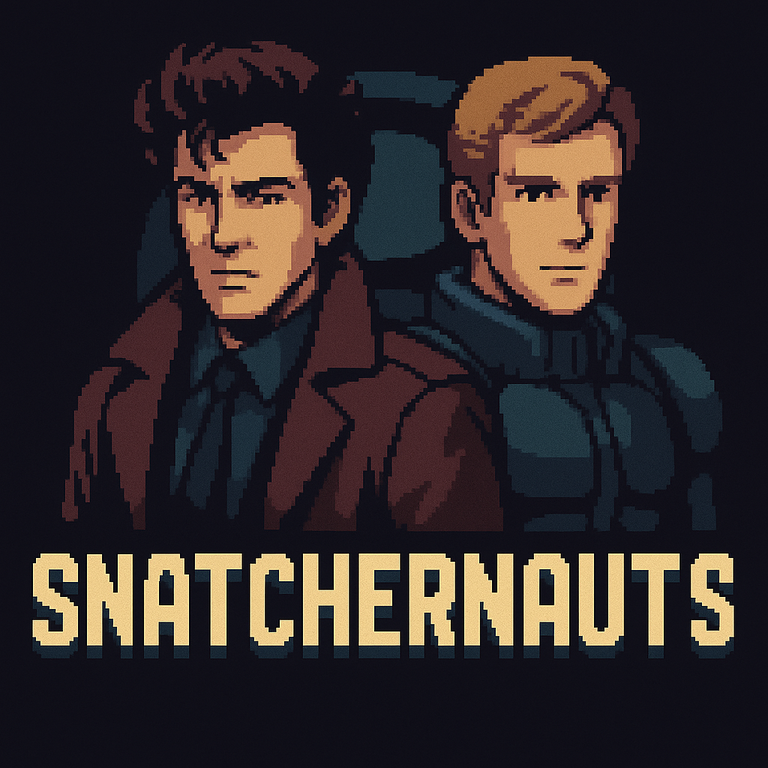

<div align="center">

# Snatchernauts Framework

<i>Retro‑cinematic, interactive visual novels — powered by Ren'Py 8.4</i>

[](CHANGELOG.md)
[](LICENSE)
[](https://github.com/grahfmusic/snatchernauts_framework)
[](https://gitlab.com/grahfmusic/snatchernauts_framework/-/pipelines)



</div>

> Bold goal: <b>make visual novels feel as tactile and alive as Kojima‑era classics</b> — <i>Snatcher</i>, <i>Policenauts</i> — while embracing Ren'Py’s portability and scriptability.

A modern Ren'Py 8.4.x framework for interactive point‑and‑click exploration that brings the energy of Kojima‑era adventures to contemporary visual novels. Snatchernauts focuses on tactile room interaction, floating descriptions, rich action menus, and cinematic CRT/Bloom overlays — all driven by a clean API and centralized gameplay hooks.

<hr/>


## 💡 Why Snatchernauts?
Visual novels are great at storytelling, but many lack the interactive texture that made classics like <b>Snatcher</b> and <b>Policenauts</b> so engaging. Snatchernauts was built to bridge that gap — keeping Ren'Py’s strengths (scriptability, portability) while layering on:
- 🎯 Room‑based exploration with <b>pixel‑accurate hotspots</b>
- 🧭 Contextual <b>interaction menus</b> and hover descriptions
- 🧩 Game‑like <b>lifecycle hooks</b> for writing logic in one place
- 🎬 **Shader‑based effects** (letterbox, film grain, fog, lighting) for retro‑cinematic feel
- 🕶️ **CRT/Bloom/Vignette** with live tuning and animation controls

<b>Result:</b> a VN that plays and feels like a classic adventure, with modern ergonomics.


## ✨ Features at a Glance

| Feature | What it gives you |
|---|---|
| 🎯 Pixel‑accurate hotspots | Click only where the image is opaque; no sloppy hitboxes |
| 🧭 Keyboard/gamepad nav | Fast navigation across in‑room objects |
| 🗂️ Contextual menus | Examine, Use, Talk, and custom actions |
| 🧩 Centralized hooks | on_game_start, on_room_enter, on_object_* events |
| 🛠️ Debug overlay | Live logging toggles, FPS/memory hints |
| 🕶️ CRT + vignette | Warp/scan/chroma + horizontal vignette, live tuning |
| 🎬 Shader system | Film grain, fog, lighting, letterbox via GLSL shaders |
| 🌸 Bloom effects | Cinematic overlays with color correlation |
| 🧰 Clean APIs | room/display/ui/interactions modules |


## How It Works (Architecture)
- Coordinator: `game/script.rpy` starts the info overlay, then calls `on_game_start()` and enters the exploration loop via `play_room()`.
- Public APIs: `game/api/*.rpy` expose helpers for rooms, display/effects, UI, and interactions.
- Logic Layer: put your gameplay in `game/logic/game_logic.rpy` and optional `game/logic/rooms/<room>_logic.rpy` files. Register per‑room handlers.
- UI Layer: screens under `game/ui/` compose descriptions, menus, and overlays.
- Effects: `game/shaders/` and `game/overlays/` provide CRT/Bloom/Letterbox and startup/debug overlays.
- Core Config: `game/core/` contains options, logging, and room configuration helpers.

See the Wiki for a deep dive, code walkthroughs, and examples.


---

## 🚀 Quick Start
1) Install Ren'Py 8.4.x and set your SDK path. Example:
   - export RENPY_SDK=~/renpy-8.4.1-sdk
2) Run the project:
   - $RENPY_SDK/renpy.sh .
3) Lint (optional):
   - make lint  or  $RENPY_SDK/renpy.sh . lint
4) Build distributions via Ren’Py Launcher → Build & Distribute.


## 🎮 Controls (Default)
- A/Enter/Space: interact (open action menu)
- Arrow keys / WASD: navigate objects
- Esc/B: cancel
- Mouse: hover/click objects


## 🧠 Core Concepts
- Hooks: write gameplay as Python/renpy functions responding to events:

```renpy
# Implement these in game/logic/game_logic.rpy (or per-room handlers)
def on_game_start():
    ...

def on_room_enter(room_id):
    ...

def on_object_hover(room_id, obj):
    ...

def on_object_interact(room_id, obj, action) -> bool:
    # Return True when you fully handle an action
    ...
```

- Per‑room Logic: implement `register_room_logic('<room>', Handler())` with your own methods.
- APIs: use `room_api`, `ui_api`, `interactions_api`, `display_api` instead of scattering logic in screens.
- Logging: centralized logging interception with color and truncation; toggles available at runtime.


## 🗺️ Project Layout
```
project/
├─ game/
│  ├─ logic/                 # global + per-room gameplay hooks
│  │  ├─ game_logic.rpy
│  │  └─ rooms/              # register_room_logic('<room>', Handler())
│  ├─ api/                   # public helper APIs
│  │  ├─ room_api.rpy        # room/object helpers
│  │  ├─ ui_api.rpy          # UI helpers
│  │  ├─ interactions_api.rpy# action routing
│  │  └─ display_api.rpy     # effects toggles
│  ├─ ui/                    # composition screens, transforms
│  ├─ overlays/              # letterbox, info, debug, fades
│  ├─ shaders/               # CRT and bloom shader code
│  └─ core/                  # options, logging, room config, utilities
├─ scripts/                  # push mirroring, wiki sync, etc.
└─ Wiki/                     # documentation (mirrored to GitHub wiki)
```


## 📚 Documentation
The Wiki covers everything from getting started to APIs and internals:
- Wiki/index.md — table of contents
- Architecture, Hooks, APIs, Screens, Effects, Examples

If you’re new, start with:
- Wiki/01-Overview.md
- Wiki/02-Getting-Started.md

## 🛠️ Debug & Effects
- **i**: toggle info overlay
- **c**: toggle CRT • **a**: toggle scanline animation
- **1–4**: scanline size presets
- **[ / ]**: vignette strength • **- / =**: vignette width • **0**: reset
- **l**: toggle letterbox (shader‑based)
- **Shift+G/F/V/L/W**: cycle shader effects (grain/fog/vintage/lighting/weather)
- **Alt+A/I**: atmosphere presets / investigation modes
- **R**: reset all shader effects • **H**: shader help
- **Cmd+Shift+F12 / Ctrl+Shift+F12**: cycle debug overlay


## 🧭 Roadmap (Short‑term)
- Enhanced detective atmospheric shaders and presets
- More built‑in actions (Use item, Combine)
- Optional inventory system module  
- Additional room examples with shader integration
- CI recipes for packaging on multiple platforms


## 🤝 Contributing
Pull requests and suggestions welcome. Please lint before submitting and include a brief rationale in your PR.


## 📄 License
MIT — see LICENSE.
