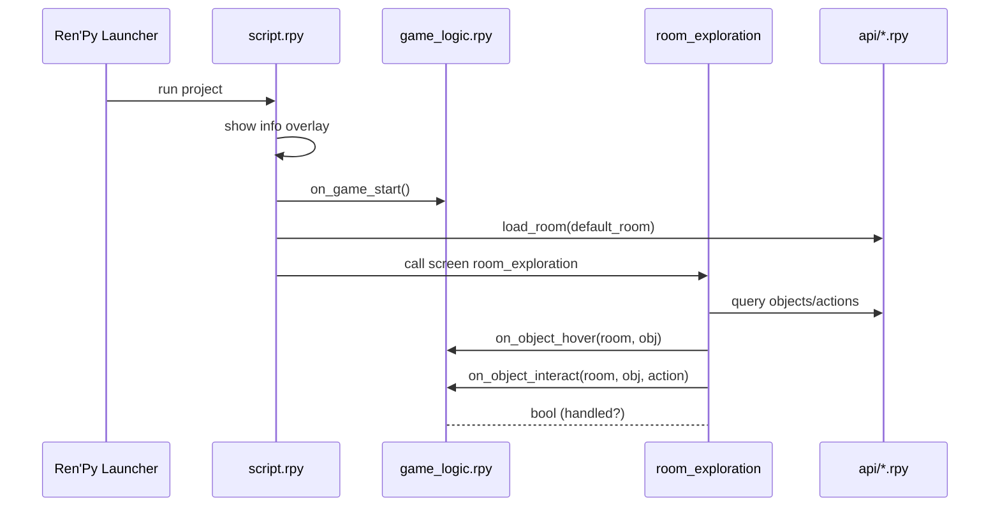
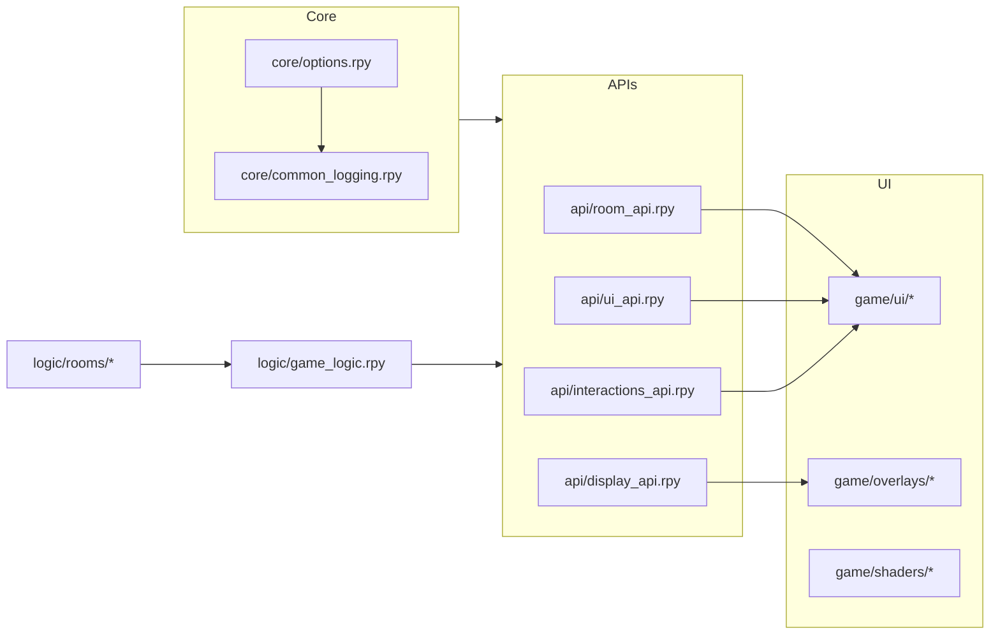

# Framework Architecture

## Overview

The Snatchernauts Framework follows a layered architecture designed for maintainable, extensible game development. The system separates concerns into distinct layers while providing clean interfaces for communication between components.

## System Flow

The framework follows this execution flow:

### 1. Initialization Phase
1. **Ren'Py Launcher** starts the game engine
2. **`script.rpy`** displays the info overlay for user orientation
3. **Game Logic Initialization** calls `on_game_start()` hook for setup
4. **Room Loading** loads the default room configuration

### 2. Exploration Phase
1. **Screen Display** shows the room exploration interface
2. **Object Registration** identifies interactive elements in the scene
3. **Input Handling** processes mouse, keyboard, and gamepad input
4. **Event Dispatching** triggers appropriate logic hooks

### 3. Interaction Phase
1. **Object Selection** determines target of player action
2. **Menu Display** shows available actions for the selected object
3. **Action Processing** executes the chosen interaction
4. **State Update** modifies game state based on the interaction result

## Core Components

### Logic Layer (`game/logic/`)

**Purpose**: Implements game behavior and responds to player actions

#### Key Files:
- **`game_logic.rpy`**: Global event handlers and game state management
- **`rooms/*.rpy`**: Room-specific logic classes for organized code

#### Responsibilities:
- Process player interactions and determine outcomes
- Manage game state transitions and story progression
- Handle character conversations and narrative events
- Coordinate with other system components

### API Layer (`game/api/`)

**Purpose**: Provides reusable functions for common game operations

#### Module Breakdown:

##### `room_api.rpy`
- **Functions**: Room loading, object registration, navigation
- **Use Cases**: Switching scenes, managing room state, object positioning
- **Key Features**: Persistent state, configuration validation

##### `ui_api.rpy`
- **Functions**: Interface creation, tooltip management, screen helpers
- **Use Cases**: Dynamic UI generation, context-sensitive displays
- **Key Features**: Responsive layouts, accessibility support

##### `interactions_api.rpy`
- **Functions**: Action menus, interaction flow, input handling
- **Use Cases**: Object interaction, dialogue systems, menu navigation
- **Key Features**: Context-aware actions, input method abstraction

##### `display_api.rpy`
- **Functions**: Visual effects control, shader management, rendering options
- **Use Cases**: Cinematic effects, atmosphere control, performance optimization
- **Key Features**: Real-time parameter adjustment, preset management

### UI Layer (`game/ui/`)

**Purpose**: Defines screen layouts and visual presentation

#### Components:
- **Screen Definitions**: Ren'Py screen language implementations
- **Transform Functions**: Animation and positioning logic
- **Style Sheets**: Visual appearance specifications
- **Layout Managers**: Responsive design helpers

#### Screen Categories:
- **Exploration Screens**: Room navigation and object interaction
- **Menu Screens**: Game menus, settings, and navigation
- **Dialog Screens**: Character conversations and narrative text
- **Effect Screens**: Visual overlays and transition effects

### Effects Layer (`game/overlays/` and `game/shaders/`)

**Purpose**: Provides cinematic visual effects and atmosphere

#### Overlay System:
- **Info Overlays**: Tutorial and help information
- **Debug Overlays**: Development tools and performance monitoring
- **Fade Overlays**: Scene transition effects
- **Letterbox Overlays**: Cinematic framing

#### Shader System:
- **CRT Effects**: Retro monitor simulation with scanlines and distortion
- **Color Grading**: Atmospheric color correction and mood setting
- **Lighting Effects**: Dynamic illumination and shadow simulation
- **Post-Processing**: Film grain, blur, and other cinematic effects

### Core System (`game/core/`)

**Purpose**: Framework infrastructure and configuration management

#### Key Components:

##### `options.rpy`
- Game configuration and version information
- Build settings and distribution parameters
- Feature toggles and compatibility options

##### `common_logging.rpy`
- Centralized logging system with categorized output
- Runtime debugging controls and verbosity levels
- Print interception and output formatting

##### `room_config.rpy`
- Room definition structures and validation
- Configuration helpers and default values
- State persistence management

## Data Flow Architecture

### Input Processing
1. **Input Detection**: System captures mouse, keyboard, or gamepad input
2. **Context Analysis**: Determines appropriate handler based on current state
3. **Event Routing**: Dispatches to relevant logic components
4. **Response Generation**: Creates appropriate feedback for the player

### State Management
1. **State Capture**: Current game state is recorded before changes
2. **Validation**: Proposed changes are checked for validity
3. **Update Processing**: Valid changes are applied to game state
4. **Persistence**: Important state changes are saved for future sessions

### Rendering Pipeline
1. **Scene Assembly**: Base room graphics and object positioning
2. **Effect Application**: Shaders and overlays applied in correct order
3. **UI Composition**: Interface elements layered over scene
4. **Final Rendering**: Complete frame sent to display

## Communication Patterns

### Hook-Based Events
The framework uses event hooks to decouple game logic from UI concerns:

```python
# Logic layer responds to events
def on_object_interact(room_id, obj, action):
    # Process interaction
    return handled  # Boolean indicating if action was processed
```

### API-Based Operations
Common operations are centralized in API modules:

```python
# UI layer uses APIs for operations
room_api.load_room("detective_office")
ui_api.show_description("A cluttered desk with papers scattered about")
```

### Configuration-Driven Behavior
Much of the framework behavior is controlled through configuration:

```python
# Room definitions specify object properties
ROOM_OBJECTS = {
    "desk": {
        "image": "desk.png",
        "position": (100, 200),
        "actions": ["examine", "search"]
    }
}
```

## Extension Points

The framework provides several mechanisms for customization:

### Custom Logic Handlers
- Implement per-room logic classes
- Override default behaviors
- Add new interaction types

### Shader Development
- Create custom visual effects
- Modify existing shader parameters
- Implement new post-processing techniques

### API Extensions
- Add new helper functions
- Extend existing API modules
- Create domain-specific utilities

### Screen Customization
- Modify existing screen layouts
- Create new screen types
- Implement custom UI components

## Project Layout
```
project/
├─ game/
│  ├─ logic/                 # global + per-room gameplay hooks
│  │  ├─ game_logic.rpy
│  │  └─ rooms/              # register_room_logic('<room>', Handler())
│  ├─ api/                   # public helper APIs
│  │  ├─ room_api.rpy        # room/object helpers
│  │  ├─ ui_api.rpy          # UI helpers
│  │  ├─ interactions_api.rpy# action routing
│  │  └─ display_api.rpy     # effects toggles
│  ├─ ui/                    # composition screens, transforms
│  ├─ overlays/              # letterbox, info, debug, fades
│  ├─ shaders/               # CRT and bloom shader code
│  └─ core/                  # options, logging, room config, utilities
├─ scripts/                  # push mirroring, wiki sync, etc.
└─ Wiki/                     # documentation (mirrored to GitHub wiki)
```

## Sequence (Mermaid)


ASCII fallback
```
Launcher -> script.rpy -> on_game_start()
script.rpy -> APIs.load_room(default_room)
script.rpy -> screen room_exploration
screen -> APIs (query objects/actions)
screen -> logic.on_object_hover(room, obj)
screen -> logic.on_object_interact(room, obj, action)
logic -> screen (handled? True/False)
```

## Components (Mermaid)


ASCII fallback
```
[core/options] -> [core/common_logging]
[core/*] -> [api/*]
[api/room] -> [ui/screens]
[api/ui] -> [ui/screens]
[api/interactions] -> [ui/screens]
[api/display] -> [overlays]
[logic] -> [api/*]
[logic/rooms/*] -> [logic]
```

