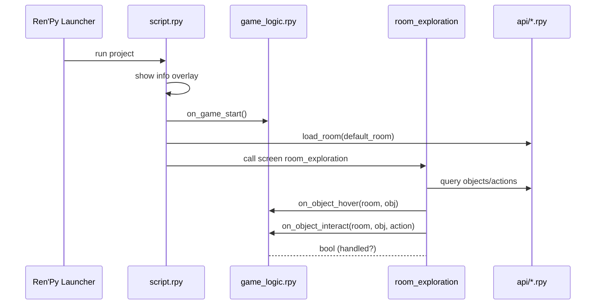
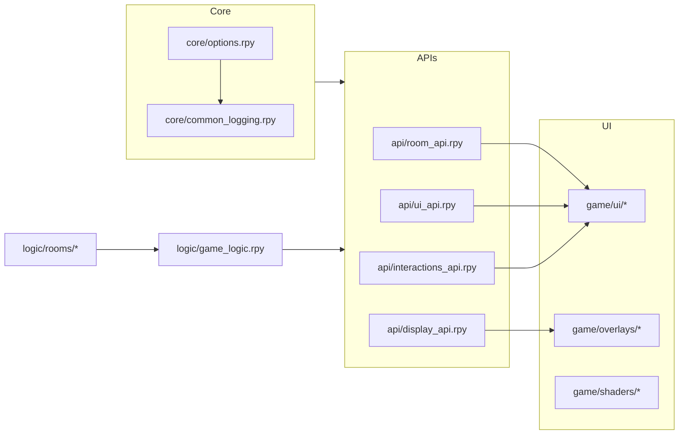

# Framework Architecture

**Part I: Getting Started - Chapter 3**

*A comprehensive exploration of the Snatchernauts Framework's architectural design, component relationships, and system patterns that enable scalable interactive game development.*

---

## Chapter Overview

This chapter provides an in-depth examination of the framework's architectural foundations, exploring how components interact, data flows through the system, and extensibility mechanisms enable custom game development. Understanding this architecture is crucial for effective framework utilization and advanced customization.

The framework implements a sophisticated layered architecture that:
- **Separates Concerns**: Distinct layers handle logic, presentation, effects, and configuration
- **Enables Extensibility**: Clean interfaces allow custom implementations without core modifications
- **Promotes Maintainability**: Modular design facilitates debugging, testing, and collaborative development
- **Supports Scalability**: Architecture scales from simple interactive scenes to complex narrative games

**By the end of this chapter, you will understand:**
- The complete framework architecture and its design principles
- How data flows between system components during game execution
- The role and responsibilities of each architectural layer
- Extension points for implementing custom game functionality
- Communication patterns and integration strategies
- Configuration-driven behavior and customization mechanisms

## Architectural Design Principles

The framework's architecture is built upon several key design principles that guide development decisions and ensure long-term maintainability:

### Separation of Concerns

**Logic vs. Presentation**: Game behavior is implemented separately from visual presentation, allowing independent modification of gameplay mechanics and visual design.

```python
# Logic Layer - Pure game behavior
class DetectiveOfficeLogic(RoomLogicBase):
    def on_object_interact(self, object_id, action):
        if object_id == "desk" and action == "search":
            return self.discover_evidence("letter")

# Presentation Layer - Visual implementation
screen room_exploration():
    add "detective_office_bg.png"
    imagebutton:
        idle "desk_idle.png"
        hover "desk_highlight.png"
        action Function(handle_object_interaction, "desk")
```

### Event-Driven Architecture

**Decoupled Communication**: Components communicate through event hooks rather than direct references, reducing coupling and increasing flexibility.

```python
# Event publishing
def handle_room_entrance(room_id):
    # Framework publishes event
    for handler in get_registered_handlers():
        handler.on_room_enter(room_id)

# Event consumption
class CustomLogic:
    def on_room_enter(self, room_id):
        if room_id == "library":
            self.start_ambient_sound("pages_turning.ogg")
```

### Configuration-Driven Behavior

**Data-Driven Design**: Game content and behavior are defined through configuration files rather than hardcoded logic, enabling rapid iteration and non-programmer content creation.

```json
{
  "room_id": "detective_office",
  "background": "office_bg.png",
  "objects": [
    {
      "id": "desk",
      "image": "desk_sprite.png",
      "position": [300, 400],
      "actions": ["examine", "search", "sit_at"]
    }
  ]
}
```

### API-Centric Integration

**Reusable Functionality**: Common operations are exposed through well-defined APIs that promote code reuse and consistent behavior across different game components.

```python
# Standardized API usage
room_api.load_room("detective_office")
ui_api.show_description("The office smells of old coffee and cigarettes.")
interactions_api.register_action("desk", "search", self.search_desk)
```

## Complete System Execution Flow

The framework orchestrates complex interactions between multiple system layers through a well-defined execution sequence that ensures consistent behavior and optimal performance.

### Phase 1: System Initialization and Bootstrap

The initialization phase establishes the runtime environment and prepares all framework components for active gameplay.

#### Step 1: Engine Startup
**Component**: Ren'Py Launcher  
**Purpose**: Initialize the underlying game engine and Python runtime environment  
**Operations**:
- Load Python interpreter and Ren'Py framework
- Initialize graphics, audio, and input subsystems
- Establish memory management and garbage collection
- Configure platform-specific settings and capabilities

#### Step 2: Project Bootstrap
**Component**: `script.rpy`  
**Purpose**: Execute project-specific initialization sequence  
**Operations**:
- Display framework information overlay for user orientation
- Load core configuration files and validate settings
- Initialize logging subsystem with appropriate verbosity levels
- Prepare asset loading and caching systems

```python
# script.rpy initialization sequence
label start:
    # Display framework information
    show screen info_overlay
    
    # Initialize framework systems
    $ initialize_framework_systems()
    
    # Call global game initialization hook
    $ on_game_start()
    
    # Load default room and begin gameplay
    $ room_api.load_room(config.default_room_id)
    call screen room_exploration
```

#### Step 3: Logic System Initialization
**Component**: Game Logic Layer  
**Purpose**: Prepare game-specific behavioral systems  
**Operations**:
- Execute `on_game_start()` hook for custom initialization
- Register room-specific logic handlers
- Initialize persistent game state variables
- Prepare save/load system for game progression tracking

```python
# Global initialization hook implementation
def on_game_start():
    # Initialize game state
    store.game_state = GameState()
    
    # Register room logic handlers
    register_room_logic("detective_office", DetectiveOfficeLogic())
    register_room_logic("library", LibraryLogic())
    
    # Load saved progress if available
    if persistent.save_exists:
        load_game_state()
```

#### Step 4: Default Room Loading
**Component**: Room Management System  
**Purpose**: Load initial game environment and prepare interactive elements  
**Operations**:
- Parse room configuration file and validate structure
- Load background images and interactive object sprites
- Position objects according to configuration specifications
- Initialize room-specific ambient effects and audio

### Phase 2: Active Exploration and Environment Interaction

During exploration, the framework maintains a responsive environment where players can investigate objects and navigate between different areas.

#### Step 1: Interface Presentation
**Component**: UI Layer (`game/ui/`)  
**Purpose**: Present interactive exploration interface to the player  
**Visual Elements**:
- Room background image with appropriate atmospheric effects
- Interactive object sprites with hover and click states
- Navigation controls and menu access buttons
- Status indicators showing current game state

```python
# room_exploration screen implementation
screen room_exploration():
    # Room background with effects
    add room_api.get_current_background()
    if display_api.effects_enabled("ambient"):
        add "ambient_overlay.png" alpha 0.3
    
    # Interactive objects
    for obj in room_api.get_visible_objects():
        imagebutton:
            idle obj.get_idle_image()
            hover obj.get_hover_image()
            pos obj.position
            action Function(handle_object_interaction, obj.id)
```

#### Step 2: Object Registration and Management
**Component**: Room API System  
**Purpose**: Maintain registry of interactive elements and their current states  
**Responsibilities**:
- Track object visibility based on game progression
- Manage object state changes (examined, moved, collected, etc.)
- Handle dynamic object addition and removal
- Coordinate object-specific visual and audio feedback

#### Step 3: Input Processing and Event Routing
**Component**: Interaction Management System  
**Purpose**: Capture player input and route events to appropriate handlers  
**Input Types Supported**:
- **Mouse**: Object clicking, hovering, context menu activation
- **Keyboard**: Shortcut keys, quick actions, accessibility navigation
- **Gamepad**: Controller-based navigation and interaction (if enabled)
- **Touch**: Tablet and mobile device support for compatible builds

```python
# Input handling and event routing
def handle_object_interaction(object_id):
    current_room = room_api.get_current_room()
    
    # Route to room-specific logic first
    room_logic = get_room_logic(current_room)
    if room_logic and room_logic.on_object_interact(object_id, "examine"):
        return  # Room logic handled the interaction
    
    # Fall back to global logic handlers
    if on_object_interact(current_room, object_id, "examine"):
        return  # Global logic handled the interaction
    
    # Default behavior if no custom handler processes the event
    ui_api.show_description(get_object_description(object_id))
```

#### Step 4: Event Hook Execution
**Component**: Logic Hook System  
**Purpose**: Execute custom game behavior in response to player actions  
**Hook Categories**:
- **Object Interaction**: `on_object_interact(room_id, object_id, action)`
- **Object Hover**: `on_object_hover(room_id, object_id)`
- **Room Navigation**: `on_room_enter(room_id)`, `on_room_exit(room_id)`
- **State Changes**: `on_game_state_change(key, old_value, new_value)`

### Phase 3: Player Interaction and Action Processing

When players interact with objects or trigger events, the framework processes these actions through a sophisticated pipeline that ensures consistent behavior and proper state management.

#### Step 1: Object Selection and Context Analysis
**Component**: Interaction API  
**Purpose**: Determine the target of player action and analyze available options  
**Context Factors**:
- **Object Properties**: What actions are inherently available for this object type
- **Game State**: What actions are currently possible based on progression
- **Inventory**: What actions are enabled by items the player possesses
- **Room Context**: How the current environment affects available actions

```python
# Context-aware action determination
def get_available_actions(object_id, room_id):
    base_actions = get_object_base_actions(object_id)
    
    # Filter based on current game state
    available_actions = []
    for action in base_actions:
        if is_action_available(object_id, action, room_id):
            available_actions.append(action)
    
    # Add context-specific actions
    context_actions = get_context_actions(object_id, room_id)
    available_actions.extend(context_actions)
    
    return available_actions
```

#### Step 2: Action Menu Generation and Display
**Component**: UI API System  
**Purpose**: Present available actions to the player in an intuitive interface  
**Menu Features**:
- **Dynamic Generation**: Menus adapt to current context and available actions
- **Visual Feedback**: Clear indication of action effects and requirements
- **Keyboard Shortcuts**: Quick access keys for frequently used actions
- **Accessibility Support**: Screen reader compatibility and high contrast modes

```python
# Dynamic action menu generation
screen object_action_menu(object_id, actions):
    modal True
    
    frame:
        style "action_menu_frame"
        has vbox
        
        text get_object_name(object_id) style "action_menu_title"
        
        for action in actions:
            textbutton action.display_name:
                style "action_menu_button"
                action [
                    Function(execute_action, object_id, action.id),
                    Hide("object_action_menu")
                ]
                
        textbutton "Cancel":
            style "action_menu_cancel"
            action Hide("object_action_menu")
```

#### Step 3: Action Execution and Logic Processing
**Component**: Logic Layer Integration  
**Purpose**: Execute the selected action and process its consequences  
**Execution Pipeline**:
1. **Validation**: Confirm action is still valid (state may have changed)
2. **Pre-Processing**: Execute any setup required before the main action
3. **Core Execution**: Perform the primary action logic
4. **Post-Processing**: Handle side effects and state updates
5. **Feedback Generation**: Provide appropriate player feedback

```python
# Action execution pipeline
def execute_action(object_id, action_id):
    # Validate action is still available
    if not is_action_available(object_id, action_id):
        ui_api.show_message("That action is no longer possible.")
        return
    
    # Execute room-specific logic
    room_logic = get_current_room_logic()
    if room_logic:
        result = room_logic.on_object_interact(object_id, action_id)
        if result.handled:
            process_action_result(result)
            return
    
    # Fall back to global logic
    result = global_logic.on_object_interact(
        room_api.get_current_room(), object_id, action_id
    )
    process_action_result(result)
```

#### Step 4: State Management and Persistence
**Component**: State Management System  
**Purpose**: Update game state and ensure changes are properly persisted  
**State Categories**:
- **Object States**: Position, visibility, interaction history
- **Room States**: Visited status, environmental changes, unlocked areas
- **Global State**: Player inventory, character attributes, story progression
- **System State**: Settings, preferences, accessibility options

```python
# Comprehensive state management
def update_game_state(state_change):
    # Validate state change
    if not validate_state_change(state_change):
        raise InvalidStateChangeError(f"Invalid change: {state_change}")
    
    # Apply change with rollback capability
    previous_state = capture_current_state()
    try:
        apply_state_change(state_change)
        
        # Trigger state change hooks
        on_game_state_change(
            state_change.key, 
            previous_state.get(state_change.key), 
            state_change.new_value
        )
        
        # Persist important changes
        if state_change.persistent:
            save_persistent_state(state_change)
            
    except Exception as e:
        # Rollback on error
        restore_state(previous_state)
        raise GameStateError(f"State update failed: {e}")
```

## Detailed Framework Layer Analysis

This section provides comprehensive examination of each architectural layer, explaining their internal structure, responsibilities, and interaction patterns.

### Logic Layer (`game/logic/`) - The Behavioral Core

The Logic Layer serves as the behavioral foundation of the framework, implementing the game-specific rules, interactions, and state management that define your interactive experience.

#### Architecture and Organization

**Hierarchical Structure**: The logic layer employs a hierarchical event handling system where global handlers provide default behavior while room-specific handlers enable customization:

```python
# Global logic handler in game_logic.rpy
def on_object_interact(room_id, object_id, action):
    """Default interaction handling for all rooms"""
    if action == "examine":
        description = get_object_description(object_id)
        ui_api.show_description(description)
        return True  # Handled
    return False  # Not handled, try other handlers

# Room-specific handler in rooms/detective_office.rpy
class DetectiveOfficeLogic(RoomLogicBase):
    def on_object_interact(self, object_id, action):
        if object_id == "safe" and action == "examine":
            if not self.player_has_key():
                ui_api.show_description("The safe is locked.")
                return True
            else:
                return self.open_safe()  # Custom behavior
        return False  # Fall back to global handler
```

#### Key Components and Their Roles

##### `game_logic.rpy` - Global Event Coordination
**Primary Responsibilities**:
- **Game Initialization**: Handle `on_game_start()` for setting up initial game state
- **Cross-Room State**: Manage player inventory, global variables, and persistent data
- **Default Behaviors**: Provide fallback implementations for common interactions
- **System Integration**: Coordinate between different framework subsystems

**Essential Hook Functions**:
```python
# Game lifecycle management
def on_game_start():
    """Called once when game begins"""
    initialize_player_state()
    load_persistent_data()
    setup_global_variables()

def on_game_save():
    """Called before saving game state"""
    return collect_save_data()

def on_game_load(save_data):
    """Called after loading game state"""
    restore_game_state(save_data)

# Room transition management
def on_room_enter(room_id):
    """Called when entering any room"""
    log_room_visit(room_id)
    update_exploration_progress(room_id)

def on_room_exit(room_id):
    """Called when leaving any room"""
    save_room_state(room_id)
    cleanup_temporary_effects()
```

##### `rooms/*.rpy` - Specialized Room Behaviors
**Organizational Pattern**: Each room has its own logic file implementing room-specific behavior through class inheritance:

```python
# Base class definition in room_logic_base.rpy
class RoomLogicBase:
    def __init__(self, room_id):
        self.room_id = room_id
        self.room_state = {}
    
    def on_room_enter(self):
        """Called when player enters this room"""
        pass
    
    def on_object_interact(self, object_id, action):
        """Handle object interactions in this room"""
        return False  # Not handled
    
    def on_object_hover(self, object_id):
        """Handle object hover events in this room"""
        pass

# Specific room implementation
class LibraryLogic(RoomLogicBase):
    def on_room_enter(self):
        if not self.room_state.get("ambient_started", False):
            audio_api.play_ambient("library_atmosphere.ogg")
            self.room_state["ambient_started"] = True
    
    def on_object_interact(self, object_id, action):
        if object_id == "ancient_book" and action == "read":
            if self.player_can_read_ancient_text():
                return self.reveal_ancient_knowledge()
            else:
                ui_api.show_description("The text is in a language you don't understand.")
                return True
        return False
```

#### Logic Registration and Discovery

The framework automatically discovers and registers room logic handlers through a standardized registration system:

```python
# Automatic registration in game_logic.rpy
init python:
    # Register room logic handlers
    register_room_logic("detective_office", DetectiveOfficeLogic("detective_office"))
    register_room_logic("library", LibraryLogic("library"))
    register_room_logic("basement", BasementLogic("basement"))
    
    # Register global event handlers
    register_global_handler("object_interact", on_object_interact)
    register_global_handler("room_enter", on_room_enter)
```

#### State Management Integration

Logic handlers interact with a comprehensive state management system that tracks game progression and enables complex conditional behaviors:

```python
# State-aware logic implementation
class DetectiveOfficeLogic(RoomLogicBase):
    def on_object_interact(self, object_id, action):
        if object_id == "telephone" and action == "use":
            if game_state.get("case_progress") >= 3:
                return self.make_important_call()
            elif game_state.get("discovered_phone_number"):
                return self.attempt_mysterious_call()
            else:
                ui_api.show_description("You don't have anyone to call right now.")
                return True
        return False
    
    def make_important_call(self):
        dialogue_api.start_conversation("important_phone_call")
        game_state.set("called_contact", True)
        return True
```

### API Layer (`game/api/`) - Reusable Framework Services

The API Layer provides a comprehensive suite of functions and utilities that abstract common game development tasks into reusable, well-tested interfaces. This layer serves as the primary integration point between game logic and framework capabilities.

#### Design Philosophy and Benefits

**Abstraction and Simplification**: Complex framework operations are wrapped in simple, intuitive function calls that hide implementation details while providing powerful functionality:

```python
# Complex room loading with validation, asset management, and state tracking
# Simplified to a single API call:
room_api.load_room("detective_office")

# Internally handles:
# - Configuration file parsing and validation
# - Asset loading and caching
# - Object registration and positioning
# - State persistence and restoration
# - Audio and visual effect initialization
```

**Consistency and Standardization**: APIs ensure consistent behavior across different game components and reduce the likelihood of implementation errors:

```python
# Standardized object interaction pattern
interactions_api.register_action("desk", "search", self.search_desk_callback)
interactions_api.register_action("book", "read", self.read_book_callback)

# All interactions follow the same pattern regardless of object type
# Consistent error handling, state management, and user feedback
```

#### Detailed Module Analysis

##### `room_api.rpy` - Environment and Object Management

**Core Purpose**: Manages room loading, object lifecycle, and environmental state with comprehensive validation and error handling.

**Key Functions and Implementation**:

```python
# Primary room management functions
def load_room(room_id, transition_type="fade"):
    """Load a new room with proper cleanup and initialization"""
    # Validate room exists and is accessible
    if not validate_room_access(room_id):
        raise RoomAccessError(f"Cannot access room: {room_id}")
    
    # Save current room state
    if current_room:
        save_room_state(current_room)
        trigger_room_exit_hooks(current_room)
    
    # Load new room configuration
    room_config = load_room_configuration(room_id)
    validate_room_configuration(room_config)
    
    # Initialize room assets and objects
    load_room_assets(room_config)
    register_room_objects(room_config.objects)
    
    # Apply visual effects and transitions
    if transition_type:
        display_api.apply_transition(transition_type)
    
    # Set new current room and trigger entry hooks
    set_current_room(room_id)
    trigger_room_enter_hooks(room_id)
    
    return room_config

def get_room_objects(room_id=None, visible_only=True):
    """Retrieve list of objects in specified room"""
    target_room = room_id or get_current_room()
    objects = get_registered_objects(target_room)
    
    if visible_only:
        objects = [obj for obj in objects if obj.visible]
    
    return objects

def add_room_object(object_definition, room_id=None):
    """Dynamically add an object to a room"""
    target_room = room_id or get_current_room()
    
    # Validate object definition
    validate_object_definition(object_definition)
    
    # Create and register object
    game_object = create_game_object(object_definition)
    register_object(target_room, game_object)
    
    # Update room display if room is currently active
    if target_room == get_current_room():
        refresh_room_display()
    
    return game_object
```

**Advanced Features**:
- **State Persistence**: Automatically saves and restores object states between room transitions
- **Lazy Loading**: Loads room assets on-demand to optimize memory usage
- **Configuration Validation**: Comprehensive validation prevents runtime errors from malformed room definitions
- **Dynamic Object Management**: Supports runtime addition, removal, and modification of interactive elements

##### `ui_api.rpy` - User Interface Creation and Management

**Core Purpose**: Provides high-level functions for creating dynamic, responsive user interfaces with consistent styling and behavior.

**Key Functions and Capabilities**:

```python
# Dynamic UI generation functions
def show_description(text, position="center", style="default"):
    """Display formatted text with automatic word wrapping and styling"""
    formatted_text = format_description_text(text)
    
    # Create description box with appropriate styling
    description_box = create_styled_text_box(
        text=formatted_text,
        style=get_description_style(style),
        position=calculate_optimal_position(position)
    )
    
    # Show with appropriate transition
    show_ui_element(description_box, transition="fade_in")
    
    # Auto-hide after reading time or user interaction
    schedule_auto_hide(description_box, calculate_reading_time(text))

def create_interaction_menu(object_id, actions, position="auto"):
    """Generate context-sensitive action menu for object interactions"""
    menu_items = []
    
    for action in actions:
        # Create menu item with appropriate styling and callbacks
        menu_item = create_menu_item(
            text=get_action_display_name(action),
            callback=partial(execute_object_action, object_id, action),
            enabled=is_action_available(object_id, action),
            tooltip=get_action_tooltip(action)
        )
        menu_items.append(menu_item)
    
    # Calculate optimal menu position
    menu_position = calculate_menu_position(object_id, position)
    
    # Create and display menu
    interaction_menu = create_context_menu(
        items=menu_items,
        position=menu_position,
        style="interaction_menu"
    )
    
    show_modal_ui(interaction_menu)
    return interaction_menu

def create_tooltip(object_id, text, delay=0.5):
    """Add hover tooltip to interactive object"""
    tooltip_content = format_tooltip_text(text)
    
    # Register tooltip with object
    register_object_tooltip(
        object_id=object_id,
        content=tooltip_content,
        show_delay=delay,
        style="default_tooltip"
    )
```

**Advanced Capabilities**:
- **Responsive Layouts**: UI elements automatically adapt to different screen sizes and resolutions
- **Accessibility Support**: Screen reader compatibility and keyboard navigation
- **Animation System**: Smooth transitions and effects for professional presentation
- **Theme System**: Consistent styling across all UI elements with customizable themes

##### `interactions_api.rpy` - Player Interaction Processing

**Core Purpose**: Manages the complete interaction lifecycle from input detection to action execution and feedback generation.

**Interaction Flow Management**:

```python
# Comprehensive interaction management system
def register_interaction(object_id, action_type, callback, conditions=None):
    """Register custom interaction handler for specific object and action"""
    interaction_definition = {
        "object_id": object_id,
        "action_type": action_type,
        "callback": callback,
        "conditions": conditions or [],
        "priority": get_interaction_priority(action_type)
    }
    
    # Validate interaction definition
    validate_interaction_definition(interaction_definition)
    
    # Register with interaction system
    interaction_registry.register(interaction_definition)

def handle_object_click(object_id, click_position, modifiers):
    """Process object click and determine appropriate response"""
    # Check if object supports interaction
    if not is_object_interactive(object_id):
        return False
    
    # Get available actions based on current context
    available_actions = get_available_actions(object_id)
    
    if not available_actions:
        # No actions available - provide feedback
        ui_api.show_message("Nothing interesting happens.")
        return True
    
    if len(available_actions) == 1:
        # Single action - execute directly
        return execute_object_action(object_id, available_actions[0])
    else:
        # Multiple actions - show selection menu
        ui_api.create_interaction_menu(object_id, available_actions)
        return True

def execute_object_action(object_id, action_type):
    """Execute specific action on object with comprehensive error handling"""
    try:
        # Validate action is still available
        if not is_action_available(object_id, action_type):
            ui_api.show_message("That action is no longer possible.")
            return False
        
        # Find and execute appropriate handler
        handler = find_interaction_handler(object_id, action_type)
        
        if handler:
            result = handler.execute(object_id, action_type)
            process_interaction_result(result)
            return True
        else:
            # No custom handler - use default behavior
            return execute_default_action(object_id, action_type)
            
    except InteractionError as e:
        log_interaction_error(e)
        ui_api.show_error_message("Something went wrong with that action.")
        return False
```

##### `display_api.rpy` - Visual Effects and Rendering Control

**Core Purpose**: Provides sophisticated visual effects, shader management, and rendering pipeline control for cinematic presentation.

**Effect System Architecture**:

```python
# Advanced visual effects management
def apply_screen_effect(effect_type, parameters=None, duration=1.0):
    """Apply visual effect to entire screen with parameter control"""
    effect_config = {
        "type": effect_type,
        "parameters": parameters or {},
        "duration": duration,
        "blend_mode": get_effect_blend_mode(effect_type)
    }
    
    # Validate effect configuration
    if not validate_effect_config(effect_config):
        raise InvalidEffectError(f"Invalid effect configuration: {effect_config}")
    
    # Apply effect with appropriate shader
    effect_shader = load_effect_shader(effect_type)
    apply_shader_effect(effect_shader, effect_config)
    
    # Schedule effect removal if duration is specified
    if duration > 0:
        schedule_effect_removal(effect_type, duration)

def create_particle_system(effect_name, position, parameters):
    """Create and manage particle-based visual effects"""
    particle_config = load_particle_configuration(effect_name)
    
    # Customize with provided parameters
    particle_config.update(parameters)
    
    # Create particle system instance
    particle_system = ParticleSystem(
        config=particle_config,
        position=position,
        layer="effects"
    )
    
    # Register for update and rendering
    register_particle_system(particle_system)
    
    return particle_system

def manage_lighting(lighting_preset, transition_time=2.0):
    """Control scene lighting with smooth transitions"""
    current_lighting = get_current_lighting()
    target_lighting = load_lighting_preset(lighting_preset)
    
    # Create smooth transition between lighting states
    lighting_transition = create_lighting_transition(
        from_state=current_lighting,
        to_state=target_lighting,
        duration=transition_time
    )
    
    # Apply transition
    apply_lighting_transition(lighting_transition)
```

#### API Integration Patterns

**Chained Operations**: APIs are designed to work together seamlessly for complex operations:

```python
# Complex sequence using multiple APIs
def investigate_mysterious_object(object_id):
    # Use room API to check object state
    if room_api.get_object_state(object_id, "investigated"):
        ui_api.show_description("You've already examined this thoroughly.")
        return
    
    # Apply visual effect during investigation
    display_api.apply_screen_effect("focus_blur", {"intensity": 0.5})
    
    # Show investigation process
    ui_api.show_description("You examine the object carefully...")
    
    # Process investigation logic
    discovery = process_investigation_logic(object_id)
    
    # Update object state
    room_api.set_object_state(object_id, "investigated", True)
    
    # Remove visual effect
    display_api.remove_screen_effect("focus_blur")
    
    # Show results
    if discovery:
        interactions_api.trigger_discovery_sequence(discovery)
    else:
        ui_api.show_description("Nothing unusual catches your attention.")
```

### UI Layer (`game/ui/`)

**Purpose**: Defines screen layouts and visual presentation

#### Components:
- **Screen Definitions**: Ren'Py screen language implementations
- **Transform Functions**: Animation and positioning logic
- **Style Sheets**: Visual appearance specifications
- **Layout Managers**: Responsive design helpers

#### Screen Categories:
- **Exploration Screens**: Room navigation and object interaction
- **Menu Screens**: Game menus, settings, and navigation
- **Dialog Screens**: Character conversations and narrative text
- **Effect Screens**: Visual overlays and transition effects

### Effects Layer (`game/overlays/` and `game/shaders/`)

**Purpose**: Provides cinematic visual effects and atmosphere

#### Overlay System:
- **Info Overlays**: Tutorial and help information
- **Debug Overlays**: Development tools and performance monitoring
- **Fade Overlays**: Scene transition effects
- **Letterbox Overlays**: Cinematic framing

#### Shader System:
- **CRT Effects**: Retro monitor simulation with scanlines and distortion
- **Color Grading**: Atmospheric color correction and mood setting
- **Lighting Effects**: Dynamic illumination and shadow simulation
- **Post-Processing**: Film grain, blur, and other cinematic effects

### Core System (`game/core/`)

**Purpose**: Framework infrastructure and configuration management

#### Key Components:

##### `options.rpy`
- Game configuration and version information
- Build settings and distribution parameters
- Feature toggles and compatibility options

##### `common_logging.rpy`
- Centralized logging system with categorized output
- Runtime debugging controls and verbosity levels
- Print interception and output formatting

##### `room_config.rpy`
- Room definition structures and validation
- Configuration helpers and default values
- State persistence management

## Data Flow Architecture

### Input Processing
1. **Input Detection**: System captures mouse, keyboard, or gamepad input
2. **Context Analysis**: Determines appropriate handler based on current state
3. **Event Routing**: Dispatches to relevant logic components
4. **Response Generation**: Creates appropriate feedback for the player

### State Management
1. **State Capture**: Current game state is recorded before changes
2. **Validation**: Proposed changes are checked for validity
3. **Update Processing**: Valid changes are applied to game state
4. **Persistence**: Important state changes are saved for future sessions

### Rendering Pipeline
1. **Scene Assembly**: Base room graphics and object positioning
2. **Effect Application**: Shaders and overlays applied in correct order
3. **UI Composition**: Interface elements layered over scene
4. **Final Rendering**: Complete frame sent to display

## Communication Patterns

### Hook-Based Events
The framework uses event hooks to decouple game logic from UI concerns:

```python
# Logic layer responds to events
def on_object_interact(room_id, obj, action):
    # Process interaction
    return handled  # Boolean indicating if action was processed
```

### API-Based Operations
Common operations are centralized in API modules:

```python
# UI layer uses APIs for operations
room_api.load_room("detective_office")
ui_api.show_description("A cluttered desk with papers scattered about")
```

### Configuration-Driven Behavior
Much of the framework behavior is controlled through configuration:

```python
# Room definitions specify object properties
ROOM_OBJECTS = {
    "desk": {
        "image": "desk.png",
        "position": (100, 200),
        "actions": ["examine", "search"]
    }
}
```

## Comprehensive Extension Points and Customization Mechanisms

The framework's extensible architecture provides multiple sophisticated approaches for customization, enabling developers to implement unique game mechanics while leveraging the robust foundation provided by the core system.

### Custom Logic Handler Development

The logic system's hierarchical structure allows for sophisticated behavior customization through multiple extension mechanisms:

#### Room-Specific Logic Implementation

**Pattern**: Create specialized room logic classes that inherit from `RoomLogicBase` to implement custom behaviors:

```python
# Advanced room logic with complex state management
class AbandonedMansionLogic(RoomLogicBase):
    def __init__(self, room_id):
        super().__init__(room_id)
        self.ghost_encounter_count = 0
        self.player_fear_level = 0
        self.supernatural_events = []
    
    def on_room_enter(self):
        """Custom entrance behavior with atmospheric effects"""
        # Increase tension with each visit
        self.ghost_encounter_count += 1
        
        # Apply progressive atmospheric effects
        if self.ghost_encounter_count == 1:
            display_api.apply_screen_effect("subtle_grain", {"intensity": 0.2})
            audio_api.play_ambient("mansion_creaking.ogg", volume=0.3)
        elif self.ghost_encounter_count >= 3:
            display_api.apply_screen_effect("color_desaturation", {"amount": 0.4})
            self.trigger_random_supernatural_event()
    
    def on_object_interact(self, object_id, action):
        """Context-aware interactions with fear system integration"""
        if object_id == "old_portrait" and action == "examine":
            if self.player_fear_level < 5:
                ui_api.show_description("An old family portrait. The eyes seem to follow you.")
                self.increase_fear_level(1)
            else:
                # High fear triggers special event
                return self.trigger_portrait_supernatural_event()
            return True
        
        elif object_id == "creaky_door" and action == "open":
            if game_state.has_item("rusty_key"):
                return self.unlock_secret_passage()
            else:
                ui_api.show_description("The door is locked tight.")
                audio_api.play_sound("door_rattle.wav")
            return True
        
        return False  # Allow fallback to global handlers
    
    def trigger_random_supernatural_event(self):
        """Custom supernatural event system"""
        import random
        events = [
            self.ghostly_whisper_event,
            self.temperature_drop_event,
            self.shadow_movement_event
        ]
        
        selected_event = random.choice(events)
        selected_event()
    
    def ghostly_whisper_event(self):
        """Atmospheric audio event with visual feedback"""
        display_api.apply_screen_effect("flicker", duration=2.0)
        audio_api.play_sound("ghostly_whisper.ogg", volume=0.7)
        ui_api.show_description("You hear a faint whisper, but can't make out the words...")
        self.increase_fear_level(2)
```

#### Global Logic Extension

**Pattern**: Extend the global logic system to implement game-wide mechanics:

```python
# Enhanced global logic with inventory and character progression
def on_object_interact(room_id, object_id, action):
    """Enhanced global interaction handler"""
    
    # Implement global inventory system
    if action == "take" and can_take_object(object_id):
        item = create_inventory_item(object_id)
        add_to_inventory(item)
        room_api.remove_room_object(object_id)
        ui_api.show_message(f"You took the {item.display_name}.")
        return True
    
    # Global skill check system
    elif action == "examine" and requires_skill_check(object_id):
        skill_required = get_required_skill(object_id)
        if player_has_skill_level(skill_required):
            detailed_description = get_detailed_examination(object_id)
            ui_api.show_description(detailed_description)
            award_experience(skill_required, 10)
        else:
            basic_description = get_basic_examination(object_id)
            ui_api.show_description(basic_description)
        return True
    
    # Default examination behavior
    elif action == "examine":
        description = get_object_description(object_id)
        ui_api.show_description(description)
        return True
    
    return False  # Not handled
```

### Advanced Shader Development and Visual Effects

The framework's shader system enables sophisticated visual customization through GLSL programming and effect composition:

#### Custom Shader Implementation

**Creating New Visual Effects**: Develop custom GLSL shaders for unique atmospheric effects:

```glsl
// game/shaders/mystery_fog.glsl - Custom fog effect shader
#ifdef GL_ES
precision mediump float;
#endif

uniform float u_time;
uniform float u_fog_intensity;
uniform vec2 u_fog_direction;
uniform sampler2D tex0;

varying vec2 v_tex_coord;

// Noise function for organic fog movement
float noise(vec2 pos) {
    return fract(sin(dot(pos, vec2(12.9898, 78.233))) * 43758.5453);
}

// Multi-octave noise for complex fog patterns
float fbm(vec2 pos) {
    float value = 0.0;
    float amplitude = 0.5;
    
    for (int i = 0; i < 4; i++) {
        value += noise(pos) * amplitude;
        pos *= 2.0;
        amplitude *= 0.5;
    }
    
    return value;
}

void main() {
    vec4 original_color = texture2D(tex0, v_tex_coord);
    
    // Calculate fog based on position and time
    vec2 fog_pos = v_tex_coord + u_fog_direction * u_time * 0.1;
    float fog_amount = fbm(fog_pos * 3.0) * u_fog_intensity;
    
    // Create mysterious blue-grey fog color
    vec3 fog_color = vec3(0.4, 0.5, 0.7);
    
    // Blend original color with fog
    vec3 final_color = mix(original_color.rgb, fog_color, fog_amount);
    
    gl_FragColor = vec4(final_color, original_color.a);
}
```

**Integrating Custom Shaders**: Register and control custom shaders through the display API:

```python
# Register custom shader effect
init python:
    display_api.register_shader_effect("mystery_fog", {
        "shader_file": "mystery_fog.glsl",
        "parameters": {
            "u_fog_intensity": 0.3,
            "u_fog_direction": (1.0, 0.5)
        },
        "blend_mode": "normal"
    })

# Use custom shader in game logic
def create_mysterious_atmosphere():
    display_api.apply_screen_effect("mystery_fog", {
        "u_fog_intensity": 0.6,
        "u_fog_direction": (0.8, -0.3)
    })
```

#### Advanced Particle System Development

**Custom Particle Effects**: Create sophisticated particle systems for environmental storytelling:

```python
# Advanced particle system for magical effects
class MagicalParticleSystem:
    def __init__(self, effect_type, position, parameters):
        self.effect_type = effect_type
        self.position = position
        self.particles = []
        self.parameters = parameters
        self.lifetime = 0.0
    
    def create_sparkle_effect(self):
        """Generate magical sparkles with physics simulation"""
        for i in range(self.parameters.get("particle_count", 50)):
            particle = {
                "position": self.position + random_offset(50),
                "velocity": random_direction() * random_speed(20, 80),
                "color": interpolate_color(
                    self.parameters.get("start_color", (1.0, 1.0, 0.8, 1.0)),
                    self.parameters.get("end_color", (0.8, 0.6, 1.0, 0.0)),
                    random.random()
                ),
                "size": random.uniform(2, 8),
                "lifetime": random.uniform(1.0, 3.0),
                "age": 0.0
            }
            self.particles.append(particle)
    
    def update(self, dt):
        """Update particle physics and lifecycle"""
        for particle in self.particles[:]:
            # Update physics
            particle["position"] += particle["velocity"] * dt
            particle["velocity"] *= 0.98  # Air resistance
            particle["age"] += dt
            
            # Update visual properties
            age_ratio = particle["age"] / particle["lifetime"]
            particle["alpha"] = 1.0 - age_ratio
            particle["size"] *= 1.01  # Slight expansion
            
            # Remove expired particles
            if particle["age"] >= particle["lifetime"]:
                self.particles.remove(particle)
```

### API Extension and Module Development

The framework's modular API design enables seamless extension through custom modules that integrate with existing systems:

#### Creating Custom API Modules

**Pattern**: Develop specialized API modules for game-specific functionality:

```python
# game/api/dialogue_api.rpy - Custom dialogue system API
init python:
    class DialogueSystem:
        def __init__(self):
            self.conversations = {}
            self.current_conversation = None
            self.conversation_state = {}
        
        def register_conversation(self, conversation_id, dialogue_tree):
            """Register a new dialogue tree"""
            self.conversations[conversation_id] = dialogue_tree
        
        def start_conversation(self, conversation_id, character=None):
            """Begin a dialogue sequence"""
            if conversation_id not in self.conversations:
                raise DialogueError(f"Unknown conversation: {conversation_id}")
            
            self.current_conversation = conversation_id
            dialogue_tree = self.conversations[conversation_id]
            
            # Show dialogue interface
            ui_api.show_dialogue_screen(
                conversation=dialogue_tree,
                character=character,
                state=self.conversation_state.get(conversation_id, {})
            )
        
        def advance_dialogue(self, choice_id=None):
            """Progress through dialogue tree based on player choice"""
            if not self.current_conversation:
                return
            
            conversation = self.conversations[self.current_conversation]
            current_state = self.conversation_state.get(self.current_conversation, {})
            
            # Process dialogue tree logic
            next_node = conversation.get_next_node(current_state, choice_id)
            
            if next_node:
                # Update conversation state
                current_state.update(next_node.get("state_changes", {}))
                self.conversation_state[self.current_conversation] = current_state
                
                # Trigger any associated effects
                if "effects" in next_node:
                    self.process_dialogue_effects(next_node["effects"])
                
                # Continue or end conversation
                if next_node.get("is_terminal", False):
                    self.end_conversation()
                else:
                    ui_api.update_dialogue_display(next_node)
            else:
                self.end_conversation()
        
        def end_conversation(self):
            """Clean up after dialogue completion"""
            ui_api.hide_dialogue_screen()
            self.current_conversation = None
    
    # Global dialogue system instance
    dialogue_api = DialogueSystem()
```

#### Extending Existing APIs

**Pattern**: Add functionality to existing API modules through monkey patching or inheritance:

```python
# Extend room_api with custom functionality
init python:
    # Store original function
    original_load_room = room_api.load_room
    
    def enhanced_load_room(room_id, transition_type="fade", **kwargs):
        """Enhanced room loading with custom features"""
        # Pre-loading custom logic
        if kwargs.get("play_entrance_music", True):
            entrance_music = get_room_entrance_music(room_id)
            if entrance_music:
                audio_api.play_music(entrance_music, fade_in=2.0)
        
        # Call original function
        result = original_load_room(room_id, transition_type)
        
        # Post-loading enhancements
        if kwargs.get("apply_room_atmosphere", True):
            atmosphere_config = get_room_atmosphere_config(room_id)
            if atmosphere_config:
                display_api.apply_atmosphere_preset(atmosphere_config)
        
        # Custom achievement tracking
        track_room_visit_achievement(room_id)
        
        return result
    
    # Replace original function
    room_api.load_room = enhanced_load_room
```

### Advanced Screen and UI Customization

The UI system provides multiple levels of customization from simple style modifications to complete interface overhauls:

#### Custom Screen Development

**Pattern**: Create sophisticated custom screens for unique gameplay elements:

```python
# Advanced inventory management screen
screen advanced_inventory():
    tag menu
    modal True
    
    # Background with blur effect
    add Solid("#000000") alpha 0.7
    
    frame:
        style "inventory_frame"
        
        has vbox
        spacing 20
        
        # Header with player stats
        hbox:
            text "Inventory" style "inventory_title"
            null width 50
            text f"Weight: {get_inventory_weight()}/{get_max_capacity()}" style "weight_display"
        
        # Main inventory grid with drag-and-drop
        viewport:
            id "inventory_viewport"
            
            grid 6 4:
                spacing 10
                
                for slot_index in range(24):
                    button:
                        style "inventory_slot"
                        
                        if slot_index < len(player_inventory):
                            $ item = player_inventory[slot_index]
                            
                            add item.icon
                            
                            # Item stack counter
                            if item.quantity > 1:
                                text str(item.quantity) style "item_quantity"
                            
                            # Drag and drop functionality
                            action Function(handle_item_click, item, slot_index)
                            hovered Function(show_item_tooltip, item)
                            unhovered Function(hide_item_tooltip)
                        else:
                            # Empty slot
                            add "empty_slot.png"
                            action Function(handle_empty_slot_click, slot_index)
        
        # Action buttons
        hbox:
            spacing 20
            textbutton "Sort" action Function(sort_inventory)
            textbutton "Use Selected" action Function(use_selected_item) sensitive (selected_item is not None)
            textbutton "Close" action Hide("advanced_inventory")

# Custom interaction handling for inventory
init python:
    def handle_item_click(item, slot_index):
        global selected_item, selected_slot
        
        if selected_item is None:
            # Select item
            selected_item = item
            selected_slot = slot_index
            ui_api.highlight_inventory_slot(slot_index)
        elif selected_item == item:
            # Deselect item
            selected_item = None
            selected_slot = None
            ui_api.clear_inventory_highlights()
        else:
            # Swap items
            swap_inventory_items(selected_slot, slot_index)
            selected_item = None
            selected_slot = None
            ui_api.clear_inventory_highlights()
```

#### Dynamic UI Generation

**Pattern**: Create UI elements dynamically based on game state and configuration:

```python
# Dynamic quest journal system
init python:
    def create_quest_journal_screen():
        """Generate quest journal UI based on current quests"""
        active_quests = get_active_quests()
        completed_quests = get_completed_quests()
        
        # Build screen elements dynamically
        screen_elements = []
        
        # Active quests section
        if active_quests:
            screen_elements.append({
                "type": "text",
                "content": "Active Quests",
                "style": "section_header"
            })
            
            for quest in active_quests:
                quest_element = create_quest_display_element(quest)
                screen_elements.append(quest_element)
        
        # Completed quests section
        if completed_quests:
            screen_elements.append({
                "type": "text",
                "content": "Completed Quests",
                "style": "section_header"
            })
            
            for quest in completed_quests:
                quest_element = create_completed_quest_element(quest)
                screen_elements.append(quest_element)
        
        # Generate and show screen
        generated_screen = compile_dynamic_screen("quest_journal", screen_elements)
        renpy.show_screen(generated_screen)
```

## Configuration-Driven Behavior and Data Management

The framework's configuration system enables extensive customization without code modification through structured data files and validation systems:

### Advanced Room Configuration

**Complex Room Definitions**: Create sophisticated room configurations with conditional logic and dynamic behavior:

```json
{
  "room_id": "detective_office_advanced",
  "name": "Detective's Office",
  "background": {
    "default": "office_day.png",
    "conditions": {
      "time_of_day == 'night'": "office_night.png",
      "weather == 'rain'": "office_rainy.png"
    }
  },
  "lighting": {
    "default": "warm_office_lighting",
    "dynamic": true,
    "time_based_changes": {
      "morning": {"preset": "bright_daylight", "transition": 3.0},
      "evening": {"preset": "warm_lamplight", "transition": 2.0},
      "night": {"preset": "dim_night_lighting", "transition": 1.5}
    }
  },
  "objects": [
    {
      "id": "adaptive_desk",
      "image": "desk_base.png",
      "position": [300, 400],
      "states": {
        "clean": {"image": "desk_clean.png", "actions": ["examine", "sit_at"]},
        "messy": {"image": "desk_messy.png", "actions": ["examine", "clean", "search"]},
        "locked": {"image": "desk_locked.png", "actions": ["examine", "unlock"]}
      },
      "initial_state": "clean",
      "state_triggers": {
        "on_case_start": "messy",
        "on_evidence_found": "locked"
      }
    }
  ],
  "ambient_audio": {
    "layers": [
      {"file": "office_ambience.ogg", "volume": 0.3, "loop": true},
      {"file": "street_noise.ogg", "volume": 0.2, "loop": true, "condition": "time_of_day != 'night'"},
      {"file": "rain_on_window.ogg", "volume": 0.4, "loop": true, "condition": "weather == 'rain'"}
    ]
  },
  "entry_requirements": {
    "has_key": false,
    "story_progress": 0,
    "custom_validation": "can_enter_office()"
  }
}
```

## Performance Optimization and Best Practices

The architecture includes several mechanisms for ensuring optimal performance across different hardware configurations:

### Lazy Loading and Asset Management

**Efficient Resource Usage**: The framework implements sophisticated asset management to minimize memory usage:

```python
# Smart asset loading with caching and cleanup
class AssetManager:
    def __init__(self):
        self.loaded_assets = {}
        self.asset_usage_count = {}
        self.cache_limits = {
            "images": 100,  # Maximum cached images
            "audio": 20,    # Maximum cached audio files
            "shaders": 50   # Maximum compiled shaders
        }
    
    def load_asset_smart(self, asset_path, asset_type):
        """Load asset with intelligent caching"""
        if asset_path in self.loaded_assets:
            self.asset_usage_count[asset_path] += 1
            return self.loaded_assets[asset_path]
        
        # Check cache limits
        if len([a for a in self.loaded_assets if self.get_asset_type(a) == asset_type]) >= self.cache_limits[asset_type]:
            self.cleanup_least_used_assets(asset_type)
        
        # Load new asset
        asset = self.load_asset_from_disk(asset_path)
        self.loaded_assets[asset_path] = asset
        self.asset_usage_count[asset_path] = 1
        
        return asset
```

## Navigation and Next Steps

With a comprehensive understanding of the framework's architecture, you're prepared to implement sophisticated interactive experiences using the system's powerful capabilities.

### Recommended Learning Path

**Immediate Next Steps**:

1. **[Logic Hooks Deep Dive](04-Logic-Hooks.md)** - Master the event-driven system that enables custom game behavior through standardized callback functions and state management.

2. **[Room API Mastery](10-API-Room.md)** - Explore advanced room management capabilities including dynamic object manipulation, state persistence, and configuration-driven behavior.

3. **[UI System Integration](05-Screens-and-UI.md)** - Learn to create sophisticated user interfaces that integrate seamlessly with the framework's presentation layer.

**Advanced Development Topics**:

4. **[Visual Effects and Shaders](06-Effects-and-Shaders.md)** - Implement stunning visual effects using GLSL shaders and the framework's comprehensive effect system.

5. **[Interaction System Mastery](11-API-Interactions.md)** - Build complex interaction patterns, dialogue systems, and player choice mechanisms.

6. **[Performance Optimization](15-Troubleshooting.md)** - Optimize your game for smooth performance across different platforms and hardware configurations.

### Practical Application Strategy

**Architecture-First Development**:

1. **Design Your Game's Architecture**: Use the framework's patterns to plan your game's structure before implementation
2. **Start with Room Logic**: Begin by implementing simple room-specific behaviors to understand the event system
3. **Expand API Usage**: Gradually incorporate more framework APIs as your game's complexity increases
4. **Custom Extensions**: Develop custom APIs and extensions for game-specific functionality
5. **Performance Optimization**: Apply optimization techniques as your game approaches completion

### Key Architectural Principles to Remember

**Development Guidelines**:

- **Embrace Event-Driven Design**: Use hooks and callbacks rather than direct function calls for loose coupling
- **Leverage Configuration**: Define game content in data files rather than hardcoded logic for easier maintenance
- **Utilize API Abstraction**: Use framework APIs for common operations to ensure consistent behavior
- **Plan for Extension**: Design custom logic with extension points for future functionality
- **Optimize Gradually**: Focus on functionality first, then optimize based on actual performance metrics

---

**Navigation**:

← [**Previous: Getting Started Guide**](02-Getting-Started.md) | [**Next: Logic Hooks System**](04-Logic-Hooks.md) →

---

*This completes Chapter 3 of the Snatchernauts Framework Manual. You now have a comprehensive understanding of the framework's architecture, enabling you to make informed decisions about implementation strategies and customization approaches. Continue to the Logic Hooks chapter to learn how to implement custom game behavior within this architectural foundation.*

## Project Layout
```
project/
├─ game/
│  ├─ logic/                 # global + per-room gameplay hooks
│  │  ├─ game_logic.rpy
│  │  └─ rooms/              # register_room_logic('<room>', Handler())
│  ├─ api/                   # public helper APIs
│  │  ├─ room_api.rpy        # room/object helpers
│  │  ├─ ui_api.rpy          # UI helpers
│  │  ├─ interactions_api.rpy# action routing
│  │  └─ display_api.rpy     # effects toggles
│  ├─ ui/                    # composition screens, transforms
│  ├─ overlays/              # letterbox, info, debug, fades
│  ├─ shaders/               # CRT and bloom shader code
│  └─ core/                  # options, logging, room config, utilities
├─ scripts/                  # push mirroring, wiki sync, etc.
└─ Wiki/                     # documentation (mirrored to GitHub wiki)
```

## Sequence (Mermaid)


ASCII fallback
```
Launcher -> script.rpy -> on_game_start()
script.rpy -> APIs.load_room(default_room)
script.rpy -> screen room_exploration
screen -> APIs (query objects/actions)
screen -> logic.on_object_hover(room, obj)
screen -> logic.on_object_interact(room, obj, action)
logic -> screen (handled? True/False)
```

## Components (Mermaid)


ASCII fallback
```
[core/options] -> [core/common_logging]
[core/*] -> [api/*]
[api/room] -> [ui/screens]
[api/ui] -> [ui/screens]
[api/interactions] -> [ui/screens]
[api/display] -> [overlays]
[logic] -> [api/*]
[logic/rooms/*] -> [logic]
```

