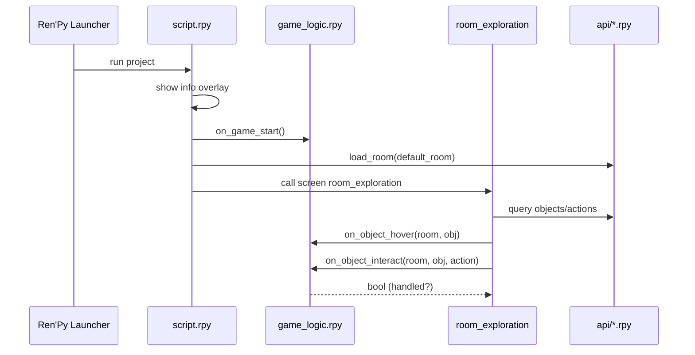
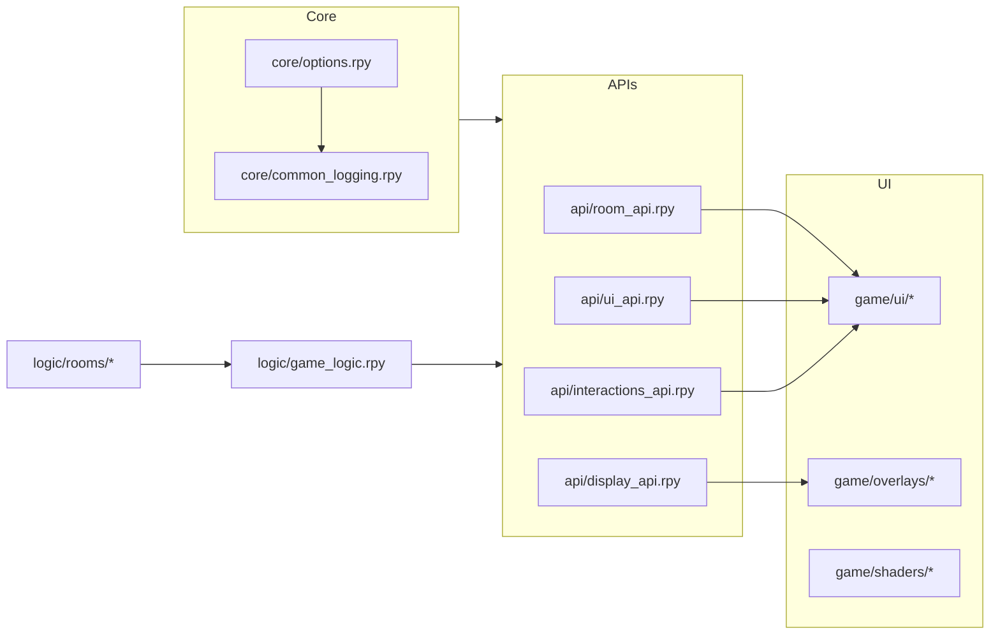

# Architecture

Flow
1) Launcher → `script.rpy` shows an info overlay, then calls `on_game_start()`.
2) Entry → `play_room()` loads the default room and starts the exploration screen.
3) Logic → Hooks in `game/logic/game_logic.rpy` (and per‑room handlers) respond to events.
4) UI → Screens in `game/ui/` render descriptions, object lists, and interaction menus.
5) Effects → `game/overlays/` and `game/shaders/` apply CRT/Bloom/Letterbox.

Key modules
- `game/api/room_api.rpy` — room loading, object registration, navigation
- `game/api/ui_api.rpy` — description boxes, tooltips, screens helpers
- `game/api/interactions_api.rpy` — actions, menus, and interaction flow
- `game/api/display_api.rpy` — effects toggles (CRT, letterbox, bloom)
- `game/core/options.rpy` — versioning and defaults
- `game/core/common_logging.rpy` — logging, print interception
- `game/core/rooms/room_config.rpy` — room configuration helper(s)

Data flow
- The exploration screen queries the current room, selection, and actions via APIs.
- Hover/selection changes trigger hooks; handlers may override default behavior.
- on_object_interact returns bool: True to signal the action has been fully handled.

## Sequence (Mermaid)

## Components (Mermaid)

