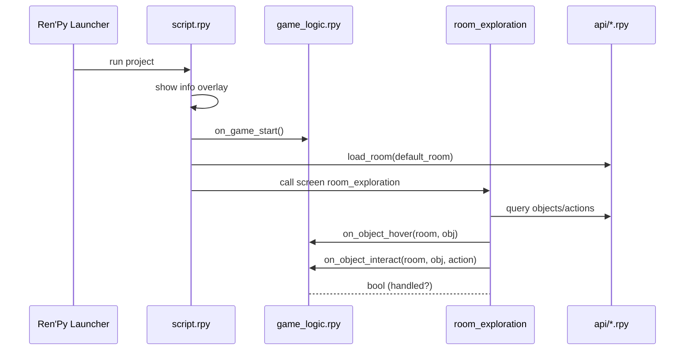
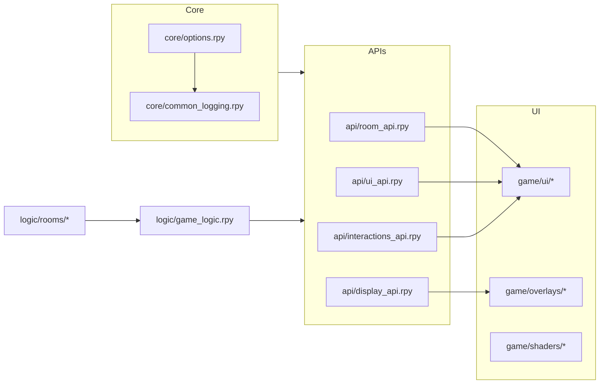

# Architecture

Flow
1) Launcher → `script.rpy` shows an info overlay, then calls `on_game_start()`.
2) Entry → `play_room()` loads the default room and starts the exploration screen.
3) Logic → Hooks in `game/logic/game_logic.rpy` (and per‑room handlers) respond to events.
4) UI → Screens in `game/ui/` render descriptions, object lists, and interaction menus.
5) Effects → `game/overlays/` and `game/shaders/` apply CRT/Bloom/Letterbox.

Key modules
- `game/api/room_api.rpy` — room loading, object registration, navigation
- `game/api/ui_api.rpy` — description boxes, tooltips, screens helpers
- `game/api/interactions_api.rpy` — actions, menus, and interaction flow
- `game/api/display_api.rpy` — effects toggles (CRT, letterbox, bloom)
- `game/core/options.rpy` — versioning and defaults
- `game/core/common_logging.rpy` — logging, print interception
- `game/core/rooms/room_config.rpy` — room configuration helper(s)

Data flow
- The exploration screen queries the current room, selection, and actions via APIs.
- Hover/selection changes trigger hooks; handlers may override default behavior.
- on_object_interact returns bool: True to signal the action has been fully handled.

## Project Layout
```
project/
├─ game/
│  ├─ logic/                 # global + per-room gameplay hooks
│  │  ├─ game_logic.rpy
│  │  └─ rooms/              # register_room_logic('<room>', Handler())
│  ├─ api/                   # public helper APIs
│  │  ├─ room_api.rpy        # room/object helpers
│  │  ├─ ui_api.rpy          # UI helpers
│  │  ├─ interactions_api.rpy# action routing
│  │  └─ display_api.rpy     # effects toggles
│  ├─ ui/                    # composition screens, transforms
│  ├─ overlays/              # letterbox, info, debug, fades
│  ├─ shaders/               # CRT and bloom shader code
│  └─ core/                  # options, logging, room config, utilities
├─ scripts/                  # push mirroring, wiki sync, etc.
└─ Wiki/                     # documentation (mirrored to GitHub wiki)
```

## Sequence (Mermaid)


ASCII fallback
```
Launcher -> script.rpy -> on_game_start()
script.rpy -> APIs.load_room(default_room)
script.rpy -> screen room_exploration
screen -> APIs (query objects/actions)
screen -> logic.on_object_hover(room, obj)
screen -> logic.on_object_interact(room, obj, action)
logic -> screen (handled? True/False)
```

## Components (Mermaid)


ASCII fallback
```
[core/options] -> [core/common_logging]
[core/*] -> [api/*]
[api/room] -> [ui/screens]
[api/ui] -> [ui/screens]
[api/interactions] -> [ui/screens]
[api/display] -> [overlays]
[logic] -> [api/*]
[logic/rooms/*] -> [logic]
```

