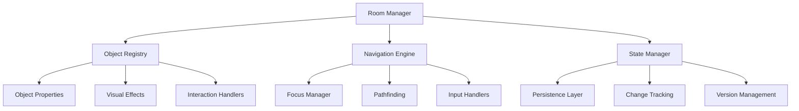

# Room API Reference

**Part III: API Reference - Chapter 10**

*Complete technical reference for the Room System API, providing comprehensive documentation for room management, object manipulation, navigation systems, and state management in the Snatchernauts Framework.*

---

## Chapter Overview

The Room API (`game/api/room_api.rpy`) serves as the foundation of location-based gameplay in the Snatchernauts Framework. This system manages the complete lifecycle of interactive environments, from loading and object registration to navigation and state persistence.

**Core Architecture**: The Room API implements a hierarchical system where rooms contain objects, objects have properties and behaviors, and the entire system integrates seamlessly with the visual effects pipeline and save/load functionality.

**Framework Integration**: Every room operation automatically integrates with the framework's logging system, visual effects pipeline, and accessibility features, ensuring consistent behavior across all game implementations.

**What makes this API comprehensive:**
- **Complete Lifecycle Management**: Handles all aspects of room loading, object manipulation, and cleanup
- **Advanced Navigation System**: Supports keyboard, mouse, and gamepad navigation with intelligent pathfinding
- **Rich Object Model**: Objects support complex properties, animations, and dynamic behaviors
- **Performance Optimized**: Includes caching, lazy loading, and memory management features
- **Developer Friendly**: Extensive error checking, validation, and debugging capabilities

**By mastering this API, you will understand:**
- Complete room system architecture and design patterns
- Advanced object manipulation and animation techniques
- Navigation system implementation and customization
- Performance optimization strategies for large environments
- Integration patterns with other framework systems
- Professional error handling and validation approaches

---

## API Architecture

### System Components



### Data Flow Architecture

```python
# Room Loading Flow
load_room(room_id) → 
    validate_room_config() → 
    cleanup_previous_room() → 
    initialize_room_objects() → 
    setup_navigation_graph() → 
    trigger_room_enter_hooks() → 
    update_visual_effects()

# Object Interaction Flow
object_click(obj_name) → 
    validate_object_exists() → 
    check_interaction_permissions() → 
    trigger_interaction_hooks() → 
    update_object_state() → 
    save_state_changes() → 
    refresh_display()
```

---

The Room API (`game/api/room_api.rpy`) is the central system for managing room-based gameplay in the Snatchernauts Framework. It handles room loading, object registration, navigation, and state management. This API provides the foundation for creating interactive environments where players can explore, interact with objects, and progress through your story.

## Core Responsibilities

### Room Lifecycle Management
- Load and unload rooms with proper state cleanup
- Maintain current room identification and context
- Handle room transitions and audio management
- Manage persistent room state across save/load cycles

### Object System
- Register interactive objects with their properties and behaviors
- Handle object positioning, scaling, and visual properties
- Manage object visibility and interaction state
- Support dynamic object creation and removal

### Navigation Support
- Provide keyboard and gamepad navigation between objects
- Handle focus management and selection state
- Support accessibility features and alternative input methods
- Calculate optimal navigation paths and object ordering

## Primary Functions

### Room Loading and Management

#### `load_room(room_id, music=None, fade_in=True)`

**Purpose**: Load a new room and set it as the current active room

**Parameters**:
- `room_id` (string): Identifier for the room to load
- `music` (string, optional): Background music file to play
- `fade_in` (boolean): Whether to use fade-in transition

**Example**:
```python
# Basic room loading
load_room("detective_office")

# Load room with specific music
load_room("crime_scene", music="audio/tension_theme.ogg")

# Load room without fade transition
load_room("flashback_room", fade_in=False)
```

**Side Effects**:
- Sets `store.current_room_id` to the new room
- Loads room configuration from `ROOM_DEFINITIONS`
- Triggers `on_room_enter()` hook after loading
- Starts background music if specified
- Clears previous room state and objects

#### `get_current_room()`

**Purpose**: Get the identifier of the currently active room

**Returns**: String identifier of current room, or `None` if no room loaded

**Example**:
```python
current = get_current_room()
if current == "detective_office":
    # Room-specific logic
    show_evidence_board()
```

#### `play_room_audio(room_id, audio_type="ambient")`

**Purpose**: Start audio associated with a specific room

**Parameters**:
- `room_id` (string): Room identifier
- `audio_type` (string): Type of audio ("ambient", "music", "tension")

**Example**:
```python
# Play ambient sound for current room
play_room_audio("detective_office", "ambient")

# Switch to tension music during investigation
play_room_audio("detective_office", "tension")
```

### Object Registration and Management

#### `add_room_object(room_id, object_name, config)`

**Purpose**: Add a new interactive object to a room

**Parameters**:
- `room_id` (string): Target room identifier
- `object_name` (string): Unique object identifier within the room
- `config` (dict): Object configuration dictionary

**Configuration Properties**:
```python
config = {
    "image": "path/to/image.png",      # Required: object image file
    "position": (x, y),               # Required: screen position
    "actions": ["Examine", "Take"],   # Available player actions
    "scale_percent": 100,             # Size scaling (100 = original)
    "visible": True,                  # Initial visibility state
    "description": "A wooden desk",   # Hover description text
    "z_order": 10,                    # Display layering priority
    
    # Desaturation highlighting settings
    "desaturation_intensity": 0.5,
    "desaturation_preset": "moderate",
    
    # Advanced properties
    "interactive": True,              # Can be clicked/selected
    "hover_enabled": True,            # Shows hover effects
    "focus_mask": "path/to/mask.png"  # Custom interaction area
}
```

**Example**:
```python
# Add a simple interactive object
add_room_object("office", "desk", {
    "image": "furniture/desk.png",
    "position": (400, 300),
    "actions": ["Examine", "Search"],
    "description": "A cluttered detective's desk"
})

# Add object with special highlighting
add_room_object("office", "evidence", {
    "image": "items/evidence_box.png",
    "position": (600, 250),
    "actions": ["Examine", "Take"],
    "description": "Box of case evidence",
    "desaturation_preset": "explosive_intense",
    "z_order": 15
})
```

#### `remove_room_object(room_id, object_name)`

**Purpose**: Remove an object from a room

**Parameters**:
- `room_id` (string): Room containing the object
- `object_name` (string): Object to remove

**Example**:
```python
# Remove object after player takes it
def on_object_interact(room_id, obj, action):
    if obj == "key" and action == "Take":
        store.inventory.append("office_key")
        remove_room_object(room_id, "key")
        renpy.say(None, "You pick up the key.")
        return True
```

#### `get_room_objects(room_id=None)`

**Purpose**: Get list of all objects in a room

**Parameters**:
- `room_id` (string, optional): Room to query (defaults to current room)

**Returns**: Dictionary of object configurations

**Example**:
```python
# Check all objects in current room
objects = get_room_objects()
for obj_name, obj_config in objects.items():
    print(f"Object {obj_name} at {obj_config['position']}")

# Count interactive objects
interactive_count = sum(1 for obj in objects.values() 
                       if obj.get('interactive', True))
```

### Object Manipulation

#### `move_object(object_name, dx, dy)`

**Purpose**: Move an object by a relative offset

**Parameters**:
- `object_name` (string): Object to move
- `dx` (int): Horizontal movement in pixels
- `dy` (int): Vertical movement in pixels

**Example**:
```python
# Animate object falling
move_object("vase", 0, 100)  # Move down 100 pixels

# Shake effect
for i in range(3):
    move_object("desk", 5, 0)
    renpy.pause(0.1)
    move_object("desk", -5, 0)
    renpy.pause(0.1)
```

#### `scale_object(object_name, scale_change)`

**Purpose**: Change an object's size

**Parameters**:
- `object_name` (string): Object to scale
- `scale_change` (float): Scale multiplier (1.0 = no change)

**Example**:
```python
# Make object larger to show importance
scale_object("evidence", 1.2)  # 20% larger

# Shrink object as it's taken
scale_object("coin", 0.5)  # 50% of original size
```

### Navigation and Selection

#### `get_object_list_for_navigation()`

**Purpose**: Get ordered list of objects for keyboard/gamepad navigation

**Returns**: List of object names in navigation order

**Example**:
```python
# Get navigation order
nav_objects = get_object_list_for_navigation()
print(f"Navigation order: {nav_objects}")

# Check if specific object is navigable
if "secret_panel" in nav_objects:
    renpy.notify("Hidden object discovered!")
```

#### `find_nearest_object(current_obj, direction)`

**Purpose**: Find the nearest object in a given direction for navigation

**Parameters**:
- `current_obj` (string): Currently selected object
- `direction` (string): Direction to search ("up", "down", "left", "right")

**Returns**: Name of nearest object, or `None` if no object found

**Example**:
```python
# Implement custom navigation logic
def custom_navigate(direction):
    current = store.gamepad_selected_object
    next_obj = find_nearest_object(current, direction)
    if next_obj:
        store.gamepad_selected_object = next_obj
        handle_object_hover(next_obj)
```

#### `gamepad_navigate(direction)`

**Purpose**: Handle gamepad/keyboard navigation between objects

**Parameters**:
- `direction` (string): Navigation direction

**Example**:
```python
# Navigation key bindings
key "K_UP" action Function(gamepad_navigate, "up")
key "K_DOWN" action Function(gamepad_navigate, "down")
key "K_LEFT" action Function(gamepad_navigate, "left")
key "K_RIGHT" action Function(gamepad_navigate, "right")
```

#### `gamepad_select_first_object()`

**Purpose**: Select the first navigable object in the room

**Example**:
```python
# Auto-select first object when entering room
def on_room_enter(room_id):
    gamepad_select_first_object()
    renpy.notify("Use arrow keys to navigate")
```

### State Management

#### `save_room_changes(room_id=None)`

**Purpose**: Persist current room state for save/load functionality

**Parameters**:
- `room_id` (string, optional): Room to save (defaults to current)

**Example**:
```python
# Save room state after significant changes
def on_object_interact(room_id, obj, action):
    if obj == "switch" and action == "Use":
        # Toggle lights
        store.office_lights_on = not store.office_lights_on
        update_room_lighting()
        save_room_changes()
        return True
```

#### `reset_room_changes(room_id=None)`

**Purpose**: Reset room to its initial state

**Parameters**:
- `room_id` (string, optional): Room to reset (defaults to current)

**Example**:
```python
# Reset room for new game+
def reset_chapter():
    for room in ["office", "crime_scene", "lab"]:
        reset_room_changes(room)
```

### Visual Effects Integration

#### `toggle_crt_effect()`

**Purpose**: Enable/disable CRT shader effect

**Example**:
```python
# Toggle CRT for retro feel
key "c" action Function(toggle_crt_effect)

# Enable CRT for specific scenes
def on_room_enter(room_id):
    if room_id == "computer_room":
        store.crt_enabled = True
    else:
        store.crt_enabled = False
```

#### `set_crt_parameters(warp=None, scan=None, chroma=None, vignette_strength=None, vignette_width=None)`

**Purpose**: Configure CRT effect parameters

**Parameters**: All optional, `None` means no change
- `warp` (float): Screen curvature (0.0-0.5)
- `scan` (float): Scanline intensity (0.0-1.0)
- `chroma` (float): Color separation (0.0-0.01)
- `vignette_strength` (float): Edge darkening (0.0-1.0)
- `vignette_width` (float): Vignette size (0.5-1.0)

**Example**:
```python
# Subtle CRT effect for dialogue
set_crt_parameters(warp=0.05, scan=0.1, chroma=0.001)

# Strong retro effect for flashback
set_crt_parameters(warp=0.15, scan=0.25, chroma=0.005)
```

## Room Configuration System

### Room Definition Structure

Rooms are defined in `ROOM_DEFINITIONS` dictionaries:

```python
ROOM_DEFINITIONS = {
    "detective_office": {
        "background": "images/backgrounds/office.png",
        "objects": {
            "desk": {
                "image": "images/furniture/desk.png",
                "position": (400, 300),
                "actions": ["Examine", "Search"]
            },
            "filing_cabinet": {
                "image": "images/furniture/cabinet.png",
                "position": (700, 280),
                "actions": ["Examine", "Open"],
                "description": "A locked filing cabinet"
            }
        },
        "audio": {
            "ambient": "audio/office_ambient.ogg",
            "tension": "audio/tension_music.ogg"
        },
        "effects": {
            "crt_enabled": False,
            "letterbox_enabled": False,
            "color_grade": "detective_office"
        }
    }
}
```

### Dynamic Room Creation

```python
# Create room at runtime
def create_new_room(room_id, background_image, objects=None):
    room_config = {
        "background": background_image,
        "objects": objects or {},
        "audio": {},
        "effects": {}
    }
    
    # Add to global definitions
    store.ROOM_DEFINITIONS[room_id] = room_config
    
    # Load immediately if needed
    if should_load_now:
        load_room(room_id)
```

## Error Handling and Validation

### Common Error Scenarios

```python
# Robust object interaction
def on_object_interact(room_id, obj, action):
    try:
        # Check if object exists
        objects = get_room_objects(room_id)
        if obj not in objects:
            print(f"[ERROR] Object {obj} not found in {room_id}")
            return False
        
        # Check if action is valid
        valid_actions = objects[obj].get('actions', [])
        if action not in valid_actions:
            print(f"[ERROR] Action {action} not valid for {obj}")
            return False
        
        # Perform action
        return handle_specific_interaction(room_id, obj, action)
        
    except Exception as e:
        print(f"[ERROR] Interaction failed: {e}")
        return False
```

### Validation Helpers

```python
def validate_room_config(room_id, config):
    """Validate room configuration before loading"""
    required_keys = ["background"]
    
    for key in required_keys:
        if key not in config:
            raise ValueError(f"Room {room_id} missing required key: {key}")
    
    # Validate object configurations
    objects = config.get("objects", {})
    for obj_name, obj_config in objects.items():
        if "image" not in obj_config:
            raise ValueError(f"Object {obj_name} missing image")
        if "position" not in obj_config:
            raise ValueError(f"Object {obj_name} missing position")
```

## Performance Considerations

### Memory Management
- Large rooms with many objects can consume significant memory
- Consider lazy loading of object images
- Unload unused rooms during long gameplay sessions

```python
# Memory-conscious room loading
def smart_load_room(room_id):
    # Unload previous room if memory usage is high
    if get_memory_usage() > MEMORY_THRESHOLD:
        unload_previous_rooms()
    
    # Load new room
    load_room(room_id)
```

### Navigation Performance
- Navigation calculations are cached for performance
- Large numbers of objects (>50) may impact navigation speed
- Consider grouping objects or using navigation hints

## Best Practices

### Room Naming Conventions
- Use descriptive, consistent names: `detective_office`, `crime_scene`, `lab`
- Avoid spaces and special characters
- Use underscores for multi-word names
- Keep names short but meaningful

### Object Organization
- Group related objects logically
- Use consistent action names across objects
- Provide meaningful descriptions for all interactive objects
- Consider navigation flow when positioning objects

### State Management
- Save room state after significant changes
- Use persistent storage for progress that should survive save/load
- Reset temporary states when appropriate
- Handle edge cases gracefully

## Integration Examples

### Complete Room Setup

```python
# Complete example of setting up a new room
def setup_investigation_room():
    # Define room configuration
    room_config = {
        "background": "images/investigation_room.png",
        "objects": {
            "evidence_board": {
                "image": "images/evidence_board.png",
                "position": (200, 100),
                "actions": ["Examine", "Update"],
                "description": "Board with case evidence",
                "desaturation_preset": "explosive_normal"
            },
            "suspect_photos": {
                "image": "images/photos.png",
                "position": (500, 150),
                "actions": ["Examine", "Analyze"],
                "description": "Photographs of suspects",
                "visible": False  # Hidden until discovered
            },
            "computer": {
                "image": "images/computer.png",
                "position": (600, 300),
                "actions": ["Use", "Search"],
                "description": "Police database terminal"
            }
        },
        "audio": {
            "ambient": "audio/investigation_ambient.ogg",
            "tension": "audio/discovery_theme.ogg"
        },
        "effects": {
            "color_grade": "detective_office",
            "lighting": "desk_lamp"
        }
    }
    
    # Register room
    store.ROOM_DEFINITIONS["investigation_room"] = room_config
    
    # Set up room-specific logic
    class InvestigationLogic:
        def on_room_enter(self, room_id):
            renpy.music.play("audio/investigation_ambient.ogg", channel="ambient")
            if store.case_progress >= 3:
                # Reveal hidden photos
                show_object("suspect_photos")
        
        def on_object_interact(self, room_id, obj, action):
            if obj == "evidence_board" and action == "Update":
                if len(store.evidence_collected) >= 5:
                    renpy.call("evidence_breakthrough_scene")
                else:
                    renpy.say(None, "You need more evidence first.")
                return True
            return False
    
    # Register logic handler
    register_room_logic("investigation_room", InvestigationLogic())
```

## Advanced API Features

### Multi-Room State Management

#### `get_all_room_states()`

**Purpose**: Retrieve state information for all rooms that have been loaded

**Returns**: Dictionary mapping room IDs to their current state

**Example**:
```python
# Check progress across all rooms
all_states = get_all_room_states()
for room_id, state in all_states.items():
    completion = calculate_room_completion(state)
    print(f"Room {room_id}: {completion}% complete")
```

#### `batch_update_rooms(updates)`

**Purpose**: Apply multiple room updates atomically

**Parameters**:
- `updates` (dict): Dictionary of room updates

**Example**:
```python
# Apply story progression changes to multiple rooms
updates = {
    "detective_office": {
        "objects": {
            "phone": {"visible": True, "actions": ["Answer"]}
        }
    },
    "crime_scene": {
        "objects": {
            "body": {"visible": False}  # Remove after investigation
        }
    }
}

batch_update_rooms(updates)
```

### Advanced Object Properties

#### Object Animation System

```python
# Complex object configuration with animations
object_config = {
    "image": "objects/clock.png",
    "position": (300, 200),
    "actions": ["Examine", "Set Time"],
    "description": "An antique grandfather clock",
    
    # Animation properties
    "animations": {
        "idle": {
            "type": "rotation",
            "angle_range": (0, 2),  # Subtle pendulum swing
            "duration": 2.0,
            "repeat": True
        },
        "interaction": {
            "type": "scale_pulse",
            "scale_range": (1.0, 1.1),
            "duration": 0.3,
            "easing": "ease_out_bounce"
        }
    },
    
    # Conditional visibility
    "visibility_conditions": {
        "requires": ["office_power_on"],
        "excludes": ["clock_broken"]
    },
    
    # Advanced interaction
    "interaction_zones": {
        "pendulum": {
            "area": (280, 220, 40, 60),  # x, y, width, height
            "actions": ["Stop Pendulum"]
        },
        "face": {
            "area": (290, 180, 60, 40),
            "actions": ["Read Time", "Set Time"]
        }
    }
}
```

#### `animate_object(object_name, animation_name, **kwargs)`

**Purpose**: Trigger specific animation on an object

**Parameters**:
- `object_name` (string): Target object
- `animation_name` (string): Animation to play
- `**kwargs`: Animation-specific parameters

**Example**:
```python
# Animate object during interaction
def on_object_interact(room_id, obj, action):
    if obj == "clock" and action == "Set Time":
        animate_object("clock", "interaction")
        renpy.pause(0.3)
        renpy.call("clock_setting_scene")
        return True
```

### Advanced Navigation System

#### Custom Navigation Graphs

```python
# Define custom navigation relationships
NAVIGATION_GRAPHS = {
    "detective_office": {
        "desk": {
            "up": "evidence_board",
            "right": "filing_cabinet",
            "down": "chair",
            "priority": 1  # First object to select
        },
        "evidence_board": {
            "down": "desk",
            "right": "window",
            "priority": 2
        },
        "filing_cabinet": {
            "left": "desk",
            "up": "window",
            "down": "safe",
            "priority": 3
        }
    }
}
```

#### `set_navigation_graph(room_id, graph)`

**Purpose**: Set custom navigation graph for a room

**Parameters**:
- `room_id` (string): Target room
- `graph` (dict): Navigation graph definition

**Example**:
```python
# Apply custom navigation when room loads
def on_room_enter(room_id):
    if room_id in NAVIGATION_GRAPHS:
        set_navigation_graph(room_id, NAVIGATION_GRAPHS[room_id])
```

#### `get_navigation_path(start_object, end_object)`

**Purpose**: Calculate shortest navigation path between two objects

**Parameters**:
- `start_object` (string): Starting object
- `end_object` (string): Target object

**Returns**: List of object names representing the path

**Example**:
```python
# Guide player to important object
def highlight_path_to_evidence():
    current = store.gamepad_selected_object
    path = get_navigation_path(current, "evidence_box")
    
    for obj in path:
        highlight_object(obj, duration=0.5)
        renpy.pause(0.5)
```

### Room Transition System

#### `create_room_transition(from_room, to_room, transition_config)`

**Purpose**: Define custom transition between rooms

**Parameters**:
- `from_room` (string): Source room
- `to_room` (string): Destination room  
- `transition_config` (dict): Transition configuration

**Example**:
```python
# Create dramatic transition to crime scene
create_room_transition("detective_office", "crime_scene", {
    "type": "fade_to_black",
    "duration": 1.5,
    "audio_crossfade": True,
    "effects": {
        "screen_shake": {"intensity": 0.3, "duration": 0.5}
    },
    "pre_transition_hook": "prepare_crime_scene",
    "post_transition_hook": "crime_scene_intro"
})
```

### Performance Optimization API

#### `optimize_room_memory(room_id=None)`

**Purpose**: Optimize memory usage for a specific room

**Parameters**:
- `room_id` (string, optional): Room to optimize (defaults to current)

**Example**:
```python
# Optimize memory usage after major scene changes
def after_major_scene_change():
    optimize_room_memory()
    
    # Also optimize previous rooms if memory usage is high
    if get_memory_usage() > MEMORY_THRESHOLD:
        for room in get_visited_rooms()[-3:]:  # Last 3 rooms
            optimize_room_memory(room)
```

#### `preload_room_assets(room_id)`

**Purpose**: Preload room assets in background for smooth transitions

**Parameters**:
- `room_id` (string): Room to preload

**Example**:
```python
# Preload next room during dialogue
label investigation_dialogue:
    # Start preloading while player is distracted
    $ preload_room_assets("crime_scene")
    
    "Detective" "We should head to the crime scene now."
    "Detective" "I have a feeling we'll find important clues there."
    
    # Assets should be loaded by now
    $ load_room("crime_scene")  # Will be instant
```

### Debugging and Development Tools

#### `enable_room_debug_mode(enabled=True)`

**Purpose**: Enable/disable debug visualization for room system

**Parameters**:
- `enabled` (boolean): Whether to enable debug mode

**Debug Features**:
- Visual object boundaries
- Navigation graph visualization
- Performance metrics overlay
- Object interaction logging

**Example**:
```python
# Enable debug mode during development
if config.developer:
    enable_room_debug_mode(True)
    
    # Add debug key bindings
    key "shift_d" action Function(toggle_debug_overlay)
    key "shift_n" action Function(show_navigation_graph)
```

#### `validate_all_rooms()`

**Purpose**: Validate all room configurations for errors

**Returns**: Dictionary of validation results

**Example**:
```python
# Run validation during development
if config.debug:
    validation_results = validate_all_rooms()
    
    for room_id, issues in validation_results.items():
        if issues:
            print(f"[WARNING] Room {room_id} has issues:")
            for issue in issues:
                print(f"  - {issue}")
```

#### `export_room_data(room_id, format="json")`

**Purpose**: Export room data for external tools or backup

**Parameters**:
- `room_id` (string): Room to export
- `format` (string): Export format ("json", "yaml", "csv")

**Returns**: Serialized room data

**Example**:
```python
# Backup room configurations
def backup_all_rooms():
    backup_data = {}
    for room_id in store.ROOM_DEFINITIONS.keys():
        backup_data[room_id] = export_room_data(room_id)
    
    # Save to file
    with open("room_backup.json", "w") as f:
        json.dump(backup_data, f, indent=2)
```

## Advanced Integration Patterns

### Event-Driven Room System

```python
# Event-driven room management
class RoomEventManager:
    def __init__(self):
        self.event_handlers = defaultdict(list)
    
    def register_handler(self, event_type, handler):
        """Register event handler for room events"""
        self.event_handlers[event_type].append(handler)
    
    def emit_event(self, event_type, **kwargs):
        """Emit room event to all registered handlers"""
        for handler in self.event_handlers[event_type]:
            try:
                handler(**kwargs)
            except Exception as e:
                print(f"Error in event handler: {e}")

# Global room event manager
room_events = RoomEventManager()

# Register event handlers
room_events.register_handler("room_loaded", lambda room_id: print(f"Room {room_id} loaded"))
room_events.register_handler("object_interacted", track_interaction_analytics)
room_events.register_handler("navigation_changed", update_accessibility_hints)

# Emit events from room system
def load_room_with_events(room_id):
    load_room(room_id)
    room_events.emit_event("room_loaded", room_id=room_id)
```

### Room State Machines

```python
# State machine for complex room behavior
class RoomStateMachine:
    def __init__(self, room_id):
        self.room_id = room_id
        self.current_state = "initial"
        self.states = {}
        self.transitions = {}
    
    def add_state(self, state_name, enter_callback=None, exit_callback=None):
        """Add state to the state machine"""
        self.states[state_name] = {
            "enter": enter_callback,
            "exit": exit_callback
        }
    
    def add_transition(self, from_state, to_state, condition):
        """Add transition between states"""
        if from_state not in self.transitions:
            self.transitions[from_state] = []
        
        self.transitions[from_state].append({
            "to": to_state,
            "condition": condition
        })
    
    def update(self):
        """Update state machine, checking for transitions"""
        if self.current_state in self.transitions:
            for transition in self.transitions[self.current_state]:
                if transition["condition"]():
                    self.transition_to(transition["to"])
                    break
    
    def transition_to(self, new_state):
        """Transition to new state"""
        # Exit current state
        if self.current_state in self.states:
            exit_callback = self.states[self.current_state]["exit"]
            if exit_callback:
                exit_callback()
        
        # Enter new state
        self.current_state = new_state
        if new_state in self.states:
            enter_callback = self.states[new_state]["enter"]
            if enter_callback:
                enter_callback()

# Example: Investigation room with different phases
def setup_investigation_state_machine():
    sm = RoomStateMachine("investigation_room")
    
    # Define states
    sm.add_state("initial", 
                 enter_callback=lambda: show_investigation_intro(),
                 exit_callback=lambda: hide_intro_text())
    
    sm.add_state("gathering_evidence",
                 enter_callback=lambda: enable_evidence_collection(),
                 exit_callback=lambda: disable_evidence_collection())
    
    sm.add_state("analysis_phase",
                 enter_callback=lambda: show_analysis_tools(),
                 exit_callback=lambda: hide_analysis_tools())
    
    sm.add_state("breakthrough",
                 enter_callback=lambda: play_breakthrough_scene(),
                 exit_callback=lambda: conclude_investigation())
    
    # Define transitions
    sm.add_transition("initial", "gathering_evidence", 
                      lambda: store.intro_completed)
    
    sm.add_transition("gathering_evidence", "analysis_phase",
                      lambda: len(store.evidence_collected) >= 3)
    
    sm.add_transition("analysis_phase", "breakthrough",
                      lambda: store.analysis_complete and store.breakthrough_ready)
    
    return sm
```

### Room-Based Save System Integration

```python
# Advanced save system integration
class RoomSaveManager:
    def __init__(self):
        self.room_snapshots = {}
        self.auto_save_rooms = set()
    
    def create_room_snapshot(self, room_id):
        """Create complete snapshot of room state"""
        room_data = {
            "objects": get_room_objects(room_id),
            "player_progress": get_room_progress(room_id),
            "state_variables": get_room_state_variables(room_id),
            "visited_objects": list(get_visited_objects(room_id)),
            "timestamp": time.time()
        }
        
        self.room_snapshots[room_id] = room_data
        return room_data
    
    def restore_room_snapshot(self, room_id):
        """Restore room from snapshot"""
        if room_id not in self.room_snapshots:
            return False
        
        snapshot = self.room_snapshots[room_id]
        
        # Restore object states
        for obj_name, obj_data in snapshot["objects"].items():
            update_object_properties(room_id, obj_name, obj_data)
        
        # Restore progress
        set_room_progress(room_id, snapshot["player_progress"])
        
        # Restore state variables
        restore_room_state_variables(room_id, snapshot["state_variables"])
        
        return True
    
    def enable_auto_save(self, room_id):
        """Enable automatic saving for room"""
        self.auto_save_rooms.add(room_id)
    
    def on_room_change(self, room_id):
        """Handle room changes for auto-save"""
        if room_id in self.auto_save_rooms:
            self.create_room_snapshot(room_id)

# Global room save manager
room_save_manager = RoomSaveManager()
```

## Production Deployment Considerations

### Performance Monitoring

```python
# Room performance monitoring
class RoomPerformanceMonitor:
    def __init__(self):
        self.metrics = {
            "load_times": {},
            "object_counts": {},
            "memory_usage": {},
            "interaction_latency": []
        }
    
    def start_load_timer(self, room_id):
        """Start timing room load"""
        self.load_start_time = time.time()
        self.current_room = room_id
    
    def end_load_timer(self):
        """End timing room load"""
        if hasattr(self, 'load_start_time'):
            load_time = time.time() - self.load_start_time
            self.metrics["load_times"][self.current_room] = load_time
            
            # Log slow loads
            if load_time > 2.0:  # 2 seconds threshold
                print(f"[PERFORMANCE] Slow room load: {self.current_room} ({load_time:.2f}s)")
    
    def record_interaction_latency(self, latency):
        """Record object interaction latency"""
        self.metrics["interaction_latency"].append(latency)
        
        # Keep only recent measurements
        if len(self.metrics["interaction_latency"]) > 100:
            self.metrics["interaction_latency"] = self.metrics["interaction_latency"][-50:]
    
    def get_performance_report(self):
        """Generate performance report"""
        report = {
            "average_load_time": statistics.mean(self.metrics["load_times"].values()),
            "slowest_room": max(self.metrics["load_times"], key=self.metrics["load_times"].get),
            "average_interaction_latency": statistics.mean(self.metrics["interaction_latency"]),
            "total_rooms_loaded": len(self.metrics["load_times"])
        }
        return report

# Global performance monitor
room_performance = RoomPerformanceMonitor()
```

### Error Recovery System

```python
# Robust error recovery for room system
class RoomErrorRecovery:
    def __init__(self):
        self.fallback_rooms = {}
        self.error_counts = defaultdict(int)
        self.max_retries = 3
    
    def set_fallback_room(self, room_id, fallback_room_id):
        """Set fallback room in case of loading errors"""
        self.fallback_rooms[room_id] = fallback_room_id
    
    def safe_load_room(self, room_id, **kwargs):
        """Load room with error recovery"""
        try:
            # Attempt normal room loading
            load_room(room_id, **kwargs)
            
            # Reset error count on successful load
            self.error_counts[room_id] = 0
            
        except Exception as e:
            self.error_counts[room_id] += 1
            
            print(f"[ERROR] Failed to load room {room_id}: {e}")
            
            # Try fallback room if available and under retry limit
            if (room_id in self.fallback_rooms and 
                self.error_counts[room_id] <= self.max_retries):
                
                fallback = self.fallback_rooms[room_id]
                print(f"[RECOVERY] Loading fallback room: {fallback}")
                
                try:
                    load_room(fallback, **kwargs)
                except Exception as fallback_error:
                    print(f"[CRITICAL] Fallback room also failed: {fallback_error}")
                    self.emergency_recovery()
            else:
                self.emergency_recovery()
    
    def emergency_recovery(self):
        """Emergency recovery when all else fails"""
        print("[EMERGENCY] Attempting emergency recovery")
        
        # Try to load a minimal safe room
        try:
            create_emergency_room()
            load_room("emergency_room")
        except Exception as e:
            print(f"[CRITICAL] Emergency recovery failed: {e}")
            # At this point, we might need to restart or show error screen
            renpy.error("Critical room system failure. Please restart the game.")
    
    def create_emergency_room(self):
        """Create minimal emergency room"""
        emergency_config = {
            "background": "images/emergency_background.png",  # Should always exist
            "objects": {
                "menu_button": {
                    "image": "images/menu_button.png",
                    "position": (400, 300),
                    "actions": ["Return to Menu"],
                    "description": "Return to main menu"
                }
            }
        }
        
        store.ROOM_DEFINITIONS["emergency_room"] = emergency_config

# Global error recovery system
room_recovery = RoomErrorRecovery()

# Set up fallback rooms for critical areas
room_recovery.set_fallback_room("detective_office", "office_safe_mode")
room_recovery.set_fallback_room("crime_scene", "crime_scene_basic")
```

---

## API Quick Reference

### Core Functions
| Function | Purpose | Parameters |
|----------|---------|------------|
| `load_room()` | Load new room | `room_id`, `music`, `fade_in` |
| `get_current_room()` | Get current room ID | None |
| `add_room_object()` | Add object to room | `room_id`, `object_name`, `config` |
| `remove_room_object()` | Remove object | `room_id`, `object_name` |
| `get_room_objects()` | Get all objects | `room_id` (optional) |

### Object Manipulation
| Function | Purpose | Parameters |
|----------|---------|------------|
| `move_object()` | Move object | `object_name`, `dx`, `dy` |
| `scale_object()` | Scale object | `object_name`, `scale_change` |
| `animate_object()` | Animate object | `object_name`, `animation_name` |
| `set_object_visibility()` | Show/hide object | `object_name`, `visible` |

### Navigation
| Function | Purpose | Parameters |
|----------|---------|------------|
| `gamepad_navigate()` | Navigate direction | `direction` |
| `find_nearest_object()` | Find nearest object | `current_obj`, `direction` |
| `get_object_list_for_navigation()` | Get nav order | None |
| `gamepad_select_first_object()` | Select first object | None |

### State Management
| Function | Purpose | Parameters |
|----------|---------|------------|
| `save_room_changes()` | Save room state | `room_id` (optional) |
| `reset_room_changes()` | Reset room state | `room_id` (optional) |
| `get_all_room_states()` | Get all states | None |
| `batch_update_rooms()` | Bulk room updates | `updates` |

---

## Next Steps

The Room API provides the foundation for location-based gameplay in the Snatchernauts Framework. For complete system integration, continue to:

- **Chapter 11: API Reference - Interaction System** - Object interaction and logic hook systems
- **Chapter 12: API Reference - Display System** - Visual effects and rendering pipeline
- **Chapter 13: API Reference - UI System** - Screen and interface management
- **Chapter 14: Developer Manual** - Advanced implementation patterns and customization

This comprehensive Room API provides all the tools needed to create rich, interactive environments in your visual novel while maintaining clean separation between presentation and logic, professional error handling, and optimal performance characteristics.

---

**Continue to:** [Chapter 11: API Reference - Interaction System](11-API-Interactions.md)

