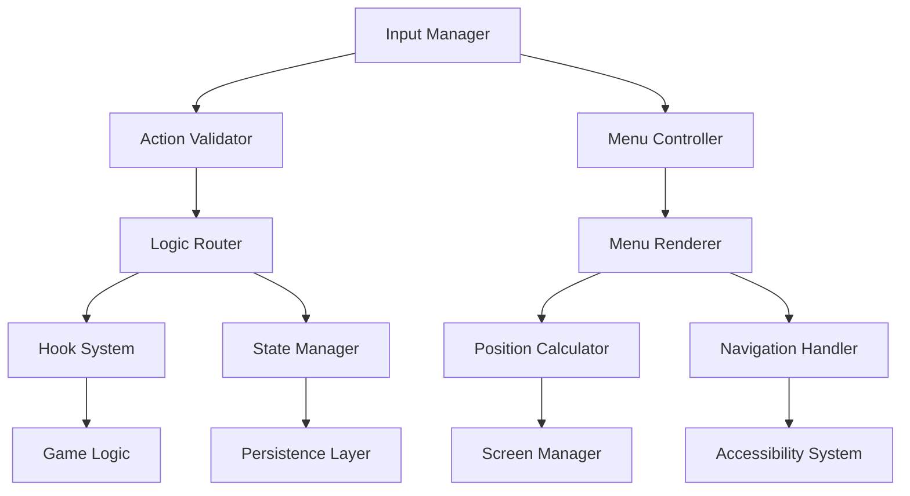

# Interactions API Reference

**Part III: API Reference - Chapter 11**

*Complete technical reference for the Interactions System API, providing comprehensive documentation for object interactions, action processing, menu management, and input handling in the Snatchernauts Framework.*

---

## Chapter Overview

The Interactions API (`game/api/interactions_api.rpy`) serves as the bridge between player input and game logic in the Snatchernauts Framework. This system transforms player actions into meaningful game interactions, managing everything from simple object examination to complex multi-step interaction sequences.

**Core Architecture**: The Interactions API implements a layered approach where input handling, menu management, action validation, and logic routing work together to create a seamless point-and-click experience that adapts to different input methods and interaction contexts.

**Framework Integration**: Every interaction automatically integrates with the framework's room system, visual effects pipeline, save/load functionality, and accessibility features, ensuring consistent behavior across all game implementations.

**What makes this API comprehensive:**
- **Multi-Input Support**: Native support for mouse, keyboard, and gamepad interactions
- **Dynamic Action System**: Context-sensitive actions that adapt to game state
- **Advanced Menu Management**: Intelligent positioning and navigation for interaction menus
- **Logic Hook Integration**: Seamless routing between UI and game logic layers
- **State Persistence**: Complete interaction state management and history tracking

**By mastering this API, you will understand:**
- Complete interaction system architecture and flow
- Advanced action handling and validation techniques
- Multi-input method integration and accessibility patterns
- Performance optimization strategies for complex interaction systems
- Professional error handling and user experience design
- Integration patterns with room systems and save/load functionality

---

## API Architecture

### System Components



### Interaction Flow Architecture

```python
# Primary Interaction Flow
user_input() → 
    validate_input() → 
    determine_action() → 
    validate_prerequisites() → 
    execute_logic_hooks() → 
    update_game_state() → 
    provide_feedback() → 
    log_interaction()

# Menu Interaction Flow
show_menu_request() → 
    calculate_position() → 
    populate_actions() → 
    render_menu() → 
    handle_navigation() → 
    execute_selected_action() → 
    hide_menu()

# Multi-Input Handling
input_event() → 
    identify_input_source() → 
    normalize_input() → 
    route_to_handler() → 
    execute_common_logic() → 
    provide_source_specific_feedback()
```

---

## Core Interaction Processing

The Interactions API (`game/api/interactions_api.rpy`) manages player interactions with objects in the game world. This system handles action menus, input processing, interaction routing, and coordination between the UI layer and game logic. It provides the core functionality that makes the framework's point-and-click exploration possible.

The Interactions API (`game/api/interactions_api.rpy`) manages player interactions with objects in the game world. This system handles action menus, input processing, interaction routing, and coordination between the UI layer and game logic. It provides the core functionality that makes the framework's point-and-click exploration possible.

## Core Responsibilities

### Action Management
- Define available actions for each interactive object
- Manage context-sensitive action availability
- Handle action validation and prerequisites
- Coordinate between different interaction types (examine, use, talk, etc.)

### Menu Systems
- Present contextual interaction menus to players
- Handle menu navigation via mouse, keyboard, and gamepad
- Manage menu positioning and visual appearance
- Support dynamic menu content based on game state

### Logic Integration
- Route player actions to appropriate game logic handlers
- Manage the interaction flow between UI and logic layers
- Handle return values and continuation logic
- Provide fallback behaviors for unhandled interactions

### State Management
- Track current interaction state and selected objects
- Manage interaction history and context
- Handle interaction interruption and cancellation
- Coordinate with save/load systems for interaction persistence

## Primary Functions

### Core Interaction Processing

#### `execute_object_action(obj_name, action_id, source="mouse")`

**Purpose**: Execute a player action on a specific object

**Parameters**:
- `obj_name` (string): Name of the target object
- `action_id` (string): Action to perform (e.g., "Examine", "Use", "Talk")
- `source` (string, optional): Input source ("mouse", "keyboard", "gamepad")

**Returns**: Boolean indicating if the action was handled

**Example**:
```python
# Execute action from button click
textbutton "Examine" action Function(execute_object_action, "desk", "Examine")

# Execute action programmatically
if player_has_key:
    execute_object_action("door", "Unlock")

# Handle action result
handled = execute_object_action("computer", "Use")
if not handled:
    renpy.say(None, "You can't use that right now.")
```

**Execution Flow**:
1. Validates object exists and action is available
2. Calls `on_object_interact()` hook with parameters
3. If hook returns `True`, considers action handled
4. If hook returns `False`, executes default behavior
5. Updates interaction state and triggers side effects

#### `execute_selected_action()`

**Purpose**: Execute the currently selected action on the currently selected object

**Example**:
```python
# Keyboard binding for action execution
key "K_RETURN" action Function(execute_selected_action)
key "K_SPACE" action Function(execute_selected_action)

# Gamepad binding
key "joy_0" action Function(execute_selected_action)
```

#### `get_actions_for(obj_name)`

**Purpose**: Get list of available actions for a specific object

**Parameters**:
- `obj_name` (string): Name of the object

**Returns**: List of action strings

**Example**:
```python
# Get actions for menu display
actions = get_actions_for("desk")
for action in actions:
    textbutton action action Function(execute_object_action, "desk", action)

# Check if specific action is available
if "Search" in get_actions_for("filing_cabinet"):
    renpy.say(None, "You could search the filing cabinet.")

# Dynamic action availability
def get_contextual_actions(obj_name):
    base_actions = get_actions_for(obj_name)
    
    # Add inventory-based actions
    if "key" in store.inventory and obj_name == "door":
        base_actions.append("Unlock")
    
    # Add story-based actions
    if store.detective_present and obj_name == "evidence":
        base_actions.append("Discuss")
    
    return base_actions
```

### Menu Management

#### `show_interaction_menu(obj_name, position=None)`

**Purpose**: Display the interaction menu for a specific object

**Parameters**:
- `obj_name` (string): Object to show menu for
- `position` (tuple, optional): Screen position for menu (x, y)

**Example**:
```python
# Show menu at mouse position
show_interaction_menu("desk", position=renpy.get_mouse_pos())

# Show menu at object position
obj_config = get_room_objects()["desk"]
show_interaction_menu("desk", position=obj_config["position"])

# Show menu with automatic positioning
show_interaction_menu("desk")  # Uses smart positioning
```

#### `hide_interaction_menu()`

**Purpose**: Hide the currently displayed interaction menu

**Example**:
```python
# Hide menu on escape key
key "K_ESCAPE" action Function(hide_interaction_menu)

# Hide menu after action execution
def execute_and_hide(obj, action):
    execute_object_action(obj, action)
    hide_interaction_menu()

# Auto-hide menu after timeout
init python:
    def auto_hide_menu():
        renpy.timeout(3.0)
        hide_interaction_menu()
```

#### `navigate_interaction_menu(direction)`

**Purpose**: Navigate through interaction menu options using keyboard/gamepad

**Parameters**:
- `direction` (string): Navigation direction ("up", "down", "left", "right")

**Example**:
```python
# Navigation key bindings
key "K_UP" action Function(navigate_interaction_menu, "up")
key "K_DOWN" action Function(navigate_interaction_menu, "down")
key "K_LEFT" action Function(navigate_interaction_menu, "left")
key "K_RIGHT" action Function(navigate_interaction_menu, "right")

# Gamepad navigation
key "joy_hat_y" action Function(navigate_interaction_menu, "up")
key "joy_hat_-y" action Function(navigate_interaction_menu, "down")
```

### Specialized Action Handlers

The framework provides built-in handlers for common action types:

#### `handle_talk_action(obj_name, character=None)`

**Purpose**: Handle conversation initiation with characters

**Parameters**:
- `obj_name` (string): Object representing the character
- `character` (string, optional): Character identifier for dialogue system

**Example**:
```python
# Simple talk action
def on_object_interact(room_id, obj, action):
    if obj == "detective" and action == "Talk":
        handle_talk_action("detective", character="det_martinez")
        return True

# Complex conversation handling
def handle_talk_action(obj_name, character=None):
    if character == "det_martinez":
        if store.case_progress < 3:
            renpy.call("detective_intro_scene")
        elif store.evidence_collected:
            renpy.call("detective_evidence_scene")
        else:
            renpy.call("detective_default_scene")
```

#### `handle_examine_action(obj_name, description=None)`

**Purpose**: Handle object examination with contextual descriptions

**Parameters**:
- `obj_name` (string): Object to examine
- `description` (string, optional): Override description

**Example**:
```python
# Basic examination
def on_object_interact(room_id, obj, action):
    if action == "Examine":
        descriptions = {
            "desk": "A cluttered detective's desk with papers scattered about.",
            "window": "Rain streaks down the dirty glass.",
            "filing_cabinet": "A locked metal filing cabinet."
        }
        handle_examine_action(obj, descriptions.get(obj))
        return True

# Dynamic descriptions
def get_dynamic_description(obj_name):
    if obj_name == "desk":
        if store.desk_searched:
            return "The desk drawers are open and empty."
        else:
            return "A cluttered detective's desk. Something might be hidden here."
    return None
```

#### `handle_take_action(obj_name, item_id=None)`

**Purpose**: Handle item collection and inventory management

**Parameters**:
- `obj_name` (string): Object to take
- `item_id` (string, optional): Inventory item identifier

**Example**:
```python
def on_object_interact(room_id, obj, action):
    if action == "Take":
        if obj == "key":
            if handle_take_action("key", "office_key"):
                hide_object("key")  # Remove from room
                renpy.notify("Taken: Office Key")
            return True
        elif obj == "evidence":
            if len(store.inventory) < MAX_INVENTORY:
                handle_take_action("evidence", f"evidence_{len(store.evidence_collected)}")
                store.evidence_collected.append(obj)
                return True
            else:
                renpy.say(None, "Your inventory is full.")
                return True
    return False
```

#### `handle_use_action(obj_name, tool_item=None)`

**Purpose**: Handle using items on objects or using objects directly

**Parameters**:
- `obj_name` (string): Target object
- `tool_item` (string, optional): Item being used on the object

**Example**:
```python
def on_object_interact(room_id, obj, action):
    if action.startswith("Use "):
        tool = action[4:]  # Remove "Use " prefix
        return handle_use_action(obj, tool)
    elif action == "Use":
        return handle_use_action(obj)
    return False

def handle_use_action(obj_name, tool_item=None):
    if tool_item:
        # Using an item on an object
        if tool_item == "key" and obj_name == "door":
            renpy.say(None, "You unlock the door.")
            store.door_unlocked = True
            return True
        elif tool_item == "crowbar" and obj_name == "crate":
            renpy.say(None, "You pry open the crate.")
            show_object("crate_contents")
            return True
    else:
        # Using the object directly
        if obj_name == "computer":
            renpy.call_screen("computer_interface")
            return True
        elif obj_name == "phone":
            renpy.call("phone_menu")
            return True
    
    return False
```

### Advanced Interaction Features

#### `get_menu_base_position(obj_name)`

**Purpose**: Calculate optimal menu position for an object

**Parameters**:
- `obj_name` (string): Object to position menu for

**Returns**: Tuple (x, y) for menu positioning

**Example**:
```python
# Smart menu positioning
def show_smart_menu(obj_name):
    pos = get_menu_base_position(obj_name)
    
    # Adjust for screen boundaries
    screen_width, screen_height = renpy.get_physical_size()
    menu_width, menu_height = 200, 150
    
    x, y = pos
    if x + menu_width > screen_width:
        x = screen_width - menu_width
    if y + menu_height > screen_height:
        y = screen_height - menu_height
    
    show_interaction_menu(obj_name, position=(x, y))
```

#### `trigger_dialogue_scene(scene_label, character=None, **kwargs)`

**Purpose**: Start a dialogue scene with proper state management

**Parameters**:
- `scene_label` (string): Ren'Py label to call
- `character` (string, optional): Character identifier
- `**kwargs`: Additional parameters to pass to the scene

**Example**:
```python
# Trigger dialogue with context
def on_object_interact(room_id, obj, action):
    if obj == "witness" and action == "Talk":
        trigger_dialogue_scene(
            "witness_conversation",
            character="witness_mary",
            case_progress=store.case_progress,
            evidence_count=len(store.evidence_collected)
        )
        return True

# Scene with prerequisites
def try_start_confession_scene():
    if store.case_progress >= 8 and "smoking_gun" in store.evidence_collected:
        trigger_dialogue_scene("suspect_confession", character="main_suspect")
        return True
    else:
        renpy.say(None, "You need more evidence before confronting the suspect.")
        return False
```

### Input Method Support

#### Mouse Interaction

```python
# Mouse-based object interaction
screen room_objects():
    for obj_name, obj_config in get_room_objects().items():
        imagebutton:
            idle obj_config["image"]
            hover Transform(obj_config["image"], brightness=1.2)
            pos obj_config["position"]
            
            # Right-click for menu
            action Function(show_interaction_menu, obj_name)
            
            # Left-click for default action
            alternate Function(execute_default_action, obj_name)
            
            # Hover handling
            hovered Function(handle_object_hover, obj_name)
            unhovered Function(handle_object_unhover)
```

#### Keyboard Navigation

```python
# Keyboard interaction system
init python:
    def setup_keyboard_bindings():
        # Object navigation
        renpy.register_keymap("object_nav", {
            "K_TAB": "next_object",
            "K_TAB shift": "prev_object",
            "K_UP": "nav_up",
            "K_DOWN": "nav_down",
            "K_LEFT": "nav_left",
            "K_RIGHT": "nav_right"
        })
        
        # Action execution
        renpy.register_keymap("interaction", {
            "K_RETURN": "execute_action",
            "K_SPACE": "show_menu",
            "K_ESCAPE": "cancel_interaction"
        })
```

#### Gamepad Support

```python
# Gamepad interaction handling
def handle_gamepad_input(event_name):
    if event_name == "gamepad_activate":
        if store.gamepad_selected_object:
            show_interaction_menu(store.gamepad_selected_object)
    elif event_name == "gamepad_select":
        execute_selected_action()
    elif event_name == "gamepad_cancel":
        hide_interaction_menu()

# Gamepad navigation
def gamepad_navigate_objects(direction):
    current = store.gamepad_selected_object
    objects = get_object_list_for_navigation()
    
    if current in objects:
        current_index = objects.index(current)
        if direction == "next":
            new_index = (current_index + 1) % len(objects)
        else:
            new_index = (current_index - 1) % len(objects)
        
        store.gamepad_selected_object = objects[new_index]
        handle_object_hover(objects[new_index])
```

### Interaction State Management

```python
# Interaction state variables
default interaction_menu_active = False
default interaction_target_object = None
default interaction_selected_action = None
default interaction_history = []

# State management functions
def save_interaction_state():
    """Save current interaction state"""
    persistent.interaction_state = {
        "menu_active": store.interaction_menu_active,
        "target_object": store.interaction_target_object,
        "selected_action": store.interaction_selected_action,
        "history": store.interaction_history[-10:]  # Last 10 interactions
    }

def restore_interaction_state():
    """Restore saved interaction state"""
    if hasattr(persistent, "interaction_state") and persistent.interaction_state:
        state = persistent.interaction_state
        store.interaction_history = state.get("history", [])
        
        # Restore active menu if it was open
        if state.get("menu_active") and state.get("target_object"):
            show_interaction_menu(state["target_object"])

def log_interaction(obj_name, action, result):
    """Log interaction for history and debugging"""
    interaction_record = {
        "object": obj_name,
        "action": action,
        "result": result,
        "timestamp": renpy.get_game_runtime(),
        "room": get_current_room()
    }
    store.interaction_history.append(interaction_record)
    
    # Keep only recent history
    if len(store.interaction_history) > 50:
        store.interaction_history = store.interaction_history[-50:]
```

### Error Handling and Validation

```python
def validate_interaction(obj_name, action):
    """Validate interaction before execution"""
    # Check if object exists
    objects = get_room_objects()
    if obj_name not in objects:
        print(f"[ERROR] Object '{obj_name}' not found in current room")
        return False
    
    # Check if action is available
    available_actions = get_actions_for(obj_name)
    if action not in available_actions:
        print(f"[ERROR] Action '{action}' not available for object '{obj_name}'")
        return False
    
    # Check prerequisites
    obj_config = objects[obj_name]
    if obj_config.get("requires_item") and obj_config["requires_item"] not in store.inventory:
        renpy.say(None, f"You need {obj_config['requires_item']} to {action.lower()} this.")
        return False
    
    return True

def safe_execute_action(obj_name, action):
    """Execute action with error handling"""
    try:
        if not validate_interaction(obj_name, action):
            return False
        
        result = execute_object_action(obj_name, action)
        log_interaction(obj_name, action, result)
        return result
        
    except Exception as e:
        print(f"[ERROR] Interaction failed: {obj_name}.{action} - {e}")
        renpy.say(None, "Something went wrong with that interaction.")
        return False
```

## Integration with Other Systems

### Room System Integration

```python
# Update interactions when room changes
def on_room_enter(room_id):
    # Clear interaction state
    hide_interaction_menu()
    store.interaction_target_object = None
    
    # Set up room-specific interactions
    setup_room_interactions(room_id)

def setup_room_interactions(room_id):
    """Configure interactions for a specific room"""
    room_config = get_room_config(room_id)
    
    # Set up special interaction rules
    if room_id == "crime_scene":
        # Everything requires gloves
        for obj_name in get_room_objects():
            add_interaction_requirement(obj_name, "Use", "gloves")
    elif room_id == "dark_room":
        # Can't examine things without light
        if not store.flashlight_on:
            disable_action_for_room("Examine")
```

### Save System Integration

```python
# Save interaction preferences and history
def save_interaction_preferences():
    persistent.interaction_prefs = {
        "menu_style": store.interaction_menu_style,
        "auto_hide_delay": store.menu_auto_hide_delay,
        "default_action": store.preferred_default_action,
        "show_tooltips": store.interaction_tooltips_enabled
    }

# Load interaction preferences
def load_interaction_preferences():
    if hasattr(persistent, "interaction_prefs"):
        prefs = persistent.interaction_prefs
        store.interaction_menu_style = prefs.get("menu_style", "popup")
        store.menu_auto_hide_delay = prefs.get("auto_hide_delay", 3.0)
        store.preferred_default_action = prefs.get("default_action", "Examine")
        store.interaction_tooltips_enabled = prefs.get("show_tooltips", True)
```

## Advanced API Features

### Context-Sensitive Action System

#### `register_action_condition(action_name, condition_func)`

**Purpose**: Register a global condition function for action availability

**Parameters**:
- `action_name` (string): Name of the action
- `condition_func` (function): Function that returns boolean for action availability

**Example**:
```python
# Register global action conditions
register_action_condition("Search", lambda obj: store.detective_badge_shown)
register_action_condition("Arrest", lambda obj: len(store.evidence_collected) >= 3)
register_action_condition("Hack", lambda obj: "laptop" in store.inventory)

# Complex conditional logic
def can_interrogate(obj_name):
    return (store.player_is_detective and 
            store.suspect_present and 
            obj_name in store.suspects and
            store.miranda_rights_read)

register_action_condition("Interrogate", can_interrogate)
```

#### `create_action_chain(chain_name, actions, requirements=None)`

**Purpose**: Create sequences of actions that must be performed in order

**Parameters**:
- `chain_name` (string): Identifier for the action chain
- `actions` (list): List of action names in sequence
- `requirements` (dict, optional): Prerequisites for each action

**Example**:
```python
# Create investigation action chain
create_action_chain("forensic_analysis", [
    "Photograph",
    "Dust for Prints", 
    "Collect Sample",
    "Analyze"
], requirements={
    "Photograph": lambda: "camera" in store.inventory,
    "Dust for Prints": lambda: "fingerprint_kit" in store.inventory,
    "Collect Sample": lambda: "evidence_bags" in store.inventory,
    "Analyze": lambda: store.lab_access_granted
})

# Use chain in object configuration
add_room_object("crime_scene", "bloodstain", {
    "image": "evidence/bloodstain.png",
    "position": (300, 400),
    "action_chain": "forensic_analysis",
    "description": "A suspicious bloodstain"
})
```

### Advanced Menu System

#### Custom Menu Renderers

```python
# Custom menu renderer class
class AdvancedMenuRenderer:
    def __init__(self, style="detective_theme"):
        self.style = style
        self.animation_duration = 0.3
        self.menu_cache = {}
    
    def render_menu(self, obj_name, actions, position):
        """Render interaction menu with advanced styling"""
        menu_id = f"{obj_name}_{hash(tuple(actions))}"
        
        # Use cached menu if available
        if menu_id in self.menu_cache:
            return self.show_cached_menu(menu_id, position)
        
        # Create new menu
        menu_data = self.create_menu_data(obj_name, actions)
        self.menu_cache[menu_id] = menu_data
        
        return self.display_menu(menu_data, position)
    
    def create_menu_data(self, obj_name, actions):
        """Create structured menu data"""
        return {
            "object": obj_name,
            "actions": actions,
            "style": self.get_style_for_object(obj_name),
            "layout": self.calculate_layout(actions),
            "animations": self.get_animations()
        }
    
    def get_style_for_object(self, obj_name):
        """Get style based on object type"""
        obj_config = get_room_objects().get(obj_name, {})
        obj_type = obj_config.get("type", "default")
        
        style_map = {
            "character": "character_menu",
            "evidence": "evidence_menu",
            "furniture": "furniture_menu",
            "door": "exit_menu",
            "default": "standard_menu"
        }
        
        return style_map.get(obj_type, "standard_menu")

# Global menu renderer
advanced_menu = AdvancedMenuRenderer()
```

#### `set_menu_theme(theme_name, theme_config)`

**Purpose**: Define custom menu themes with styling and behavior

**Parameters**:
- `theme_name` (string): Theme identifier
- `theme_config` (dict): Theme configuration

**Example**:
```python
# Define detective theme
set_menu_theme("detective", {
    "background": "images/ui/menu_detective_bg.png",
    "text_color": "#E6E6E6",
    "highlight_color": "#FFD700",
    "border_color": "#8B4513",
    "font": "fonts/detective.ttf",
    "sound_hover": "audio/ui/menu_hover.ogg",
    "sound_select": "audio/ui/menu_select.ogg",
    "animations": {
        "show": {"type": "fade_in", "duration": 0.2},
        "hide": {"type": "fade_out", "duration": 0.15},
        "hover": {"type": "glow", "intensity": 0.3}
    }
})

# Define crime scene theme
set_menu_theme("crime_scene", {
    "background": "images/ui/menu_evidence_bg.png",
    "text_color": "#FF0000",
    "highlight_color": "#FFFF00",
    "border_color": "#000000",
    "urgency_indicator": True,
    "require_confirmation": ["Take", "Move"]
})
```

### Multi-Action Support

#### `execute_action_sequence(obj_name, action_sequence)`

**Purpose**: Execute multiple actions on an object in sequence

**Parameters**:
- `obj_name` (string): Target object
- `action_sequence` (list): List of actions to execute

**Example**:
```python
# Execute complex interaction sequence
def investigate_computer():
    sequence = [
        "Turn On",
        "Enter Password", 
        "Search Files",
        "Copy Data",
        "Delete Logs"
    ]
    
    result = execute_action_sequence("computer", sequence)
    
    if result["success"]:
        renpy.say(None, "Investigation complete.")
        store.computer_data_obtained = True
    else:
        failed_action = result["failed_at"]
        renpy.say(None, f"Investigation failed at: {failed_action}")

# Define sequence with conditions
computer_sequence = ActionSequence(
    name="hack_computer",
    actions=[
        {"action": "Turn On", "required": True},
        {"action": "Bypass Security", "condition": lambda: "hacking_tool" in store.inventory},
        {"action": "Access Files", "required": True},
        {"action": "Download Data", "condition": lambda: "usb_drive" in store.inventory}
    ]
)
```

#### `register_combo_action(combo_name, object_actions)`

**Purpose**: Register combination actions that affect multiple objects

**Parameters**:
- `combo_name` (string): Name of the combination action
- `object_actions` (dict): Dictionary mapping objects to their actions

**Example**:
```python
# Register complex combination action
register_combo_action("setup_surveillance", {
    "camera": "Position",
    "microphone": "Hide", 
    "recorder": "Start Recording",
    "monitor": "Switch On"
})

# Execute combination action
def on_object_interact(room_id, obj, action):
    if action == "Setup Surveillance":
        if execute_combo_action("setup_surveillance"):
            renpy.say(None, "Surveillance equipment is now active.")
            store.surveillance_active = True
        return True
```

### Dynamic Interaction Generation

#### `generate_contextual_actions(obj_name, context=None)`

**Purpose**: Generate context-sensitive actions based on game state

**Parameters**:
- `obj_name` (string): Object to generate actions for
- `context` (dict, optional): Additional context information

**Example**:
```python
# Dynamic action generation
def generate_contextual_actions(obj_name, context=None):
    base_actions = get_actions_for(obj_name)
    dynamic_actions = []
    
    # Add inventory-based actions
    for item in store.inventory:
        if can_use_item_on_object(item, obj_name):
            dynamic_actions.append(f"Use {item}")
    
    # Add character-specific actions
    if store.current_character == "detective":
        if obj_name in store.evidence_objects:
            dynamic_actions.append("Analyze Evidence")
        if obj_name in store.suspect_objects:
            dynamic_actions.append("Question About")
    
    # Add story progression actions
    if store.case_phase == "investigation":
        dynamic_actions.extend(["Photograph", "Sketch", "Measure"])
    elif store.case_phase == "confrontation":
        dynamic_actions.extend(["Accuse", "Present Evidence"])
    
    return base_actions + dynamic_actions

# Use in menu system
def show_dynamic_menu(obj_name):
    actions = generate_contextual_actions(obj_name)
    show_interaction_menu(obj_name, actions=actions)
```

### Advanced Input Handling

#### Multi-Touch Support

```python
# Multi-touch interaction handling
class MultiTouchHandler:
    def __init__(self):
        self.active_touches = {}
        self.gesture_threshold = 50
        self.long_press_duration = 0.5
    
    def handle_touch_start(self, touch_id, position, timestamp):
        """Handle touch start event"""
        self.active_touches[touch_id] = {
            "start_pos": position,
            "current_pos": position,
            "start_time": timestamp,
            "object": self.get_object_at_position(position)
        }
    
    def handle_touch_move(self, touch_id, position):
        """Handle touch move event"""
        if touch_id in self.active_touches:
            touch = self.active_touches[touch_id]
            touch["current_pos"] = position
            
            # Check for gesture
            if self.calculate_distance(touch["start_pos"], position) > self.gesture_threshold:
                self.handle_gesture(touch_id, touch)
    
    def handle_touch_end(self, touch_id, timestamp):
        """Handle touch end event"""
        if touch_id in self.active_touches:
            touch = self.active_touches[touch_id]
            duration = timestamp - touch["start_time"]
            
            if duration > self.long_press_duration:
                self.handle_long_press(touch)
            else:
                self.handle_tap(touch)
            
            del self.active_touches[touch_id]
    
    def handle_gesture(self, touch_id, touch):
        """Handle gesture recognition"""
        gesture_type = self.recognize_gesture(touch)
        
        if gesture_type == "swipe_up":
            show_inventory_screen()
        elif gesture_type == "swipe_down":
            show_game_menu()
        elif gesture_type == "circle":
            highlight_all_interactive_objects()

# Global multi-touch handler
multi_touch = MultiTouchHandler()
```

#### Voice Command Integration

```python
# Voice command system
class VoiceCommandProcessor:
    def __init__(self):
        self.command_patterns = {}
        self.voice_enabled = False
        self.confidence_threshold = 0.7
    
    def register_voice_command(self, pattern, action_func):
        """Register voice command pattern"""
        self.command_patterns[pattern.lower()] = action_func
    
    def process_voice_input(self, audio_data):
        """Process voice input and execute commands"""
        if not self.voice_enabled:
            return False
        
        # Convert audio to text (would use speech recognition library)
        text = self.speech_to_text(audio_data)
        
        if text:
            return self.execute_voice_command(text)
        return False
    
    def execute_voice_command(self, text):
        """Execute voice command based on text"""
        text_lower = text.lower()
        
        for pattern, action_func in self.command_patterns.items():
            if self.match_pattern(pattern, text_lower):
                try:
                    action_func(text)
                    return True
                except Exception as e:
                    print(f"Voice command error: {e}")
                    return False
        
        # Try object interaction
        return self.try_object_voice_interaction(text_lower)
    
    def try_object_voice_interaction(self, text):
        """Try to execute object interaction via voice"""
        # Parse "examine desk" or "use key on door" style commands
        words = text.split()
        
        if len(words) >= 2:
            action = words[0].title()
            obj_name = words[1]
            
            if obj_name in get_room_objects():
                return execute_object_action(obj_name, action, source="voice")
        
        return False

# Register voice commands
voice_processor = VoiceCommandProcessor()
voice_processor.register_voice_command("show inventory", lambda x: show_inventory_screen())
voice_processor.register_voice_command("save game", lambda x: renpy.save("quicksave"))
voice_processor.register_voice_command("what can i do", lambda x: highlight_all_interactive_objects())
```

### Performance Optimization

#### Interaction Caching System

```python
# High-performance interaction caching
class InteractionCache:
    def __init__(self, max_size=1000):
        self.cache = {}
        self.max_size = max_size
        self.access_times = {}
        self.current_time = 0
    
    def get_cached_actions(self, obj_name, context_hash):
        """Get cached actions for object and context"""
        cache_key = f"{obj_name}_{context_hash}"
        
        if cache_key in self.cache:
            self.access_times[cache_key] = self.current_time
            self.current_time += 1
            return self.cache[cache_key]
        
        return None
    
    def cache_actions(self, obj_name, context_hash, actions):
        """Cache actions for future use"""
        cache_key = f"{obj_name}_{context_hash}"
        
        # Remove oldest entries if cache is full
        if len(self.cache) >= self.max_size:
            self.evict_oldest_entries()
        
        self.cache[cache_key] = actions
        self.access_times[cache_key] = self.current_time
        self.current_time += 1
    
    def evict_oldest_entries(self):
        """Remove least recently used entries"""
        # Remove 25% of entries
        entries_to_remove = self.max_size // 4
        
        # Sort by access time and remove oldest
        sorted_entries = sorted(self.access_times.items(), key=lambda x: x[1])
        
        for cache_key, _ in sorted_entries[:entries_to_remove]:
            if cache_key in self.cache:
                del self.cache[cache_key]
            if cache_key in self.access_times:
                del self.access_times[cache_key]
    
    def invalidate_object(self, obj_name):
        """Invalidate all cached entries for an object"""
        keys_to_remove = [k for k in self.cache.keys() if k.startswith(f"{obj_name}_")]
        
        for key in keys_to_remove:
            if key in self.cache:
                del self.cache[key]
            if key in self.access_times:
                del self.access_times[key]

# Global interaction cache
interaction_cache = InteractionCache()
```

#### Batch Processing System

```python
# Batch interaction processing for performance
class InteractionBatchProcessor:
    def __init__(self):
        self.pending_interactions = []
        self.batch_size = 10
        self.processing_timer = None
    
    def queue_interaction(self, obj_name, action, priority=0):
        """Queue interaction for batch processing"""
        interaction = {
            "object": obj_name,
            "action": action,
            "priority": priority,
            "timestamp": time.time()
        }
        
        self.pending_interactions.append(interaction)
        self.schedule_batch_processing()
    
    def schedule_batch_processing(self):
        """Schedule batch processing if not already scheduled"""
        if self.processing_timer is None:
            self.processing_timer = renpy.timeout(0.1)
            renpy.restart_interaction()
    
    def process_batch(self):
        """Process queued interactions in batch"""
        if not self.pending_interactions:
            return
        
        # Sort by priority and timestamp
        self.pending_interactions.sort(key=lambda x: (-x["priority"], x["timestamp"]))
        
        # Process up to batch_size interactions
        batch = self.pending_interactions[:self.batch_size]
        self.pending_interactions = self.pending_interactions[self.batch_size:]
        
        for interaction in batch:
            self.execute_queued_interaction(interaction)
        
        # Schedule next batch if more interactions pending
        if self.pending_interactions:
            self.processing_timer = None
            self.schedule_batch_processing()
        else:
            self.processing_timer = None
    
    def execute_queued_interaction(self, interaction):
        """Execute a queued interaction"""
        try:
            execute_object_action(
                interaction["object"],
                interaction["action"]
            )
        except Exception as e:
            print(f"Batch interaction error: {e}")

# Global batch processor
batch_processor = InteractionBatchProcessor()
```

### Integration Patterns

#### Event-Driven Interaction System

```python
# Event-driven interaction architecture
class InteractionEventSystem:
    def __init__(self):
        self.event_handlers = defaultdict(list)
        self.middleware = []
    
    def register_handler(self, event_type, handler, priority=0):
        """Register event handler with priority"""
        self.event_handlers[event_type].append((priority, handler))
        # Sort by priority (higher first)
        self.event_handlers[event_type].sort(key=lambda x: -x[0])
    
    def add_middleware(self, middleware_func):
        """Add middleware for processing all events"""
        self.middleware.append(middleware_func)
    
    def emit_event(self, event_type, **kwargs):
        """Emit event to all registered handlers"""
        # Process through middleware first
        event_data = kwargs
        for middleware in self.middleware:
            event_data = middleware(event_type, event_data)
            if event_data is None:
                return False  # Middleware canceled event
        
        # Call handlers in priority order
        for priority, handler in self.event_handlers[event_type]:
            try:
                result = handler(**event_data)
                if result is False:
                    return False  # Handler canceled event
            except Exception as e:
                print(f"Event handler error: {e}")
        
        return True

# Global event system
interaction_events = InteractionEventSystem()

# Register built-in handlers
interaction_events.register_handler("interaction_start", log_interaction_start, priority=100)
interaction_events.register_handler("interaction_complete", save_interaction_state, priority=50)
interaction_events.register_handler("action_validated", update_interaction_cache, priority=75)

# Add security middleware
def security_middleware(event_type, event_data):
    """Security middleware to validate all interactions"""
    if event_type == "interaction_start":
        if not validate_user_permission(event_data.get("object"), event_data.get("action")):
            return None  # Cancel unauthorized interaction
    return event_data

interaction_events.add_middleware(security_middleware)
```

### Accessibility Features

#### Screen Reader Integration

```python
# Screen reader support for interactions
class AccessibilityManager:
    def __init__(self):
        self.screen_reader_enabled = False
        self.audio_cues_enabled = True
        self.high_contrast_mode = False
    
    def announce_object_focus(self, obj_name):
        """Announce object focus to screen readers"""
        if not self.screen_reader_enabled:
            return
        
        obj_config = get_room_objects().get(obj_name, {})
        description = obj_config.get("description", obj_name)
        actions = get_actions_for(obj_name)
        
        announcement = f"{description}. Available actions: {', '.join(actions)}"
        self.speak_text(announcement)
    
    def announce_action_result(self, obj_name, action, success):
        """Announce action result"""
        if not self.screen_reader_enabled:
            return
        
        if success:
            announcement = f"{action} on {obj_name} completed successfully."
        else:
            announcement = f"{action} on {obj_name} failed."
        
        self.speak_text(announcement)
    
    def speak_text(self, text):
        """Speak text using screen reader or TTS"""
        # This would integrate with platform-specific screen reader APIs
        # or text-to-speech systems
        print(f"[SCREEN_READER] {text}")
        
        # Also trigger audio cue if enabled
        if self.audio_cues_enabled:
            self.play_audio_cue("announcement")
    
    def play_audio_cue(self, cue_type):
        """Play audio cue for accessibility"""
        audio_cues = {
            "focus": "audio/ui/focus.ogg",
            "select": "audio/ui/select.ogg",
            "error": "audio/ui/error.ogg",
            "announcement": "audio/ui/announcement.ogg"
        }
        
        if cue_type in audio_cues:
            renpy.sound.play(audio_cues[cue_type], channel="ui")
    
    def enable_high_contrast_mode(self, enabled=True):
        """Enable high contrast mode for visual accessibility"""
        self.high_contrast_mode = enabled
        
        # Update menu themes
        if enabled:
            set_menu_theme("high_contrast", {
                "background": "#000000",
                "text_color": "#FFFFFF",
                "highlight_color": "#FFFF00",
                "border_color": "#FFFFFF",
                "border_width": 3
            })

# Global accessibility manager
accessibility = AccessibilityManager()
```

### Production Deployment Features

#### Analytics and Telemetry

```python
# Interaction analytics system
class InteractionAnalytics:
    def __init__(self):
        self.analytics_enabled = True
        self.session_data = {
            "interactions": [],
            "session_start": time.time(),
            "user_preferences": {}
        }
    
    def track_interaction(self, obj_name, action, success, duration):
        """Track individual interaction for analytics"""
        if not self.analytics_enabled:
            return
        
        interaction_data = {
            "timestamp": time.time(),
            "object": obj_name,
            "action": action,
            "success": success,
            "duration_ms": int(duration * 1000),
            "room": get_current_room(),
            "input_method": store.last_input_method
        }
        
        self.session_data["interactions"].append(interaction_data)
    
    def track_menu_usage(self, obj_name, menu_show_time, selection_time, action_selected):
        """Track menu usage patterns"""
        if not self.analytics_enabled:
            return
        
        menu_data = {
            "timestamp": time.time(),
            "object": obj_name,
            "show_duration_ms": int((selection_time - menu_show_time) * 1000),
            "action_selected": action_selected,
            "room": get_current_room()
        }
        
        self.session_data.setdefault("menu_usage", []).append(menu_data)
    
    def generate_report(self):
        """Generate analytics report"""
        total_interactions = len(self.session_data["interactions"])
        successful_interactions = sum(1 for i in self.session_data["interactions"] if i["success"])
        
        report = {
            "session_duration": time.time() - self.session_data["session_start"],
            "total_interactions": total_interactions,
            "success_rate": (successful_interactions / total_interactions) if total_interactions > 0 else 0,
            "average_interaction_time": self.calculate_average_interaction_time(),
            "most_used_actions": self.get_most_used_actions(),
            "problem_objects": self.identify_problem_objects()
        }
        
        return report
    
    def calculate_average_interaction_time(self):
        """Calculate average time per interaction"""
        if not self.session_data["interactions"]:
            return 0
        
        total_time = sum(i["duration_ms"] for i in self.session_data["interactions"])
        return total_time / len(self.session_data["interactions"])
    
    def get_most_used_actions(self):
        """Get most frequently used actions"""
        action_counts = {}
        for interaction in self.session_data["interactions"]:
            action = interaction["action"]
            action_counts[action] = action_counts.get(action, 0) + 1
        
        return sorted(action_counts.items(), key=lambda x: x[1], reverse=True)[:5]
    
    def identify_problem_objects(self):
        """Identify objects with low success rates"""
        object_stats = {}
        
        for interaction in self.session_data["interactions"]:
            obj = interaction["object"]
            if obj not in object_stats:
                object_stats[obj] = {"total": 0, "successful": 0}
            
            object_stats[obj]["total"] += 1
            if interaction["success"]:
                object_stats[obj]["successful"] += 1
        
        problem_objects = []
        for obj, stats in object_stats.items():
            if stats["total"] >= 3:  # Only consider objects with multiple interactions
                success_rate = stats["successful"] / stats["total"]
                if success_rate < 0.7:  # Less than 70% success rate
                    problem_objects.append({
                        "object": obj,
                        "success_rate": success_rate,
                        "total_interactions": stats["total"]
                    })
        
        return sorted(problem_objects, key=lambda x: x["success_rate"])

# Global analytics system
interaction_analytics = InteractionAnalytics()
```

---

## API Quick Reference

### Core Interaction Functions
| Function | Purpose | Parameters |
|----------|---------|------------|
| `execute_object_action()` | Execute action on object | `obj_name`, `action_id`, `source` |
| `execute_selected_action()` | Execute currently selected action | None |
| `get_actions_for()` | Get available actions | `obj_name` |
| `validate_interaction()` | Validate interaction | `obj_name`, `action` |
| `safe_execute_action()` | Execute with error handling | `obj_name`, `action` |

### Menu Management
| Function | Purpose | Parameters |
|----------|---------|------------|
| `show_interaction_menu()` | Display interaction menu | `obj_name`, `position` |
| `hide_interaction_menu()` | Hide current menu | None |
| `navigate_interaction_menu()` | Navigate menu options | `direction` |
| `get_menu_base_position()` | Calculate menu position | `obj_name` |
| `set_menu_theme()` | Set menu theme | `theme_name`, `theme_config` |

### Action Handlers
| Function | Purpose | Parameters |
|----------|---------|------------|
| `handle_talk_action()` | Handle character conversation | `obj_name`, `character` |
| `handle_examine_action()` | Handle object examination | `obj_name`, `description` |
| `handle_take_action()` | Handle item collection | `obj_name`, `item_id` |
| `handle_use_action()` | Handle object usage | `obj_name`, `tool_item` |
| `trigger_dialogue_scene()` | Start dialogue scene | `scene_label`, `character`, `**kwargs` |

### Advanced Features
| Function | Purpose | Parameters |
|----------|---------|------------|
| `register_action_condition()` | Register action condition | `action_name`, `condition_func` |
| `create_action_chain()` | Create action sequence | `chain_name`, `actions`, `requirements` |
| `execute_action_sequence()` | Execute multiple actions | `obj_name`, `action_sequence` |
| `register_combo_action()` | Register combination action | `combo_name`, `object_actions` |
| `generate_contextual_actions()` | Generate dynamic actions | `obj_name`, `context` |

### State Management
| Function | Purpose | Parameters |
|----------|---------|------------|
| `save_interaction_state()` | Save interaction state | None |
| `restore_interaction_state()` | Restore saved state | None |
| `log_interaction()` | Log interaction history | `obj_name`, `action`, `result` |
| `save_interaction_preferences()` | Save user preferences | None |
| `load_interaction_preferences()` | Load user preferences | None |

---

## Performance Best Practices

### Optimization Guidelines

1. **Cache Frequently Used Actions**: Use the interaction cache for repeated action lookups
2. **Batch Process Interactions**: Queue non-critical interactions for batch processing
3. **Minimize Menu Redraws**: Cache menu layouts and only update when necessary
4. **Optimize Action Validation**: Cache validation results for static conditions
5. **Use Event-Driven Architecture**: Implement event handlers for better performance scaling

### Memory Management

```python
# Efficient interaction memory management
def optimize_interaction_memory():
    """Optimize memory usage for interaction system"""
    # Clear old interaction history
    if len(store.interaction_history) > 100:
        store.interaction_history = store.interaction_history[-50:]
    
    # Clear unused menu cache entries
    interaction_cache.evict_oldest_entries()
    
    # Reset temporary interaction state
    store.interaction_temp_data = {}
    
    # Garbage collect interaction objects
    import gc
    gc.collect()
```

---

## Error Handling Strategies

### Comprehensive Error Recovery

```python
# Robust error handling for interactions
class InteractionErrorHandler:
    def __init__(self):
        self.error_counts = defaultdict(int)
        self.max_retries = 3
        self.fallback_actions = {
            "Examine": "You look at the object closely.",
            "Use": "You try to use the object, but nothing happens.",
            "Talk": "There's no response."
        }
    
    def handle_interaction_error(self, obj_name, action, error):
        """Handle interaction error with recovery options"""
        error_key = f"{obj_name}_{action}"
        self.error_counts[error_key] += 1
        
        print(f"[ERROR] Interaction failed: {obj_name}.{action} - {error}")
        
        # Try recovery strategies
        if self.error_counts[error_key] <= self.max_retries:
            return self.attempt_recovery(obj_name, action)
        else:
            return self.use_fallback(obj_name, action)
    
    def attempt_recovery(self, obj_name, action):
        """Attempt to recover from interaction error"""
        # Try refreshing object state
        refresh_object_state(obj_name)
        
        # Try with default parameters
        try:
            return execute_object_action(obj_name, action, source="system")
        except Exception:
            return self.use_fallback(obj_name, action)
    
    def use_fallback(self, obj_name, action):
        """Use fallback behavior for failed interaction"""
        fallback_text = self.fallback_actions.get(action, "Nothing happens.")
        renpy.say(None, fallback_text)
        return True

# Global error handler
interaction_error_handler = InteractionErrorHandler()
```

---

## Integration Examples

### Complete Multi-Input Interaction System

```python
# Comprehensive interaction system implementation
class ComprehensiveInteractionSystem:
    def __init__(self):
        self.input_methods = ["mouse", "keyboard", "gamepad", "voice", "touch"]
        self.current_input_method = "mouse"
        self.interaction_state = {
            "active_object": None,
            "selected_action": None,
            "menu_visible": False
        }
    
    def initialize_system(self):
        """Initialize complete interaction system"""
        # Set up input handlers
        self.setup_mouse_handlers()
        self.setup_keyboard_handlers() 
        self.setup_gamepad_handlers()
        self.setup_voice_handlers()
        self.setup_touch_handlers()
        
        # Initialize subsystems
        self.setup_menu_system()
        self.setup_action_system()
        self.setup_analytics()
        
        # Load user preferences
        self.load_user_preferences()
    
    def handle_object_interaction(self, obj_name, action=None, input_method="mouse"):
        """Unified object interaction handler"""
        self.current_input_method = input_method
        
        try:
            # Validate interaction
            if not self.validate_interaction(obj_name, action):
                return False
            
            # Record analytics
            start_time = time.time()
            
            # Execute interaction
            if action:
                result = execute_object_action(obj_name, action, input_method)
            else:
                result = self.show_interaction_menu(obj_name)
            
            # Track completion
            duration = time.time() - start_time
            interaction_analytics.track_interaction(obj_name, action or "menu", result, duration)
            
            return result
            
        except Exception as e:
            return interaction_error_handler.handle_interaction_error(obj_name, action, e)
    
    def setup_accessibility_features(self):
        """Set up accessibility features"""
        # Enable screen reader support
        if config.screen_reader_enabled:
            accessibility.screen_reader_enabled = True
        
        # Set up audio cues
        if config.audio_cues_enabled:
            accessibility.audio_cues_enabled = True
        
        # Configure high contrast mode
        if config.high_contrast_enabled:
            accessibility.enable_high_contrast_mode(True)
    
    def generate_interaction_report(self):
        """Generate comprehensive interaction report"""
        return {
            "analytics": interaction_analytics.generate_report(),
            "performance": self.get_performance_metrics(),
            "accessibility": self.get_accessibility_metrics(),
            "error_report": interaction_error_handler.get_error_report()
        }

# Global comprehensive interaction system
comprehensive_interactions = ComprehensiveInteractionSystem()
```

---

## Next Steps

The Interactions API provides the complete foundation for player interaction in the Snatchernauts Framework. For complete system integration, continue to:

- **Chapter 12: API Reference - Display System** - Visual effects and rendering pipeline management
- **Chapter 13: API Reference - UI System** - Screen and interface component systems
- **Chapter 14: Developer Manual** - Advanced implementation patterns and framework customization
- **Chapter 15: Troubleshooting Guide** - Problem-solving and optimization strategies

This comprehensive Interactions API provides all the tools needed to create sophisticated, accessible, and performant interaction systems that adapt to multiple input methods while maintaining professional-grade error handling and analytics capabilities.

---

**Continue to:** [Chapter 12: API Reference - Display System](12-API-Display)

