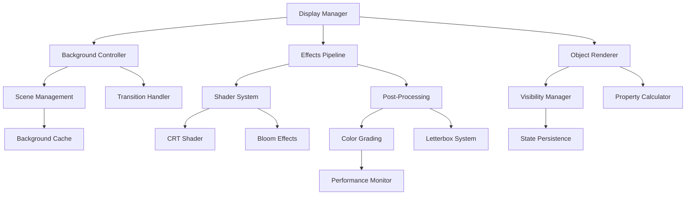

# Display and Effects API Reference

**Part III: API Reference - Chapter 12**

*Complete technical reference for the Display and Effects System API, providing comprehensive documentation for visual effects management, rendering control, and cinematic presentation in the Snatchernauts Framework.*

---

## Chapter Overview

The Display and Effects API (`game/api/display_api.rpy`) serves as the visual presentation engine of the Snatchernauts Framework. This system manages all aspects of visual effects, from subtle atmospheric enhancements to dramatic cinematic sequences, providing developers with precise control over the visual narrative experience.

**Core Architecture**: The Display API implements a layered rendering system where background management, object visibility, shader effects, and post-processing work together to create cohesive visual experiences that adapt dynamically to story context and performance requirements.

**Framework Integration**: Every visual effect automatically integrates with the framework's room system, interaction pipeline, save/load functionality, and performance monitoring, ensuring consistent visual quality across all platforms and scenarios.

**What makes this API comprehensive:**
- **Advanced Shader System**: Real-time CRT, bloom, and post-processing effects
- **Dynamic Color Grading**: Context-aware atmospheric and mood management
- **Performance Adaptive**: Automatic quality scaling based on system capabilities
- **Cinematic Control**: Professional letterboxing and transition effects
- **State Persistence**: Complete visual state management and user preferences

**By mastering this API, you will understand:**
- Complete visual effects system architecture and rendering pipeline
- Advanced shader programming and real-time effect management
- Performance optimization techniques for visual-intensive applications
- Professional cinematic presentation and transition design
- Integration patterns with game systems and narrative flow
- Production-grade visual state management and persistence

---

## API Architecture

### System Components



### Rendering Pipeline Architecture

```python
# Main Rendering Pipeline Flow
frame_start() →
    update_background() →
    process_object_visibility() →
    calculate_display_properties() →
    apply_pre_effects() →
    render_objects() →
    apply_shader_effects() →
    process_post_effects() →
    apply_cinematic_overlays() →
    present_frame()

# Effect Processing Chain
effect_request() →
    validate_parameters() →
    check_performance_impact() →
    queue_shader_updates() →
    apply_gradual_transitions() →
    update_visual_state() →
    persist_changes()

# Color Grading Pipeline
color_grade_change() →
    blend_from_current() →
    apply_color_transformation() →
    update_shader_uniforms() →
    coordinate_with_effects() →
    cache_result()
```

---

The Display API (`game/api/display_api.rpy`) manages visual effects and display properties in the Snatchernauts Framework. This API provides centralized control over cinematic effects, object visibility, background management, and visual state coordination across different game systems.

## Core Responsibilities

### Visual Effects Management
- Control CRT shader effects with real-time parameter adjustment
- Manage letterbox overlay for cinematic scenes
- Coordinate bloom and desaturation effects for object highlighting
- Handle color grading and atmospheric lighting transitions

### Display State Control
- Manage object visibility and rendering state
- Handle background image management and transitions
- Coordinate shader effect combinations and layering
- Provide fallback rendering for unsupported platforms

### Integration Coordination
- Bridge between room system and visual effects
- Coordinate with audio system for synchronized audio-visual effects
- Manage effect persistence across room transitions
- Handle save/load state for visual preferences

## Primary Functions

### Background and Scene Management

#### `get_room_background(room_id=None)`

**Purpose**: Get the background image for a specific room

**Parameters**:
- `room_id` (string, optional): Room identifier (defaults to current room)

**Returns**: String path to background image, or `None` if not found

**Example**:
```python
# Get current room background
current_bg = get_room_background()
if current_bg:
    renpy.show("background", what=current_bg)

# Get specific room background
office_bg = get_room_background("detective_office")
```

#### `get_fallback_background()`

**Purpose**: Get the default fallback background for error states

**Returns**: String path to fallback background image

**Example**:
```python
# Use fallback if room background is missing
bg = get_room_background(room_id) or get_fallback_background()
renpy.scene(bg)
```

#### `set_fallback_background_color(color)`

**Purpose**: Set the default background color for scenes without backgrounds

**Parameters**:
- `color` (string): Color value (hex code or named color)

**Example**:
```python
# Set dark background for noir scenes
set_fallback_background_color("#1a1a1a")

# Set blue background for tech scenes
set_fallback_background_color("#001133")
```

#### `set_default_background(image_path)`

**Purpose**: Set the default background image to use when no room-specific background is available

**Parameters**:
- `image_path` (string): Path to default background image

**Example**:
```python
# Set generic detective office as default
set_default_background("images/backgrounds/generic_office.png")
```

### Object Visibility Control

#### `should_display_object(obj_config, obj_name=None)`

**Purpose**: Check if an object should be rendered based on its configuration and game state

**Parameters**:
- `obj_config` (dict): Object configuration dictionary
- `obj_name` (string, optional): Object name for debugging

**Returns**: Boolean indicating if object should be displayed

**Example**:
```python
# Check if object should be shown
obj = get_room_objects()["desk"]
if should_display_object(obj, "desk"):
    renpy.show("desk", at_list=[obj["position"]])

# Conditional display based on story progress
def update_room_objects():
    objects = get_room_objects()
    for obj_name, obj_config in objects.items():
        if should_display_object(obj_config, obj_name):
            show_object(obj_name)
        else:
            hide_object(obj_name)
```

#### `hide_object(obj_name)`

**Purpose**: Hide a specific object from display

**Parameters**:
- `obj_name` (string): Name of object to hide

**Example**:
```python
# Hide object after player takes it
def on_object_interact(room_id, obj, action):
    if obj == "key" and action == "Take":
        store.inventory.append("office_key")
        hide_object("key")
        return True

# Hide objects based on story state
if store.lights_off:
    hide_object("light_switch_on")
    show_object("light_switch_off")
```

#### `show_object(obj_name)`

**Purpose**: Show a previously hidden object

**Parameters**:
- `obj_name` (string): Name of object to show

**Example**:
```python
# Show object when conditions are met
if store.case_progress >= 3:
    show_object("evidence_board")
    renpy.notify("New evidence board available!")

# Show objects dynamically
def reveal_hidden_objects():
    hidden_objects = ["secret_panel", "hidden_safe", "concealed_door"]
    for obj in hidden_objects:
        if obj in store.discovered_secrets:
            show_object(obj)
```

#### `is_object_hidden(obj_name)`

**Purpose**: Check if an object is currently hidden

**Parameters**:
- `obj_name` (string): Name of object to check

**Returns**: Boolean indicating if object is hidden

**Example**:
```python
# Check visibility before interactions
if not is_object_hidden("secret_panel"):
    renpy.say(None, "You notice something unusual about the wall panel.")

# Conditional descriptions
def get_room_description():
    desc = "You're in the detective's office."
    if not is_object_hidden("evidence_board"):
        desc += " An evidence board covers one wall."
    return desc
```

### Visual Effects Control

#### `show_letterbox(enabled, duration=0.5)`

**Purpose**: Enable or disable cinematic letterbox effect

**Parameters**:
- `enabled` (boolean): Whether to show letterbox bars
- `duration` (float, optional): Animation duration in seconds

**Example**:
```python
# Enable letterbox for dramatic dialogue
def start_dramatic_scene():
    show_letterbox(True, duration=1.0)
    renpy.pause(1.0)
    detective "This changes everything..."

# Disable letterbox after scene
def end_dramatic_scene():
    show_letterbox(False, duration=0.5)
    renpy.pause(0.5)
```

#### `toggle_letterbox()`

**Purpose**: Toggle letterbox effect on/off

**Example**:
```python
# Keyboard shortcut for letterbox
key "l" action Function(toggle_letterbox)

# Toggle during gameplay
def on_object_interact(room_id, obj, action):
    if obj == "tv" and action == "Watch":
        toggle_letterbox()  # Enable cinematic mode
        renpy.call("tv_scene")
        toggle_letterbox()  # Disable after scene
        return True
```

### CRT Shader Effects

#### `toggle_crt_effect()`

**Purpose**: Enable/disable CRT shader effect

**Example**:
```python
# Keyboard shortcut
key "c" action Function(toggle_crt_effect)

# Context-sensitive CRT
def on_room_enter(room_id):
    if room_id in ["computer_room", "security_office"]:
        store.crt_enabled = True
    else:
        store.crt_enabled = False
```

#### `set_crt_parameters(warp=None, scanlines=None, chroma=None, vignette_strength=None, vignette_width=None, animated=None)`

**Purpose**: Configure CRT effect parameters

**Parameters**: All optional, `None` means no change
- `warp` (float): Screen curvature intensity (0.0-0.5)
- `scanlines` (float): Scanline visibility (0.0-1.0)
- `chroma` (float): Chromatic aberration amount (0.0-0.01)
- `vignette_strength` (float): Edge darkening (0.0-1.0)
- `vignette_width` (float): Vignette area (0.5-1.0)
- `animated` (boolean): Enable scanline animation

**Example**:
```python
# Subtle CRT for dialogue scenes
set_crt_parameters(
    warp=0.05,
    scanlines=0.1,
    chroma=0.002,
    animated=False
)

# Strong retro effect for flashbacks
set_crt_parameters(
    warp=0.15,
    scanlines=0.3,
    chroma=0.006,
    vignette_strength=0.6,
    animated=True
)

# Dynamic adjustment based on scene
def adjust_crt_for_scene(scene_type):
    if scene_type == "flashback":
        set_crt_parameters(warp=0.12, scanlines=0.25, animated=True)
    elif scene_type == "computer":
        set_crt_parameters(warp=0.08, scanlines=0.4, chroma=0.004)
    elif scene_type == "normal":
        set_crt_parameters(warp=0.05, scanlines=0.15, animated=False)
```

#### `reset_crt_parameters()`

**Purpose**: Reset CRT parameters to default values

**Example**:
```python
# Reset after special effect
def end_flashback_sequence():
    reset_crt_parameters()
    set_color_grade("normal")

# Keyboard shortcut for reset
key "0" action Function(reset_crt_parameters)
```

### Bloom and Highlighting Effects

#### `get_object_display_properties(obj_config, obj_name=None)`

**Purpose**: Get computed display properties for an object including effects

**Parameters**:
- `obj_config` (dict): Object configuration
- `obj_name` (string, optional): Object name for debugging

**Returns**: Dictionary of display properties

**Example**:
```python
# Get object display properties
obj = get_room_objects()["evidence"]
props = get_object_display_properties(obj, "evidence")

# Apply properties to display
renpy.show("evidence", at_list=[
    Transform(
        pos=props["position"],
        zoom=props["scale"],
        alpha=props["alpha"]
    )
])
```

#### `bloom_fade_in(room_id=None, duration=1.0)`

**Purpose**: Perform a bloom fade-in effect for room transition

**Parameters**:
- `room_id` (string, optional): Target room (defaults to current)
- `duration` (float): Fade duration in seconds

**Example**:
```python
# Smooth transition between rooms
def transition_to_room(new_room):
    bloom_fade_out(duration=0.5)
    renpy.pause(0.5)
    load_room(new_room)
    bloom_fade_in(duration=0.5)
```

#### `bloom_fade_out(duration=1.0)`

**Purpose**: Perform a bloom fade-out effect

**Parameters**:
- `duration` (float): Fade duration in seconds

**Example**:
```python
# Fade out before major scene change
def start_revelation_scene():
    bloom_fade_out(duration=2.0)
    renpy.pause(2.0)
    renpy.scene("black")
    renpy.say(None, "Everything went white...")
```

### Color Grading and Atmosphere

#### `set_color_grade(preset_name)`

**Purpose**: Apply a color grading preset to the entire scene

**Parameters**:
- `preset_name` (string): Name of color grading preset

**Available Presets**:
- `"normal"` - Default color balance
- `"noir"` - High contrast black and white
- `"sepia"` - Warm vintage tones
- `"cool"` - Blue-tinted cool atmosphere
- `"warm"` - Orange-tinted warm atmosphere
- `"desaturated"` - Muted colors
- `"crime_scene"` - High contrast with red emphasis
- `"detective_office"` - Vintage investigation feel

**Example**:
```python
# Set mood based on room
def on_room_enter(room_id):
    if room_id == "crime_scene":
        set_color_grade("noir")
    elif room_id == "flashback_room":
        set_color_grade("sepia")
    else:
        set_color_grade("normal")

# Dynamic grading based on story events
def update_atmosphere():
    if store.case_solved:
        set_color_grade("warm")
    elif store.danger_level > 7:
        set_color_grade("crime_scene")
    else:
        set_color_grade("detective_office")
```

#### `get_current_color_grade()`

**Purpose**: Get the currently active color grading preset

**Returns**: String name of current preset

**Example**:
```python
# Save current state before temporary change
current_grade = get_current_color_grade()
set_color_grade("noir")
# ... dramatic scene ...
set_color_grade(current_grade)  # Restore
```

### Advanced Display Control

#### `get_object_main_color(obj_config)`

**Purpose**: Extract the dominant color from an object for effect coordination

**Parameters**:
- `obj_config` (dict): Object configuration

**Returns**: Color tuple (r, g, b) normalized to 0.0-1.0

**Example**:
```python
# Coordinate bloom color with object
obj = get_room_objects()["ruby"]
main_color = get_object_main_color(obj)

# Apply matching bloom effect
apply_colored_bloom(obj_name="ruby", color=main_color)
```

#### `create_gradient_background(color1, color2, direction="vertical")`

**Purpose**: Create a gradient background for special scenes

**Parameters**:
- `color1` (string): Starting color
- `color2` (string): Ending color
- `direction` (string): Gradient direction ("vertical", "horizontal")

**Returns**: Displayable object for use as background

**Example**:
```python
# Create atmospheric background for dream sequence
dream_bg = create_gradient_background("#000033", "#330066", "vertical")
renpy.scene(dream_bg)

# Sunset effect
sunset_bg = create_gradient_background("#ff6600", "#ffcc00", "horizontal")
renpy.show("sunset_overlay", what=sunset_bg, alpha=0.3)
```

## Effect Coordination and Presets

### Scene Preset System

```python
# Define scene presets for quick setup
SCENE_PRESETS = {
    "normal": {
        "color_grade": "normal",
        "crt_enabled": False,
        "letterbox_enabled": False,
        "bloom_intensity": 0.3
    },
    "noir_investigation": {
        "color_grade": "noir",
        "crt_enabled": True,
        "crt_scanlines": 0.2,
        "letterbox_enabled": True,
        "bloom_intensity": 0.5
    },
    "flashback": {
        "color_grade": "sepia",
        "crt_enabled": True,
        "crt_warp": 0.1,
        "crt_animated": True,
        "bloom_intensity": 0.4
    },
    "computer_terminal": {
        "color_grade": "cool",
        "crt_enabled": True,
        "crt_scanlines": 0.4,
        "crt_chroma": 0.005
    }
}

def apply_scene_preset(preset_name):
    """Apply a complete scene preset"""
    if preset_name not in SCENE_PRESETS:
        return False
    
    preset = SCENE_PRESETS[preset_name]
    
    # Apply color grading
    if "color_grade" in preset:
        set_color_grade(preset["color_grade"])
    
    # Configure CRT
    if preset.get("crt_enabled", False):
        store.crt_enabled = True
        set_crt_parameters(
            warp=preset.get("crt_warp"),
            scanlines=preset.get("crt_scanlines"),
            chroma=preset.get("crt_chroma"),
            animated=preset.get("crt_animated")
        )
    else:
        store.crt_enabled = False
    
    # Configure letterbox
    if preset.get("letterbox_enabled", False):
        show_letterbox(True)
    else:
        show_letterbox(False)
    
    return True
```

### Performance Optimization

#### `optimize_display_for_performance()`

**Purpose**: Reduce visual effects for better performance

**Example**:
```python
# Detect performance issues and optimize
def check_and_optimize_performance():
    if renpy.get_fps() < 30:  # Low framerate detected
        optimize_display_for_performance()
        renpy.notify("Performance mode enabled")

def optimize_display_for_performance():
    """Reduce effects for better performance"""
    store.crt_enabled = False
    store.bloom_quality = "low"
    store.film_grain_enabled = False
    
    # Use simpler color grading
    if get_current_color_grade() in ["noir", "crime_scene"]:
        set_color_grade("desaturated")
```

### Integration with Save/Load System

```python
# Save display preferences
def save_display_preferences():
    persistent.display_prefs = {
        "crt_enabled": store.crt_enabled,
        "crt_warp": getattr(store, "crt_warp", 0.12),
        "crt_scanlines": getattr(store, "crt_scanlines", 0.18),
        "letterbox_preferred": getattr(store, "letterbox_preferred", False),
        "color_grade_preference": get_current_color_grade()
    }

# Load display preferences
def load_display_preferences():
    if hasattr(persistent, "display_prefs") and persistent.display_prefs:
        prefs = persistent.display_prefs
        store.crt_enabled = prefs.get("crt_enabled", False)
        set_crt_parameters(
            warp=prefs.get("crt_warp"),
            scanlines=prefs.get("crt_scanlines")
        )
        if prefs.get("letterbox_preferred"):
            show_letterbox(True)
```

## Best Practices

### Effect Timing
- Use gradual transitions (0.5-2.0 seconds) for major visual changes
- Keep effect parameters consistent within scenes
- Reset effects between major story transitions

### Performance Considerations
- Monitor framerate when combining multiple effects
- Provide options to disable intensive effects
- Use simpler alternatives on mobile platforms

### Narrative Integration
- Match visual effects to story mood and themes
- Use effects to enhance rather than distract from narrative
- Maintain consistency within story arcs

## Advanced API Features

### Dynamic Shader Management

#### `create_custom_shader(shader_name, vertex_source, fragment_source)`

**Purpose**: Create custom shader effects for specialized visual needs

**Parameters**:
- `shader_name` (string): Unique identifier for the shader
- `vertex_source` (string): GLSL vertex shader source code
- `fragment_source` (string): GLSL fragment shader source code

**Example**:
```python
# Create custom film grain shader
film_grain_fragment = """
#version 120
uniform sampler2D tex0;
uniform float time;
uniform float intensity;
varying vec2 v_tex_coord;

float random(vec2 co) {
    return fract(sin(dot(co.xy, vec2(12.9898, 78.233))) * 43758.5453);
}

void main() {
    vec4 color = texture2D(tex0, v_tex_coord);
    float noise = random(v_tex_coord + time) * intensity;
    gl_FragColor = color + vec4(noise, noise, noise, 0.0);
}
"""

create_custom_shader("film_grain", None, film_grain_fragment)
```

#### `apply_custom_shader(shader_name, parameters=None)`

**Purpose**: Apply a custom shader with specified parameters

**Parameters**:
- `shader_name` (string): Name of shader to apply
- `parameters` (dict, optional): Shader uniform parameters

**Example**:
```python
# Apply film grain effect
apply_custom_shader("film_grain", {
    "time": renpy.get_game_runtime(),
    "intensity": 0.15
})

# Dynamic parameter updates
def update_film_grain():
    intensity = 0.1 + (store.tension_level * 0.05)
    apply_custom_shader("film_grain", {
        "time": renpy.get_game_runtime(),
        "intensity": intensity
    })
```

### Advanced Color Grading System

#### `create_color_grade_preset(preset_name, color_matrix)`

**Purpose**: Create custom color grading presets with precise color transformation

**Parameters**:
- `preset_name` (string): Name for the new preset
- `color_matrix` (list): 4x4 color transformation matrix

**Example**:
```python
# Create vintage film look
vintage_matrix = [
    [1.2, 0.1, 0.0, 0.0],   # Red channel
    [0.0, 1.1, 0.2, 0.0],   # Green channel  
    [0.0, 0.0, 0.8, 0.0],   # Blue channel
    [0.0, 0.0, 0.0, 1.0]    # Alpha channel
]

create_color_grade_preset("vintage_film", vintage_matrix)

# Create cyberpunk aesthetic
cyberpunk_matrix = [
    [1.0, 0.0, 0.2, 0.0],
    [0.1, 1.3, 0.1, 0.0], 
    [0.3, 0.0, 1.5, 0.0],
    [0.0, 0.0, 0.0, 1.0]
]

create_color_grade_preset("cyberpunk", cyberpunk_matrix)
```

#### `blend_color_grades(preset1, preset2, blend_factor)`

**Purpose**: Smoothly blend between two color grading presets

**Parameters**:
- `preset1` (string): Starting preset
- `preset2` (string): Target preset
- `blend_factor` (float): Blend amount (0.0 = preset1, 1.0 = preset2)

**Example**:
```python
# Gradual transition from normal to noir
def transition_to_noir(duration=2.0):
    steps = 60  # 60 frames for smooth transition
    for i in range(steps):
        blend_factor = i / float(steps - 1)
        blend_color_grades("normal", "noir", blend_factor)
        renpy.pause(duration / steps)

# Dynamic blending based on story tension
def update_tension_grading():
    tension_factor = min(store.tension_level / 10.0, 1.0)
    blend_color_grades("normal", "crime_scene", tension_factor)
```

### Particle and Atmospheric Effects

#### `create_particle_system(system_name, config)`

**Purpose**: Create particle effects for environmental atmosphere

**Parameters**:
- `system_name` (string): Unique identifier for particle system
- `config` (dict): Particle system configuration

**Example**:
```python
# Create rain effect
rain_config = {
    "texture": "images/effects/raindrop.png",
    "count": 200,
    "spawn_area": (0, -100, 1920, 100),
    "velocity": (0, 400),
    "velocity_variance": (20, 50),
    "lifetime": 3.0,
    "alpha_fade": True,
    "gravity": (0, 200)
}

create_particle_system("rain", rain_config)

# Create dust motes
dust_config = {
    "texture": "images/effects/dust_mote.png",
    "count": 50,
    "spawn_area": (0, 0, 1920, 1080),
    "velocity": (10, -20),
    "velocity_variance": (15, 15),
    "lifetime": 10.0,
    "scale_variance": 0.3,
    "rotation_speed": 30
}

create_particle_system("dust_motes", dust_config)
```

#### `start_particle_system(system_name, duration=None)`

**Purpose**: Start a particle system with optional duration

**Parameters**:
- `system_name` (string): Particle system to start
- `duration` (float, optional): Duration in seconds (None = continuous)

**Example**:
```python
# Start rain for storm scene
def start_storm_scene():
    start_particle_system("rain", duration=30.0)
    set_color_grade("desaturated")
    renpy.sound.play("audio/rain.ogg", loop=True)

# Continuous atmospheric effects
def setup_dusty_room():
    start_particle_system("dust_motes")  # Continuous
    set_color_grade("sepia")
```

### Advanced Lighting System

#### `create_dynamic_lighting(light_name, light_config)`

**Purpose**: Create dynamic lighting effects that respond to game state

**Parameters**:
- `light_name` (string): Unique identifier for light
- `light_config` (dict): Lighting configuration

**Example**:
```python
# Create flickering candle light
candle_config = {
    "type": "point",
    "position": (400, 300),
    "color": (1.0, 0.8, 0.4),
    "intensity": 0.7,
    "radius": 200,
    "flicker": {
        "enabled": True,
        "frequency": 3.0,
        "intensity_variance": 0.3
    },
    "shadows": True
}

create_dynamic_lighting("candle", candle_config)

# Create dramatic investigation lighting
investigation_config = {
    "type": "spot",
    "position": (960, 100),
    "direction": (0, 1),
    "color": (0.9, 0.9, 1.0),
    "intensity": 1.2,
    "cone_angle": 45,
    "falloff": 2.0,
    "shadows": True
}

create_dynamic_lighting("investigation_light", investigation_config)
```

#### `animate_lighting(light_name, animation_config)`

**Purpose**: Animate lighting properties over time

**Parameters**:
- `light_name` (string): Light to animate
- `animation_config` (dict): Animation configuration

**Example**:
```python
# Animate light intensity for dramatic effect
intensity_animation = {
    "property": "intensity",
    "keyframes": [
        {"time": 0.0, "value": 0.2},
        {"time": 1.0, "value": 1.0},
        {"time": 2.0, "value": 0.5}
    ],
    "easing": "ease_in_out",
    "loop": False
}

animate_lighting("investigation_light", intensity_animation)

# Color temperature animation for dawn effect
color_animation = {
    "property": "color",
    "keyframes": [
        {"time": 0.0, "value": (0.2, 0.2, 0.8)},  # Cool night
        {"time": 5.0, "value": (1.0, 0.8, 0.6)},  # Warm dawn
        {"time": 10.0, "value": (1.0, 1.0, 0.9)}  # Bright day
    ],
    "duration": 10.0
}

animate_lighting("sun", color_animation)
```

### Performance-Aware Rendering

#### `set_quality_level(level)`

**Purpose**: Set overall visual quality level based on system performance

**Parameters**:
- `level` (string): Quality level ("low", "medium", "high", "ultra")

**Example**:
```python
# Auto-detect appropriate quality level
def auto_detect_quality():
    fps = renpy.get_fps()
    gpu_info = renpy.get_renderer_info()
    
    if fps < 30 or "integrated" in gpu_info.lower():
        set_quality_level("low")
    elif fps < 45:
        set_quality_level("medium")
    elif fps < 60:
        set_quality_level("high")
    else:
        set_quality_level("ultra")

# Quality-specific settings
def set_quality_level(level):
    quality_settings = {
        "low": {
            "particle_count_multiplier": 0.3,
            "shader_quality": "basic",
            "shadow_resolution": 512,
            "bloom_samples": 4
        },
        "medium": {
            "particle_count_multiplier": 0.6,
            "shader_quality": "medium",
            "shadow_resolution": 1024,
            "bloom_samples": 8
        },
        "high": {
            "particle_count_multiplier": 1.0,
            "shader_quality": "high",
            "shadow_resolution": 2048,
            "bloom_samples": 16
        },
        "ultra": {
            "particle_count_multiplier": 1.5,
            "shader_quality": "ultra",
            "shadow_resolution": 4096,
            "bloom_samples": 32
        }
    }
    
    if level in quality_settings:
        apply_quality_settings(quality_settings[level])
```

#### `create_performance_monitor()`

**Purpose**: Create system for monitoring and adapting to performance

**Example**:
```python
# Adaptive performance monitoring
class PerformanceMonitor:
    def __init__(self):
        self.fps_history = []
        self.quality_level = "high"
        self.adaptation_enabled = True
    
    def update(self):
        """Update performance metrics and adapt if needed"""
        if not self.adaptation_enabled:
            return
        
        current_fps = renpy.get_fps()
        self.fps_history.append(current_fps)
        
        # Keep only recent history
        if len(self.fps_history) > 60:  # 60 frames
            self.fps_history = self.fps_history[-60:]
        
        # Calculate average FPS
        if len(self.fps_history) >= 30:
            avg_fps = sum(self.fps_history[-30:]) / 30
            self.adapt_quality(avg_fps)
    
    def adapt_quality(self, avg_fps):
        """Adapt quality based on performance"""
        if avg_fps < 25 and self.quality_level != "low":
            self.reduce_quality()
        elif avg_fps > 55 and self.quality_level != "ultra":
            self.increase_quality()
    
    def reduce_quality(self):
        """Reduce quality level"""
        quality_order = ["ultra", "high", "medium", "low"]
        current_index = quality_order.index(self.quality_level)
        
        if current_index < len(quality_order) - 1:
            self.quality_level = quality_order[current_index + 1]
            set_quality_level(self.quality_level)
            renpy.notify(f"Quality adjusted to {self.quality_level}")
    
    def increase_quality(self):
        """Increase quality level"""
        quality_order = ["low", "medium", "high", "ultra"]
        current_index = quality_order.index(self.quality_level)
        
        if current_index < len(quality_order) - 1:
            self.quality_level = quality_order[current_index + 1]
            set_quality_level(self.quality_level)
            renpy.notify(f"Quality improved to {self.quality_level}")

# Global performance monitor
performance_monitor = PerformanceMonitor()
```

### Advanced Transition Effects

#### `create_custom_transition(transition_name, transition_func)`

**Purpose**: Create custom scene transition effects

**Parameters**:
- `transition_name` (string): Name for the transition
- `transition_func` (function): Function that handles the transition

**Example**:
```python
# Create spiral transition effect
def spiral_transition(old_scene, new_scene, duration=1.0):
    """Custom spiral transition effect"""
    steps = 30
    for i in range(steps):
        progress = i / float(steps - 1)
        angle = progress * 720  # Two full rotations
        scale = 1.0 - progress * 0.8  # Shrink to 20%
        
        # Apply transform to old scene
        old_transform = Transform(
            old_scene,
            rotate=angle,
            zoom=scale,
            alpha=1.0 - progress
        )
        
        # Show transformed scene
        renpy.scene()
        renpy.show("transition", what=old_transform)
        
        if progress > 0.5:
            # Start showing new scene
            new_progress = (progress - 0.5) * 2
            new_transform = Transform(
                new_scene,
                rotate=-angle,
                zoom=0.2 + new_progress * 0.8,
                alpha=new_progress
            )
            renpy.show("new_scene", what=new_transform)
        
        renpy.pause(duration / steps)
    
    # Final state
    renpy.scene(new_scene)

# Register the custom transition
create_custom_transition("spiral", spiral_transition)

# Use custom transition
def transition_with_spiral(new_room):
    old_bg = get_room_background()
    new_bg = get_room_background(new_room)
    
    spiral_transition(old_bg, new_bg, duration=1.5)
    load_room(new_room)
```

#### `create_shader_transition(transition_name, shader_source)`

**Purpose**: Create GPU-accelerated transition effects using shaders

**Parameters**:
- `transition_name` (string): Name for the transition
- `shader_source` (string): GLSL fragment shader source

**Example**:
```python
# Create dissolve transition shader
dissolve_shader = """
#version 120
uniform sampler2D tex0;  // Old scene
uniform sampler2D tex1;  // New scene
uniform sampler2D noise; // Noise texture
uniform float progress;  // 0.0 to 1.0
varying vec2 v_tex_coord;

void main() {
    vec4 old_color = texture2D(tex0, v_tex_coord);
    vec4 new_color = texture2D(tex1, v_tex_coord);
    float noise_value = texture2D(noise, v_tex_coord * 4.0).r;
    
    float threshold = progress * 1.2 - 0.1;
    float mask = smoothstep(threshold - 0.1, threshold + 0.1, noise_value);
    
    gl_FragColor = mix(old_color, new_color, mask);
}
"""

create_shader_transition("dissolve", dissolve_shader)

# Create page flip transition
page_flip_shader = """
#version 120
uniform sampler2D tex0;
uniform sampler2D tex1;
uniform float progress;
varying vec2 v_tex_coord;

void main() {
    float flip_point = 0.5;
    vec2 coord = v_tex_coord;
    
    if (progress < flip_point) {
        // First half: show old scene with perspective
        float scale = 1.0 - progress * 2.0 * 0.5;
        coord.x = (coord.x - 0.5) / scale + 0.5;
        
        if (coord.x >= 0.0 && coord.x <= 1.0) {
            gl_FragColor = texture2D(tex0, coord);
        } else {
            gl_FragColor = vec4(0.0, 0.0, 0.0, 1.0);
        }
    } else {
        // Second half: show new scene
        float scale = (progress - flip_point) * 2.0 * 0.5 + 0.5;
        coord.x = (coord.x - 0.5) / scale + 0.5;
        
        if (coord.x >= 0.0 && coord.x <= 1.0) {
            gl_FragColor = texture2D(tex1, coord);
        } else {
            gl_FragColor = vec4(0.0, 0.0, 0.0, 1.0);
        }
    }
}
"""

create_shader_transition("page_flip", page_flip_shader)
```

### Visual State Analytics

#### `track_visual_performance()`

**Purpose**: Track visual system performance for analytics and optimization

**Example**:
```python
# Visual performance analytics
class VisualAnalytics:
    def __init__(self):
        self.metrics = {
            "frame_times": [],
            "effect_usage": {},
            "quality_changes": [],
            "shader_compile_times": {}
        }
    
    def track_frame(self, frame_time):
        """Track individual frame rendering time"""
        self.metrics["frame_times"].append(frame_time)
        
        # Keep only recent frames
        if len(self.metrics["frame_times"]) > 300:  # 5 seconds at 60fps
            self.metrics["frame_times"] = self.metrics["frame_times"][-300:]
    
    def track_effect_usage(self, effect_name, enabled):
        """Track which effects are being used"""
        if effect_name not in self.metrics["effect_usage"]:
            self.metrics["effect_usage"][effect_name] = {
                "enabled_count": 0,
                "disabled_count": 0,
                "total_time_enabled": 0.0,
                "last_enabled_time": None
            }
        
        effect_data = self.metrics["effect_usage"][effect_name]
        
        if enabled:
            effect_data["enabled_count"] += 1
            effect_data["last_enabled_time"] = time.time()
        else:
            effect_data["disabled_count"] += 1
            if effect_data["last_enabled_time"]:
                duration = time.time() - effect_data["last_enabled_time"]
                effect_data["total_time_enabled"] += duration
                effect_data["last_enabled_time"] = None
    
    def track_quality_change(self, old_quality, new_quality, reason):
        """Track quality level changes"""
        self.metrics["quality_changes"].append({
            "timestamp": time.time(),
            "from": old_quality,
            "to": new_quality,
            "reason": reason
        })
    
    def generate_report(self):
        """Generate comprehensive analytics report"""
        if not self.metrics["frame_times"]:
            return {"error": "No frame data collected"}
        
        frame_times = self.metrics["frame_times"]
        avg_frame_time = sum(frame_times) / len(frame_times)
        avg_fps = 1.0 / avg_frame_time if avg_frame_time > 0 else 0
        
        # Calculate percentiles
        sorted_times = sorted(frame_times)
        p95_time = sorted_times[int(len(sorted_times) * 0.95)]
        p99_time = sorted_times[int(len(sorted_times) * 0.99)]
        
        report = {
            "performance": {
                "average_fps": avg_fps,
                "average_frame_time_ms": avg_frame_time * 1000,
                "p95_frame_time_ms": p95_time * 1000,
                "p99_frame_time_ms": p99_time * 1000,
                "frames_analyzed": len(frame_times)
            },
            "effect_usage": self.metrics["effect_usage"],
            "quality_changes": len(self.metrics["quality_changes"]),
            "stability_score": self.calculate_stability_score()
        }
        
        return report
    
    def calculate_stability_score(self):
        """Calculate overall visual stability score"""
        if not self.metrics["frame_times"]:
            return 0.0
        
        frame_times = self.metrics["frame_times"]
        
        # Variance in frame times (lower is better)
        avg_time = sum(frame_times) / len(frame_times)
        variance = sum((t - avg_time) ** 2 for t in frame_times) / len(frame_times)
        
        # Quality changes (fewer is better)
        quality_penalty = len(self.metrics["quality_changes"]) * 0.1
        
        # Calculate score (0-100, higher is better)
        stability_score = max(0, 100 - variance * 1000 - quality_penalty)
        
        return min(100, stability_score)

# Global visual analytics
visual_analytics = VisualAnalytics()
```

### Integration Patterns

#### Complete Visual Effect Manager

```python
# Comprehensive visual effects management system
class VisualEffectsManager:
    def __init__(self):
        self.active_effects = set()
        self.effect_states = {}
        self.transition_queue = []
        self.performance_mode = False
    
    def initialize(self):
        """Initialize the visual effects system"""
        # Load user preferences
        self.load_preferences()
        
        # Set up performance monitoring
        performance_monitor.adaptation_enabled = True
        
        # Initialize default effects
        self.setup_default_effects()
    
    def apply_scene_setup(self, room_id):
        """Apply appropriate visual setup for a room"""
        room_config = get_room_config(room_id)
        
        if not room_config:
            return
        
        effects = room_config.get("effects", {})
        
        # Apply color grading
        color_grade = effects.get("color_grade", "normal")
        self.set_color_grade_smooth(color_grade)
        
        # Apply lighting setup
        if "lighting" in effects:
            self.setup_room_lighting(room_id, effects["lighting"])
        
        # Apply atmospheric effects
        if "atmosphere" in effects:
            self.setup_atmosphere(effects["atmosphere"])
        
        # Apply special effects
        if "special_effects" in effects:
            for effect_name, effect_config in effects["special_effects"].items():
                self.apply_special_effect(effect_name, effect_config)
    
    def set_color_grade_smooth(self, target_grade, duration=1.0):
        """Smoothly transition to target color grade"""
        current_grade = get_current_color_grade()
        
        if current_grade == target_grade:
            return
        
        # Add to transition queue
        transition = {
            "type": "color_grade",
            "from": current_grade,
            "to": target_grade,
            "duration": duration,
            "start_time": time.time()
        }
        
        self.transition_queue.append(transition)
    
    def update(self):
        """Update visual effects system"""
        current_time = time.time()
        
        # Process transition queue
        self.process_transitions(current_time)
        
        # Update performance monitor
        performance_monitor.update()
        
        # Update visual analytics
        frame_time = 1.0 / max(renpy.get_fps(), 1)
        visual_analytics.track_frame(frame_time)
    
    def process_transitions(self, current_time):
        """Process queued visual transitions"""
        completed_transitions = []
        
        for transition in self.transition_queue:
            elapsed = current_time - transition["start_time"]
            progress = min(elapsed / transition["duration"], 1.0)
            
            if transition["type"] == "color_grade":
                blend_color_grades(
                    transition["from"], 
                    transition["to"], 
                    progress
                )
            
            if progress >= 1.0:
                completed_transitions.append(transition)
        
        # Remove completed transitions
        for completed in completed_transitions:
            self.transition_queue.remove(completed)
    
    def create_cinematic_moment(self, moment_type, duration=3.0):
        """Create cinematic visual moment"""
        cinematic_configs = {
            "revelation": {
                "color_grade": "warm",
                "bloom_intensity": 0.8,
                "letterbox": True,
                "camera_shake": {"intensity": 0.1, "frequency": 2.0}
            },
            "tension": {
                "color_grade": "desaturated",
                "vignette_strength": 0.7,
                "film_grain": 0.3,
                "letterbox": False
            },
            "flashback": {
                "color_grade": "sepia",
                "blur_intensity": 0.2,
                "vignette_strength": 0.5,
                "letterbox": True,
                "transition": "dissolve"
            }
        }
        
        if moment_type in cinematic_configs:
            config = cinematic_configs[moment_type]
            self.apply_cinematic_config(config, duration)
    
    def apply_cinematic_config(self, config, duration):
        """Apply cinematic configuration"""
        # Store current state for restoration
        self.store_current_state()
        
        # Apply cinematic effects
        if "color_grade" in config:
            self.set_color_grade_smooth(config["color_grade"], duration * 0.3)
        
        if "letterbox" in config:
            show_letterbox(config["letterbox"], duration * 0.2)
        
        if "bloom_intensity" in config:
            self.animate_bloom_intensity(config["bloom_intensity"], duration * 0.5)
        
        # Schedule restoration
        renpy.timeout(duration)
        self.restore_previous_state()
    
    def store_current_state(self):
        """Store current visual state for restoration"""
        self.stored_state = {
            "color_grade": get_current_color_grade(),
            "letterbox_enabled": store.letterbox_enabled,
            "crt_enabled": store.crt_enabled,
            "bloom_intensity": getattr(store, "bloom_intensity", 0.3)
        }
    
    def restore_previous_state(self):
        """Restore previously stored visual state"""
        if not hasattr(self, "stored_state"):
            return
        
        state = self.stored_state
        
        # Restore with smooth transitions
        self.set_color_grade_smooth(state["color_grade"])
        show_letterbox(state["letterbox_enabled"])
        
        if not state["crt_enabled"]:
            store.crt_enabled = False

# Global visual effects manager
visual_fx = VisualEffectsManager()
```

---

## API Quick Reference

### Background Management
| Function | Purpose | Parameters |
|----------|---------|------------|
| `get_room_background()` | Get room background | `room_id` |
| `get_fallback_background()` | Get default fallback | None |
| `set_fallback_background_color()` | Set fallback color | `color` |
| `set_default_background()` | Set default background | `image_path` |
| `create_gradient_background()` | Create gradient | `color1`, `color2`, `direction` |

### Object Visibility
| Function | Purpose | Parameters |
|----------|---------|------------|
| `should_display_object()` | Check object visibility | `obj_config`, `obj_name` |
| `hide_object()` | Hide object | `obj_name` |
| `show_object()` | Show object | `obj_name` |
| `is_object_hidden()` | Check if hidden | `obj_name` |
| `get_object_display_properties()` | Get display properties | `obj_config`, `obj_name` |

### Visual Effects
| Function | Purpose | Parameters |
|----------|---------|------------|
| `show_letterbox()` | Control letterbox | `enabled`, `duration` |
| `toggle_letterbox()` | Toggle letterbox | None |
| `bloom_fade_in()` | Bloom fade in | `room_id`, `duration` |
| `bloom_fade_out()` | Bloom fade out | `duration` |
| `get_object_main_color()` | Extract dominant color | `obj_config` |

### CRT Effects
| Function | Purpose | Parameters |
|----------|---------|------------|
| `toggle_crt_effect()` | Toggle CRT | None |
| `set_crt_parameters()` | Configure CRT | `warp`, `scanlines`, `chroma`, `vignette_strength`, `vignette_width`, `animated` |
| `reset_crt_parameters()` | Reset CRT to defaults | None |

### Color Grading
| Function | Purpose | Parameters |
|----------|---------|------------|
| `set_color_grade()` | Set color preset | `preset_name` |
| `get_current_color_grade()` | Get current preset | None |
| `create_color_grade_preset()` | Create custom preset | `preset_name`, `color_matrix` |
| `blend_color_grades()` | Blend presets | `preset1`, `preset2`, `blend_factor` |

### Advanced Features
| Function | Purpose | Parameters |
|----------|---------|------------|
| `create_custom_shader()` | Create shader | `shader_name`, `vertex_source`, `fragment_source` |
| `apply_custom_shader()` | Apply shader | `shader_name`, `parameters` |
| `create_particle_system()` | Create particles | `system_name`, `config` |
| `start_particle_system()` | Start particles | `system_name`, `duration` |
| `create_dynamic_lighting()` | Create lighting | `light_name`, `light_config` |
| `animate_lighting()` | Animate lighting | `light_name`, `animation_config` |

### Performance
| Function | Purpose | Parameters |
|----------|---------|------------|
| `set_quality_level()` | Set quality | `level` |
| `optimize_display_for_performance()` | Performance mode | None |
| `create_performance_monitor()` | Create monitor | None |

---

## Performance Optimization Guidelines

### Shader Efficiency

1. **Minimize Texture Samples**: Reduce the number of texture lookups in shaders
2. **Use Appropriate Precision**: Use `mediump` instead of `highp` when possible
3. **Avoid Branching**: Minimize conditional statements in fragment shaders
4. **Cache Uniform Values**: Avoid recalculating uniform values each frame

### Effect Layering Strategy

```python
# Efficient effect combination
def optimize_effect_combination():
    """Combine multiple effects efficiently"""
    # Combine similar operations
    if store.crt_enabled and store.film_grain_enabled:
        # Use combined CRT+grain shader instead of two passes
        apply_custom_shader("crt_grain_combined")
    else:
        if store.crt_enabled:
            apply_custom_shader("crt_only")
        if store.film_grain_enabled:
            apply_custom_shader("grain_only")
```

### Memory Management

```python
# Efficient texture and resource management
def cleanup_visual_resources():
    """Clean up unused visual resources"""
    # Clear unused particle systems
    cleanup_inactive_particle_systems()
    
    # Release cached shaders
    clear_shader_cache_if_full()
    
    # Optimize texture memory
    compress_background_textures()
    
    # Garbage collect visual objects
    import gc
    gc.collect()
```

---

## Error Handling and Debugging

### Visual Effect Debugging

```python
# Debug visual effects system
class VisualDebugger:
    def __init__(self):
        self.debug_enabled = False
        self.debug_info = {}
    
    def enable_debug_mode(self):
        """Enable visual debugging"""
        self.debug_enabled = True
        renpy.show_screen("visual_debug_overlay")
    
    def log_effect_change(self, effect_name, old_value, new_value):
        """Log visual effect changes"""
        if not self.debug_enabled:
            return
        
        print(f"[VISUAL] {effect_name}: {old_value} → {new_value}")
        
        self.debug_info[effect_name] = {
            "old_value": old_value,
            "new_value": new_value,
            "timestamp": time.time()
        }
    
    def validate_shader_parameters(self, shader_name, parameters):
        """Validate shader parameters"""
        if shader_name == "crt":
            if parameters.get("warp", 0) > 0.5:
                print(f"[WARNING] CRT warp value {parameters['warp']} is very high")
            if parameters.get("scanlines", 0) > 1.0:
                print(f"[WARNING] CRT scanlines value {parameters['scanlines']} is out of range")

# Global visual debugger
visual_debugger = VisualDebugger()
```

---

## Integration Examples

### Complete Scene Management

```python
# Comprehensive scene visual management
def setup_investigation_scene():
    """Set up complete visual atmosphere for investigation"""
    # Initialize visual effects manager
    visual_fx.initialize()
    
    # Set appropriate color grading
    visual_fx.set_color_grade_smooth("detective_office")
    
    # Add atmospheric particles
    start_particle_system("dust_motes")
    
    # Set up dramatic lighting
    create_dynamic_lighting("desk_lamp", {
        "type": "spot",
        "position": (600, 200),
        "direction": (0, 1),
        "color": (1.0, 0.9, 0.7),
        "intensity": 0.8,
        "cone_angle": 60
    })
    
    # Enable subtle CRT for monitors
    if "computer" in get_room_objects():
        set_crt_parameters(
            warp=0.03,
            scanlines=0.1,
            animated=False
        )
    
    # Track performance
    visual_analytics.track_effect_usage("investigation_setup", True)

def create_dramatic_revelation():
    """Create dramatic visual moment for story revelation"""
    # Store current state
    visual_fx.store_current_state()
    
    # Create cinematic moment
    visual_fx.create_cinematic_moment("revelation", duration=5.0)
    
    # Add special effects
    bloom_fade_out(duration=0.5)
    renpy.pause(0.5)
    
    show_letterbox(True, duration=0.3)
    set_color_grade("warm")
    
    # Dramatic pause
    renpy.pause(3.0)
    
    # Restore normal state
    bloom_fade_in(duration=1.0)
    visual_fx.restore_previous_state()
```

---

## Next Steps

The Display and Effects API provides complete control over visual presentation in the Snatchernauts Framework. For complete system integration, continue to:

- **Chapter 13: API Reference - UI System** - Screen and interface component management
- **Chapter 14: Developer Manual** - Advanced implementation patterns and framework customization  
- **Chapter 15: Troubleshooting Guide** - Problem-solving and optimization strategies

This comprehensive Display API provides all the tools needed to create visually stunning, performant, and professionally polished visual experiences that adapt dynamically to story context and system capabilities while maintaining optimal performance across all platforms.

---

**Continue to:** [Chapter 13: API Reference - UI System](13-API-UI.md)

