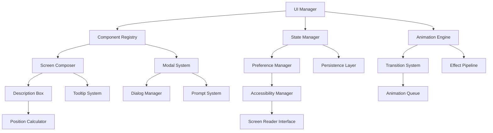

# UI API Reference

**Part III: API Reference - Chapter 13**

*Complete technical reference for the User Interface System API, providing comprehensive documentation for screen composition, interactive elements, state management, and accessibility features in the Snatchernauts Framework.*

---

## Chapter Overview

The UI API (`game/api/ui_api.rpy`) serves as the presentation layer orchestrator of the Snatchernauts Framework. This system manages all aspects of user interface interaction, from floating description boxes and screen composition to modal dialogs and accessibility features, providing developers with a complete toolkit for creating intuitive and responsive user experiences.

**Core Architecture**: The UI API implements a modular component system where individual UI elements, state management, animation systems, and accessibility features work together to create cohesive user interfaces that adapt to different interaction methods and user preferences.

**Framework Integration**: Every UI component automatically integrates with the framework's room system, interaction pipeline, visual effects system, and save/load functionality, ensuring consistent behavior and seamless user experience across all game scenarios.

**What makes this API comprehensive:**
- **Component-Based Architecture**: Modular UI components with flexible composition
- **Multi-Input Support**: Native support for mouse, keyboard, gamepad, and accessibility inputs
- **State Management**: Complete UI state persistence and restoration
- **Animation System**: Professional animations and transitions for all UI elements
- **Accessibility First**: Built-in screen reader support and keyboard navigation

**By mastering this API, you will understand:**
- Complete UI system architecture and component lifecycle management
- Advanced screen composition and dynamic layout techniques
- Professional animation and transition systems for enhanced user experience
- Accessibility implementation patterns and inclusive design principles
- Integration strategies with game systems and narrative flow
- Production-grade UI state management and user preference systems

---

## API Architecture

### System Components



### UI Composition Flow

```python
# Screen Composition Pipeline
compose_screen_request() →
    validate_components() →
    initialize_layout() →
    register_event_handlers() →
    apply_theme_and_styling() →
    setup_accessibility_features() →
    animate_entrance_effects() →
    activate_interactions()

# Component Lifecycle
component_creation() →
    validate_configuration() →
    initialize_state() →
    register_with_manager() →
    setup_event_bindings() →
    apply_initial_styling() →
    begin_update_loop()

# User Interaction Flow
user_input() →
    capture_input_event() →
    determine_target_component() →
    validate_interaction_permissions() →
    execute_component_handler() →
    update_component_state() →
    trigger_visual_feedback() →
    persist_state_changes()
```

---

The UI API (`game/api/ui_api.rpy`) provides essential user interface functionality for the framework's point-and-click adventure system. This API handles floating description boxes, screen composition for room exploration, tooltips, prompts, confirmations, and various UI helper functions. It serves as the bridge between game logic and the visual presentation layer.

## Core Responsibilities

### Description Management
- Display floating description boxes for hovered objects
- Manage description positioning and appearance
- Handle dynamic description content based on game state
- Coordinate description visibility with other UI elements

### Screen Composition
- Drive the main room exploration screen architecture
- Coordinate between different UI components and overlays
- Manage screen transitions and state changes
- Handle multi-layer UI composition for complex scenes

### Interactive Elements
- Provide tooltip systems for enhanced user experience
- Handle confirmation dialogs and prompts
- Manage modal UI states and user input routing
- Support keyboard, mouse, and gamepad interaction patterns

### Visual Feedback
- Coordinate hover effects and visual states
- Manage UI element highlighting and selection feedback
- Handle loading states and progress indicators
- Provide consistent visual language across different screens

## Primary Functions

### Description Box Management

#### `show_description(obj_name, description, position=None)`

**Purpose**: Display a floating description box for an object

**Parameters**:
- `obj_name` (string): Name of the object being described
- `description` (string): Text content to display
- `position` (tuple, optional): Screen position (x, y) for the description box

**Example**:
```python
# Show description at mouse position
show_description("desk", "A cluttered detective's desk with papers scattered about.")

# Show description at specific position
show_description("door", "A heavy wooden door.", position=(100, 200))

# Show dynamic description based on game state
def show_contextual_description(obj_name):
    if obj_name == "safe":
        if store.safe_opened:
            desc = "The safe is open and empty."
        elif store.has_combination:
            desc = "You know the combination to this safe."
        else:
            desc = "A locked safe with a combination dial."
        show_description(obj_name, desc)
```

#### `hide_description()`

**Purpose**: Hide the currently displayed description box

**Example**:
```python
# Hide description on object unhover
def handle_object_unhover():
    hide_description()
    store.current_hover_object = None

# Auto-hide description after timeout
init python:
    def auto_hide_description():
        renpy.timeout(2.0)
        hide_description()
```

#### `update_description(new_description)`

**Purpose**: Update the content of the currently displayed description box

**Parameters**:
- `new_description` (string): New description text

**Example**:
```python
# Update description based on examination progress
def examine_desk():
    if store.desk_examination_count == 0:
        update_description("A cluttered desk. You should look more carefully.")
    elif store.desk_examination_count == 1:
        update_description("Looking closer, you notice a hidden drawer.")
    else:
        update_description("You've thoroughly examined this desk.")
    
    store.desk_examination_count += 1
```

### Screen Composition Helpers

#### `compose_exploration_screen(room_id, **kwargs)`

**Purpose**: Set up the main room exploration screen with all necessary components

**Parameters**:
- `room_id` (string): Identifier of the current room
- `**kwargs`: Additional configuration parameters

**Example**:
```python
# Basic room exploration setup
compose_exploration_screen("office")

# Room exploration with custom settings
compose_exploration_screen(
    "office",
    enable_descriptions=True,
    show_debug_overlay=store.dev_mode,
    interaction_menu_style="contextual",
    enable_gamepad_nav=True
)

# Compose screen with room-specific UI elements
def setup_crime_scene_ui():
    compose_exploration_screen(
        "crime_scene",
        evidence_collection_mode=True,
        show_evidence_counter=True,
        restrict_interactions=store.case_progress < 5
    )
```

#### `register_ui_component(component_name, component_screen)`

**Purpose**: Register a custom UI component for use in screen composition

**Parameters**:
- `component_name` (string): Unique identifier for the component
- `component_screen` (string): Name of the Ren'Py screen to use

**Example**:
```python
# Register custom inventory display
register_ui_component("inventory_bar", "inventory_horizontal_bar")

# Register mini-map component
register_ui_component("mini_map", "room_mini_map")

# Use registered components
def compose_enhanced_exploration():
    base_components = get_default_ui_components()
    base_components.extend(["inventory_bar", "mini_map"])
    
    compose_exploration_screen(
        get_current_room(),
        components=base_components
    )
```

### Interactive UI Elements

#### `show_confirmation(message, on_yes=None, on_no=None, **kwargs)`

**Purpose**: Display a confirmation dialog with customizable actions

**Parameters**:
- `message` (string): Confirmation message text
- `on_yes` (callable, optional): Function to call if user confirms
- `on_no` (callable, optional): Function to call if user cancels
- `**kwargs`: Additional styling and behavior options

**Example**:
```python
# Simple confirmation
show_confirmation("Are you sure you want to quit?", 
                 on_yes=Function(renpy.quit),
                 on_no=Function(hide_confirmation))

# Confirmation with game logic
def try_destroy_evidence():
    show_confirmation(
        "Destroying evidence is irreversible. Continue?",
        on_yes=Function(destroy_evidence_and_update_plot),
        on_no=Function(hide_confirmation),
        style="danger",
        require_double_confirm=True
    )

# Confirmation with parameters
def confirm_room_transition(target_room):
    show_confirmation(
        f"Leave this area and go to {target_room}?",
        on_yes=Function(navigate_to_room, target_room),
        on_no=Function(hide_confirmation)
    )
```

#### `show_tooltip(element, tooltip_text, **kwargs)`

**Purpose**: Display a tooltip for a UI element

**Parameters**:
- `element` (string): Identifier of the UI element
- `tooltip_text` (string): Tooltip content
- `**kwargs`: Positioning and styling options

**Example**:
```python
# Show tooltip on hover
screen inventory_item(item_name):
    imagebutton:
        idle f"inventory/{item_name}.png"
        action Function(use_inventory_item, item_name)
        hovered Function(show_tooltip, item_name, get_item_description(item_name))
        unhovered Function(hide_tooltip)

# Show contextual tooltip
def show_action_tooltip(action_name):
    tooltips = {
        "Examine": "Look closely at this object",
        "Use": "Interact with this object",
        "Talk": "Start a conversation",
        "Take": "Add to your inventory"
    }
    
    show_tooltip(action_name, tooltips.get(action_name, "Perform action"))
```

#### `show_prompt(message, input_type="text", on_submit=None, **kwargs)`

**Purpose**: Display an input prompt dialog

**Parameters**:
- `message` (string): Prompt message
- `input_type` (string): Type of input ("text", "number", "choice")
- `on_submit` (callable): Function to call with the input value
- `**kwargs`: Additional configuration options

**Example**:
```python
# Text input prompt
def ask_for_safe_combination():
    show_prompt(
        "Enter the safe combination:",
        input_type="number",
        on_submit=Function(try_safe_combination),
        max_length=4,
        placeholder="0000"
    )

# Choice prompt
def ask_dialogue_choice():
    choices = ["Ask about the case", "Ask about the victim", "Leave"]
    show_prompt(
        "What would you like to discuss?",
        input_type="choice",
        choices=choices,
        on_submit=Function(handle_dialogue_choice)
    )
```

### UI State Management

#### `get_ui_state()`

**Purpose**: Get the current UI state information

**Returns**: Dictionary containing current UI state

**Example**:
```python
# Check current UI state
ui_state = get_ui_state()

if ui_state["modal_active"]:
    print("Modal dialog is open")

if ui_state["description_visible"]:
    print(f"Showing description for: {ui_state['description_target']}")

# Save UI state for restoration
store.saved_ui_state = get_ui_state()
```

#### `set_ui_state(state_dict)`

**Purpose**: Set UI state from a state dictionary

**Parameters**:
- `state_dict` (dict): State information to restore

**Example**:
```python
# Restore saved UI state
def restore_ui_state():
    if hasattr(store, "saved_ui_state"):
        set_ui_state(store.saved_ui_state)
        del store.saved_ui_state

# Set specific UI state
set_ui_state({
    "modal_active": False,
    "description_visible": False,
    "interaction_menu_active": False,
    "current_focus": None
})
```

#### `save_ui_preferences()`

**Purpose**: Save user UI preferences to persistent storage

**Example**:
```python
# Save UI preferences
def save_ui_preferences():
    persistent.ui_preferences = {
        "description_position": store.description_position_preference,
        "tooltip_delay": store.tooltip_delay,
        "confirmation_style": store.confirmation_style,
        "menu_animation_speed": store.menu_animation_speed,
        "accessibility_mode": store.accessibility_mode
    }

# Load UI preferences
def load_ui_preferences():
    if hasattr(persistent, "ui_preferences"):
        prefs = persistent.ui_preferences
        store.description_position_preference = prefs.get("description_position", "auto")
        store.tooltip_delay = prefs.get("tooltip_delay", 0.5)
        store.confirmation_style = prefs.get("confirmation_style", "standard")
        store.menu_animation_speed = prefs.get("menu_animation_speed", 1.0)
        store.accessibility_mode = prefs.get("accessibility_mode", False)
```

### Advanced UI Features

#### `create_dynamic_menu(menu_items, position=None, **kwargs)`

**Purpose**: Create a dynamic menu with customizable items and behavior

**Parameters**:
- `menu_items` (list): List of menu item dictionaries
- `position` (tuple, optional): Menu position (x, y)
- `**kwargs`: Additional menu configuration

**Example**:
```python
# Create context menu
def show_context_menu(obj_name):
    menu_items = []
    
    # Add basic actions
    menu_items.append({
        "text": "Examine",
        "action": Function(execute_object_action, obj_name, "Examine"),
        "enabled": True
    })
    
    # Add conditional actions
    if obj_name in store.usable_objects:
        menu_items.append({
            "text": "Use",
            "action": Function(execute_object_action, obj_name, "Use"),
            "enabled": True
        })
    
    # Add inventory-based actions
    for item in store.inventory:
        if can_use_item_on_object(item, obj_name):
            menu_items.append({
                "text": f"Use {item}",
                "action": Function(use_item_on_object, item, obj_name),
                "enabled": True,
                "icon": f"inventory/{item}.png"
            })
    
    create_dynamic_menu(menu_items, style="contextual")
```

#### `handle_ui_input(input_event, context=None)`

**Purpose**: Handle UI input events with proper routing and context awareness

**Parameters**:
- `input_event` (dict): Input event information
- `context` (string, optional): Current input context

**Example**:
```python
# Handle keyboard shortcuts
def handle_ui_input(input_event, context=None):
    event_type = input_event.get("type")
    key = input_event.get("key")
    
    if event_type == "keydown":
        if key == "K_ESCAPE":
            if get_ui_state()["modal_active"]:
                close_current_modal()
            elif get_ui_state()["interaction_menu_active"]:
                hide_interaction_menu()
            else:
                show_main_menu()
            return True
        
        elif key == "K_TAB":
            if context == "room_exploration":
                cycle_object_selection()
            return True
        
        elif key == "K_RETURN":
            if context == "room_exploration":
                execute_selected_action()
            return True
    
    return False
```

### UI Animation and Transitions

#### `animate_ui_element(element_id, animation_type, **kwargs)`

**Purpose**: Animate UI elements with various transition effects

**Parameters**:
- `element_id` (string): Identifier of the UI element to animate
- `animation_type` (string): Type of animation ("fade", "slide", "scale", "bounce")
- `**kwargs`: Animation parameters (duration, easing, etc.)

**Example**:
```python
# Fade in description box
animate_ui_element("description_box", "fade", 
                  direction="in", duration=0.3, easing="ease_out")

# Slide menu from right
animate_ui_element("interaction_menu", "slide",
                  direction="right_to_center", duration=0.5)

# Bounce notification
animate_ui_element("notification", "bounce",
                  intensity=0.2, duration=0.8)

# Scale hover effect
def animate_hover_effect(obj_name, hover_state):
    if hover_state:
        animate_ui_element(f"object_{obj_name}", "scale",
                          target_scale=1.1, duration=0.2)
    else:
        animate_ui_element(f"object_{obj_name}", "scale",
                          target_scale=1.0, duration=0.2)
```

## Integration with Other Systems

### Room System Integration

```python
# Update UI when room changes
def on_room_enter(room_id):
    # Clear existing UI state
    hide_all_modals()
    hide_description()
    
    # Set up room-specific UI
    setup_room_ui(room_id)
    
    # Configure room-specific interactions
    configure_interaction_ui(room_id)

def setup_room_ui(room_id):
    """Configure UI for specific room"""
    room_config = get_room_config(room_id)
    
    # Set room-specific UI elements
    if room_config.get("show_inventory", True):
        show_ui_component("inventory")
    
    if room_config.get("show_map", False):
        show_ui_component("mini_map")
    
    # Configure description positioning
    if room_id == "narrow_hallway":
        set_description_position("bottom")
    else:
        set_description_position("auto")
```

### Save System Integration

```python
# Save UI state with game data
def save_ui_state_with_game():
    game_save_data = get_current_save_data()
    game_save_data["ui_state"] = {
        "preferences": get_ui_preferences(),
        "window_positions": get_window_positions(),
        "accessibility_settings": get_accessibility_settings()
    }
    save_game_data(game_save_data)

# Load UI state from save data
def load_ui_state_from_save(save_data):
    if "ui_state" in save_data:
        ui_state = save_data["ui_state"]
        
        if "preferences" in ui_state:
            set_ui_preferences(ui_state["preferences"])
        
        if "accessibility_settings" in ui_state:
            set_accessibility_settings(ui_state["accessibility_settings"])
```

## Accessibility Features

```python
# High contrast mode
def enable_high_contrast_mode():
    set_ui_theme("high_contrast")
    store.accessibility_mode = True
    
# Screen reader support
def announce_to_screen_reader(text):
    if store.accessibility_mode:
        renpy.notify(text)
        # Additional screen reader integration would go here

# Keyboard navigation enhancement
def enhance_keyboard_navigation():
    if store.accessibility_mode:
        # Make all interactive elements keyboard accessible
        register_keyboard_shortcuts({
            "K_h": show_help_dialog,
            "K_d": toggle_description_verbosity,
            "K_s": announce_current_state
        })
```

## Advanced API Features

### Dynamic Component System

#### `create_ui_component(component_id, component_class, **kwargs)`

**Purpose**: Create dynamic UI components at runtime with custom behavior

**Parameters**:
- `component_id` (string): Unique identifier for the component
- `component_class` (class): Component class defining behavior
- `**kwargs`: Component-specific configuration parameters

**Example**:
```python
# Create custom inventory component
class InventoryGrid(UIComponent):
    def __init__(self, **kwargs):
        super().__init__(**kwargs)
        self.grid_size = kwargs.get('grid_size', (4, 4))
        self.slot_size = kwargs.get('slot_size', 64)
        self.items = []
    
    def add_item(self, item):
        if len(self.items) < self.grid_size[0] * self.grid_size[1]:
            self.items.append(item)
            self.refresh_display()
            return True
        return False
    
    def remove_item(self, item):
        if item in self.items:
            self.items.remove(item)
            self.refresh_display()
            return True
        return False
    
    def refresh_display(self):
        # Update visual representation
        self.trigger_redraw()

# Create and register the component
inventory_component = create_ui_component(
    "player_inventory",
    InventoryGrid,
    grid_size=(6, 4),
    slot_size=72,
    position=(50, 50)
)
```

#### `create_ui_layout(layout_name, layout_config)`

**Purpose**: Define reusable UI layouts with component positioning and behavior

**Parameters**:
- `layout_name` (string): Unique identifier for the layout
- `layout_config` (dict): Layout configuration and component definitions

**Example**:
```python
# Create investigation layout
investigation_layout = {
    "name": "investigation_interface",
    "base_resolution": (1920, 1080),
    "components": {
        "evidence_board": {
            "type": "evidence_display",
            "position": ("right", "top"),
            "size": (300, 400),
            "anchor": "top_right",
            "margin": (20, 20)
        },
        "notebook": {
            "type": "interactive_notebook",
            "position": ("left", "bottom"),
            "size": (250, 200),
            "anchor": "bottom_left",
            "margin": (20, 20),
            "auto_hide": True
        },
        "magnifier": {
            "type": "zoom_tool",
            "position": ("center", "center"),
            "size": (200, 200),
            "visible": False,
            "activation_key": "K_m"
        }
    },
    "responsive_rules": {
        "mobile": {
            "max_width": 768,
            "modifications": {
                "evidence_board": {"size": (200, 300)},
                "notebook": {"auto_hide": True, "position": ("center", "bottom")}
            }
        }
    }
}

create_ui_layout("investigation_interface", investigation_layout)
```

### Advanced Modal System

#### `create_modal_stack(stack_name, modal_configs)`

**Purpose**: Create complex modal dialog sequences with state management

**Parameters**:
- `stack_name` (string): Identifier for the modal stack
- `modal_configs` (list): List of modal configurations

**Example**:
```python
# Create tutorial modal sequence
tutorial_stack = [
    {
        "id": "welcome",
        "type": "info",
        "title": "Welcome to the Investigation",
        "content": "You are Detective Smith. Click objects to interact.",
        "buttons": [{"text": "Next", "action": "next_modal"}],
        "dismissible": False,
        "animation": "fade_in"
    },
    {
        "id": "interaction_guide",
        "type": "interactive",
        "title": "How to Interact",
        "content": "Right-click objects for actions menu, left-click for default action.",
        "demo_object": "tutorial_desk",
        "buttons": [
            {"text": "Try It", "action": "enable_demo"},
            {"text": "Skip Tutorial", "action": "close_stack"}
        ],
        "require_interaction": True
    },
    {
        "id": "inventory_intro",
        "type": "info",
        "title": "Your Inventory",
        "content": "Items you collect appear here. Use them by dragging onto objects.",
        "highlight_component": "inventory_bar",
        "buttons": [{"text": "Got It", "action": "complete_tutorial"}]
    }
]

create_modal_stack("tutorial_sequence", tutorial_stack)

# Show the tutorial
def start_tutorial():
    show_modal_stack("tutorial_sequence")
    store.tutorial_active = True
```

#### `create_responsive_modal(modal_config)`

**Purpose**: Create modals that adapt to different screen sizes and orientations

**Parameters**:
- `modal_config` (dict): Responsive modal configuration

**Example**:
```python
# Create responsive settings modal
settings_modal_config = {
    "id": "game_settings",
    "title": "Game Settings",
    "responsive_layouts": {
        "desktop": {
            "size": (800, 600),
            "columns": 2,
            "tab_position": "left"
        },
        "tablet": {
            "size": ("80%", "90%"),
            "columns": 1,
            "tab_position": "top"
        },
        "mobile": {
            "size": ("100%", "100%"),
            "columns": 1,
            "tab_position": "bottom",
            "fullscreen": True
        }
    },
    "tabs": [
        {
            "id": "video",
            "title": "Video",
            "icon": "settings_video.png",
            "content": "video_settings_screen"
        },
        {
            "id": "audio",
            "title": "Audio",
            "icon": "settings_audio.png",
            "content": "audio_settings_screen"
        },
        {
            "id": "controls",
            "title": "Controls",
            "icon": "settings_controls.png",
            "content": "control_settings_screen"
        }
    ]
}

create_responsive_modal(settings_modal_config)
```

### Advanced Input System

#### `create_input_context(context_name, input_mappings)`

**Purpose**: Define context-sensitive input handling for different UI states

**Parameters**:
- `context_name` (string): Name of the input context
- `input_mappings` (dict): Input mapping configuration

**Example**:
```python
# Create investigation input context
investigation_input = {
    "keyboard": {
        "K_TAB": {"action": "cycle_evidence", "repeat": True},
        "K_SPACE": {"action": "examine_closely", "hold": True},
        "K_i": {"action": "toggle_inventory", "modifier": None},
        "K_n": {"action": "open_notebook", "modifier": None},
        "K_h": {"action": "show_hints", "modifier": "ctrl"},
        "K_ESCAPE": {"action": "pause_menu", "priority": "high"}
    },
    "mouse": {
        "left_click": {"action": "primary_interaction"},
        "right_click": {"action": "context_menu"},
        "middle_click": {"action": "quick_examine"},
        "scroll_up": {"action": "zoom_in", "sensitivity": 0.1},
        "scroll_down": {"action": "zoom_out", "sensitivity": 0.1}
    },
    "gamepad": {
        "button_a": {"action": "primary_interaction"},
        "button_b": {"action": "cancel"},
        "button_x": {"action": "context_menu"},
        "button_y": {"action": "quick_examine"},
        "dpad_up": {"action": "navigate_up"},
        "dpad_down": {"action": "navigate_down"},
        "left_trigger": {"action": "zoom_mode", "analog": True},
        "right_trigger": {"action": "examine_mode", "analog": True}
    },
    "gestures": {
        "tap": {"action": "primary_interaction"},
        "long_press": {"action": "context_menu"},
        "pinch": {"action": "zoom", "analog": True},
        "swipe_up": {"action": "show_inventory"},
        "swipe_down": {"action": "hide_ui"},
        "two_finger_tap": {"action": "quick_examine"}
    }
}

create_input_context("investigation", investigation_input)

# Activate context when entering investigation mode
def enter_investigation_mode():
    activate_input_context("investigation")
    show_ui_components(["evidence_counter", "magnifier_tool"])
    set_cursor_style("investigation")
```

#### `create_gesture_recognizer(recognizer_name, gesture_config)`

**Purpose**: Create custom gesture recognition for touch and advanced input

**Parameters**:
- `recognizer_name` (string): Name of the gesture recognizer
- `gesture_config` (dict): Gesture recognition configuration

**Example**:
```python
# Create investigation gestures
investigation_gestures = {
    "evidence_circle": {
        "type": "path",
        "pattern": "circle",
        "min_radius": 50,
        "max_radius": 150,
        "tolerance": 0.3,
        "action": "highlight_evidence_in_area",
        "feedback": "visual_circle_overlay"
    },
    "magnify_gesture": {
        "type": "multi_touch",
        "fingers": 2,
        "movement": "spread",
        "min_distance": 100,
        "action": "activate_magnifier",
        "continuous": True
    },
    "quick_notes": {
        "type": "path",
        "pattern": "zigzag",
        "min_points": 5,
        "action": "open_quick_notes",
        "timeout": 2.0
    }
}

create_gesture_recognizer("investigation_gestures", investigation_gestures)
```

### Advanced Theme System

#### `create_ui_theme(theme_name, theme_config)`

**Purpose**: Define comprehensive UI themes with styling and behavior

**Parameters**:
- `theme_name` (string): Unique theme identifier
- `theme_config` (dict): Complete theme configuration

**Example**:
```python
# Create noir detective theme
noir_theme = {
    "name": "noir_detective",
    "base_theme": "dark",
    "color_palette": {
        "primary": "#E6E6E6",
        "secondary": "#B8B8B8",
        "accent": "#FFD700",
        "background": "#1A1A1A",
        "surface": "#2D2D2D",
        "error": "#FF4444",
        "warning": "#FFA500",
        "success": "#4CAF50"
    },
    "typography": {
        "primary_font": "fonts/detective_serif.ttf",
        "ui_font": "fonts/detective_sans.ttf",
        "monospace_font": "fonts/detective_mono.ttf",
        "base_size": 16,
        "scale_ratio": 1.25
    },
    "components": {
        "button": {
            "background": "surface",
            "text_color": "primary",
            "border": {"width": 2, "color": "accent"},
            "hover": {"background": "accent", "text_color": "background"},
            "animation": {"duration": 0.2, "easing": "ease_out"}
        },
        "modal": {
            "background": "surface",
            "border": {"width": 3, "color": "accent"},
            "shadow": {"blur": 10, "color": "#000000", "opacity": 0.7},
            "animation": {"entrance": "fade_up", "exit": "fade_down"}
        },
        "tooltip": {
            "background": "background",
            "text_color": "accent",
            "border": {"width": 1, "color": "secondary"},
            "max_width": 300,
            "padding": 8
        }
    },
    "animations": {
        "default_duration": 0.3,
        "easing_curves": {
            "detective_ease": [0.25, 0.46, 0.45, 0.94]
        }
    },
    "sounds": {
        "button_hover": "audio/ui/noir_hover.ogg",
        "button_click": "audio/ui/noir_click.ogg",
        "modal_open": "audio/ui/noir_modal_open.ogg",
        "error": "audio/ui/noir_error.ogg"
    }
}

create_ui_theme("noir_detective", noir_theme)

# Apply theme with smooth transition
def apply_noir_theme():
    transition_to_theme("noir_detective", duration=1.0)
    play_theme_transition_sound()
```

#### `create_adaptive_theme_system()`

**Purpose**: Create system that adapts themes based on context and preferences

**Example**:
```python
# Create adaptive theming system
class AdaptiveThemeManager:
    def __init__(self):
        self.themes = {}
        self.current_theme = "default"
        self.adaptation_rules = []
        self.user_preferences = {}
    
    def register_adaptation_rule(self, rule_name, condition_func, theme_name):
        """Register rule for automatic theme adaptation"""
        self.adaptation_rules.append({
            "name": rule_name,
            "condition": condition_func,
            "theme": theme_name,
            "priority": len(self.adaptation_rules)
        })
    
    def update_theme_context(self):
        """Update theme based on current context"""
        # Sort rules by priority
        sorted_rules = sorted(self.adaptation_rules, key=lambda x: x["priority"])
        
        for rule in sorted_rules:
            if rule["condition"]():
                if self.current_theme != rule["theme"]:
                    self.transition_to_theme(rule["theme"])
                return
    
    def transition_to_theme(self, theme_name, duration=0.5):
        """Smoothly transition to new theme"""
        if theme_name not in self.themes:
            return False
        
        # Store previous theme for animation
        previous_theme = self.current_theme
        self.current_theme = theme_name
        
        # Apply theme with transition
        self.apply_theme_transition(previous_theme, theme_name, duration)
        return True

# Global adaptive theme manager
theme_manager = AdaptiveThemeManager()

# Register adaptation rules
theme_manager.register_adaptation_rule(
    "crime_scene",
    lambda: get_current_room() == "crime_scene",
    "noir_detective"
)

theme_manager.register_adaptation_rule(
    "lab_analysis",
    lambda: get_current_room() == "forensics_lab",
    "scientific_blue"
)

theme_manager.register_adaptation_rule(
    "night_time",
    lambda: store.time_of_day == "night",
    "dark_investigation"
)
```

### Performance Optimization

#### `create_ui_performance_monitor()`

**Purpose**: Monitor and optimize UI performance in real-time

**Example**:
```python
# UI performance monitoring system
class UIPerformanceMonitor:
    def __init__(self):
        self.metrics = {
            "frame_times": [],
            "component_update_times": {},
            "animation_performance": {},
            "memory_usage": []
        }
        self.optimization_thresholds = {
            "max_frame_time": 16.67,  # 60fps target
            "max_component_update": 2.0,  # 2ms per component
            "max_memory_growth": 10  # 10MB per minute
        }
        self.optimization_enabled = True
    
    def track_frame_performance(self):
        """Track UI frame performance"""
        frame_start = time.time()
        
        # Frame processing would happen here
        
        frame_time = (time.time() - frame_start) * 1000  # Convert to ms
        self.metrics["frame_times"].append(frame_time)
        
        # Keep only recent metrics
        if len(self.metrics["frame_times"]) > 300:  # 5 seconds at 60fps
            self.metrics["frame_times"] = self.metrics["frame_times"][-300:]
        
        # Check for performance issues
        if frame_time > self.optimization_thresholds["max_frame_time"]:
            self.trigger_performance_optimization("frame_time", frame_time)
    
    def track_component_performance(self, component_id, update_time):
        """Track individual component update performance"""
        if component_id not in self.metrics["component_update_times"]:
            self.metrics["component_update_times"][component_id] = []
        
        self.metrics["component_update_times"][component_id].append(update_time)
        
        # Keep only recent metrics
        if len(self.metrics["component_update_times"][component_id]) > 100:
            self.metrics["component_update_times"][component_id] = \
                self.metrics["component_update_times"][component_id][-100:]
        
        # Check component performance
        if update_time > self.optimization_thresholds["max_component_update"]:
            self.optimize_component(component_id, update_time)
    
    def trigger_performance_optimization(self, issue_type, severity):
        """Trigger appropriate performance optimizations"""
        if not self.optimization_enabled:
            return
        
        if issue_type == "frame_time":
            # Reduce animation quality
            self.reduce_animation_quality()
            # Disable non-essential components
            self.disable_non_essential_components()
            # Reduce update frequency
            self.reduce_update_frequency()
        
        print(f"[UI_PERFORMANCE] Applied optimizations for {issue_type} (severity: {severity:.2f})")
    
    def optimize_component(self, component_id, update_time):
        """Optimize specific component performance"""
        # Component-specific optimizations
        component = get_ui_component(component_id)
        
        if component:
            # Reduce component update frequency
            component.set_update_frequency(0.5)  # Update every 500ms instead
            # Enable component caching
            component.enable_caching(True)
            # Reduce visual complexity
            component.set_quality_level("performance")
    
    def generate_performance_report(self):
        """Generate comprehensive performance report"""
        if not self.metrics["frame_times"]:
            return {"error": "No performance data available"}
        
        avg_frame_time = sum(self.metrics["frame_times"]) / len(self.metrics["frame_times"])
        fps = 1000 / avg_frame_time if avg_frame_time > 0 else 0
        
        # Calculate component performance stats
        component_stats = {}
        for comp_id, times in self.metrics["component_update_times"].items():
            if times:
                component_stats[comp_id] = {
                    "avg_update_time": sum(times) / len(times),
                    "max_update_time": max(times),
                    "update_count": len(times)
                }
        
        return {
            "average_fps": fps,
            "average_frame_time_ms": avg_frame_time,
            "component_performance": component_stats,
            "optimization_events": self.get_optimization_events()
        }

# Global UI performance monitor
ui_performance = UIPerformanceMonitor()
```

### Advanced Accessibility System

#### `create_accessibility_manager()`

**Purpose**: Comprehensive accessibility support system

**Example**:
```python
# Advanced accessibility management
class AccessibilityManager:
    def __init__(self):
        self.screen_reader_enabled = False
        self.high_contrast_enabled = False
        self.large_text_enabled = False
        self.reduced_motion_enabled = False
        self.focus_indicators_enabled = True
        self.audio_descriptions_enabled = False
        
        self.keyboard_navigation = {
            "current_focus": None,
            "focus_history": [],
            "custom_nav_order": {}
        }
    
    def initialize_accessibility_features(self):
        """Initialize all accessibility features"""
        # Detect system accessibility preferences
        self.detect_system_preferences()
        
        # Set up keyboard navigation
        self.setup_keyboard_navigation()
        
        # Initialize screen reader support
        self.initialize_screen_reader()
        
        # Set up focus management
        self.setup_focus_management()
    
    def detect_system_preferences(self):
        """Detect system-level accessibility preferences"""
        # This would integrate with system accessibility APIs
        system_prefs = get_system_accessibility_preferences()
        
        if system_prefs.get("high_contrast", False):
            self.enable_high_contrast()
        
        if system_prefs.get("large_text", False):
            self.enable_large_text()
        
        if system_prefs.get("reduced_motion", False):
            self.enable_reduced_motion()
    
    def setup_keyboard_navigation(self):
        """Set up comprehensive keyboard navigation"""
        # Register global keyboard handlers
        register_global_key_handler("K_TAB", self.handle_tab_navigation)
        register_global_key_handler("K_F6", self.cycle_navigation_regions)
        register_global_key_handler("K_ESCAPE", self.handle_escape_navigation)
        register_global_key_handler("K_RETURN", self.activate_focused_element)
        register_global_key_handler("K_SPACE", self.activate_focused_element)
    
    def handle_tab_navigation(self, event):
        """Handle Tab key navigation"""
        if event.shift:
            self.focus_previous_element()
        else:
            self.focus_next_element()
    
    def focus_next_element(self):
        """Move focus to next focusable element"""
        focusable_elements = self.get_focusable_elements()
        current_index = self.get_current_focus_index(focusable_elements)
        
        if current_index is not None:
            next_index = (current_index + 1) % len(focusable_elements)
        else:
            next_index = 0
        
        if focusable_elements:
            self.set_focus(focusable_elements[next_index])
    
    def focus_previous_element(self):
        """Move focus to previous focusable element"""
        focusable_elements = self.get_focusable_elements()
        current_index = self.get_current_focus_index(focusable_elements)
        
        if current_index is not None:
            prev_index = (current_index - 1) % len(focusable_elements)
        else:
            prev_index = len(focusable_elements) - 1 if focusable_elements else 0
        
        if focusable_elements:
            self.set_focus(focusable_elements[prev_index])
    
    def set_focus(self, element):
        """Set focus to specific element with accessibility announcements"""
        # Remove focus from current element
        if self.keyboard_navigation["current_focus"]:
            self.remove_focus(self.keyboard_navigation["current_focus"])
        
        # Set focus to new element
        self.keyboard_navigation["current_focus"] = element
        self.apply_focus_styling(element)
        
        # Announce to screen reader
        if self.screen_reader_enabled:
            self.announce_focus_change(element)
        
        # Update focus history
        self.keyboard_navigation["focus_history"].append(element)
        if len(self.keyboard_navigation["focus_history"]) > 10:
            self.keyboard_navigation["focus_history"] = \
                self.keyboard_navigation["focus_history"][-10:]
    
    def announce_focus_change(self, element):
        """Announce focus change to screen reader"""
        element_info = self.get_element_accessibility_info(element)
        
        announcement = f"{element_info['role']} {element_info['name']}"
        
        if element_info.get('description'):
            announcement += f", {element_info['description']}"
        
        if element_info.get('state'):
            announcement += f", {element_info['state']}"
        
        self.speak_to_screen_reader(announcement)
    
    def enable_high_contrast(self):
        """Enable high contrast mode"""
        self.high_contrast_enabled = True
        apply_ui_theme("high_contrast")
        
        # Increase border widths and visibility
        update_theme_property("border_width_multiplier", 2.0)
        update_theme_property("focus_outline_width", 4)
    
    def enable_large_text(self):
        """Enable large text mode"""
        self.large_text_enabled = True
        
        # Scale up all text sizes
        update_theme_property("text_scale_factor", 1.25)
        
        # Increase spacing for readability
        update_theme_property("line_height_multiplier", 1.2)
        update_theme_property("letter_spacing_multiplier", 1.1)
    
    def enable_reduced_motion(self):
        """Enable reduced motion mode"""
        self.reduced_motion_enabled = True
        
        # Disable or reduce animations
        disable_ui_animations(["bounce", "elastic", "spring"])
        reduce_animation_duration(0.5)  # 50% of original duration
        
        # Replace motion with instant changes where appropriate
        set_animation_preference("instant", ["modal_entrance", "tooltip_show"])

# Global accessibility manager
accessibility_manager = AccessibilityManager()
```

### Integration Patterns

#### Complete UI Management System

```python
# Comprehensive UI management system
class UIManager:
    def __init__(self):
        self.components = {}
        self.layouts = {}
        self.themes = {}
        self.modal_stack = []
        self.input_contexts = {}
        self.current_screen = None
        self.state_history = []
    
    def initialize(self):
        """Initialize the complete UI system"""
        # Initialize subsystems
        self.performance_monitor = UIPerformanceMonitor()
        self.accessibility_manager = AccessibilityManager()
        self.theme_manager = AdaptiveThemeManager()
        
        # Load user preferences
        self.load_user_preferences()
        
        # Set up default components
        self.register_default_components()
        
        # Initialize accessibility
        self.accessibility_manager.initialize_accessibility_features()
    
    def compose_screen(self, screen_config):
        """Compose a complete screen from configuration"""
        screen_id = screen_config.get("id", "unknown")
        
        # Validate configuration
        if not self.validate_screen_config(screen_config):
            raise ValueError(f"Invalid screen configuration for {screen_id}")
        
        # Clear current screen
        if self.current_screen:
            self.cleanup_screen(self.current_screen)
        
        # Initialize new screen
        screen = {
            "id": screen_id,
            "components": {},
            "layout": screen_config.get("layout"),
            "theme": screen_config.get("theme", "default"),
            "input_context": screen_config.get("input_context")
        }
        
        # Create components
        for comp_config in screen_config.get("components", []):
            component = self.create_component(comp_config)
            screen["components"][component.id] = component
        
        # Apply layout
        if screen["layout"]:
            self.apply_layout(screen["layout"], screen["components"])
        
        # Apply theme
        if screen["theme"] != self.theme_manager.current_theme:
            self.theme_manager.transition_to_theme(screen["theme"])
        
        # Activate input context
        if screen["input_context"]:
            activate_input_context(screen["input_context"])
        
        # Set as current screen
        self.current_screen = screen
        
        # Trigger screen transition animations
        self.animate_screen_transition(screen)
        
        return screen
    
    def create_component(self, comp_config):
        """Create UI component from configuration"""
        comp_type = comp_config.get("type")
        comp_class = self.get_component_class(comp_type)
        
        if not comp_class:
            raise ValueError(f"Unknown component type: {comp_type}")
        
        # Create component instance
        component = comp_class(**comp_config)
        
        # Register with performance monitoring
        self.performance_monitor.register_component(component.id)
        
        # Apply accessibility features
        if self.accessibility_manager:
            self.accessibility_manager.setup_component_accessibility(component)
        
        return component
    
    def handle_screen_transition(self, from_screen, to_screen):
        """Handle transition between screens"""
        # Save current screen state
        if from_screen:
            self.save_screen_state(from_screen)
        
        # Prepare transition animation
        transition_config = {
            "type": "slide",
            "direction": "left_to_right",
            "duration": 0.5,
            "easing": "ease_in_out"
        }
        
        # Execute transition
        self.execute_screen_transition(from_screen, to_screen, transition_config)
        
        # Update navigation history
        if to_screen:
            self.state_history.append({
                "screen_id": to_screen["id"],
                "timestamp": time.time(),
                "context": self.get_current_context()
            })
    
    def save_screen_state(self, screen):
        """Save screen state for restoration"""
        state = {
            "screen_id": screen["id"],
            "component_states": {},
            "scroll_positions": {},
            "focus_state": self.accessibility_manager.get_focus_state()
        }
        
        # Save component states
        for comp_id, component in screen["components"].items():
            state["component_states"][comp_id] = component.get_state()
        
        # Store state
        set_screen_state(screen["id"], state)
    
    def cleanup_screen(self, screen):
        """Clean up screen resources"""
        # Cleanup components
        for component in screen["components"].values():
            component.cleanup()
            self.performance_monitor.unregister_component(component.id)
        
        # Clear event handlers
        clear_screen_event_handlers(screen["id"])
        
        # Run garbage collection
        import gc
        gc.collect()

# Global UI manager
ui_manager = UIManager()
```

---

## API Quick Reference

### Description Management
| Function | Purpose | Parameters |
|----------|---------|------------|
| `show_description()` | Show description box | `obj_name`, `description`, `position` |
| `hide_description()` | Hide description box | None |
| `update_description()` | Update description content | `new_description` |

### Screen Composition
| Function | Purpose | Parameters |
|----------|---------|------------|
| `compose_exploration_screen()` | Set up room exploration | `room_id`, `**kwargs` |
| `register_ui_component()` | Register custom component | `component_name`, `component_screen` |
| `create_ui_component()` | Create dynamic component | `component_id`, `component_class`, `**kwargs` |
| `create_ui_layout()` | Define reusable layout | `layout_name`, `layout_config` |

### Interactive Elements
| Function | Purpose | Parameters |
|----------|---------|------------|
| `show_confirmation()` | Show confirmation dialog | `message`, `on_yes`, `on_no`, `**kwargs` |
| `show_tooltip()` | Show tooltip | `element`, `tooltip_text`, `**kwargs` |
| `show_prompt()` | Show input prompt | `message`, `input_type`, `on_submit`, `**kwargs` |
| `create_dynamic_menu()` | Create dynamic menu | `menu_items`, `position`, `**kwargs` |

### State Management
| Function | Purpose | Parameters |
|----------|---------|------------|
| `get_ui_state()` | Get current UI state | None |
| `set_ui_state()` | Set UI state | `state_dict` |
| `save_ui_preferences()` | Save user preferences | None |
| `load_ui_preferences()` | Load user preferences | None |

### Animation System
| Function | Purpose | Parameters |
|----------|---------|------------|
| `animate_ui_element()` | Animate UI element | `element_id`, `animation_type`, `**kwargs` |
| `create_animation_sequence()` | Create animation sequence | `sequence_config` |
| `set_animation_preferences()` | Set animation preferences | `preferences` |

### Advanced Features
| Function | Purpose | Parameters |
|----------|---------|------------|
| `create_modal_stack()` | Create modal sequence | `stack_name`, `modal_configs` |
| `create_input_context()` | Define input context | `context_name`, `input_mappings` |
| `create_ui_theme()` | Define UI theme | `theme_name`, `theme_config` |
| `create_gesture_recognizer()` | Create gesture recognizer | `recognizer_name`, `gesture_config` |

---

## Performance Best Practices

### Component Optimization

1. **Lazy Loading**: Load UI components only when needed
2. **Component Pooling**: Reuse components instead of creating new ones
3. **Update Batching**: Batch UI updates to reduce rendering calls
4. **Animation Optimization**: Use transform-based animations when possible
5. **State Minimization**: Keep component state as minimal as possible

### Memory Management

```python
# Efficient UI memory management
def optimize_ui_memory():
    """Optimize UI memory usage"""
    # Clean up unused components
    cleanup_unused_components()
    
    # Clear animation caches
    clear_animation_caches()
    
    # Optimize texture memory
    optimize_ui_textures()
    
    # Run garbage collection
    import gc
    gc.collect()
```

---

## Accessibility Guidelines

### Screen Reader Support

1. **Semantic Markup**: Use proper ARIA roles and properties
2. **Focus Management**: Maintain logical focus order
3. **Announcements**: Provide meaningful screen reader announcements
4. **Alternative Text**: Include alt text for all images and icons

### Keyboard Navigation

1. **Tab Order**: Ensure logical tab navigation order
2. **Focus Indicators**: Provide visible focus indicators
3. **Keyboard Shortcuts**: Implement standard keyboard shortcuts
4. **Skip Links**: Provide skip navigation options

---

## Next Steps

The UI API provides complete control over user interface presentation and interaction in the Snatchernauts Framework. For complete system integration, continue to:

- **Chapter 14: Developer Manual** - Advanced implementation patterns and framework customization
- **Chapter 15: Troubleshooting Guide** - Problem-solving and optimization strategies

This comprehensive UI API provides all the tools needed to create sophisticated, accessible, and performant user interfaces that adapt to different input methods and user preferences while maintaining professional-grade usability and inclusivity.

---

**Continue to:** [Chapter 14: Developer Manual](14-Developer-Manual)

