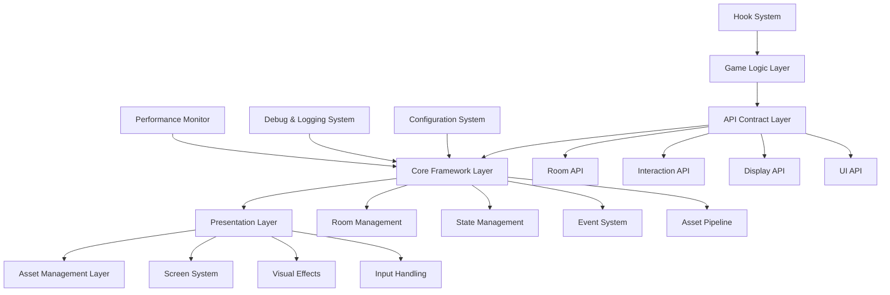

# Developer Manual

**Part III: Framework Documentation - Chapter 14**

*Comprehensive developer reference covering advanced implementation patterns, framework architecture, development workflow optimization, and production-ready best practices for the Snatchernauts Framework.*

---

## Chapter Overview

The Developer Manual serves as the definitive technical guide for professional development with the Snatchernauts Framework. This comprehensive reference bridges the gap between basic framework usage and advanced implementation patterns, providing the deep technical knowledge required for building production-quality point-and-click adventure games.

**Target Audience**: This manual is designed for experienced developers, technical leads, and teams building commercial or complex interactive fiction games. It assumes familiarity with basic framework concepts and focuses on advanced techniques, architecture patterns, and professional development practices.

**What This Manual Provides**:
- **Complete Framework Architecture**: Deep dive into system design, component relationships, and extensibility patterns
- **Advanced Development Workflows**: Professional development practices, automation, testing, and quality assurance
- **Performance Engineering**: Optimization strategies, profiling techniques, and production deployment patterns
- **Professional Best Practices**: Code organization, documentation standards, team collaboration, and maintenance strategies
- **Integration Strategies**: Advanced patterns for custom logic, third-party integrations, and framework extensions

**Framework Mastery Levels Covered**:
- **Professional Development**: Advanced patterns and production deployment strategies
- **Framework Extension**: Creating custom APIs, systems, and framework modifications
- **Performance Optimization**: Advanced profiling, optimization, and scalability techniques
- **Team Development**: Collaboration patterns, code standards, and project management integration

---

## Framework Architecture Deep Dive

### Architectural Philosophy

The Snatchernauts Framework implements a **layered architecture** with clear separation of concerns, designed for maintainability, extensibility, and professional development workflows.



### Core Design Principles

#### **1. Layered Abstraction**

**API Contract Layer**: Provides stable, well-documented interfaces that remain consistent across framework versions. Game logic should only interact with this layer.

```python
# CORRECT: Using API layer
from game.api.room_api import navigate_to_room, get_current_room
from game.api.display_api import show_object, hide_object

# Game logic using stable API
def handle_door_interaction():
    if store.has_key:
        navigate_to_room("secret_room")
        show_object("treasure_chest")
```

**Core Framework Layer**: Internal implementation details that can change between versions. Direct access should be avoided in game code.

```python
# INCORRECT: Directly accessing core layer
# This breaks abstraction and may fail in future versions
store.room_objects["door"]["visible"] = False  # Fragile!

# CORRECT: Using API abstraction
hide_object("door")  # Stable and future-proof
```

#### **2. Hook-Driven Extensibility**

The framework uses a sophisticated hook system that allows custom behavior without modifying core framework code:

```python
# Global hooks - affect entire game
def on_room_enter(room_id):
    """Global room entry logic - runs for every room"""
    # Update global game state
    store.rooms_visited.append(room_id)
    update_achievement_progress("explorer", len(store.rooms_visited))
    
    # Room-specific global logic
    if room_id.startswith("crime_scene_"):
        enable_evidence_collection_mode()
    elif room_id.startswith("safe_house_"):
        disable_evidence_collection_mode()

# Room-specific hooks - only affect specific rooms
class DetectiveOfficeLogic:
    def on_room_enter(self, room_id):
        """Only runs when entering detective_office"""
        # Check for new case files
        if store.new_case_available:
            highlight_object("case_files")
            show_notification("New case file available!")
    
    def on_object_interact(self, room_id, obj_name, action_id):
        """Handle detective office specific interactions"""
        if obj_name == "case_board" and action_id == "Examine":
            show_case_analysis_screen()
            return True  # Prevent default examine action
        return False  # Allow default behavior

# Register room-specific logic
register_room_logic("detective_office", DetectiveOfficeLogic())
```

#### **3. Event-Driven Communication**

Systems communicate through events rather than direct coupling:

```python
# Event system implementation
class FrameworkEventSystem:
    def __init__(self):
        self.listeners = {}
    
    def emit(self, event_name, **kwargs):
        """Emit event to all registered listeners"""
        if event_name in self.listeners:
            for listener in self.listeners[event_name]:
                try:
                    listener(**kwargs)
                except Exception as e:
                    log_error(f"Event listener error: {e}")
    
    def on(self, event_name, callback):
        """Register event listener"""
        if event_name not in self.listeners:
            self.listeners[event_name] = []
        self.listeners[event_name].append(callback)

# Usage in game logic
events.on("evidence_collected", update_investigation_progress)
events.on("evidence_collected", play_collection_sound)
events.on("evidence_collected", update_evidence_counter)

# Emit events from framework
def collect_evidence(evidence_name):
    store.evidence.append(evidence_name)
    events.emit("evidence_collected", evidence=evidence_name)
```

### Component Architecture

#### **Room Management System**

**Responsibility**: Complete lifecycle management of game rooms, including loading, state management, and navigation.

```python
# Advanced room management patterns
class RoomManager:
    def __init__(self):
        self.loaded_rooms = {}  # Room cache
        self.room_stack = []    # Navigation history
        self.preload_queue = [] # Performance optimization
    
    def load_room_with_caching(self, room_id, preload_adjacent=True):
        """Load room with intelligent caching"""
        # Check cache first
        if room_id in self.loaded_rooms:
            return self.activate_cached_room(room_id)
        
        # Load room data
        room_data = self.load_room_data(room_id)
        
        # Cache room for future use
        self.loaded_rooms[room_id] = room_data
        
        # Preload adjacent rooms for performance
        if preload_adjacent:
            adjacent_rooms = self.get_adjacent_rooms(room_id)
            for adj_room in adjacent_rooms:
                if adj_room not in self.loaded_rooms:
                    self.preload_queue.append(adj_room)
    
    def navigate_with_history(self, target_room, transition_type="fade"):
        """Navigate with navigation history support"""
        current_room = get_current_room()
        
        # Add to navigation stack
        self.room_stack.append({
            "room": current_room,
            "timestamp": time.time(),
            "save_state": get_room_state(current_room)
        })
        
        # Perform navigation with transition
        navigate_to_room(target_room, transition=transition_type)
    
    def go_back(self):
        """Return to previous room in navigation history"""
        if self.room_stack:
            previous = self.room_stack.pop()
            navigate_to_room(previous["room"], transition="fade")
            restore_room_state(previous["room"], previous["save_state"])
```

#### **Interaction System Architecture**

**Multi-Input Support**: The interaction system supports multiple input methods with context-aware behavior:

```python
# Advanced interaction system
class InteractionManager:
    def __init__(self):
        self.input_contexts = {}
        self.active_context = "default"
        self.interaction_history = []
    
    def register_input_context(self, context_name, config):
        """Register context-specific input handling"""
        self.input_contexts[context_name] = {
            "mouse": config.get("mouse", {}),
            "keyboard": config.get("keyboard", {}),
            "gamepad": config.get("gamepad", {}),
            "gesture": config.get("gesture", {})
        }
    
    def handle_contextual_input(self, input_event):
        """Route input based on current context"""
        context = self.input_contexts.get(self.active_context, {})
        input_type = input_event.get("type")
        
        if input_type in context:
            handler = context[input_type].get(input_event.get("action"))
            if handler:
                result = handler(input_event)
                self.log_interaction(input_event, result)
                return result
        
        # Fall back to default behavior
        return self.handle_default_input(input_event)
    
    def log_interaction(self, input_event, result):
        """Log interactions for analytics and debugging"""
        self.interaction_history.append({
            "timestamp": time.time(),
            "input": input_event,
            "result": result,
            "context": self.active_context,
            "room": get_current_room()
        })

# Context registration example
interaction_manager.register_input_context("investigation", {
    "mouse": {
        "left_click": handle_evidence_examine,
        "right_click": show_evidence_context_menu,
        "scroll": zoom_evidence_view
    },
    "keyboard": {
        "space": toggle_magnifier,
        "tab": cycle_evidence,
        "e": quick_examine
    },
    "gamepad": {
        "a_button": handle_evidence_examine,
        "x_button": show_evidence_context_menu,
        "right_trigger": zoom_evidence_view
    }
})
```

---

## Professional Development Workflow

### Development Environment Configuration

#### **Advanced IDE Setup**

**Visual Studio Code Configuration** (`/.vscode/settings.json`):
```json
{
    "python.pythonPath": "/path/to/renpy-sdk/lib/py3-linux-x86_64/python",
    "python.linting.enabled": true,
    "python.linting.pylintEnabled": true,
    "files.associations": {
        "*.rpy": "python",
        "*.rpym": "python"
    },
    "editor.rulers": [80, 100],
    "editor.tabSize": 4,
    "editor.insertSpaces": true,
    "files.trimTrailingWhitespace": true,
    "files.insertFinalNewline": true,
    "python.formatting.provider": "black",
    "python.formatting.blackArgs": ["--line-length=100"]
}
```

**Recommended Extensions**:
```json
{
    "recommendations": [
        "ms-python.python",
        "ms-python.vscode-pylance",
        "eamodio.gitlens",
        "ms-vscode.vscode-json",
        "yzhang.markdown-all-in-one",
        "streetsidesoftware.code-spell-checker",
        "ms-vscode.vscode-typescript-next",
        "bradlc.vscode-tailwindcss",
        "formulahendry.auto-rename-tag"
    ]
}
```

#### **Git Workflow Configuration**

**Git Hooks Setup** (`.git/hooks/pre-commit`):
```bash
#!/bin/bash
# Pre-commit hook for code quality

set -e

# Run Ren'Py linting
echo "Running Ren'Py lint..."
$RENPY_SDK/renpy.sh . lint

# Check for common issues
echo "Checking for debugging code..."
if grep -r "renpy.full_restart()" game/ --include="*.rpy"; then
    echo "Error: Found debugging restart calls"
    exit 1
fi

if grep -r "print(" game/ --include="*.rpy" | grep -v "#.*print("; then
    echo "Warning: Found print statements (use logging instead)"
fi

# Validate room configurations
echo "Validating room configurations..."
python3 scripts/validate_rooms.py

# Update documentation if needed
if [ -n "$(git diff --cached --name-only | grep '\.rpy$')" ]; then
    echo "Updating API documentation..."
    python3 scripts/generate_api_docs.py
fi

echo "Pre-commit checks passed!"
```

**Automated Testing Pipeline** (`.github/workflows/test.yml`):
```yaml
name: Framework Testing

on:
  push:
    branches: [ main, develop ]
  pull_request:
    branches: [ main ]

jobs:
  test:
    runs-on: ubuntu-latest
    
    steps:
    - uses: actions/checkout@v3
    
    - name: Download Ren'Py SDK
      run: |
        wget https://www.renpy.org/dl/8.1.0/renpy-8.1.0-sdk.tar.bz2
        tar xf renpy-8.1.0-sdk.tar.bz2
        export RENPY_SDK=$(pwd)/renpy-8.1.0-sdk
    
    - name: Run Ren'Py Lint
      run: |
        $RENPY_SDK/renpy.sh . lint
    
    - name: Validate Room Configurations
      run: |
        python3 scripts/validate_rooms.py
    
    - name: Run Unit Tests
      run: |
        python3 -m pytest tests/ -v
    
    - name: Generate Test Coverage Report
      run: |
        python3 -m pytest tests/ --cov=game --cov-report=xml
    
    - name: Upload Coverage to Codecov
      uses: codecov/codecov-action@v3
```

### Advanced Development Patterns

#### **Modular Game Logic Architecture**

**Feature-Based Organization**:
```
logic/
├── core/                      # Core game mechanics
│   ├── investigation.py      # Investigation system logic
│   ├── inventory.py          # Inventory management
│   ├── dialogue.py           # Conversation system
│   └── save_system.py        # Save/load functionality
├── features/                  # Game-specific features
│   ├── evidence_collection/  # Evidence gathering mechanics
│   ├── character_interaction/ # NPC interaction systems
│   ├── puzzle_solving/       # Puzzle mechanics
│   └── narrative_branching/  # Story progression logic
├── rooms/                     # Room-specific logic
│   ├── detective_office.py   # Office-specific behavior
│   ├── crime_scene.py        # Crime scene mechanics
│   └── forensics_lab.py      # Lab analysis features
└── utils/                     # Shared utilities
    ├── state_helpers.py      # State management utilities
    ├── animation_helpers.py   # Animation convenience functions
    └── debug_helpers.py      # Development and debugging tools
```

**Feature Module Template**:
```python
# logic/features/evidence_collection/evidence_manager.py
"""
Evidence Collection System

Provides comprehensive evidence gathering, analysis, and management
functionality for investigation-based gameplay.

Architecture:
- EvidenceManager: Core evidence handling
- EvidenceAnalyzer: Evidence processing and connections
- EvidenceUI: User interface integration
- EvidenceValidator: Quality assurance and validation
"""

from dataclasses import dataclass
from typing import List, Dict, Optional, Callable
from enum import Enum

class EvidenceType(Enum):
    PHYSICAL = "physical"
    DIGITAL = "digital"
    TESTIMONIAL = "testimonial"
    PHOTOGRAPHIC = "photographic"

class EvidenceImportance(Enum):
    CRITICAL = "critical"      # Required for case solution
    IMPORTANT = "important"    # Provides key insights
    SUPPORTING = "supporting"  # Adds context
    MISLEADING = "misleading"  # Red herring

@dataclass
class Evidence:
    """Core evidence data structure"""
    id: str
    name: str
    description: str
    evidence_type: EvidenceType
    importance: EvidenceImportance
    room_found: str
    timestamp_found: float
    analysis_results: Dict[str, any] = None
    connections: List[str] = None  # IDs of connected evidence
    
    def __post_init__(self):
        if self.analysis_results is None:
            self.analysis_results = {}
        if self.connections is None:
            self.connections = []

class EvidenceManager:
    """Advanced evidence management system"""
    
    def __init__(self):
        self.evidence_store: Dict[str, Evidence] = {}
        self.collection_callbacks: List[Callable] = []
        self.analysis_callbacks: List[Callable] = []
        self.connection_callbacks: List[Callable] = []
        
        # Analytics and debugging
        self.collection_history = []
        self.analysis_history = []
        
    def register_collection_callback(self, callback: Callable):
        """Register callback for evidence collection events"""
        self.collection_callbacks.append(callback)
    
    def collect_evidence(self, evidence: Evidence) -> bool:
        """Collect new evidence with validation and callbacks"""
        # Validation
        if evidence.id in self.evidence_store:
            log_warning(f"Evidence {evidence.id} already collected")
            return False
        
        # Store evidence
        self.evidence_store[evidence.id] = evidence
        
        # Record collection
        self.collection_history.append({
            "evidence_id": evidence.id,
            "timestamp": time.time(),
            "room": get_current_room(),
            "player_state": get_player_state_snapshot()
        })
        
        # Trigger callbacks
        for callback in self.collection_callbacks:
            try:
                callback(evidence)
            except Exception as e:
                log_error(f"Evidence collection callback error: {e}")
        
        # Check for automatic connections
        self.analyze_connections(evidence)
        
        log_info(f"Collected evidence: {evidence.name}")
        return True
    
    def analyze_connections(self, new_evidence: Evidence):
        """Automatically detect evidence connections"""
        connections_found = []
        
        for existing_id, existing_evidence in self.evidence_store.items():
            if existing_id == new_evidence.id:
                continue
            
            # Check for connections based on various criteria
            connection_strength = self.calculate_connection_strength(
                new_evidence, existing_evidence
            )
            
            if connection_strength > 0.7:  # High confidence threshold
                self.create_evidence_connection(
                    new_evidence.id, 
                    existing_id,
                    strength=connection_strength
                )
                connections_found.append(existing_id)
        
        if connections_found:
            # Notify player of discovered connections
            show_evidence_connection_notification(
                new_evidence.id, 
                connections_found
            )
    
    def calculate_connection_strength(self, 
                                   evidence1: Evidence, 
                                   evidence2: Evidence) -> float:
        """Calculate connection strength between two pieces of evidence"""
        strength = 0.0
        
        # Same room bonus
        if evidence1.room_found == evidence2.room_found:
            strength += 0.3
        
        # Type synergy bonus
        type_synergies = {
            (EvidenceType.PHYSICAL, EvidenceType.PHOTOGRAPHIC): 0.4,
            (EvidenceType.DIGITAL, EvidenceType.TESTIMONIAL): 0.3,
            (EvidenceType.PHYSICAL, EvidenceType.DIGITAL): 0.2
        }
        
        type_pair = (evidence1.evidence_type, evidence2.evidence_type)
        if type_pair in type_synergies:
            strength += type_synergies[type_pair]
        elif (type_pair[1], type_pair[0]) in type_synergies:
            strength += type_synergies[(type_pair[1], type_pair[0])]
        
        # Temporal proximity bonus
        time_diff = abs(evidence1.timestamp_found - evidence2.timestamp_found)
        if time_diff < 300:  # Within 5 minutes
            strength += 0.2 * (1 - time_diff / 300)
        
        # Keyword analysis (simplified)
        if self.has_keyword_overlap(evidence1, evidence2):
            strength += 0.3
        
        return min(strength, 1.0)
    
    def has_keyword_overlap(self, evidence1: Evidence, evidence2: Evidence) -> bool:
        """Check for keyword overlap between evidence descriptions"""
        # This would implement more sophisticated NLP in production
        keywords1 = set(evidence1.description.lower().split())
        keywords2 = set(evidence2.description.lower().split())
        
        # Remove common words
        common_words = {'the', 'a', 'an', 'and', 'or', 'but', 'in', 'on', 'at', 'to', 'for', 'of', 'with', 'by'}
        keywords1 -= common_words
        keywords2 -= common_words
        
        overlap = len(keywords1.intersection(keywords2))
        return overlap >= 2  # At least 2 keywords in common
    
    def generate_analysis_report(self) -> Dict[str, any]:
        """Generate comprehensive evidence analysis report"""
        return {
            "total_evidence": len(self.evidence_store),
            "evidence_by_type": self.get_evidence_by_type_stats(),
            "evidence_by_importance": self.get_evidence_by_importance_stats(),
            "evidence_by_room": self.get_evidence_by_room_stats(),
            "connection_network": self.get_connection_network(),
            "collection_timeline": self.collection_history,
            "completion_percentage": self.calculate_completion_percentage()
        }
    
    def get_evidence_by_type_stats(self) -> Dict[str, int]:
        """Get evidence count by type"""
        stats = {}
        for evidence in self.evidence_store.values():
            type_name = evidence.evidence_type.value
            stats[type_name] = stats.get(type_name, 0) + 1
        return stats

# Global evidence manager instance
evidence_manager = EvidenceManager()

# Integration with framework hooks
def on_object_interact(room_id, obj_name, action_id):
    """Hook for evidence collection during interactions"""
    if action_id == "Examine" and is_evidence_object(obj_name):
        evidence_data = get_evidence_data(obj_name)
        if evidence_data:
            new_evidence = Evidence(
                id=evidence_data["id"],
                name=evidence_data["name"],
                description=evidence_data["description"],
                evidence_type=EvidenceType(evidence_data["type"]),
                importance=EvidenceImportance(evidence_data["importance"]),
                room_found=room_id,
                timestamp_found=time.time()
            )
            
            if evidence_manager.collect_evidence(new_evidence):
                # Evidence successfully collected
                play_evidence_collection_sound()
                show_evidence_collection_notification(new_evidence)
                update_investigation_ui()
                return True  # Prevent default examine behavior
    
    return False  # Allow default behavior
```

---

## Performance Engineering

### Profiling and Optimization

#### **Performance Monitoring System**

```python
# performance/monitor.py
"""
Comprehensive Performance Monitoring System

Provides real-time performance tracking, bottleneck identification,
and optimization recommendations for the Snatchernauts Framework.
"""

import time
import psutil
import tracemalloc
from collections import defaultdict, deque
from contextlib import contextmanager
from dataclasses import dataclass
from typing import Dict, List, Optional, Callable

@dataclass
class PerformanceMetric:
    """Performance measurement data point"""
    name: str
    value: float
    timestamp: float
    category: str
    metadata: Dict[str, any] = None

class PerformanceMonitor:
    """Advanced performance monitoring and profiling"""
    
    def __init__(self, max_history=1000):
        self.metrics_history = defaultdict(lambda: deque(maxlen=max_history))
        self.active_timers = {}
        self.thresholds = {
            "frame_time": 16.67,      # 60fps target (ms)
            "interaction_response": 100.0,  # 100ms max response
            "room_load_time": 2000.0,      # 2s max room load
            "memory_usage": 512.0,         # 512MB max memory
        }
        self.optimization_callbacks = []
        
        # Start memory tracking
        tracemalloc.start()
        
        # System information
        self.system_info = self.gather_system_info()
    
    def gather_system_info(self) -> Dict[str, any]:
        """Gather system performance baseline information"""
        return {
            "cpu_count": psutil.cpu_count(),
            "cpu_freq": psutil.cpu_freq()._asdict() if psutil.cpu_freq() else {},
            "memory_total": psutil.virtual_memory().total,
            "disk_usage": psutil.disk_usage('/').total,
            "platform": renpy.platform,
            "renpy_version": renpy.version_tuple
        }
    
    @contextmanager
    def measure_performance(self, metric_name: str, category: str = "general"):
        """Context manager for measuring execution time"""
        start_time = time.time()
        start_memory = self.get_current_memory_usage()
        
        try:
            yield
        finally:
            end_time = time.time()
            end_memory = self.get_current_memory_usage()
            
            execution_time = (end_time - start_time) * 1000  # Convert to ms
            memory_delta = end_memory - start_memory
            
            self.record_metric(
                PerformanceMetric(
                    name=metric_name,
                    value=execution_time,
                    timestamp=end_time,
                    category=category,
                    metadata={
                        "memory_delta": memory_delta,
                        "current_memory": end_memory
                    }
                )
            )
    
    def get_current_memory_usage(self) -> float:
        """Get current memory usage in MB"""
        current, peak = tracemalloc.get_traced_memory()
        return current / (1024 * 1024)  # Convert to MB
    
    def record_metric(self, metric: PerformanceMetric):
        """Record performance metric and check thresholds"""
        self.metrics_history[metric.name].append(metric)
        
        # Check if metric exceeds threshold
        threshold = self.thresholds.get(metric.name)
        if threshold and metric.value > threshold:
            self.handle_performance_issue(metric, threshold)
    
    def handle_performance_issue(self, metric: PerformanceMetric, threshold: float):
        """Handle performance threshold violation"""
        severity = "critical" if metric.value > threshold * 2 else "warning"
        
        issue_report = {
            "metric": metric.name,
            "value": metric.value,
            "threshold": threshold,
            "severity": severity,
            "timestamp": metric.timestamp,
            "category": metric.category,
            "metadata": metric.metadata or {},
            "recommendations": self.get_optimization_recommendations(metric)
        }
        
        # Log performance issue
        log_performance_issue(issue_report)
        
        # Trigger automatic optimizations if available
        for callback in self.optimization_callbacks:
            try:
                callback(issue_report)
            except Exception as e:
                log_error(f"Optimization callback error: {e}")
    
    def get_optimization_recommendations(self, metric: PerformanceMetric) -> List[str]:
        """Generate optimization recommendations based on performance issues"""
        recommendations = []
        
        if metric.name == "frame_time":
            recommendations.extend([
                "Consider reducing visual effects quality",
                "Check for inefficient screen updates",
                "Optimize image sizes and compression",
                "Review animation complexity"
            ])
        
        elif metric.name == "room_load_time":
            recommendations.extend([
                "Implement room preloading",
                "Optimize image loading pipeline",
                "Cache frequently used assets",
                "Reduce initial object count"
            ])
        
        elif metric.name == "memory_usage":
            recommendations.extend([
                "Clear unused image cache",
                "Optimize large background images",
                "Review object pooling strategy",
                "Implement garbage collection triggers"
            ])
        
        # Add system-specific recommendations
        if self.system_info["memory_total"] < 4 * 1024**3:  # Less than 4GB RAM
            recommendations.append("Enable low-memory mode optimizations")
        
        return recommendations
    
    def generate_performance_report(self) -> Dict[str, any]:
        """Generate comprehensive performance analysis report"""
        report = {
            "timestamp": time.time(),
            "system_info": self.system_info,
            "current_metrics": {},
            "historical_analysis": {},
            "performance_issues": [],
            "optimization_opportunities": []
        }
        
        # Current metrics snapshot
        for metric_name, history in self.metrics_history.items():
            if history:
                recent_values = [m.value for m in list(history)[-10:]]  # Last 10 measurements
                report["current_metrics"][metric_name] = {
                    "latest": recent_values[-1],
                    "average": sum(recent_values) / len(recent_values),
                    "min": min(recent_values),
                    "max": max(recent_values),
                    "threshold": self.thresholds.get(metric_name),
                    "samples": len(recent_values)
                }
        
        # Historical trend analysis
        for metric_name, history in self.metrics_history.items():
            if len(history) >= 50:  # Need sufficient data for trend analysis
                values = [m.value for m in history]
                report["historical_analysis"][metric_name] = {
                    "trend": self.calculate_trend(values),
                    "volatility": self.calculate_volatility(values),
                    "performance_grade": self.calculate_performance_grade(metric_name, values)
                }
        
        # Identify current performance issues
        for metric_name, current_data in report["current_metrics"].items():
            threshold = current_data.get("threshold")
            if threshold and current_data["average"] > threshold:
                report["performance_issues"].append({
                    "metric": metric_name,
                    "severity": "high" if current_data["average"] > threshold * 1.5 else "medium",
                    "average_value": current_data["average"],
                    "threshold": threshold,
                    "recommendations": self.get_optimization_recommendations(
                        PerformanceMetric(metric_name, current_data["average"], time.time(), "analysis")
                    )
                })
        
        return report
    
    def calculate_trend(self, values: List[float]) -> str:
        """Calculate performance trend (improving/degrading/stable)"""
        if len(values) < 10:
            return "insufficient_data"
        
        # Simple linear regression slope
        n = len(values)
        x_mean = (n - 1) / 2
        y_mean = sum(values) / n
        
        slope = sum((i - x_mean) * (values[i] - y_mean) for i in range(n))
        slope /= sum((i - x_mean) ** 2 for i in range(n))
        
        if abs(slope) < 0.01:  # Threshold for "stable"
            return "stable"
        elif slope > 0:
            return "degrading"
        else:
            return "improving"
    
    def calculate_volatility(self, values: List[float]) -> float:
        """Calculate performance volatility (standard deviation)"""
        if len(values) < 2:
            return 0.0
        
        mean = sum(values) / len(values)
        variance = sum((x - mean) ** 2 for x in values) / len(values)
        return variance ** 0.5
    
    def calculate_performance_grade(self, metric_name: str, values: List[float]) -> str:
        """Calculate overall performance grade for a metric"""
        if not values:
            return "unknown"
        
        threshold = self.thresholds.get(metric_name)
        if not threshold:
            return "no_baseline"
        
        average = sum(values) / len(values)
        ratio = average / threshold
        
        if ratio <= 0.5:
            return "excellent"
        elif ratio <= 0.75:
            return "good"
        elif ratio <= 1.0:
            return "acceptable"
        elif ratio <= 1.5:
            return "poor"
        else:
            return "critical"

# Global performance monitor
performance_monitor = PerformanceMonitor()

# Integration with framework
def monitor_room_loading():
    """Monitor room loading performance"""
    original_load_room = load_room
    
    def monitored_load_room(room_id):
        with performance_monitor.measure_performance("room_load_time", "rooms"):
            return original_load_room(room_id)
    
    # Replace original function with monitored version
    globals()["load_room"] = monitored_load_room

def monitor_interactions():
    """Monitor interaction response performance"""
    original_execute_action = execute_object_action
    
    def monitored_execute_action(obj_name, action_id):
        with performance_monitor.measure_performance("interaction_response", "interactions"):
            return original_execute_action(obj_name, action_id)
    
    globals()["execute_object_action"] = monitored_execute_action

# Initialize monitoring
monitor_room_loading()
monitor_interactions()
```

#### **Optimization Strategies**

**Asset Optimization Pipeline**:

```python
# optimization/asset_optimizer.py
"""
Asset Optimization Pipeline

Automated optimization of game assets for performance and memory efficiency.
"""

import os
import subprocess
from PIL import Image
from pathlib import Path
from typing import Dict, List, Tuple

class AssetOptimizer:
    """Comprehensive asset optimization system"""
    
    def __init__(self, project_root: str):
        self.project_root = Path(project_root)
        self.images_dir = self.project_root / "game" / "images"
        self.audio_dir = self.project_root / "game" / "audio"
        
        # Optimization settings
        self.image_quality_settings = {
            "backgrounds": {"quality": 85, "max_size": (1920, 1080)},
            "objects": {"quality": 90, "max_size": (512, 512)},
            "ui": {"quality": 95, "max_size": (256, 256)}
        }
        
        self.optimization_stats = {
            "files_processed": 0,
            "bytes_saved": 0,
            "processing_time": 0
        }
    
    def optimize_all_assets(self):
        """Run complete asset optimization pipeline"""
        start_time = time.time()
        
        # Optimize images
        self.optimize_images()
        
        # Optimize audio (if ffmpeg available)
        if self.check_ffmpeg_available():
            self.optimize_audio()
        
        # Generate optimization report
        self.optimization_stats["processing_time"] = time.time() - start_time
        self.generate_optimization_report()
    
    def optimize_images(self):
        """Optimize all game images"""
        for category, settings in self.image_quality_settings.items():
            category_path = self.images_dir / category
            if category_path.exists():
                self.optimize_image_category(category_path, settings)
    
    def optimize_image_category(self, category_path: Path, settings: Dict):
        """Optimize images in a specific category"""
        for image_file in category_path.rglob("*.png"):
            self.optimize_single_image(image_file, settings)
        
        for image_file in category_path.rglob("*.jpg"):
            self.optimize_single_image(image_file, settings)
        
        for image_file in category_path.rglob("*.jpeg"):
            self.optimize_single_image(image_file, settings)
    
    def optimize_single_image(self, image_path: Path, settings: Dict):
        """Optimize individual image file"""
        try:
            # Record original size
            original_size = image_path.stat().st_size
            
            # Load and process image
            with Image.open(image_path) as img:
                # Convert to RGB if necessary
                if img.mode in ('RGBA', 'LA'):
                    # Keep transparency for UI elements
                    if "ui" not in str(image_path):
                        # Remove alpha for non-UI images
                        background = Image.new('RGB', img.size, (0, 0, 0))
                        background.paste(img, mask=img.split()[-1] if img.mode == 'RGBA' else None)
                        img = background
                
                # Resize if too large
                max_size = settings["max_size"]
                if img.size[0] > max_size[0] or img.size[1] > max_size[1]:
                    img.thumbnail(max_size, Image.Resampling.LANCZOS)
                
                # Save with optimization
                quality = settings["quality"]
                img.save(
                    image_path,
                    optimize=True,
                    quality=quality,
                    format="JPEG" if image_path.suffix.lower() in ('.jpg', '.jpeg') else "PNG"
                )
            
            # Record savings
            new_size = image_path.stat().st_size
            bytes_saved = original_size - new_size
            
            if bytes_saved > 0:
                self.optimization_stats["bytes_saved"] += bytes_saved
                self.optimization_stats["files_processed"] += 1
                
                log_info(f"Optimized {image_path.name}: {bytes_saved} bytes saved")
        
        except Exception as e:
            log_error(f"Failed to optimize {image_path}: {e}")
    
    def check_ffmpeg_available(self) -> bool:
        """Check if FFmpeg is available for audio optimization"""
        try:
            subprocess.run(["ffmpeg", "-version"], 
                         capture_output=True, check=True)
            return True
        except (subprocess.CalledProcessError, FileNotFoundError):
            return False
    
    def optimize_audio(self):
        """Optimize audio files using FFmpeg"""
        for audio_file in self.audio_dir.rglob("*.wav"):
            self.convert_audio_to_ogg(audio_file)
        
        for audio_file in self.audio_dir.rglob("*.mp3"):
            if audio_file.stat().st_size > 1024 * 1024:  # Files larger than 1MB
                self.compress_audio(audio_file)
    
    def convert_audio_to_ogg(self, audio_file: Path):
        """Convert WAV files to OGG for better compression"""
        ogg_file = audio_file.with_suffix('.ogg')
        
        try:
            subprocess.run([
                "ffmpeg", "-i", str(audio_file),
                "-c:a", "libvorbis", "-q:a", "6",
                str(ogg_file)
            ], capture_output=True, check=True)
            
            # Compare file sizes
            original_size = audio_file.stat().st_size
            new_size = ogg_file.stat().st_size
            
            if new_size < original_size:
                audio_file.unlink()  # Remove original WAV
                self.optimization_stats["bytes_saved"] += (original_size - new_size)
                self.optimization_stats["files_processed"] += 1
                log_info(f"Converted {audio_file.name} to OGG: {original_size - new_size} bytes saved")
            else:
                ogg_file.unlink()  # Remove OGG if not smaller
        
        except subprocess.CalledProcessError as e:
            log_error(f"Failed to convert {audio_file}: {e}")
    
    def generate_optimization_report(self):
        """Generate comprehensive optimization report"""
        report = f"""
        Asset Optimization Report
        ========================
        
        Files Processed: {self.optimization_stats['files_processed']}
        Total Bytes Saved: {self.optimization_stats['bytes_saved']:,} bytes ({self.optimization_stats['bytes_saved'] / (1024*1024):.2f} MB)
        Processing Time: {self.optimization_stats['processing_time']:.2f} seconds
        
        Optimization Settings:
        - Background Quality: {self.image_quality_settings['backgrounds']['quality']}%
        - Object Quality: {self.image_quality_settings['objects']['quality']}%
        - UI Quality: {self.image_quality_settings['ui']['quality']}%
        
        Recommendations:
        {self.generate_optimization_recommendations()}
        """
        
        log_info(report)
        
        # Save report to file
        report_path = self.project_root / "optimization_report.txt"
        with open(report_path, 'w') as f:
            f.write(report)
    
    def generate_optimization_recommendations(self) -> str:
        """Generate optimization recommendations based on results"""
        recommendations = []
        
        if self.optimization_stats["bytes_saved"] == 0:
            recommendations.append("- Assets are already well optimized")
        elif self.optimization_stats["bytes_saved"] > 10 * 1024 * 1024:  # > 10MB saved
            recommendations.append("- Significant space savings achieved")
            recommendations.append("- Consider implementing automated optimization in build pipeline")
        
        # Check for large files that might need attention
        large_files = self.find_large_assets()
        if large_files:
            recommendations.append("- Large assets detected:")
            for file_path, size in large_files[:5]:  # Top 5 largest
                recommendations.append(f"  * {file_path}: {size / (1024*1024):.2f}MB")
        
        return "\n".join(recommendations) if recommendations else "- No specific recommendations"
    
    def find_large_assets(self, threshold_mb: float = 5.0) -> List[Tuple[str, int]]:
        """Find assets larger than threshold"""
        large_files = []
        threshold_bytes = threshold_mb * 1024 * 1024
        
        for asset_file in self.project_root.rglob("*"):
            if asset_file.is_file() and asset_file.suffix.lower() in ('.png', '.jpg', '.jpeg', '.wav', '.mp3', '.ogg'):
                size = asset_file.stat().st_size
                if size > threshold_bytes:
                    large_files.append((str(asset_file.relative_to(self.project_root)), size))
        
        return sorted(large_files, key=lambda x: x[1], reverse=True)

# Usage
asset_optimizer = AssetOptimizer(".")
# Run during build process
# asset_optimizer.optimize_all_assets()
```

---

## Testing and Quality Assurance

### Automated Testing Framework

```python
# tests/framework_tests.py
"""
Comprehensive Testing Framework for Snatchernauts

Provides automated testing for all framework components,
including unit tests, integration tests, and end-to-end scenarios.
"""

import unittest
import time
import tempfile
from unittest.mock import Mock, patch, MagicMock
from pathlib import Path
from typing import Dict, List, Any

class FrameworkTestCase(unittest.TestCase):
    """Base test case with framework-specific utilities"""
    
    def setUp(self):
        """Set up test environment"""
        # Mock Ren'Py environment
        self.mock_renpy = self.setup_renpy_mocks()
        
        # Create temporary game state
        self.temp_state = self.create_test_state()
        
        # Initialize test data
        self.test_rooms = self.create_test_rooms()
        self.test_objects = self.create_test_objects()
    
    def tearDown(self):
        """Clean up test environment"""
        # Reset global state
        if hasattr(store, 'current_room'):
            del store.current_room
        if hasattr(store, 'room_objects'):
            del store.room_objects
    
    def setup_renpy_mocks(self):
        """Set up Ren'Py environment mocks"""
        mock_renpy = Mock()
        mock_renpy.config = Mock()
        mock_renpy.store = Mock()
        mock_renpy.display = Mock()
        mock_renpy.audio = Mock()
        
        # Mock common Ren'Py functions
        mock_renpy.show_screen = Mock()
        mock_renpy.hide_screen = Mock()
        mock_renpy.call_screen = Mock()
        mock_renpy.jump = Mock()
        mock_renpy.call = Mock()
        
        return mock_renpy
    
    def create_test_state(self) -> Dict[str, Any]:
        """Create isolated test state"""
        return {
            "current_room": None,
            "room_objects": {},
            "inventory": [],
            "game_flags": {},
            "test_mode": True
        }
    
    def create_test_rooms(self) -> Dict[str, Dict]:
        """Create test room configurations"""
        return {
            "test_room_1": {
                "id": "test_room_1",
                "name": "Test Room 1",
                "background": "test_bg_1.png",
                "objects": ["test_object_1", "test_object_2"],
                "navigation": {"north": "test_room_2"}
            },
            "test_room_2": {
                "id": "test_room_2",
                "name": "Test Room 2",
                "background": "test_bg_2.png",
                "objects": ["test_object_3"],
                "navigation": {"south": "test_room_1"}
            }
        }
    
    def create_test_objects(self) -> Dict[str, Dict]:
        """Create test object configurations"""
        return {
            "test_object_1": {
                "id": "test_object_1",
                "name": "Test Object 1",
                "image": "test_obj_1.png",
                "position": (100, 200),
                "actions": ["Examine", "Use"],
                "visible": True
            },
            "test_object_2": {
                "id": "test_object_2",
                "name": "Test Object 2",
                "image": "test_obj_2.png",
                "position": (300, 400),
                "actions": ["Examine", "Take"],
                "visible": True
            },
            "test_object_3": {
                "id": "test_object_3",
                "name": "Test Object 3",
                "image": "test_obj_3.png",
                "position": (500, 600),
                "actions": ["Examine"],
                "visible": False
            }
        }
    
    def assertRoomLoaded(self, room_id: str):
        """Assert that a room is properly loaded"""
        self.assertEqual(store.current_room, room_id)
        self.assertIn('room_objects', dir(store))
        self.assertIsInstance(store.room_objects, dict)
    
    def assertObjectExists(self, object_id: str):
        """Assert that an object exists in current room"""
        self.assertIn(object_id, store.room_objects)
    
    def assertObjectVisible(self, object_id: str):
        """Assert that an object is visible"""
        self.assertObjectExists(object_id)
        obj = store.room_objects[object_id]
        self.assertTrue(obj.get('visible', True))
    
    def assertObjectHidden(self, object_id: str):
        """Assert that an object is hidden"""
        self.assertObjectExists(object_id)
        obj = store.room_objects[object_id]
        self.assertFalse(obj.get('visible', True))

class RoomAPITests(FrameworkTestCase):
    """Test cases for Room API functionality"""
    
    @patch('game.api.room_api.load_room_data')
    def test_load_room_success(self, mock_load_data):
        """Test successful room loading"""
        # Setup mock
        mock_load_data.return_value = self.test_rooms["test_room_1"]
        
        # Import and test
        from game.api.room_api import load_room
        
        result = load_room("test_room_1")
        
        # Assertions
        self.assertTrue(result)
        mock_load_data.assert_called_once_with("test_room_1")
        self.assertRoomLoaded("test_room_1")
    
    @patch('game.api.room_api.load_room_data')
    def test_load_room_failure(self, mock_load_data):
        """Test room loading failure handling"""
        # Setup mock to raise exception
        mock_load_data.side_effect = FileNotFoundError("Room not found")
        
        from game.api.room_api import load_room
        
        result = load_room("nonexistent_room")
        
        # Should handle gracefully
        self.assertFalse(result)
        mock_load_data.assert_called_once_with("nonexistent_room")
    
    def test_navigate_to_room(self):
        """Test room navigation"""
        from game.api.room_api import load_room, navigate_to_room
        
        # Load initial room
        with patch('game.api.room_api.load_room_data') as mock_load:
            mock_load.return_value = self.test_rooms["test_room_1"]
            load_room("test_room_1")
        
        # Navigate to second room
        with patch('game.api.room_api.load_room_data') as mock_load:
            mock_load.return_value = self.test_rooms["test_room_2"]
            result = navigate_to_room("test_room_2")
        
        self.assertTrue(result)
        self.assertRoomLoaded("test_room_2")
    
    def test_object_manipulation(self):
        """Test object visibility and position manipulation"""
        from game.api.room_api import load_room
        from game.api.display_api import show_object, hide_object, move_object
        
        # Setup room
        with patch('game.api.room_api.load_room_data') as mock_load:
            mock_load.return_value = self.test_rooms["test_room_1"]
            with patch('game.core.object_factory.create_room_objects') as mock_objects:
                mock_objects.return_value = self.test_objects.copy()
                load_room("test_room_1")
        
        # Test object visibility
        show_object("test_object_1")
        self.assertObjectVisible("test_object_1")
        
        hide_object("test_object_1")
        self.assertObjectHidden("test_object_1")
        
        # Test object movement
        original_pos = store.room_objects["test_object_1"]["position"]
        move_object("test_object_1", 50, 50)
        new_pos = store.room_objects["test_object_1"]["position"]
        
        self.assertEqual(new_pos, (original_pos[0] + 50, original_pos[1] + 50))

class InteractionAPITests(FrameworkTestCase):
    """Test cases for Interaction API functionality"""
    
    def setUp(self):
        super().setUp()
        # Setup interaction test environment
        from game.api.room_api import load_room
        with patch('game.api.room_api.load_room_data') as mock_load:
            mock_load.return_value = self.test_rooms["test_room_1"]
            with patch('game.core.object_factory.create_room_objects') as mock_objects:
                mock_objects.return_value = self.test_objects.copy()
                load_room("test_room_1")
    
    def test_show_interaction_menu(self):
        """Test interaction menu display"""
        from game.api.interactions_api import show_interaction_menu
        
        with patch('renpy.show_screen') as mock_show:
            show_interaction_menu("test_object_1")
            mock_show.assert_called()
            
            # Check menu state
            self.assertTrue(store.interaction_menu_active)
            self.assertEqual(store.selected_object, "test_object_1")
    
    def test_execute_object_action(self):
        """Test object action execution"""
        from game.api.interactions_api import execute_object_action
        
        # Mock action execution
        with patch('game.logic.game_logic.on_object_interact') as mock_hook:
            mock_hook.return_value = False  # Allow default behavior
            
            result = execute_object_action("test_object_1", "Examine")
            
            # Should call hook and execute default behavior
            mock_hook.assert_called_once_with("test_room_1", "test_object_1", "Examine")
            self.assertTrue(result)
    
    def test_custom_action_override(self):
        """Test custom action overriding default behavior"""
        from game.api.interactions_api import execute_object_action
        
        # Mock hook that overrides default behavior
        with patch('game.logic.game_logic.on_object_interact') as mock_hook:
            mock_hook.return_value = True  # Override default behavior
            
            result = execute_object_action("test_object_1", "Use")
            
            mock_hook.assert_called_once_with("test_room_1", "test_object_1", "Use")
            self.assertTrue(result)

class UIAPITests(FrameworkTestCase):
    """Test cases for UI API functionality"""
    
    def test_show_description(self):
        """Test description box display"""
        from game.api.ui_api import show_description
        
        with patch('renpy.show_screen') as mock_show:
            show_description("test_object", "Test description")
            mock_show.assert_called()
            
            # Check description state
            self.assertTrue(store.description_visible)
            self.assertEqual(store.description_text, "Test description")
    
    def test_hide_description(self):
        """Test description box hiding"""
        from game.api.ui_api import show_description, hide_description
        
        # Show description first
        with patch('renpy.show_screen'):
            show_description("test_object", "Test description")
        
        # Hide description
        with patch('renpy.hide_screen') as mock_hide:
            hide_description()
            mock_hide.assert_called()
            
            # Check state
            self.assertFalse(store.description_visible)
    
    def test_ui_state_management(self):
        """Test UI state saving and restoration"""
        from game.api.ui_api import get_ui_state, set_ui_state
        
        # Set up initial UI state
        store.description_visible = True
        store.interaction_menu_active = False
        store.selected_object = "test_object"
        
        # Get current state
        state = get_ui_state()
        
        # Modify state
        store.description_visible = False
        store.interaction_menu_active = True
        store.selected_object = "other_object"
        
        # Restore previous state
        set_ui_state(state)
        
        # Check restoration
        self.assertTrue(store.description_visible)
        self.assertFalse(store.interaction_menu_active)
        self.assertEqual(store.selected_object, "test_object")

class PerformanceTests(FrameworkTestCase):
    """Performance and stress testing"""
    
    def test_room_loading_performance(self):
        """Test room loading performance under normal conditions"""
        from game.api.room_api import load_room
        
        with patch('game.api.room_api.load_room_data') as mock_load:
            mock_load.return_value = self.test_rooms["test_room_1"]
            
            # Time room loading
            start_time = time.time()
            for _ in range(10):
                load_room("test_room_1")
            end_time = time.time()
            
            avg_time = (end_time - start_time) / 10
            
            # Should load within reasonable time (adjust threshold as needed)
            self.assertLess(avg_time, 0.1, "Room loading too slow")
    
    def test_interaction_response_time(self):
        """Test interaction response performance"""
        from game.api.interactions_api import execute_object_action
        
        # Setup
        self.setUp()
        
        with patch('game.logic.game_logic.on_object_interact') as mock_hook:
            mock_hook.return_value = False
            
            # Time interactions
            start_time = time.time()
            for _ in range(100):
                execute_object_action("test_object_1", "Examine")
            end_time = time.time()
            
            avg_time = (end_time - start_time) / 100
            
            # Should respond quickly (adjust threshold as needed)
            self.assertLess(avg_time, 0.01, "Interaction response too slow")
    
    def test_memory_usage(self):
        """Test memory usage during normal operations"""
        import tracemalloc
        
        tracemalloc.start()
        
        # Perform memory-intensive operations
        from game.api.room_api import load_room
        
        with patch('game.api.room_api.load_room_data') as mock_load:
            # Load many rooms to test memory management
            for i in range(50):
                room_data = self.test_rooms["test_room_1"].copy()
                room_data["id"] = f"test_room_{i}"
                mock_load.return_value = room_data
                load_room(f"test_room_{i}")
        
        current, peak = tracemalloc.get_traced_memory()
        tracemalloc.stop()
        
        # Memory usage should be reasonable (adjust threshold as needed)
        memory_mb = peak / (1024 * 1024)
        self.assertLess(memory_mb, 100, f"Memory usage too high: {memory_mb:.2f}MB")

class IntegrationTests(FrameworkTestCase):
    """End-to-end integration testing"""
    
    def test_complete_interaction_flow(self):
        """Test complete user interaction flow"""
        # Load room
        from game.api.room_api import load_room
        with patch('game.api.room_api.load_room_data') as mock_load:
            mock_load.return_value = self.test_rooms["test_room_1"]
            with patch('game.core.object_factory.create_room_objects') as mock_objects:
                mock_objects.return_value = self.test_objects.copy()
                load_room("test_room_1")
        
        # Show object description on hover
        from game.api.ui_api import handle_object_hover
        with patch('renpy.show_screen'):
            handle_object_hover("test_object_1")
        
        # Open interaction menu
        from game.api.interactions_api import show_interaction_menu
        with patch('renpy.show_screen'):
            show_interaction_menu("test_object_1")
        
        # Execute action
        from game.api.interactions_api import execute_object_action
        with patch('game.logic.game_logic.on_object_interact') as mock_hook:
            mock_hook.return_value = False
            execute_object_action("test_object_1", "Examine")
        
        # Verify complete flow worked
        self.assertTrue(store.description_visible)
        self.assertTrue(store.interaction_menu_active)
        mock_hook.assert_called_once()
    
    def test_room_navigation_flow(self):
        """Test room-to-room navigation flow"""
        from game.api.room_api import load_room, navigate_to_room
        
        # Load initial room
        with patch('game.api.room_api.load_room_data') as mock_load:
            mock_load.return_value = self.test_rooms["test_room_1"]
            load_room("test_room_1")
        
        # Navigate to second room
        with patch('game.api.room_api.load_room_data') as mock_load:
            mock_load.return_value = self.test_rooms["test_room_2"]
            navigate_to_room("test_room_2")
        
        # Navigate back
        with patch('game.api.room_api.load_room_data') as mock_load:
            mock_load.return_value = self.test_rooms["test_room_1"]
            navigate_to_room("test_room_1")
        
        # Verify final state
        self.assertRoomLoaded("test_room_1")

def run_all_tests():
    """Run complete test suite"""
    # Create test suite
    suite = unittest.TestSuite()
    
    # Add test cases
    suite.addTest(unittest.makeSuite(RoomAPITests))
    suite.addTest(unittest.makeSuite(InteractionAPITests))
    suite.addTest(unittest.makeSuite(UIAPITests))
    suite.addTest(unittest.makeSuite(PerformanceTests))
    suite.addTest(unittest.makeSuite(IntegrationTests))
    
    # Run tests
    runner = unittest.TextTestRunner(verbosity=2)
    result = runner.run(suite)
    
    return result

if __name__ == "__main__":
    result = run_all_tests()
    if not result.wasSuccessful():
        exit(1)
```

---

## Best Practices and Conventions

## Framework Architecture

### Design Philosophy

The Snatchernauts Framework follows several key design principles:

**Modular Architecture**: The framework is built with clearly separated concerns, allowing developers to modify or extend specific functionality without affecting other systems.

**Hook-Based Logic**: Game logic is implemented through a system of hooks that allow for both global and room-specific behavior while maintaining clean separation between UI and logic.

**API-Driven Development**: All framework functionality is exposed through well-defined APIs that provide clear contracts and consistent behavior.

**Developer Experience Focus**: The framework prioritizes ease of use, comprehensive documentation, and robust debugging tools to enhance the development experience.

### Core Systems Overview

**Room Management System**: Handles room loading, object management, and navigation between different game areas.

**Interaction System**: Manages player input, object interactions, and action menus across multiple input methods (mouse, keyboard, gamepad).

**Display System**: Controls visual presentation, background rendering, object visibility, and visual effects coordination.

**UI Framework**: Provides screen composition, overlay management, and user interface components.

**Effect System**: Implements visual effects including CRT shaders, bloom effects, and letterboxing.

**Logic Hook System**: Enables custom game behavior through a structured hook system that supports both global and room-specific logic.

## Development Environment Setup

### Prerequisites

**Required Software**:
- Ren'Py SDK 8.1.0 or later
- Python 3.9+ (included with Ren'Py SDK)
- Git for version control
- Text editor with Python/Ren'Py syntax support (VS Code recommended)

**Recommended Extensions** (VS Code):
- Ren'Py Language Support
- Python extension
- GitLens for Git integration
- Material Icon Theme for file recognition

### Initial Setup Process

**1. Clone the Framework**:
```bash
git clone https://gitlab.com/yourusername/snatchernauts-framework.git
cd snatchernauts-framework
```

**2. Environment Configuration**:
```bash
# Set up Ren'Py SDK path
export RENPY_SDK="/path/to/renpy-sdk"

# Add to shell profile for persistence
echo 'export RENPY_SDK="/path/to/renpy-sdk"' >> ~/.bashrc

# Verify setup
$RENPY_SDK/renpy.sh --version
```

**3. Project Initialization**:
```bash
# Test the framework
$RENPY_SDK/renpy.sh .

# Run linting to verify setup
$RENPY_SDK/renpy.sh . lint
```

### Development Workflow

**Daily Development Routine**:
1. Pull latest changes: `git pull origin main`
2. Run linting: `$RENPY_SDK/renpy.sh . lint`
3. Test game functionality: `$RENPY_SDK/renpy.sh .`
4. Make changes to game logic/assets
5. Test changes thoroughly
6. Commit changes: `git commit -am "Description of changes"`
7. Push changes: `git push origin feature-branch`

## Directory Structure and Organization

### Complete Directory Structure

The framework follows a structured organization that separates concerns and promotes maintainability:

```
snatchernauts-framework/
├── game/                          # Main game directory
│   ├── script.rpy                # Main entry point and game flow
│   ├── api/                       # Framework APIs
│   │   ├── room_api.rpy          # Room management functions
│   │   ├── display_api.rpy       # Display and visual functions
│   │   ├── interactions_api.rpy  # Player interaction handling
│   │   └── ui_api.rpy            # UI and screen management
│   ├── core/                      # Core framework functionality
│   │   ├── options.rpy           # Game configuration and settings
│   │   ├── common_utils.rpy      # Shared utility functions
│   │   ├── common_logging.rpy    # Logging and debug functions
│   │   ├── room_utils.rpy        # Room-specific utilities
│   │   └── rooms/                # Room configuration system
│   │       └── room_config.rpy   # Room definitions and editor
│   ├── logic/                     # Game logic implementation
│   │   └── game_logic.rpy        # Global game logic hooks
│   ├── rooms/                     # Room definitions and assets
│   │   ├── room1/                # Example room with assets and scripts
│   │   ├── room2/                # Additional example rooms
│   │   └── room3/                # Room-specific configurations
│   ├── ui/                        # User interface screens
│   │   ├── screens_room.rpy      # Room exploration screens
│   │   ├── screens_interactions.rpy # Interaction menu screens
│   │   └── room_descriptions.rpy # Description box management
│   ├── overlays/                  # Screen overlays
│   │   ├── info_overlay.rpy      # Information and help overlay
│   │   ├── debug_overlay.rpy     # Development debug overlay
│   │   ├── letterbox_gui.rpy     # Letterbox effect overlay
│   │   └── fade_overlay.rpy      # Screen transition overlays
│   ├── shaders/                   # Visual effect shaders
│   │   ├── crt_shader.rpy        # CRT monitor effect
│   │   ├── letterbox_shader_v2.rpy # Enhanced letterbox shader
│   │   └── neo_noir_*.rpy        # Neo-noir atmosphere effects
│   ├── images/                    # Game images and sprites
│   │   ├── backgrounds/          # Room background images
│   │   ├── objects/              # Interactive object sprites
│   │   └── ui/                   # UI element graphics
│   ├── audio/                     # Game audio files
│   │   ├── music/                # Background music tracks
│   │   └── sounds/               # Sound effects
│   ├── fonts/                     # Custom font files
│   └── gui/                       # Ren'Py GUI system files
├── scripts/                       # Development and automation tools
│   ├── run-game.sh               # 🎮 Unified game launcher with options
│   ├── lint.sh                   # 🔍 Ren'Py code linting
│   ├── push-both.sh              # 🚀 Push to GitLab + GitHub simultaneously
│   ├── sync-github-wiki.sh       # 📚 Manual wiki synchronization to GitHub
│   ├── github-init.sh            # 🔗 Initialize GitHub remote repository
│   └── hooks/                    # Git hooks for automation
│       └── pre-push             # ⚠️ Auto-sync wiki on push (if enabled)
├── Wiki/                          # Documentation (auto-synced to wikis)
│   ├── 01-Overview.md            # Framework introduction and concepts
│   ├── 02-Getting-Started.md     # Zero-to-hero tutorial
│   ├── 03-Architecture.md        # System design and best practices
│   ├── 04-Logic-Hooks.md         # Game logic system documentation
│   ├── 05-API-*.md               # Complete API reference library
│   ├── 06-Screens-and-UI.md     # UI system documentation
│   ├── 07-Effects-and-Shaders.md # Visual effects manual
│   ├── 08-Build-and-Distribute.md # Production deployment guide
│   ├── 09-Examples.md            # Extensive code examples
│   ├── 10-Troubleshooting.md     # Problem-solving guide
│   └── DeveloperManual.md        # This document
├── .gitlab-ci.yml                # GitLab CI/CD configuration (auto-wiki sync)
├── CHANGELOG.md                  # Version history and release notes
├── README.md                     # Comprehensive framework guide
├── LICENSE                       # MIT license
└── project.json                  # Ren'Py project configuration
```

### File Organization Principles

**API Layer (`game/api/`)**: Contains all public-facing functions that game developers should use. These files define the contract between the framework and game-specific code.

**Core Layer (`game/core/`)**: Internal framework functionality that supports the APIs. Game developers typically shouldn't need to modify these files directly.

**Logic Layer (`game/logic/`)**: Where game-specific behavior is implemented using the framework's hook system.

**Presentation Layer (`game/ui/`, `game/overlays/`)**: Handles all visual presentation and user interface concerns.

**Assets (`game/images/`, `game/audio/`)**: Organized by type and usage context for easy management.

### Directory Layout

- `game/script.rpy`: Entry points (`label start`, `label play_room`). Calls `load_room(room)` then `on_room_enter(room)`.
- `game/logic/`
  - `game_logic.rpy`: Global hooks and room handler registry.
  - `rooms/room1_logic.rpy`: Example per-room handler registration and hooks.
- `game/api/`
  - `room_api.rpy`: Room lifecycle (toggle CRT, parameter setters, navigate, etc.).
  - `display_api.rpy`: Background and object visibility helpers.
  - `ui_api.rpy`: Hotspots, hover/unhover, editor/exit button customization.
  - `interactions_api.rpy`: Interaction menu, actions, execution.
- `game/core/`
  - `common_utils.rpy`: Shared helpers (fonts, dev mode checks, mouse position).
  - `common_logging.rpy`: Color-coded, truncating logs; function wrapping; print interception.
  - `config_builders.rpy`, `object_factory.rpy`: Build room/object configs.
  - `bloom_utils.rpy`, `bloom_colors.rpy`: Bloom logic and presets.
  - `room_utils.rpy`: Misc room-related utilities.
  - `rooms/`: `room_config.rpy` & editor.
  - `options.rpy`: Project options and defaults (log toggles).
- `game/ui/`
  - `screens_room.rpy`: Room background + object composition and bloom.
  - `screens_interactions.rpy`: Interaction UI and bindings.
  - `screens_bloom.rpy`: Bloom overlays.
  - `room_descriptions.rpy`: Floating description boxes.
  - `room_ui.rpy`, `room_transforms.rpy`, `screens.rpy`: Additional screens and transforms.
- `game/overlays/`
  - `letterbox_gui.rpy`, `info_overlay.rpy`, `debug_overlay.rpy`, `fade_overlay.rpy`.
- `game/shaders/`
  - `crt_shader.rpy`, `bloom_shader.rpy`.

## Lifecycle

1. `label start` → info overlay flow → `call play_room`.
2. `label play_room(room, music)`:
   - `load_room(room)` → populates `store.room_objects`.
   - Calls `on_room_enter(room)` (global hook + per-room handler) for logic.
   - `call screen room_exploration` for the interactive loop.
3. Hovering objects → `ui_api.handle_object_hover(obj)`:
   - Sets `store.current_hover_object`.
   - Calls `on_object_hover(room_id, obj)` hook.
4. Opening/using interactions → `interactions_api.execute_object_action(obj, action)`:
   - Calls `on_object_interact(room_id, obj, action)` hook before built-in side effects.

## Game Logic Hooks

- `on_game_start()`: One-time init after overlays (optional, call from script if used).
- `on_room_enter(room_id)`: Called after `load_room`; initialize per-room state.
- `on_object_hover(room_id, obj_name)`: Lightweight reactions to hover changes.
- `on_object_interact(room_id, obj_name, action_id)`: Central place to branch gameplay.

Room-specific logic
- Create `game/logic/rooms/<room_id>_logic.rpy` with a handler class and register via `register_room_logic('<room_id>', Handler())`.
- Only implement the hooks you need; the global hooks still run.

## Public API Contracts

- room_api:
  - `toggle_crt_effect()`, `set_crt_parameters(warp, scan, chroma, scanline_size)`
  - `move_object(name, dx, dy)`, `scale_object(name, scale_change)`
  - `get_object_list_for_navigation()`, `gamepad_navigate(dir)`
- display_api:
  - `get_room_background()`, `get_fallback_background()`
  - `should_display_object(obj)`, `is_object_hidden(obj)`
- ui_api:
  - `handle_object_hover(name)`, `handle_object_unhover()`
- interactions_api:
  - `show_interaction_menu(name)`, `execute_object_action(name, action_id)`

All APIs return simple values or update `store` and will log ENTER/EXIT with truncated arguments by default.

## UI & Interactions

- Screen `room_exploration` composes background, objects, bloom, hotspots, overlays, and input handlers.
- Interaction flow:
  - `show_interaction_menu(obj)` sets menu state and selection.
  - Input navigates via `navigate_interaction_menu` and executes via `execute_selected_action()` → `execute_object_action(obj, action_id)`.
  - Before executing the built-in action, the logic hook `on_object_interact(room, obj, action_id)` is called for custom behavior.

## Effects

- CRT: `crt_shader.rpy` with scanlines, chromatic aberration, and horizontal vignette; toggles/params in `room_api`.
- Bloom: `screens_bloom.rpy` and `bloom_utils.rpy`; applied to hovered objects.
- Letterbox: `letterbox_gui.rpy` overlay.

## Debugging & Logging

- Debug overlay (Cmd+Shift+F12 / Ctrl+Shift+F12): hidden → compact → verbose → hidden.
- Logging:
  - `sn_log_enabled`, `sn_log_color`, `sn_log_intercept_prints` toggles (Shift+O to set at runtime).
  - Built-in `print` is intercepted; logs are color-coded, prefixed with `::`, and truncated.

## Conventions & Best Practices

- Only call `game/api/*` from logic.
- Keep UI screens “dumb” — emit events to hooks and render state.
- Add doc headers to new modules with Overview, Contracts, and Examples.
- Keep room assets under `game/images/` matching object ids.
- Run `renpy.sh . lint` before PRs.

