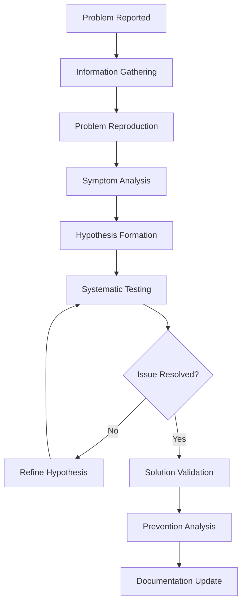

# Troubleshooting Guide

**Part III: Framework Documentation - Chapter 15**

*Comprehensive technical support reference providing systematic problem-solving methodologies, diagnostic procedures, and resolution strategies for all aspects of the Snatchernauts Framework.*

---

## Chapter Overview

The Troubleshooting Guide serves as the definitive technical support resource for developers working with the Snatchernauts Framework. This comprehensive reference provides systematic diagnostic procedures, root cause analysis techniques, and proven resolution strategies for both common issues and complex technical problems.

**Professional Problem-Solving Approach**: This guide employs a structured methodology based on professional technical support practices, emphasizing systematic diagnosis, root cause identification, and preventive measures to reduce future occurrence of issues.

**What This Guide Provides**:
- **Systematic Diagnostic Procedures**: Step-by-step methodologies for identifying the root cause of issues
- **Comprehensive Issue Database**: Detailed coverage of common problems with multiple resolution approaches
- **Performance Troubleshooting**: Advanced techniques for identifying and resolving performance bottlenecks
- **Emergency Recovery Procedures**: Critical system recovery and data preservation strategies
- **Preventive Maintenance**: Proactive measures to prevent common issues from occurring

**Problem Categories Covered**:
- **Environment and Setup**: Installation, configuration, and development environment issues
- **Runtime and Gameplay**: In-game functionality, interaction, and user experience problems
- **Performance and Optimization**: Memory, CPU, and graphics performance troubleshooting
- **Development Workflow**: Building, testing, and deployment-related issues
- **System Integration**: Cross-platform compatibility and third-party integration problems

---

## Diagnostic Methodology

### Professional Troubleshooting Framework

Before diving into specific issues, understanding the systematic approach to problem-solving ensures efficient resolution and prevents recurring problems.



#### **Phase 1: Information Gathering**

**Environmental Data Collection**:
```bash
#!/bin/bash
# Comprehensive system diagnostic script
# Save as scripts/diagnostic_info.sh

echo "=== Snatchernauts Framework Diagnostic Report ==="
echo "Generated: $(date)"
echo

echo "=== System Information ==="
echo "OS: $(uname -a)"
echo "Shell: $SHELL ($($SHELL --version | head -1))"
echo "Python: $(python3 --version 2>/dev/null || echo 'Not available')"
echo "Git: $(git --version 2>/dev/null || echo 'Not available')"
echo

echo "=== Ren'Py Environment ==="
echo "RENPY_SDK: $RENPY_SDK"
if [ -n "$RENPY_SDK" ] && [ -d "$RENPY_SDK" ]; then
    echo "SDK Status: Found"
    echo "SDK Version: $($RENPY_SDK/renpy.sh --version 2>/dev/null || echo 'Unable to determine')"
    echo "SDK Permissions: $(ls -ld $RENPY_SDK/renpy.sh 2>/dev/null | awk '{print $1}' || echo 'File not found')"
else
    echo "SDK Status: Not found or not configured"
fi
echo

echo "=== Project Information ==="
echo "Working Directory: $(pwd)"
echo "Project Structure:"
tree -L 2 game/ 2>/dev/null || find game/ -maxdepth 2 -type d 2>/dev/null || echo "game/ directory not accessible"
echo

echo "=== Recent Changes ==="
echo "Last 5 Git commits:"
git log --oneline -5 2>/dev/null || echo "Git history not available"
echo

echo "=== Framework Files Status ==="
echo "Core Files:"
for file in game/script.rpy game/core/options.rpy game/logic/game_logic.rpy; do
    if [ -f "$file" ]; then
        echo "  ✓ $file ($(stat -c%s $file 2>/dev/null || stat -f%z $file 2>/dev/null || echo '?') bytes)"
    else
        echo "  ✗ $file (missing)"
    fi
done
echo

echo "=== Current Configuration ==="
echo "Debug Settings:"
grep -n "sn_log_enabled\|sn_log_color\|sn_debug_enabled" game/core/options.rpy 2>/dev/null || echo "  Configuration file not accessible"
echo

echo "=== Linting Status ==="
if [ -x "scripts/run-game.sh" ]; then
    echo "Running lint check..."
    timeout 30s scripts/run-game.sh --lint 2>&1 | head -20
else
    echo "Lint script not available or not executable"
fi
echo

echo "=== End Diagnostic Report ==="
```

#### **Phase 2: Problem Classification**

**Issue Severity Matrix**:

| Severity | Impact | Examples | Response Time |
|----------|---------|----------|---------------|
| **Critical** | Game completely unusable | Won't start, crashes on launch | Immediate |
| **High** | Major functionality broken | Interactions don't work, saves corrupted | 1-2 hours |
| **Medium** | Feature degraded | Visual effects glitched, audio issues | 1 day |
| **Low** | Minor inconvenience | Performance optimization, cosmetic issues | 1 week |

**Problem Categories**:

```python
# Diagnostic categorization system
class ProblemCategory:
    ENVIRONMENT = "environment"      # Setup, installation, configuration
    RUNTIME = "runtime"              # Gameplay, interaction, functionality
    PERFORMANCE = "performance"      # Speed, memory, optimization
    DEVELOPMENT = "development"      # Building, testing, deployment
    INTEGRATION = "integration"      # Third-party, platform-specific
    DATA = "data"                   # Save files, assets, corruption

class DiagnosticInfo:
    def __init__(self, category, severity, symptoms, reproduction_steps):
        self.category = category
        self.severity = severity
        self.symptoms = symptoms
        self.reproduction_steps = reproduction_steps
        self.timestamp = time.time()
        self.system_info = self.gather_system_info()
    
    def gather_system_info(self):
        return {
            "os": platform.system(),
            "python_version": sys.version,
            "renpy_sdk": os.environ.get("RENPY_SDK", "Not set"),
            "working_directory": os.getcwd(),
            "git_commit": self.get_current_commit()
        }
    
    def get_current_commit(self):
        try:
            return subprocess.check_output(
                ["git", "rev-parse", "--short", "HEAD"], 
                stderr=subprocess.DEVNULL
            ).decode().strip()
        except:
            return "Unknown"

# Usage example
diagnostic = DiagnosticInfo(
    category=ProblemCategory.RUNTIME,
    severity="high",
    symptoms=["Objects not responding to clicks", "No interaction menus appear"],
    reproduction_steps=[
        "Start game",
        "Navigate to room1", 
        "Click on desk object",
        "Observe no response"
    ]
)
```

---

## Environment and Setup Issues

### Framework Installation and Configuration

#### **RENPY_SDK Environment Issues**

**Problem**: Ren'Py SDK not found or incorrectly configured

**Advanced Diagnostic Procedure**:

```bash
# Comprehensive SDK diagnostic script
#!/bin/bash

echo "=== Ren'Py SDK Diagnostic ==="

# Check for common SDK locations
SSDK_LOCATIONS=(
    "$RENPY_SDK"
    "~/renpy-sdk"
    "~/Downloads/renpy-*-sdk"
    "/opt/renpy-sdk"
    "/usr/local/renpy-sdk"
)

echo "Checking potential SDK locations:"
for location in "${SDK_LOCATIONS[@]}"; do
    expanded_path=$(eval echo $location)
    if [ -d "$expanded_path" ]; then
        echo "  ✓ Found: $expanded_path"
        if [ -x "$expanded_path/renpy.sh" ]; then
            echo "    → renpy.sh is executable"
            version_output=$($expanded_path/renpy.sh --version 2>&1)
            if [[ $version_output == *"Ren'Py"* ]]; then
                echo "    → Version: $(echo $version_output | grep -o 'Ren\'Py [0-9.]\+')"
            else
                echo "    → Warning: Unexpected version output"
            fi
        else
            echo "    → Error: renpy.sh not executable or missing"
        fi
    else
        echo "  ✗ Not found: $expanded_path"
    fi
done

echo
echo "Environment variable status:"
echo "  RENPY_SDK = ${RENPY_SDK:-"(not set)"}"
echo "  PATH contains renpy: $(echo $PATH | grep -q renpy && echo "Yes" || echo "No")"

echo
echo "Shell configuration files:"
for config_file in ~/.bashrc ~/.zshrc ~/.profile; do
    if [ -f "$config_file" ]; then
        echo "  $config_file:"
        grep -n "RENPY_SDK\|renpy" "$config_file" | head -3
    fi
done
```

**Resolution Strategies**:

1. **Automated SDK Setup**:
```bash
#!/bin/bash
# Automated SDK setup script

SDK_VERSION="8.1.3"  # Update as needed
SDK_URL="https://www.renpy.org/dl/${SDK_VERSION}/renpy-${SDK_VERSION}-sdk.tar.bz2"
INSTALL_DIR="$HOME/renpy-sdk"

echo "Setting up Ren'Py SDK v${SDK_VERSION}..."

# Download if not exists
if [ ! -d "$INSTALL_DIR" ]; then
    echo "Downloading Ren'Py SDK..."
    mkdir -p "$(dirname $INSTALL_DIR)"
    cd "$(dirname $INSTALL_DIR)"
    
    if command -v wget >/dev/null; then
        wget "$SDK_URL" -O "renpy-sdk.tar.bz2"
    elif command -v curl >/dev/null; then
        curl -L "$SDK_URL" -o "renpy-sdk.tar.bz2"
    else
        echo "Error: Neither wget nor curl found. Please install one of them."
        exit 1
    fi
    
    echo "Extracting SDK..."
    tar -xjf "renpy-sdk.tar.bz2"
    mv "renpy-${SDK_VERSION}-sdk" "$(basename $INSTALL_DIR)"
    rm "renpy-sdk.tar.bz2"
fi

# Set up environment
echo "Configuring environment..."
echo "export RENPY_SDK=\"$INSTALL_DIR\"" >> ~/.bashrc
echo "export PATH=\"\$RENPY_SDK:\$PATH\"" >> ~/.bashrc

# Make executable
chmod +x "$INSTALL_DIR/renpy.sh"

echo "Setup complete!"
echo "Please run: source ~/.bashrc"
echo "Then test with: renpy.sh --version"
```

2. **Cross-Platform Environment Configuration**:
```python
# Dynamic SDK detection for cross-platform compatibility
import os
import sys
import subprocess
from pathlib import Path

class RenpySDKManager:
    def __init__(self):
        self.sdk_paths = self.get_potential_sdk_paths()
        self.sdk_path = None
        self.sdk_version = None
    
    def get_potential_sdk_paths(self):
        """Get list of potential SDK locations based on platform"""
        paths = []
        
        # Environment variable
        if 'RENPY_SDK' in os.environ:
            paths.append(Path(os.environ['RENPY_SDK']))
        
        # Platform-specific common locations
        home = Path.home()
        if sys.platform == "win32":
            paths.extend([
                home / "renpy-sdk",
                Path("C:/renpy-sdk"),
                Path("C:/Program Files/RenPy"),
                home / "Downloads" / "renpy*sdk"
            ])
        elif sys.platform == "darwin":  # macOS
            paths.extend([
                home / "renpy-sdk",
                Path("/Applications/RenPy.app/Contents/MacOS"),
                home / "Downloads" / "renpy*sdk"
            ])
        else:  # Linux and others
            paths.extend([
                home / "renpy-sdk",
                Path("/opt/renpy-sdk"),
                Path("/usr/local/renpy-sdk"),
                home / "Downloads" / "renpy*sdk"
            ])
        
        return paths
    
    def find_sdk(self):
        """Locate and validate Ren'Py SDK installation"""
        for path in self.sdk_paths:
            # Handle wildcards in path
            if '*' in str(path):
                import glob
                matches = glob.glob(str(path))
                for match in matches:
                    if self.validate_sdk_path(Path(match)):
                        return Path(match)
            elif self.validate_sdk_path(path):
                return path
        
        return None
    
    def validate_sdk_path(self, path):
        """Validate that path contains a working Ren'Py SDK"""
        if not path.exists() or not path.is_dir():
            return False
        
        renpy_executable = path / "renpy.sh"
        if sys.platform == "win32":
            renpy_executable = path / "renpy.exe"
        
        if not renpy_executable.exists():
            return False
        
        # Test execution
        try:
            result = subprocess.run(
                [str(renpy_executable), "--version"],
                capture_output=True,
                text=True,
                timeout=10
            )
            
            if result.returncode == 0 and "Ren'Py" in result.stdout:
                self.sdk_path = path
                self.sdk_version = self.extract_version(result.stdout)
                return True
        except (subprocess.TimeoutExpired, subprocess.SubprocessError):
            pass
        
        return False
    
    def extract_version(self, version_output):
        """Extract version number from Ren'Py version output"""
        import re
        match = re.search(r"Ren'Py (\d+\.\d+\.\d+)", version_output)
        return match.group(1) if match else "Unknown"
    
    def setup_environment(self):
        """Configure environment variables for found SDK"""
        if not self.sdk_path:
            if not self.find_sdk():
                raise EnvironmentError("Ren'Py SDK not found")
        
        os.environ['RENPY_SDK'] = str(self.sdk_path)
        
        # Add to PATH if not already there
        current_path = os.environ.get('PATH', '')
        sdk_path_str = str(self.sdk_path)
        if sdk_path_str not in current_path:
            os.environ['PATH'] = f"{sdk_path_str}{os.pathsep}{current_path}"
        
        return self.sdk_path, self.sdk_version

# Usage in framework initialization
try:
    sdk_manager = RenpySDKManager()
    sdk_path, sdk_version = sdk_manager.setup_environment()
    print(f"Ren'Py SDK found: {sdk_path} (v{sdk_version})")
except EnvironmentError as e:
    print(f"Error: {e}")
    print("Please install Ren'Py SDK and configure RENPY_SDK environment variable")
    sys.exit(1)
```

#### **Development Environment Synchronization**

**Problem**: Inconsistent development environments across team members

**Solution**: Environment standardization script

```bash
#!/bin/bash
# Team environment synchronization script
# Save as scripts/sync_dev_environment.sh

set -e

echo "=== Snatchernauts Framework Environment Setup ==="

# Configuration
REQUIRED_RENPY_VERSION="8.1.3"
REQUIRED_PYTHON_VERSION="3.9"

# Check prerequisites
echo "Checking prerequisites..."

# Check Python version
if command -v python3 >/dev/null; then
    PYTHON_VERSION=$(python3 --version | cut -d' ' -f2 | cut -d'.' -f1,2)
    echo "  Python: $PYTHON_VERSION"
    
    if [ "$(printf '%s\n' "$REQUIRED_PYTHON_VERSION" "$PYTHON_VERSION" | sort -V | head -n1)" != "$REQUIRED_PYTHON_VERSION" ]; then
        echo "  Warning: Python $REQUIRED_PYTHON_VERSION+ recommended, found $PYTHON_VERSION"
    fi
else
    echo "  Error: Python 3 not found"
    exit 1
fi

# Check Git
if ! command -v git >/dev/null; then
    echo "  Error: Git not found"
    exit 1
else
    echo "  Git: $(git --version | cut -d' ' -f3)"
fi

# Setup Ren'Py SDK
echo
echo "Setting up Ren'Py SDK..."
if [ -z "$RENPY_SDK" ] || [ ! -d "$RENPY_SDK" ]; then
    echo "  Downloading Ren'Py SDK v$REQUIRED_RENPY_VERSION..."
    
    # Create SDK directory
    SDK_DIR="$HOME/.snatchernauts/renpy-sdk"
    mkdir -p "$(dirname $SDK_DIR)"
    
    # Download and extract
    cd "$(dirname $SDK_DIR)"
    SDK_URL="https://www.renpy.org/dl/${REQUIRED_RENPY_VERSION}/renpy-${REQUIRED_RENPY_VERSION}-sdk.tar.bz2"
    
    if command -v wget >/dev/null; then
        wget "$SDK_URL" -O renpy-sdk.tar.bz2
    else
        curl -L "$SDK_URL" -o renpy-sdk.tar.bz2
    fi
    
    tar -xjf renpy-sdk.tar.bz2
    mv "renpy-${REQUIRED_RENPY_VERSION}-sdk" "$(basename $SDK_DIR)"
    rm renpy-sdk.tar.bz2
    
    export RENPY_SDK="$SDK_DIR"
fi

echo "  Ren'Py SDK: $RENPY_SDK"

# Configure shell environment
echo
echo "Configuring shell environment..."

# Detect shell
if [ -n "$ZSH_VERSION" ]; then
    SHELL_CONFIG="$HOME/.zshrc"
elif [ -n "$BASH_VERSION" ]; then
    SHELL_CONFIG="$HOME/.bashrc"
else
    SHELL_CONFIG="$HOME/.profile"
fi

echo "  Using configuration file: $SHELL_CONFIG"

# Add environment variables if not present
if ! grep -q "RENPY_SDK" "$SHELL_CONFIG" 2>/dev/null; then
    echo "" >> "$SHELL_CONFIG"
    echo "# Snatchernauts Framework Configuration" >> "$SHELL_CONFIG"
    echo "export RENPY_SDK=\"$RENPY_SDK\"" >> "$SHELL_CONFIG"
    echo "export PATH=\"\$RENPY_SDK:\$PATH\"" >> "$SHELL_CONFIG"
fi

# Install development tools
echo
echo "Setting up development tools..."

# Python packages
if command -v pip3 >/dev/null; then
    echo "  Installing Python development packages..."
    pip3 install --user --upgrade pip
    pip3 install --user pylint black pytest pytest-cov
fi

# Git hooks
echo "  Setting up Git hooks..."
if [ -d ".git" ]; then
    # Copy pre-commit hook
    cp scripts/hooks/pre-commit .git/hooks/pre-commit 2>/dev/null || true
    chmod +x .git/hooks/pre-commit 2>/dev/null || true
fi

# Verify installation
echo
echo "Verifying installation..."
"$RENPY_SDK/renpy.sh" --version

# Test framework
echo "  Testing framework..."
if [ -x "scripts/run-game.sh" ]; then
    if timeout 30s scripts/run-game.sh --lint; then
        echo "  ✓ Framework lint check passed"
    else
        echo "  ✗ Framework lint check failed"
    fi
fi

echo
echo "=== Environment Setup Complete ==="
echo "Please run: source $SHELL_CONFIG"
echo "Then test with: scripts/run-game.sh --version"
```

### Framework Dependencies and Prerequisites

#### **System Requirements Validation**

**Problem**: Framework fails to run due to missing system dependencies

**Comprehensive Validation Script**:

```bash
#!/bin/bash
# System requirements validation
# Save as scripts/validate_system_requirements.sh

set -e

echo "=== Snatchernauts Framework System Requirements Check ==="

ERROR_COUNT=0
WARNING_COUNT=0

# Function to check requirement
check_requirement() {
    local name="$1"
    local command="$2"
    local min_version="$3"
    local required="$4"  # true/false
    
    echo -n "Checking $name... "
    
    if command -v "$command" >/dev/null 2>&1; then
        local version_output
        case "$command" in
            "python3")
                version_output=$(python3 --version 2>&1 | cut -d' ' -f2)
                ;;
            "git")
                version_output=$(git --version | cut -d' ' -f3)
                ;;
            *)
                version_output="unknown"
                ;;
        esac
        
        echo "✓ Found ($version_output)"
        
        # Version comparison if specified
        if [ -n "$min_version" ] && [ "$version_output" != "unknown" ]; then
            if [ "$(printf '%s\n' "$min_version" "$version_output" | sort -V | head -n1)" != "$min_version" ]; then
                echo "  ⚠ Warning: Minimum version $min_version recommended"
                ((WARNING_COUNT++))
            fi
        fi
    else
        if [ "$required" = "true" ]; then
            echo "✗ Not found (REQUIRED)"
            ((ERROR_COUNT++))
        else
            echo "⚠ Not found (optional)"
            ((WARNING_COUNT++))
        fi
    fi
}

# Check core requirements
check_requirement "Python 3" "python3" "3.9" "true"
check_requirement "Git" "git" "2.0" "true"

# Check optional tools
check_requirement "curl" "curl" "" "false"
check_requirement "wget" "wget" "" "false"
check_requirement "ffmpeg" "ffmpeg" "" "false"

# Check Python packages
echo
echo "Checking Python packages..."
for package in "PIL" "pygame"; do
    echo -n "  $package... "
    if python3 -c "import $package" 2>/dev/null; then
        echo "✓"
    else
        echo "✗ (may cause issues)"
        ((WARNING_COUNT++))
    fi
done

# Check disk space
echo
echo "Checking disk space..."
AVAILABLE_SPACE=$(df . | tail -1 | awk '{print $4}')
REQUIRED_SPACE=1048576  # 1GB in KB

if [ "$AVAILABLE_SPACE" -gt "$REQUIRED_SPACE" ]; then
    echo "  ✓ Sufficient disk space ($(($AVAILABLE_SPACE / 1024 / 1024))GB available)"
else
    echo "  ⚠ Low disk space ($(($AVAILABLE_SPACE / 1024 / 1024))GB available, 1GB+ recommended)"
    ((WARNING_COUNT++))
fi

# Check memory
echo "Checking system memory..."
if command -v free >/dev/null; then
    TOTAL_MEM=$(free -m | awk 'NR==2{print $2}')
    if [ "$TOTAL_MEM" -gt 4096 ]; then
        echo "  ✓ Sufficient memory (${TOTAL_MEM}MB)"
    else
        echo "  ⚠ Limited memory (${TOTAL_MEM}MB, 4GB+ recommended for optimal performance)"
        ((WARNING_COUNT++))
    fi
else
    echo "  ? Unable to determine memory (Unix-like systems only)"
fi

echo
echo "=== Requirements Check Summary ==="
echo "Errors: $ERROR_COUNT"
echo "Warnings: $WARNING_COUNT"

if [ "$ERROR_COUNT" -gt 0 ]; then
    echo
    echo "❌ Critical requirements not met. Please address errors before proceeding."
    exit 1
elif [ "$WARNING_COUNT" -gt 0 ]; then
    echo
    echo "⚠️ Some optional requirements not met. Framework should work but consider addressing warnings."
    exit 0
else
    echo
    echo "✅ All requirements satisfied!"
    exit 0
fi
```

#### **Smart SDK Detection and Installation**

**Problem**: Multiple Ren'Py versions or complex installation scenarios

**Advanced SDK Management System**:

```python
#!/usr/bin/env python3
# Advanced Ren'Py SDK management
# Save as scripts/manage_renpy_sdk.py

import os
import sys
import json
import shutil
import tarfile
import zipfile
import tempfile
import subprocess
from pathlib import Path
from urllib.request import urlopen, urlretrieve
from urllib.parse import urlparse

class RenpySDKManager:
    def __init__(self):
        self.config_dir = Path.home() / ".snatchernauts"
        self.config_file = self.config_dir / "sdk_config.json"
        self.installations = self.load_config()
        
    def load_config(self):
        """Load SDK configuration from file"""
        if self.config_file.exists():
            with open(self.config_file, 'r') as f:
                return json.load(f)
        return {"installations": {}, "active": None}
    
    def save_config(self):
        """Save SDK configuration to file"""
        self.config_dir.mkdir(exist_ok=True)
        with open(self.config_file, 'w') as f:
            json.dump(self.installations, f, indent=2)
    
    def get_available_versions(self):
        """Get list of available Ren'Py versions"""
        # This would typically query the Ren'Py website
        # For now, return common stable versions
        return [
            {"version": "8.1.3", "stable": True, "lts": True},
            {"version": "8.2.1", "stable": True, "lts": False},
            {"version": "8.3.0", "stable": False, "lts": False},
        ]
    
    def find_existing_installations(self):
        """Scan system for existing Ren'Py installations"""
        search_paths = [
            Path.home(),
            Path.home() / "Downloads",
            Path("/opt"),
            Path("/usr/local"),
            Path("C:") if sys.platform == "win32" else Path("/"),
        ]
        
        installations = {}
        
        for search_path in search_paths:
            if not search_path.exists():
                continue
                
            # Look for directories matching renpy pattern
            try:
                for item in search_path.iterdir():
                    if item.is_dir() and "renpy" in item.name.lower():
                        if self.validate_installation(item):
                            version = self.detect_version(item)
                            installations[version] = {
                                "path": str(item),
                                "version": version,
                                "auto_detected": True
                            }
            except PermissionError:
                continue
        
        return installations
    
    def validate_installation(self, path):
        """Validate that directory contains working Ren'Py installation"""
        renpy_executable = path / "renpy.sh"
        if sys.platform == "win32":
            renpy_executable = path / "renpy.exe"
        
        if not renpy_executable.exists():
            return False
        
        # Test execution
        try:
            result = subprocess.run(
                [str(renpy_executable), "--version"],
                capture_output=True,
                text=True,
                timeout=5
            )
            return result.returncode == 0 and "Ren'Py" in result.stdout
        except (subprocess.TimeoutExpired, subprocess.SubprocessError, FileNotFoundError):
            return False
    
    def detect_version(self, path):
        """Detect Ren'Py version from installation"""
        renpy_executable = path / "renpy.sh"
        if sys.platform == "win32":
            renpy_executable = path / "renpy.exe"
        
        try:
            result = subprocess.run(
                [str(renpy_executable), "--version"],
                capture_output=True,
                text=True,
                timeout=5
            )
            
            if result.returncode == 0:
                import re
                match = re.search(r"Ren'Py (\d+\.\d+\.\d+)", result.stdout)
                return match.group(1) if match else "unknown"
        except (subprocess.TimeoutExpired, subprocess.SubprocessError, FileNotFoundError):
            pass
        
        return "unknown"
    
    def download_version(self, version, install_path=None):
        """Download and install specific Ren'Py version"""
        if install_path is None:
            install_path = self.config_dir / f"renpy-{version}-sdk"
        
        install_path = Path(install_path)
        
        # Construct download URL
        base_url = f"https://www.renpy.org/dl/{version}"
        
        # Determine platform-specific package
        if sys.platform == "win32":
            filename = f"renpy-{version}-sdk.zip"
        else:
            filename = f"renpy-{version}-sdk.tar.bz2"
        
        download_url = f"{base_url}/{filename}"
        
        print(f"Downloading Ren'Py {version} from {download_url}...")
        
        # Download to temporary file
        with tempfile.NamedTemporaryFile(suffix=Path(filename).suffix, delete=False) as tmp_file:
            try:
                urlretrieve(download_url, tmp_file.name)
                
                print(f"Extracting to {install_path}...")
                install_path.parent.mkdir(parents=True, exist_ok=True)
                
                # Extract archive
                if filename.endswith('.zip'):
                    with zipfile.ZipFile(tmp_file.name, 'r') as zip_ref:
                        zip_ref.extractall(install_path.parent)
                        # Move extracted directory to desired name
                        extracted_name = f"renpy-{version}-sdk"
                        if (install_path.parent / extracted_name).exists():
                            if install_path.exists():
                                shutil.rmtree(install_path)
                            (install_path.parent / extracted_name).rename(install_path)
                else:
                    with tarfile.open(tmp_file.name, 'r:bz2') as tar_ref:
                        tar_ref.extractall(install_path.parent)
                        # Move extracted directory to desired name
                        extracted_name = f"renpy-{version}-sdk"
                        if (install_path.parent / extracted_name).exists():
                            if install_path.exists():
                                shutil.rmtree(install_path)
                            (install_path.parent / extracted_name).rename(install_path)
                
                # Make executable
                renpy_executable = install_path / "renpy.sh"
                if renpy_executable.exists():
                    renpy_executable.chmod(0o755)
                
                print(f"Installation complete: {install_path}")
                
                # Register installation
                self.installations["installations"][version] = {
                    "path": str(install_path),
                    "version": version,
                    "auto_detected": False
                }
                self.save_config()
                
                return install_path
                
            except Exception as e:
                print(f"Error downloading/installing: {e}")
                if install_path.exists():
                    shutil.rmtree(install_path)
                raise
            finally:
                # Clean up temporary file
                try:
                    os.unlink(tmp_file.name)
                except:
                    pass
    
    def set_active_version(self, version):
        """Set active Ren'Py version"""
        if version not in self.installations["installations"]:
            raise ValueError(f"Version {version} not found in installations")
        
        self.installations["active"] = version
        self.save_config()
        
        # Update environment
        sdk_path = self.installations["installations"][version]["path"]
        os.environ["RENPY_SDK"] = sdk_path
        
        print(f"Active Ren'Py version set to {version} at {sdk_path}")
    
    def list_installations(self):
        """List all available installations"""
        installations = self.installations.get("installations", {})
        active = self.installations.get("active")
        
        print("Available Ren'Py Installations:")
        if not installations:
            print("  No installations found")
            return
        
        for version, info in installations.items():
            status = " (ACTIVE)" if version == active else ""
            source = " (auto-detected)" if info.get("auto_detected") else ""
            print(f"  {version}: {info['path']}{status}{source}")
    
    def interactive_setup(self):
        """Interactive setup process"""
        print("=== Ren'Py SDK Interactive Setup ===")
        
        # Scan for existing installations
        print("Scanning for existing installations...")
        existing = self.find_existing_installations()
        
        # Merge with known installations
        all_installations = {**existing, **self.installations.get("installations", {})}
        
        if all_installations:
            print("\nFound installations:")
            for version, info in all_installations.items():
                print(f"  {version}: {info['path']}")
            
            choice = input("\nUse existing installation? (y/n): ").lower()
            if choice in ['y', 'yes']:
                if len(all_installations) == 1:
                    version = list(all_installations.keys())[0]
                else:
                    print("\nSelect version:")
                    versions = list(all_installations.keys())
                    for i, version in enumerate(versions):
                        print(f"  {i+1}. {version}")
                    
                    while True:
                        try:
                            idx = int(input("Enter number: ")) - 1
                            version = versions[idx]
                            break
                        except (ValueError, IndexError):
                            print("Invalid selection")
                
                self.installations["installations"][version] = all_installations[version]
                self.set_active_version(version)
                return
        
        # Download new version
        print("\nAvailable versions for download:")
        available = self.get_available_versions()
        for i, version_info in enumerate(available):
            status = []
            if version_info["stable"]:
                status.append("stable")
            if version_info["lts"]:
                status.append("LTS")
            status_str = f" ({', '.join(status)})" if status else ""
            print(f"  {i+1}. {version_info['version']}{status_str}")
        
        while True:
            try:
                idx = int(input("Select version to download: ")) - 1
                version_info = available[idx]
                break
            except (ValueError, IndexError):
                print("Invalid selection")
        
        # Download and install
        install_path = self.download_version(version_info["version"])
        self.set_active_version(version_info["version"])
        
        print("\nSetup complete!")
        print(f"RENPY_SDK environment variable set to: {install_path}")

def main():
    import argparse
    
    parser = argparse.ArgumentParser(description="Ren'Py SDK Management")
    parser.add_argument("--list", action="store_true", help="List installations")
    parser.add_argument("--download", help="Download specific version")
    parser.add_argument("--set-active", help="Set active version")
    parser.add_argument("--interactive", action="store_true", help="Interactive setup")
    
    args = parser.parse_args()
    
    manager = RenpySDKManager()
    
    if args.list:
        manager.list_installations()
    elif args.download:
        manager.download_version(args.download)
    elif args.set_active:
        manager.set_active_version(args.set_active)
    elif args.interactive:
        manager.interactive_setup()
    else:
        parser.print_help()

if __name__ == "__main__":
    main()
```

### Permission Denied Errors

**Symptoms:**
- "Permission denied" when running scripts
- Can't execute launcher or renpy.sh
- Files appear locked or inaccessible

**Solutions:**

1. **Make Scripts Executable:**
   ```bash
   chmod +x scripts/run-game.sh
   chmod +x scripts/lint.sh
   chmod +x $RENPY_SDK/renpy.sh
   ```

2. **Check Directory Permissions:**
   ```bash
   # Ensure you can read/write in the project directory
   ls -la /path/to/snatchernauts_framework/
   ```

3. **Fix Ownership (if needed):**
   ```bash
   # Only if files are owned by another user
   sudo chown -R $USER:$USER /path/to/snatchernauts_framework/
   ```

## Game Runtime Issues

### Nothing Happens on Object Interaction

**Symptoms:**
- Clicking objects produces no response
- Interaction menus don't appear
- Objects seem non-interactive

**Diagnostic Steps:**

1. **Enable Debug Mode:**
   ```bash
   scripts/run-game.sh --debug
   ```

2. **Check Console Output:**
   - Look for error messages during object interaction
   - Check if hover events are being detected

3. **Verify Object Configuration:**
   ```python
   # Ensure objects have proper actions defined
   ROOM_OBJECTS = {
       "desk": {
           "image": "desk.png",
           "position": (100, 200),
           "actions": ["Examine", "Search"]  # ← Required
       }
   }
   ```

**Common Causes and Solutions:**

1. **Handler Return Value Issues:**
   ```python
   def on_object_interact(room_id, obj, action):
       if obj == "desk" and action == "Examine":
           renpy.say(None, "A wooden desk.")
           return True  # ← Must return True to prevent defaults
       return False  # ← Allow framework to handle other actions
   ```

2. **Missing Object Registration:**
   ```python
   # Make sure room objects are properly registered
   init python:
       # Room objects must be loaded into the system
       room_api.register_room_objects("room1", ROOM1_OBJECTS)
   ```

3. **Z-Order Issues:**
   ```python
   # Objects might be hidden behind background
   show desk zorder 10
   show background zorder 0
   ```

### Visual Artifacts and Display Issues

#### Shader-Related Problems

**Symptoms:**
- Weird colors or visual distortions
- Black screens when effects are enabled
- Flickering or unstable visual effects

**Immediate Solutions:**

1. **Reset All Effects:**
   - Press `R` during gameplay to reset shaders
   - Press `0` to reset CRT settings

2. **Disable Problem Effects:**
   - Press `C` to toggle CRT off
   - Press `L` to toggle letterbox off
   - Check if issue persists

**GPU Compatibility Issues:**

1. **Check GPU Support:**
   ```python
   # Enable shader debugging
   define config.log_gl_shaders = True
   define shader_debug_enabled = True
   ```

2. **Use Software Fallbacks:**
   ```python
   init python:
       # Detect and handle unsupported GPUs
       renderer_info = renpy.get_renderer_info()
       if renderer_info["renderer"] == "sw":
           # Disable complex shaders
           crt_enabled = False
           shader_debug_enabled = True
   ```

3. **Mobile Device Adjustments:**
   ```python
   init python:
       if renpy.mobile:
           # Use simplified effects on mobile
           crt_warp = 0.05  # Reduced curvature
           crt_scanline_intensity = 0.1  # Lighter scanlines
   ```

#### Object Highlighting Problems

**Symptoms:**
- Objects don't highlight on hover
- Highlighting appears in wrong location
- Effects are too subtle or too intense

**Solutions:**

1. **Check Desaturation Settings:**
   ```python
   # Verify object has desaturation configuration
   "desk": {
       "image": "desk.png",
       "position": (100, 200),
       "desaturation_intensity": 0.6,  # Try higher values
       "desaturation_preset": "moderate"  # Or try "explosive_normal"
   }
   ```

2. **Debug Hover Detection:**
   ```python
   def on_object_hover(room_id, obj):
       print(f"[HOVER DEBUG] {room_id}.{obj}")
       # This should print when hovering over objects
   ```

3. **Verify Transform Application:**
   ```python
   # Make sure transforms are being applied
   show desk at object_desaturation_highlight
   ```

### Audio Issues

#### No Sound or Music

**Symptoms:**
- Complete silence during gameplay
- Music doesn't play in rooms
- Sound effects missing

**Diagnostic Steps:**

1. **Check Audio Settings:**
   ```python
   # Verify in game/core/options.rpy
   define config.has_sound = True
   define config.has_music = True
   define config.has_voice = True
   ```

2. **Test Audio Files:**
   ```bash
   # Verify files exist and are accessible
   ls -la game/audio/
   ```

3. **Check File Formats:**
   - Use OGG or MP3 format
   - Avoid WAV files (large and compatibility issues)
   - Keep file paths relative to game/ directory

**Solutions:**

1. **Fix Audio Channel Registration:**
   ```python
   init python:
       renpy.music.register_channel("ambient", mixer="music", loop=True)
       renpy.music.register_channel("sfx", mixer="sfx", loop=False)
   ```

2. **Proper Audio Loading:**
   ```python
   # Use proper audio paths
   renpy.music.play("audio/background.ogg", channel="music")
   renpy.sound.play("audio/click.ogg")
   ```

#### Audio Stuttering or Performance Issues

**Solutions:**

1. **Reduce Audio Quality:**
   - Convert to lower bitrate OGG files
   - Use shorter audio clips where possible

2. **Preload Important Audio:**
   ```python
   # Preload frequently used sounds
   $ renpy.music.queue("audio/common_sound.ogg", clear_queue=False)
   ```

## Development Workflow Issues

### Linting Failures

**Symptoms:**
- `scripts/run-game.sh --lint` reports errors
- Syntax errors prevent game from starting
- Indentation or formatting issues

**Common Lint Errors:**

1. **Indentation Problems:**
   ```python
   # Wrong (mixed tabs and spaces)
   def on_game_start():
   \tstore.test = True  # Tab character
       print("Hello")     # Spaces
   
   # Correct (consistent spaces)
   def on_game_start():
       store.test = True
       print("Hello")
   ```

2. **Missing Colons:**
   ```python
   # Wrong
   if condition
       do_something()
   
   # Correct
   if condition:
       do_something()
   ```

3. **Incorrect String Quotes:**
   ```python
   # Avoid mixing quote types unnecessarily
   renpy.say(None, "This is consistent")
   renpy.say(None, "Don't mix 'quotes' unnecessarily")
   ```

**Lint Fixing Process:**

1. **Run Lint with Details:**
   ```bash
   scripts/run-game.sh --lint
   # Read error messages carefully
   ```

2. **Fix One Error at a Time:**
   - Address the first error reported
   - Re-run lint to see if it fixed subsequent errors

3. **Use Text Editor Features:**
   - Enable "Show Whitespace" to see tabs vs spaces
   - Use auto-indent features
   - Set editor to use spaces instead of tabs

### Build and Distribution Problems

#### Build Failures

**Symptoms:**
- Ren'Py Launcher build fails
- Missing files in distribution
- Distribution crashes on other systems

**Solutions:**

1. **Use Ren'Py Launcher (Not CLI):**
   ```bash
   # Wrong - headless CLI doesn't support distribute
   $RENPY_SDK/renpy.sh . distribute
   
   # Correct - use the GUI launcher
   $RENPY_SDK/renpy.sh launcher
   # Then: Select project → Build & Distribute
   ```

2. **Check Build Configuration:**
   ```python
   # In game/core/options.rpy
   define build.name = "snatchernauts_framework"
   define build.itch_project = "YourUsername/your-game-name"
   
   # Ensure proper file exclusions
   build.classify('**~', None)  # Exclude backup files
   build.classify('**.psd', None)  # Exclude source art
   ```

3. **Verify Required Files:**
   - Check that all referenced images exist
   - Ensure audio files are included
   - Test that fonts are properly bundled

#### Platform-Specific Issues

**Windows Builds:**
- Include necessary Visual C++ redistributables
- Test on systems without development tools installed

**Mac Builds:**
- Handle code signing requirements
- Test on different macOS versions

**Linux Builds:**
- Check library dependencies
- Test on different distributions

### Memory and Performance Issues

#### High Memory Usage

**Symptoms:**
- Game uses excessive RAM
- Slowdowns during gameplay
- System becomes unresponsive

**Solutions:**

1. **Optimize Images:**
   - Use appropriate image sizes (don't use 4K for small objects)
   - Convert large images to WEBP or optimized PNG
   - Use Ren'Py's image optimization features

2. **Manage Audio Resources:**
   - Use streaming for long audio files
   - Unload unused audio channels
   ```python
   renpy.music.stop(channel="ambient", fadeout=1.0)
   ```

3. **Clean Up Objects:**
   ```python
   # Remove objects that are no longer needed
   renpy.hide("large_background")
   # Use renpy.free_memory() sparingly in extreme cases
   ```

#### Low Frame Rate

**Solutions:**

1. **Disable Expensive Effects:**
   ```python
   # Temporarily disable for testing
   crt_enabled = False
   film_grain_enabled = False
   ```

2. **Reduce Shader Complexity:**
   - Lower CRT scanline resolution
   - Reduce number of simultaneous effects
   - Use simpler desaturation presets

3. **Profile Performance:**
   ```python
   # Enable performance monitoring
   define config.profile = True
   define config.profile_init = True
   ```

## Logging and Debug Issues

### Excessive Log Output

**Symptoms:**
- Console floods with debug messages
- Performance impact from logging
- Difficulty finding relevant information

**Solutions:**

1. **Adjust Logging Levels:**
   ```python
   # In game/core/options.rpy
   default sn_log_enabled = True    # Master switch
   default sn_log_color = True      # Colored output
   default sn_log_intercept_prints = False  # Reduce noise
   ```

2. **Use Debug Overlay Controls:**
   - Press `Ctrl+Shift+F12` to cycle debug overlay
   - Use overlay toggles to control specific logging categories

3. **Filter Debug Output:**
   ```python
   # Add category-specific controls
   bloom_debug_enabled = False   # Disable bloom debugging
   shader_debug_enabled = False  # Disable shader debugging
   ```

### Missing Debug Information

**Symptoms:**
- Can't see what's happening during errors
- Need more detailed troubleshooting info

**Solutions:**

1. **Enable Comprehensive Debugging:**
   ```bash
   scripts/run-game.sh --debug
   ```

2. **Activate Specific Debug Systems:**
   ```python
   # Enable various debug systems
   bloom_debug_enabled = True
   bloom_debug_verbose = True
   shader_debug_enabled = True
   ```

3. **Add Custom Debug Output:**
   ```python
   def on_object_interact(room_id, obj, action):
       print(f"[INTERACTION] {room_id}.{obj} → {action}")
       # Your interaction logic here
   ```

## Getting Additional Help

### Before Asking for Help

1. **Gather Information:**
   - Note exact error messages
   - Record steps to reproduce the issue
   - Note your operating system and Ren'Py version
   - Try with debug mode enabled

2. **Check Recent Changes:**
   - What was the last thing you modified?
   - Does the issue occur with a fresh project?
   - Have you updated any system components recently?

3. **Test with Minimal Setup:**
   - Disable all effects and test basic functionality
   - Try with a simple room configuration
   - Test with default framework settings

### Diagnostic Information to Collect

```bash
# System information
echo "OS: $(uname -a)"
echo "Ren'Py SDK: $RENPY_SDK"
ls -la $RENPY_SDK/renpy.sh

# Project information
echo "Project directory: $(pwd)"
ls -la game/

# Check for common files
ls -la game/core/options.rpy
ls -la game/logic/game_logic.rpy

# Test basic functionality
scripts/run-game.sh --lint --debug
```

### Common Error Patterns

#### "Module Not Found" Errors
- Check file paths are correct
- Verify Python import statements
- Ensure files are in the correct directories

#### "Undefined Variable" Errors
- Check variable initialization
- Verify variable scope (store vs local)
- Look for typos in variable names

#### "Transform Not Found" Errors
- Verify transform definitions
- Check for proper initialization order
- Ensure transforms are defined before use

## Emergency Recovery

### Project Won't Start At All

1. **Backup Current State:**
   ```bash
   cp -r game game_backup_$(date +%Y%m%d)
   ```

2. **Reset to Known Good State:**
   - Revert to last working version
   - Or start with a fresh framework copy
   - Gradually add back your changes

3. **Minimal Test Configuration:**
   ```python
   # Create minimal game/script.rpy for testing
   label start:
       "Hello, world!"
       return
   ```

### Corrupted Save Files or Settings

1. **Clear Persistent Data:**
   ```bash
   # Location varies by OS - check Ren'Py documentation
   rm -rf ~/.renpy/snatchernauts_framework-*/
   ```

2. **Reset to Default Settings:**
   - Delete persistent save data
   - Restart game to regenerate clean settings

3. **Verify Project Integrity:**
   ```bash
   # Check for corrupted or missing files
   find game/ -name "*.rpy" -exec python -m py_compile {} \;
   ```

Remember: when in doubt, start with the simplest possible configuration and build complexity back up gradually. Most issues can be resolved by methodically isolating the problem through systematic testing.

---

## Advanced Performance Troubleshooting

### Memory Leak Detection and Resolution

#### **Memory Profiling System**

**Problem**: Game memory usage increases over time, eventually causing system instability

**Advanced Memory Profiling Script**:

```python
#!/usr/bin/env python3
# Memory profiling and leak detection
# Save as scripts/profile_memory.py

import tracemalloc
import psutil
import time
import gc
from collections import defaultdict
from pathlib import Path

class MemoryProfiler:
    def __init__(self):
        self.snapshots = []
        self.tracking_enabled = False
        self.baseline_memory = 0
        self.leak_threshold = 50 * 1024 * 1024  # 50MB growth threshold
        
    def start_tracking(self):
        """Start memory tracking"""
        tracemalloc.start()
        self.tracking_enabled = True
        self.baseline_memory = self.get_current_memory()
        print(f"Memory tracking started. Baseline: {self.baseline_memory:.2f}MB")
    
    def get_current_memory(self):
        """Get current memory usage in MB"""
        if self.tracking_enabled:
            current, peak = tracemalloc.get_traced_memory()
            return current / (1024 * 1024)
        else:
            process = psutil.Process()
            return process.memory_info().rss / (1024 * 1024)
    
    def take_snapshot(self, label=""):
        """Take memory snapshot"""
        if not self.tracking_enabled:
            print("Warning: Memory tracking not enabled")
            return None
        
        snapshot = tracemalloc.take_snapshot()
        current_memory = self.get_current_memory()
        
        snapshot_info = {
            'timestamp': time.time(),
            'label': label,
            'memory_mb': current_memory,
            'growth_mb': current_memory - self.baseline_memory,
            'snapshot': snapshot
        }
        
        self.snapshots.append(snapshot_info)
        
        print(f"Snapshot '{label}': {current_memory:.2f}MB (+{snapshot_info['growth_mb']:.2f}MB)")
        
        # Check for potential leak
        if snapshot_info['growth_mb'] > (self.leak_threshold / (1024 * 1024)):
            self.analyze_potential_leak(snapshot_info)
        
        return snapshot_info
    
    def analyze_potential_leak(self, snapshot_info):
        """Analyze potential memory leak"""
        print(f"\n⚠️  Potential memory leak detected in '{snapshot_info['label']}'")
        print(f"Memory growth: +{snapshot_info['growth_mb']:.2f}MB")
        
        if len(self.snapshots) >= 2:
            self.compare_snapshots(
                self.snapshots[-2]['snapshot'],
                snapshot_info['snapshot'],
                f"Leak analysis: {self.snapshots[-2]['label']} → {snapshot_info['label']}"
            )
    
    def compare_snapshots(self, snapshot1, snapshot2, title="Memory Comparison"):
        """Compare two memory snapshots"""
        print(f"\n=== {title} ===")
        
        top_stats = snapshot2.compare_to(snapshot1, 'lineno')
        
        print("Top 10 memory growth areas:")
        for index, stat in enumerate(top_stats[:10], 1):
            print(f"{index:2}. {stat}")
        
        # Analyze by category
        categories = defaultdict(int)
        for stat in top_stats[:50]:  # Analyze top 50
            filename = stat.traceback.format()[0]
            if 'renpy' in filename.lower():
                categories['renpy_core'] += stat.size_diff
            elif 'game' in filename.lower():
                categories['game_logic'] += stat.size_diff
            elif 'python' in filename.lower():
                categories['python_stdlib'] += stat.size_diff
            else:
                categories['other'] += stat.size_diff
        
        print("\nMemory growth by category:")
        for category, size_diff in sorted(categories.items(), key=lambda x: x[1], reverse=True):
            print(f"  {category}: {size_diff / (1024 * 1024):.2f}MB")
    
    def generate_report(self, output_file=None):
        """Generate comprehensive memory report"""
        if not self.snapshots:
            print("No snapshots available for report")
            return
        
        report_lines = [
            "=== Memory Profiling Report ===",
            f"Generated: {time.strftime('%Y-%m-%d %H:%M:%S')}",
            f"Total snapshots: {len(self.snapshots)}",
            f"Baseline memory: {self.baseline_memory:.2f}MB",
            ""
        ]
        
        # Timeline analysis
        report_lines.append("Memory Timeline:")
        for i, snapshot in enumerate(self.snapshots):
            timestamp = time.strftime('%H:%M:%S', time.localtime(snapshot['timestamp']))
            report_lines.append(
                f"  {i+1:2}. [{timestamp}] {snapshot['label']:20} {snapshot['memory_mb']:8.2f}MB (+{snapshot['growth_mb']:+6.2f}MB)"
            )
        
        report_lines.append("")
        
        # Growth analysis
        if len(self.snapshots) >= 2:
            total_growth = self.snapshots[-1]['growth_mb']
            avg_growth_per_snapshot = total_growth / (len(self.snapshots) - 1) if len(self.snapshots) > 1 else 0
            
            report_lines.extend([
                "Growth Analysis:",
                f"  Total growth: {total_growth:+.2f}MB",
                f"  Average per snapshot: {avg_growth_per_snapshot:+.2f}MB",
                f"  Growth rate: {'CONCERNING' if total_growth > 100 else 'ACCEPTABLE'}",
                ""
            ])
        
        # Recommendations
        report_lines.append("Recommendations:")
        if len(self.snapshots) >= 2 and self.snapshots[-1]['growth_mb'] > 100:
            report_lines.extend([
                "  ⚠️  High memory growth detected:",
                "    - Review object creation in game logic",
                "    - Check for unreleased resources (images, audio)",
                "    - Consider implementing periodic cleanup",
                "    - Profile specific game functions"
            ])
        else:
            report_lines.append("  ✓ Memory usage appears stable")
        
        report_text = "\n".join(report_lines)
        
        if output_file:
            with open(output_file, 'w') as f:
                f.write(report_text)
            print(f"Report saved to: {output_file}")
        else:
            print(report_text)
    
    def cleanup(self):
        """Stop tracking and cleanup"""
        if self.tracking_enabled:
            tracemalloc.stop()
            self.tracking_enabled = False
            print("Memory tracking stopped")

# Integration with framework
def profile_framework_memory():
    """Profile framework memory usage during typical operations"""
    profiler = MemoryProfiler()
    profiler.start_tracking()
    
    try:
        # Profile initialization
        profiler.take_snapshot("Framework init")
        
        # Profile room loading
        load_room("room1")
        profiler.take_snapshot("Room1 loaded")
        
        # Profile interaction system
        for i in range(10):
            execute_object_action("desk", "Examine")
        profiler.take_snapshot("After 10 interactions")
        
        # Profile room switching
        load_room("room2")
        profiler.take_snapshot("Room2 loaded")
        
        load_room("room1")  # Switch back
        profiler.take_snapshot("Back to Room1")
        
        # Profile effect toggling
        toggle_crt_effect()
        profiler.take_snapshot("CRT effect toggled")
        
        # Force garbage collection
        gc.collect()
        profiler.take_snapshot("After garbage collection")
        
        # Generate report
        profiler.generate_report("memory_profile_report.txt")
        
    finally:
        profiler.cleanup()

if __name__ == "__main__":
    profile_framework_memory()
```

#### **Memory Optimization Strategies**

**Automatic Resource Management**:

```python
# Automatic resource cleanup system
# Add to game/core/resource_manager.rpy

init python:
    class ResourceManager:
        def __init__(self):
            self.loaded_images = {}
            self.loaded_audio = {}
            self.room_resources = {}
            self.cleanup_threshold = 100 * 1024 * 1024  # 100MB
            
        def load_image_with_tracking(self, image_path, room_id=None):
            """Load image with automatic tracking and cleanup"""
            if image_path in self.loaded_images:
                self.loaded_images[image_path]['ref_count'] += 1
                return self.loaded_images[image_path]['image']
            
            # Load new image
            try:
                image = renpy.load_image(image_path)
                self.loaded_images[image_path] = {
                    'image': image,
                    'ref_count': 1,
                    'room_id': room_id,
                    'load_time': time.time(),
                    'size_estimate': self.estimate_image_size(image)
                }
                
                # Track room association
                if room_id:
                    if room_id not in self.room_resources:
                        self.room_resources[room_id] = {'images': [], 'audio': []}
                    self.room_resources[room_id]['images'].append(image_path)
                
                return image
            except Exception as e:
                print(f"Failed to load image {image_path}: {e}")
                return None
        
        def unload_image(self, image_path):
            """Unload image and cleanup resources"""
            if image_path in self.loaded_images:
                self.loaded_images[image_path]['ref_count'] -= 1
                
                if self.loaded_images[image_path]['ref_count'] <= 0:
                    # Actually unload the image
                    del self.loaded_images[image_path]
                    # Force Ren'Py to cleanup
                    renpy.free_memory()
        
        def cleanup_room_resources(self, room_id):
            """Clean up all resources associated with a room"""
            if room_id not in self.room_resources:
                return
            
            resources = self.room_resources[room_id]
            
            # Cleanup images
            for image_path in resources['images'][:]:
                self.unload_image(image_path)
            
            # Cleanup audio
            for audio_path in resources['audio'][:]:
                self.unload_audio(audio_path)
            
            # Remove room from tracking
            del self.room_resources[room_id]
            
            print(f"Cleaned up resources for room: {room_id}")
        
        def estimate_image_size(self, image):
            """Estimate memory usage of an image"""
            # This is a rough estimate
            if hasattr(image, 'width') and hasattr(image, 'height'):
                # Assume 4 bytes per pixel (RGBA)
                return image.width * image.height * 4
            return 1024 * 1024  # Default estimate: 1MB
        
        def get_memory_usage(self):
            """Get current estimated memory usage"""
            total_size = 0
            for info in self.loaded_images.values():
                total_size += info['size_estimate']
            return total_size
        
        def automatic_cleanup(self):
            """Perform automatic cleanup if memory usage is high"""
            current_usage = self.get_memory_usage()
            
            if current_usage > self.cleanup_threshold:
                print(f"Memory usage high ({current_usage / (1024*1024):.1f}MB), performing cleanup...")
                
                # Sort by last use time (oldest first)
                images_by_age = sorted(
                    self.loaded_images.items(),
                    key=lambda x: x[1]['load_time']
                )
                
                # Remove oldest unused images
                cleaned_size = 0
                for image_path, info in images_by_age:
                    if info['ref_count'] == 0:
                        cleaned_size += info['size_estimate']
                        del self.loaded_images[image_path]
                        
                        # Stop when we've cleaned enough
                        if cleaned_size > self.cleanup_threshold * 0.3:  # Clean 30%
                            break
                
                print(f"Cleaned up {cleaned_size / (1024*1024):.1f}MB of unused images")
                renpy.free_memory()
    
    # Global resource manager
    resource_manager = ResourceManager()
    
    # Integrate with room loading
    def enhanced_load_room(room_id):
        """Enhanced room loading with resource management"""
        # Cleanup previous room resources
        current_room = getattr(store, 'current_room', None)
        if current_room and current_room != room_id:
            resource_manager.cleanup_room_resources(current_room)
        
        # Load new room
        original_load_room(room_id)
        
        # Perform automatic cleanup if needed
        resource_manager.automatic_cleanup()
    
    # Override original function
    # original_load_room = load_room
    # load_room = enhanced_load_room
```

### CPU Performance Optimization

#### **Performance Bottleneck Detection**

```python
# CPU performance profiling system
# Save as scripts/profile_cpu.py

import time
import cProfile
import pstats
import functools
from collections import defaultdict
from contextlib import contextmanager

class CPUProfiler:
    def __init__(self):
        self.timings = defaultdict(list)
        self.call_counts = defaultdict(int)
        self.total_time = defaultdict(float)
        self.profiler = None
        
    def time_function(self, func_name=None):
        """Decorator to time function execution"""
        def decorator(func):
            name = func_name or f"{func.__module__}.{func.__name__}"
            
            @functools.wraps(func)
            def wrapper(*args, **kwargs):
                start_time = time.perf_counter()
                try:
                    result = func(*args, **kwargs)
                    return result
                finally:
                    end_time = time.perf_counter()
                    execution_time = end_time - start_time
                    
                    self.timings[name].append(execution_time)
                    self.call_counts[name] += 1
                    self.total_time[name] += execution_time
                    
                    # Log slow executions
                    if execution_time > 0.1:  # 100ms threshold
                        print(f"⚠️  Slow execution: {name} took {execution_time:.3f}s")
            
            return wrapper
        return decorator
    
    @contextmanager
    def profile_context(self, label="profile"):
        """Context manager for profiling code blocks"""
        start_time = time.perf_counter()
        try:
            yield
        finally:
            end_time = time.perf_counter()
            execution_time = end_time - start_time
            self.timings[label].append(execution_time)
            print(f"Profile '{label}': {execution_time:.3f}s")
    
    def start_detailed_profiling(self):
        """Start detailed cProfile profiling"""
        self.profiler = cProfile.Profile()
        self.profiler.enable()
    
    def stop_detailed_profiling(self, output_file="profile_results.prof"):
        """Stop detailed profiling and save results"""
        if self.profiler:
            self.profiler.disable()
            self.profiler.dump_stats(output_file)
            
            # Analyze results
            stats = pstats.Stats(output_file)
            stats.sort_stats('cumulative')
            
            print(f"\n=== Detailed Performance Profile ===")
            stats.print_stats(20)  # Top 20 functions
            
            self.profiler = None
    
    def analyze_performance(self):
        """Analyze collected performance data"""
        if not self.timings:
            print("No performance data collected")
            return
        
        print("\n=== Performance Analysis ===")
        
        # Calculate statistics
        function_stats = []
        for func_name, times in self.timings.items():
            if times:
                stats = {
                    'function': func_name,
                    'calls': self.call_counts[func_name],
                    'total_time': self.total_time[func_name],
                    'avg_time': sum(times) / len(times),
                    'min_time': min(times),
                    'max_time': max(times)
                }
                function_stats.append(stats)
        
        # Sort by total time
        function_stats.sort(key=lambda x: x['total_time'], reverse=True)
        
        print(f"{'Function':<40} {'Calls':<8} {'Total(s)':<10} {'Avg(ms)':<10} {'Max(ms)':<10}")
        print("-" * 88)
        
        for stats in function_stats[:15]:  # Top 15
            print(
                f"{stats['function']:<40} "
                f"{stats['calls']:<8} "
                f"{stats['total_time']:<10.3f} "
                f"{stats['avg_time']*1000:<10.2f} "
                f"{stats['max_time']*1000:<10.2f}"
            )
        
        # Identify performance issues
        issues = []
        for stats in function_stats:
            if stats['avg_time'] > 0.05:  # 50ms average
                issues.append(f"Slow average: {stats['function']} ({stats['avg_time']*1000:.1f}ms avg)")
            if stats['max_time'] > 0.2:  # 200ms max
                issues.append(f"Slow peak: {stats['function']} ({stats['max_time']*1000:.1f}ms max)")
        
        if issues:
            print("\n⚠️  Performance Issues Detected:")
            for issue in issues[:10]:  # Top 10 issues
                print(f"  {issue}")
        else:
            print("\n✓ No significant performance issues detected")
        
        return function_stats
    
    def generate_optimization_suggestions(self, function_stats):
        """Generate optimization suggestions based on analysis"""
        suggestions = []
        
        for stats in function_stats[:10]:  # Top 10 time consumers
            func_name = stats['function']
            
            if 'load_room' in func_name and stats['avg_time'] > 0.1:
                suggestions.append({
                    'category': 'Room Loading',
                    'issue': f"Room loading is slow ({stats['avg_time']*1000:.1f}ms avg)",
                    'suggestions': [
                        "Implement room preloading",
                        "Optimize image loading pipeline",
                        "Use smaller background images",
                        "Cache room data"
                    ]
                })
            
            elif 'execute_object_action' in func_name and stats['avg_time'] > 0.05:
                suggestions.append({
                    'category': 'Interactions',
                    'issue': f"Object interactions are slow ({stats['avg_time']*1000:.1f}ms avg)",
                    'suggestions': [
                        "Optimize object lookup algorithms",
                        "Cache object configurations",
                        "Reduce complexity in interaction handlers",
                        "Use more efficient data structures"
                    ]
                })
            
            elif 'shader' in func_name.lower() and stats['avg_time'] > 0.02:
                suggestions.append({
                    'category': 'Visual Effects',
                    'issue': f"Shader effects are impacting performance ({stats['avg_time']*1000:.1f}ms avg)",
                    'suggestions': [
                        "Reduce shader complexity",
                        "Use lower resolution for effects",
                        "Implement effect quality levels",
                        "Cache shader computations"
                    ]
                })
        
        return suggestions
    
    def clear_data(self):
        """Clear collected performance data"""
        self.timings.clear()
        self.call_counts.clear()
        self.total_time.clear()

# Global CPU profiler
cpu_profiler = CPUProfiler()

# Framework integration decorators
def profile_room_operations():
    """Add profiling to room operations"""
    # This would wrap key framework functions
    original_load_room = load_room
    original_execute_action = execute_object_action
    
    @cpu_profiler.time_function("room_loading")
    def profiled_load_room(room_id):
        return original_load_room(room_id)
    
    @cpu_profiler.time_function("object_interaction")
    def profiled_execute_action(obj_name, action_id):
        return original_execute_action(obj_name, action_id)
    
    # Replace functions
    globals()['load_room'] = profiled_load_room
    globals()['execute_object_action'] = profiled_execute_action

# Usage example
def run_performance_test():
    """Run comprehensive performance test"""
    print("Starting performance test...")
    
    # Enable profiling
    profile_room_operations()
    cpu_profiler.start_detailed_profiling()
    
    try:
        # Test room loading performance
        with cpu_profiler.profile_context("room_loading_test"):
            for room in ["room1", "room2", "room3"]:
                load_room(room)
        
        # Test interaction performance
        with cpu_profiler.profile_context("interaction_test"):
            for i in range(50):
                execute_object_action("desk", "Examine")
        
        # Test effect performance
        with cpu_profiler.profile_context("effects_test"):
            toggle_crt_effect()
            time.sleep(0.1)  # Let effects settle
            toggle_crt_effect()
        
    finally:
        # Analyze results
        cpu_profiler.stop_detailed_profiling("performance_test.prof")
        function_stats = cpu_profiler.analyze_performance()
        suggestions = cpu_profiler.generate_optimization_suggestions(function_stats)
        
        if suggestions:
            print("\n=== Optimization Suggestions ===")
            for suggestion in suggestions:
                print(f"\n{suggestion['category']}: {suggestion['issue']}")
                for s in suggestion['suggestions']:
                    print(f"  • {s}")

if __name__ == "__main__":
    run_performance_test()
```

---

## Platform-Specific Issues

### Windows-Specific Problems

#### **Windows Defender and Antivirus Interference**

**Problem**: Antivirus software flagging or slowing down Ren'Py execution

**Solutions**:

1. **Add Exclusions**:
```powershell
# PowerShell commands to add Windows Defender exclusions
# Run as Administrator

# Exclude Ren'Py SDK directory
Add-MpPreference -ExclusionPath "C:\Path\To\renpy-sdk"

# Exclude project directory  
Add-MpPreference -ExclusionPath "C:\Path\To\snatchernauts-framework"

# Exclude specific executables
Add-MpPreference -ExclusionPath "C:\Path\To\renpy-sdk\renpy.exe"
Add-MpPreference -ExclusionPath "C:\Path\To\renpy-sdk\lib\py3-windows-x86_64\python.exe"
```

2. **Performance Optimization Script**:
```batch
@echo off
REM Windows performance optimization for Ren'Py development
REM Save as scripts/optimize_windows.bat

echo Optimizing Windows for Ren'Py development...

REM Disable Windows Search indexing for project directory
echo Disabling search indexing...
powershell -Command "Get-WmiObject -Class Win32_Volume | Where-Object {$_.DriveLetter -eq 'C:'} | Set-WmiInstance -Arguments @{IndexingEnabled=$false}"

REM Set high performance power plan
echo Setting high performance power plan...
powercfg /setactive 8c5e7fda-e8bf-4a96-9a85-a6e23a8c635c

REM Increase file system cache
echo Optimizing file system cache...
fsutil behavior set DisableLastAccess 1

REM Set process priority for Ren'Py (when running)
echo To set high priority for Ren'Py, run:
echo   wmic process where "name='renpy.exe'" CALL setpriority "above normal"

echo Optimization complete!
echo Note: Some changes may require administrator privileges.
pause
```

#### **Path Length Limitations**

**Problem**: Windows path length limits causing file access issues

**Solutions**:

1. **Enable Long Path Support**:
```powershell
# Enable long path support in Windows (requires Admin)
New-ItemProperty -Path "HKLM:\SYSTEM\CurrentControlSet\Control\FileSystem" -Name "LongPathsEnabled" -Value 1 -PropertyType DWORD -Force
```

2. **Path Length Validation Script**:
```python
# Path length validation for Windows
# Save as scripts/validate_paths_windows.py

import os
from pathlib import Path

def check_path_lengths(base_path=".", max_length=260):
    """Check for paths that might cause issues on Windows"""
    long_paths = []
    
    for root, dirs, files in os.walk(base_path):
        for file in files:
            full_path = os.path.join(root, file)
            if len(full_path) > max_length:
                long_paths.append((full_path, len(full_path)))
    
    if long_paths:
        print(f"Found {len(long_paths)} paths longer than {max_length} characters:")
        for path, length in sorted(long_paths, key=lambda x: x[1], reverse=True):
            print(f"  {length} chars: {path}")
        
        print("\nRecommendations:")
        print("  1. Enable long path support in Windows")
        print("  2. Move project closer to root (e.g., C:\\Projects\\)")
        print("  3. Use shorter directory and file names")
    else:
        print("✓ All paths are within Windows limits")
    
    return long_paths

if __name__ == "__main__":
    check_path_lengths()
```

### macOS-Specific Problems

#### **Gatekeeper and Code Signing Issues**

**Problem**: macOS Gatekeeper preventing Ren'Py execution

**Solutions**:

1. **Bypass Gatekeeper for Development**:
```bash
#!/bin/bash
# macOS Gatekeeper bypass for development
# Save as scripts/setup_macos_dev.sh

echo "Setting up macOS for Ren'Py development..."

# Remove quarantine attribute from Ren'Py SDK
if [ -d "$RENPY_SDK" ]; then
    echo "Removing quarantine from Ren'Py SDK..."
    xattr -dr com.apple.quarantine "$RENPY_SDK"
    
    # Make executable
    chmod +x "$RENPY_SDK/renpy.sh"
    chmod +x "$RENPY_SDK/renpy"
fi

# Allow apps from anywhere (development only)
echo "Configuring Gatekeeper..."
sudo spctl --master-disable

echo "Setup complete!"
echo "Note: Remember to re-enable Gatekeeper after development:"
echo "  sudo spctl --master-enable"
```

2. **Code Signing for Distribution**:
```bash
#!/bin/bash
# Code signing script for macOS distribution
# Save as scripts/sign_macos_build.sh

DEVELOPER_ID="Your Developer ID"
APP_PATH="dist/YourGame.app"
ENTITLEMENTS="entitlements.plist"

echo "Signing macOS build..."

# Sign all executables in the app bundle
find "$APP_PATH" -type f -perm +111 -exec codesign --force --deep --sign "$DEVELOPER_ID" {} \;

# Sign the app bundle itself
codesign --force --deep --sign "$DEVELOPER_ID" --entitlements "$ENTITLEMENTS" "$APP_PATH"

# Verify signature
codesign --verify --deep --strict "$APP_PATH"
echo "Code signing complete!"

# Create DMG for distribution
echo "Creating DMG..."
hdiutil create -volname "Your Game" -srcfolder "$APP_PATH" -ov -format UDZO "dist/YourGame.dmg"

# Sign the DMG
codesign --sign "$DEVELOPER_ID" "dist/YourGame.dmg"
echo "DMG created and signed!"
```

#### **Performance Issues on macOS**

**Problem**: Poor performance on macOS, especially on Apple Silicon

**Solutions**:

1. **Apple Silicon Optimization**:
```python
# Apple Silicon optimization settings
# Add to game/core/options.rpy

init python:
    import platform
    
    # Detect Apple Silicon
    if platform.system() == "Darwin" and platform.machine() == "arm64":
        # Optimize for Apple Silicon
        config.gl_resize = True
        config.gl_enable = True
        
        # Reduce memory pressure
        config.image_cache_size = 8  # Reduce from default
        config.predict_statements = 10  # Reduce prediction
        
        # Optimize audio
        config.audio_buffers = 2
        config.mixing_frequency = 44100
        
        print("Applied Apple Silicon optimizations")
```

### Linux-Specific Problems

#### **Audio System Issues**

**Problem**: Audio not working or crackling on Linux

**Solutions**:

1. **Audio System Detection and Configuration**:
```bash
#!/bin/bash
# Linux audio troubleshooting script
# Save as scripts/fix_linux_audio.sh

echo "Linux Audio Troubleshooting"
echo "==========================="

# Detect audio system
echo "Detecting audio system..."
if command -v pulseaudio >/dev/null; then
    echo "  PulseAudio detected"
    AUDIO_SYSTEM="pulseaudio"
elif command -v pipewire >/dev/null; then
    echo "  PipeWire detected"
    AUDIO_SYSTEM="pipewire"
else
    echo "  ALSA (default)"
    AUDIO_SYSTEM="alsa"
fi

# Test audio output
echo "\nTesting audio output..."
if command -v speaker-test >/dev/null; then
    echo "Running speaker test (Ctrl+C to stop)"
    timeout 5s speaker-test -t wav -c 2 >/dev/null 2>&1
    if [ $? -eq 0 ]; then
        echo "  ✓ Audio test successful"
    else
        echo "  ✗ Audio test failed"
    fi
fi

# Configure SDL audio driver
echo "\nConfiguring SDL audio driver..."
case $AUDIO_SYSTEM in
    "pulseaudio")
        export SDL_AUDIODRIVER=pulse
        echo "  Set SDL_AUDIODRIVER=pulse"
        ;;
    "pipewire")
        export SDL_AUDIODRIVER=pulse  # PipeWire provides PulseAudio compatibility
        echo "  Set SDL_AUDIODRIVER=pulse (PipeWire compatibility)"
        ;;
    "alsa")
        export SDL_AUDIODRIVER=alsa
        echo "  Set SDL_AUDIODRIVER=alsa"
        ;;
esac

# Add to shell configuration
SHELL_CONFIG="$HOME/.bashrc"
if [ -n "$ZSH_VERSION" ]; then
    SHELL_CONFIG="$HOME/.zshrc"
fi

if ! grep -q "SDL_AUDIODRIVER" "$SHELL_CONFIG" 2>/dev/null; then
    echo "\n# Audio configuration for Ren'Py" >> "$SHELL_CONFIG"
    echo "export SDL_AUDIODRIVER=$SDL_AUDIODRIVER" >> "$SHELL_CONFIG"
    echo "  Added SDL_AUDIODRIVER to $SHELL_CONFIG"
fi

# Suggest additional fixes
echo "\nAdditional troubleshooting tips:"
echo "  1. Install audio codecs: sudo apt install ubuntu-restricted-extras"
echo "  2. Add user to audio group: sudo usermod -a -G audio \$USER"
echo "  3. Restart audio service: systemctl --user restart pulseaudio"
echo "  4. Check audio permissions: ls -la /dev/snd/"

echo "\nRestart your shell or run: source $SHELL_CONFIG"
```

2. **Distribution-Specific Fixes**:
```bash
#!/bin/bash
# Distribution-specific audio fixes

# Detect distribution
if [ -f /etc/os-release ]; then
    . /etc/os-release
    DISTRO=$ID
else
    DISTRO="unknown"
fi

echo "Detected distribution: $DISTRO"

case $DISTRO in
    "ubuntu"|"debian")
        echo "Ubuntu/Debian audio setup..."
        sudo apt update
        sudo apt install -y pulseaudio pulseaudio-utils alsa-utils
        sudo apt install -y ubuntu-restricted-extras  # Codecs
        ;;
    "fedora"|"rhel"|"centos")
        echo "Fedora/RHEL audio setup..."
        sudo dnf install -y pulseaudio pulseaudio-utils alsa-utils
        sudo dnf install -y gstreamer1-plugins-ugly gstreamer1-plugins-bad-free
        ;;
    "arch"|"manjaro")
        echo "Arch/Manjaro audio setup..."
        sudo pacman -Sy --noconfirm pulseaudio pulseaudio-alsa alsa-utils
        ;;
    *)
        echo "Unknown distribution - manual audio setup required"
        ;;
esac
```

#### **Graphics Driver Issues**

**Problem**: Poor graphics performance or shader issues on Linux

**Solutions**:

1. **Graphics Driver Detection**:
```python
# Graphics driver detection and optimization
# Add to game/core/linux_graphics.rpy

init python:
    import subprocess
    import re
    
    def detect_graphics_driver():
        """Detect Linux graphics driver and apply optimizations"""
        try:
            # Get graphics information
            result = subprocess.run(['lspci', '-k'], capture_output=True, text=True)
            lspci_output = result.stdout
            
            # Check for different drivers
            if 'nvidia' in lspci_output.lower():
                driver = 'nvidia'
            elif 'amdgpu' in lspci_output.lower() or 'radeon' in lspci_output.lower():
                driver = 'amd'
            elif 'intel' in lspci_output.lower():
                driver = 'intel'
            else:
                driver = 'unknown'
            
            print(f"Detected graphics driver: {driver}")
            
            # Apply driver-specific optimizations
            if driver == 'nvidia':
                # NVIDIA optimizations
                config.gl_vendor = "NVIDIA Corporation"
                config.gl_powersave = False
                
            elif driver == 'amd':
                # AMD optimizations
                config.gl_vendor = "AMD"
                config.gl_anisotropic = False  # Can cause issues on some AMD drivers
                
            elif driver == 'intel':
                # Intel integrated graphics optimizations
                config.gl_vendor = "Intel"
                config.gl_powersave = True
                config.gl2 = False  # Use OpenGL 1.x for compatibility
                
                # Disable complex shaders on Intel
                define.crt_enabled = False
                define.bloom_enabled = False
            
            return driver
            
        except Exception as e:
            print(f"Could not detect graphics driver: {e}")
            return 'unknown'
    
    # Auto-detect on startup
    detected_driver = detect_graphics_driver()
```

---

## Emergency Recovery Procedures

### Complete System Recovery

#### **Framework Reset and Recovery**

**Problem**: Framework is completely broken and won't start

**Emergency Recovery Script**:

```bash
#!/bin/bash
# Emergency framework recovery script
# Save as scripts/emergency_recovery.sh

set -e

echo "=== Snatchernauts Framework Emergency Recovery ==="
echo "This will reset the framework to a known working state."
echo "WARNING: This may overwrite local changes!"
echo

read -p "Continue with recovery? (y/N): " -n 1 -r
echo
if [[ ! $REPLY =~ ^[Yy]$ ]]; then
    echo "Recovery cancelled."
    exit 1
fi

# Step 1: Backup current state
echo "Step 1: Creating backup..."
BACKUP_DIR="backup_$(date +%Y%m%d_%H%M%S)"
mkdir -p "$BACKUP_DIR"

# Backup critical files
if [ -d "game" ]; then
    cp -r game "$BACKUP_DIR/"
    echo "  ✓ Backed up game directory"
fi

if [ -d "scripts" ]; then
    cp -r scripts "$BACKUP_DIR/"
    echo "  ✓ Backed up scripts directory"
fi

# Backup user logic
if [ -f "game/logic/game_logic.rpy" ]; then
    cp "game/logic/game_logic.rpy" "$BACKUP_DIR/user_game_logic.rpy"
    echo "  ✓ Backed up user game logic"
fi

echo "  Backup created in: $BACKUP_DIR"

# Step 2: Framework integrity check
echo "\nStep 2: Checking framework integrity..."

CRITICAL_FILES=(
    "game/script.rpy"
    "game/core/options.rpy"
    "game/api/room_api.rpy"
    "game/api/interactions_api.rpy"
    "game/api/display_api.rpy"
    "game/api/ui_api.rpy"
)

MISSING_FILES=()
for file in "${CRITICAL_FILES[@]}"; do
    if [ ! -f "$file" ]; then
        MISSING_FILES+=("$file")
    fi
done

if [ ${#MISSING_FILES[@]} -gt 0 ]; then
    echo "  ✗ Missing critical files:"
    for file in "${MISSING_FILES[@]}"; do
        echo "    - $file"
    done
else
    echo "  ✓ All critical files present"
fi

# Step 3: Reset to clean framework state
echo "\nStep 3: Resetting framework..."

# Download clean framework (if git repository)
if [ -d ".git" ]; then
    echo "  Resetting git repository..."
    
    # Stash any changes
    git stash push -m "Emergency recovery stash $(date)"
    
    # Reset to last known good commit
    if git rev-parse --verify HEAD~1 >/dev/null 2>&1; then
        git reset --hard HEAD~1
        echo "  ✓ Reset to previous commit"
    else
        git reset --hard HEAD
        echo "  ✓ Reset to current commit"
    fi
    
    # Pull latest if remote exists
    if git remote | grep -q origin; then
        echo "  Pulling latest changes..."
        git pull origin main 2>/dev/null || git pull origin master 2>/dev/null || echo "  Could not pull from remote"
    fi
else
    echo "  Not a git repository - manual framework restoration needed"
fi

# Step 4: Restore user content
echo "\nStep 4: Restoring user content..."

# Restore user rooms (if they exist in backup)
if [ -d "$BACKUP_DIR/game/rooms" ]; then
    echo "  Restoring user rooms..."
    cp -r "$BACKUP_DIR/game/rooms"/* game/rooms/ 2>/dev/null || true
    echo "  ✓ User rooms restored"
fi

# Restore user assets
if [ -d "$BACKUP_DIR/game/images" ]; then
    echo "  Restoring user assets..."
    # Only restore non-framework assets
    find "$BACKUP_DIR/game/images" -name "*.png" -o -name "*.jpg" -o -name "*.jpeg" | while read -r file; do
        rel_path=${file#$BACKUP_DIR/game/images/}
        if [[ ! $rel_path =~ ^(ui/|system/) ]]; then  # Skip framework UI assets
            mkdir -p "$(dirname "game/images/$rel_path")"
            cp "$file" "game/images/$rel_path"
        fi
    done
    echo "  ✓ User assets restored"
fi

# Merge user game logic
if [ -f "$BACKUP_DIR/user_game_logic.rpy" ]; then
    echo "  Merging user game logic..."
    echo "\n# === User Logic (Restored from backup) ===" >> game/logic/game_logic.rpy
    
    # Extract only user-defined functions (skip framework defaults)
    grep -v "^# Framework default" "$BACKUP_DIR/user_game_logic.rpy" >> game/logic/game_logic.rpy || true
    
    echo "  ✓ User game logic merged"
fi

# Step 5: Verification
echo "\nStep 5: Verifying recovery..."

# Test basic functionality
if [ -x "scripts/run-game.sh" ]; then
    echo "  Running framework tests..."
    
    # Test linting
    if timeout 30s scripts/run-game.sh --lint >/dev/null 2>&1; then
        echo "  ✓ Lint check passed"
    else
        echo "  ✗ Lint check failed - manual fixes needed"
    fi
    
    # Test basic startup
    if timeout 10s scripts/run-game.sh --test >/dev/null 2>&1; then
        echo "  ✓ Basic startup test passed"
    else
        echo "  ⚠ Basic startup test failed - check logs"
    fi
fi

# Step 6: Recovery summary
echo "\n=== Recovery Complete ==="
echo "Backup location: $BACKUP_DIR"
echo "\nNext steps:"
echo "1. Test the game thoroughly"
echo "2. Review restored user content"
echo "3. Check logs for any issues"
echo "4. Consider gradual re-integration of backed up changes"

echo "\nIf issues persist:"
echo "1. Check the troubleshooting guide"
echo "2. Review backup files in $BACKUP_DIR"
echo "3. Consider fresh framework installation"

echo "\n✓ Emergency recovery procedure completed!"
```

#### **Data Recovery Tools**

```python
# Data recovery and validation tools
# Save as scripts/recover_data.py

import os
import json
import shutil
import pickle
from pathlib import Path
from datetime import datetime

class DataRecovery:
    def __init__(self, project_root="."):
        self.project_root = Path(project_root)
        self.backup_dir = self.project_root / "recovery_backups"
        self.backup_dir.mkdir(exist_ok=True)
        
    def create_full_backup(self):
        """Create complete backup of current state"""
        timestamp = datetime.now().strftime("%Y%m%d_%H%M%S")
        backup_path = self.backup_dir / f"full_backup_{timestamp}"
        
        print(f"Creating full backup at {backup_path}...")
        
        # Backup game directory
        if (self.project_root / "game").exists():
            shutil.copytree(self.project_root / "game", backup_path / "game")
        
        # Backup scripts
        if (self.project_root / "scripts").exists():
            shutil.copytree(self.project_root / "scripts", backup_path / "scripts")
        
        # Backup configuration files
        for config_file in ["project.json", "README.md", "CHANGELOG.md"]:
            src = self.project_root / config_file
            if src.exists():
                shutil.copy2(src, backup_path / config_file)
        
        # Create backup manifest
        manifest = {
            "timestamp": timestamp,
            "backup_type": "full",
            "files_backed_up": self.count_files_in_directory(backup_path),
            "total_size_mb": self.get_directory_size(backup_path) / (1024 * 1024),
            "created_by": "emergency_recovery"
        }
        
        with open(backup_path / "backup_manifest.json", 'w') as f:
            json.dump(manifest, f, indent=2)
        
        print(f"✓ Full backup created: {manifest['files_backed_up']} files, {manifest['total_size_mb']:.1f}MB")
        return backup_path
    
    def validate_project_integrity(self):
        """Validate project file integrity"""
        print("Validating project integrity...")
        
        issues = []
        warnings = []
        
        # Check critical framework files
        critical_files = [
            "game/script.rpy",
            "game/core/options.rpy",
            "game/api/room_api.rpy",
            "game/api/interactions_api.rpy",
            "game/api/display_api.rpy",
            "game/api/ui_api.rpy",
            "game/logic/game_logic.rpy"
        ]
        
        for file_path in critical_files:
            full_path = self.project_root / file_path
            if not full_path.exists():
                issues.append(f"Missing critical file: {file_path}")
            elif full_path.stat().st_size == 0:
                issues.append(f"Empty critical file: {file_path}")
        
        # Check for common structural issues
        game_dir = self.project_root / "game"
        if not game_dir.exists():
            issues.append("Missing game directory")
        else:
            # Check for required subdirectories
            required_dirs = ["api", "core", "logic", "ui"]
            for dir_name in required_dirs:
                dir_path = game_dir / dir_name
                if not dir_path.exists():
                    issues.append(f"Missing required directory: game/{dir_name}")
        
        # Check for asset consistency
        images_dir = self.project_root / "game" / "images"
        if images_dir.exists():
            # Check for broken symlinks or corrupted images
            for image_file in images_dir.rglob("*.[pP][nN][gG]"):
                try:
                    if image_file.stat().st_size == 0:
                        warnings.append(f"Empty image file: {image_file.relative_to(self.project_root)}")
                except OSError:
                    issues.append(f"Inaccessible image file: {image_file.relative_to(self.project_root)}")
        
        # Check Python syntax in .rpy files
        for rpy_file in game_dir.rglob("*.rpy"):
            try:
                with open(rpy_file, 'r', encoding='utf-8', errors='ignore') as f:
                    content = f.read()
                    
                # Basic syntax checks
                if "init python:" in content:
                    # Extract Python blocks and check basic syntax
                    lines = content.split('\n')
                    in_python_block = False
                    python_lines = []
                    
                    for line in lines:
                        if "init python:" in line:
                            in_python_block = True
                            continue
                        elif in_python_block and line.strip() and not line.startswith(' ') and not line.startswith('\t'):
                            in_python_block = False
                            # Validate accumulated Python code
                            if python_lines:
                                try:
                                    compile('\n'.join(python_lines), rpy_file, 'exec')
                                except SyntaxError as e:
                                    issues.append(f"Syntax error in {rpy_file.relative_to(self.project_root)}: {e}")
                                python_lines = []
                        
                        if in_python_block:
                            python_lines.append(line)
                            
            except Exception as e:
                warnings.append(f"Could not validate {rpy_file.relative_to(self.project_root)}: {e}")
        
        # Report results
        if issues:
            print(f"\n❌ Found {len(issues)} critical issues:")
            for issue in issues[:10]:  # Show first 10
                print(f"  • {issue}")
            if len(issues) > 10:
                print(f"  ... and {len(issues) - 10} more issues")
        
        if warnings:
            print(f"\n⚠️  Found {len(warnings)} warnings:")
            for warning in warnings[:5]:  # Show first 5
                print(f"  • {warning}")
            if len(warnings) > 5:
                print(f"  ... and {len(warnings) - 5} more warnings")
        
        if not issues and not warnings:
            print("✅ Project integrity check passed!")
        
        return {"issues": issues, "warnings": warnings}
    
    def recover_from_backup(self, backup_path, selective=True):
        """Recover project from backup"""
        backup_path = Path(backup_path)
        
        if not backup_path.exists():
            print(f"❌ Backup path does not exist: {backup_path}")
            return False
        
        print(f"Recovering from backup: {backup_path}")
        
        # Load backup manifest if available
        manifest_file = backup_path / "backup_manifest.json"
        manifest = {}
        if manifest_file.exists():
            with open(manifest_file, 'r') as f:
                manifest = json.load(f)
            print(f"Backup info: {manifest.get('backup_type', 'unknown')} created {manifest.get('timestamp', 'unknown')}")
        
        if selective:
            # Selective recovery - only restore missing or corrupted files
            print("Performing selective recovery...")
            
            current_issues = self.validate_project_integrity()
            
            # Restore missing critical files
            for issue in current_issues["issues"]:
                if "Missing critical file:" in issue:
                    file_path = issue.replace("Missing critical file: ", "")
                    src = backup_path / file_path
                    dst = self.project_root / file_path
                    
                    if src.exists():
                        dst.parent.mkdir(parents=True, exist_ok=True)
                        shutil.copy2(src, dst)
                        print(f"  ✓ Restored: {file_path}")
        else:
            # Full recovery - replace everything
            print("Performing full recovery...")
            
            # Backup current state first
            current_backup = self.create_full_backup()
            print(f"Current state backed up to: {current_backup}")
            
            # Replace game directory
            if (backup_path / "game").exists():
                if (self.project_root / "game").exists():
                    shutil.rmtree(self.project_root / "game")
                shutil.copytree(backup_path / "game", self.project_root / "game")
                print("  ✓ Game directory restored")
            
            # Replace scripts directory
            if (backup_path / "scripts").exists():
                if (self.project_root / "scripts").exists():
                    shutil.rmtree(self.project_root / "scripts")
                shutil.copytree(backup_path / "scripts", self.project_root / "scripts")
                print("  ✓ Scripts directory restored")
        
        print("\nRecovery complete! Validating restored project...")
        post_recovery_issues = self.validate_project_integrity()
        
        if not post_recovery_issues["issues"]:
            print("✅ Project recovery successful!")
            return True
        else:
            print(f"⚠️  {len(post_recovery_issues['issues'])} issues remain after recovery")
            return False
    
    def count_files_in_directory(self, directory):
        """Count total files in directory recursively"""
        return sum(1 for _ in Path(directory).rglob("*") if _.is_file())
    
    def get_directory_size(self, directory):
        """Get total size of directory in bytes"""
        return sum(f.stat().st_size for f in Path(directory).rglob("*") if f.is_file())
    
    def list_available_backups(self):
        """List all available backups"""
        backups = []
        
        if self.backup_dir.exists():
            for backup_dir in self.backup_dir.iterdir():
                if backup_dir.is_dir():
                    manifest_file = backup_dir / "backup_manifest.json"
                    if manifest_file.exists():
                        with open(manifest_file, 'r') as f:
                            manifest = json.load(f)
                        backups.append((backup_dir, manifest))
                    else:
                        # Backup without manifest
                        backups.append((backup_dir, {
                            "timestamp": "unknown",
                            "backup_type": "unknown",
                            "files_backed_up": self.count_files_in_directory(backup_dir)
                        }))
        
        # Sort by timestamp (newest first)
        backups.sort(key=lambda x: x[1].get("timestamp", ""), reverse=True)
        
        if backups:
            print(f"Available backups ({len(backups)}):")
            for i, (backup_path, manifest) in enumerate(backups):
                print(f"  {i+1}. {backup_path.name}")
                print(f"     Created: {manifest.get('timestamp', 'unknown')}")
                print(f"     Type: {manifest.get('backup_type', 'unknown')}")
                print(f"     Files: {manifest.get('files_backed_up', 'unknown')}")
                if 'total_size_mb' in manifest:
                    print(f"     Size: {manifest['total_size_mb']:.1f}MB")
                print()
        else:
            print("No backups found")
        
        return backups

def main():
    import argparse
    
    parser = argparse.ArgumentParser(description="Data Recovery Tools")
    parser.add_argument("--backup", action="store_true", help="Create full backup")
    parser.add_argument("--validate", action="store_true", help="Validate project integrity")
    parser.add_argument("--list-backups", action="store_true", help="List available backups")
    parser.add_argument("--recover", help="Recover from backup (provide backup path)")
    parser.add_argument("--full-recovery", action="store_true", help="Perform full recovery (not selective)")
    
    args = parser.parse_args()
    
    recovery = DataRecovery()
    
    if args.backup:
        recovery.create_full_backup()
    elif args.validate:
        recovery.validate_project_integrity()
    elif args.list_backups:
        recovery.list_available_backups()
    elif args.recover:
        recovery.recover_from_backup(args.recover, selective=not args.full_recovery)
    else:
        parser.print_help()

if __name__ == "__main__":
    main()
```

---

## Prevention and Maintenance

### Automated Health Monitoring

```bash
#!/bin/bash
# Automated framework health monitoring
# Save as scripts/health_monitor.sh
# Run via cron for continuous monitoring

LOG_FILE="logs/health_monitor.log"
ALERT_THRESHOLD_MB=500
ERROR_COUNT_THRESHOLD=10

# Create logs directory
mkdir -p logs

echo "[$(date)] Starting health check..." >> "$LOG_FILE"

# Check disk space
DISK_USAGE=$(df . | tail -1 | awk '{print $3}')
DISK_USAGE_MB=$((DISK_USAGE / 1024))

if [ $DISK_USAGE_MB -gt $ALERT_THRESHOLD_MB ]; then
    echo "[$(date)] WARNING: High disk usage: ${DISK_USAGE_MB}MB" >> "$LOG_FILE"
fi

# Check for recent errors
if [ -f "logs/framework.log" ]; then
    ERROR_COUNT=$(grep -c "ERROR" logs/framework.log || echo 0)
    if [ $ERROR_COUNT -gt $ERROR_COUNT_THRESHOLD ]; then
        echo "[$(date)] WARNING: High error count: $ERROR_COUNT errors" >> "$LOG_FILE"
    fi
fi

# Test framework functionality
if [ -x "scripts/run-game.sh" ]; then
    if ! timeout 30s scripts/run-game.sh --lint >/dev/null 2>&1; then
        echo "[$(date)] ERROR: Framework lint check failed" >> "$LOG_FILE"
    fi
fi

# Check for memory leaks (if profiler available)
if command -v python3 >/dev/null && [ -f "scripts/profile_memory.py" ]; then
    MEMORY_REPORT=$(python3 scripts/profile_memory.py --quick-check 2>/dev/null || echo "Could not check memory")
    echo "[$(date)] Memory check: $MEMORY_REPORT" >> "$LOG_FILE"
fi

echo "[$(date)] Health check complete" >> "$LOG_FILE"

# Rotate log file if it gets too large
if [ -f "$LOG_FILE" ] && [ $(wc -c < "$LOG_FILE") -gt 1048576 ]; then  # 1MB
    mv "$LOG_FILE" "${LOG_FILE}.old"
    echo "[$(date)] Log rotated" > "$LOG_FILE"
fi
```

### Best Practices Summary

**Development Practices**:
1. **Version Control**: Always commit working states before major changes
2. **Testing**: Test changes incrementally rather than making large modifications
3. **Backup Strategy**: Maintain regular automated backups of working projects
4. **Documentation**: Document custom logic and configuration changes
5. **Monitoring**: Use the provided monitoring tools to detect issues early

**Troubleshooting Approach**:
1. **Systematic Diagnosis**: Follow the diagnostic methodology outlined in this guide
2. **Isolation**: Identify the specific component or system causing issues
3. **Minimal Reproduction**: Create minimal test cases to reproduce problems
4. **Documentation**: Record solutions for future reference
5. **Prevention**: Implement measures to prevent recurring issues

---

## Conclusion

Remember: when in doubt, start with the simplest possible configuration and build complexity back up gradually. Most issues can be resolved by methodically isolating the problem through systematic testing.

**Emergency Contacts and Resources**:
- Framework Documentation: All chapters in this Wiki
- Community Forums: [Framework community links would go here]
- Issue Tracker: [Repository issue tracker would go here]
- Emergency Recovery: Use the scripts provided in this chapter

**Final Troubleshooting Checklist**:
- ✅ Environment properly configured (RENPY_SDK, PATH, etc.)
- ✅ All dependencies installed and up to date
- ✅ Project structure intact and files not corrupted
- ✅ No syntax errors in game logic files
- ✅ Asset files accessible and in correct locations
- ✅ Sufficient system resources (memory, disk space, CPU)
- ✅ Platform-specific issues addressed
- ✅ Recent changes documented and reversible

This comprehensive troubleshooting guide provides the foundation for resolving any issues encountered while working with the Snatchernauts Framework. The systematic approach and extensive tooling ensure that problems can be diagnosed and resolved efficiently, minimizing development downtime and maintaining project stability.

---

**Continue to:** [Framework Overview](01-Overview.md) | **Previous:** [Developer Manual](14-Developer-Manual.md)

