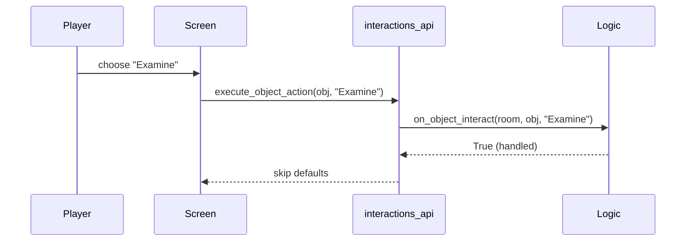

# Examples

Minimal per‑room logic
```renpy
init python:
    class Room1Logic:
        def on_room_enter(self, room):
            renpy.notify("Welcome to Room 1")
        def on_object_interact(self, room, obj, action):
            if obj == 'door' and action == 'Examine':
                renpy.say(None, "A heavy steel door.")
                return True
            if obj == 'terminal' and action == 'Use':
                renpy.say(None, "You access the terminal.")
                return True
            return False

    register_room_logic('room1', Room1Logic())
```

Custom action menu button
```renpy
screen object_actions(obj):
    vbox:
        for action in get_actions_for(obj):
            textbutton action action Function(execute_object_action, obj, action)
        if obj == 'door':
            textbutton "Knock" action Function(execute_object_action, obj, "Knock")
```

Programmatic effects
```renpy
$ show_letterbox(True)
$ crt_enabled = True
$ crt_scanline_size = 1.5
```

Sequence (Mermaid)


ASCII fallback
```
Player -> Screen: choose Examine
Screen -> interactions_api: execute_object_action
interactions_api -> Logic: on_object_interact(...)
Logic -> interactions_api: handled=True
interactions_api -> Screen: skip defaults
```

